# The Upper Gastrointestinal Tract

David A. Greenwald Lawrence J. Brandt

Symptoms of gastrointestinal disorders are frequently mentioned by older Americans during visits to the doctor, and the digestive diseases producing these symptoms are among the most common hospital discharge diagnoses for elderly patients in the United States.1,2 As the elderly population expands and the demand by older individuals for medical care grows, it becomes increasingly important for physicians to be acquainted with the manifestations of diseases of the upper gastrointestinal tract in members of this age group.

# **THE ORAL CAVITY**

The most proximal of the digestive organs traditionally is considered to be the esophagus; patients with complaints thought to originate within the oral cavity or pharynx are referred to a dentist or a specialist in disorders of the ear, nose, and throat. The oral cavity, however, is examined easily by the general practitioner and may reveal the cause of unexplained or apparently unrelated abnormalities; thus evaluation of the upper gastrointestinal tract should begin with the mouth.

# **The mouth and nutrition**

Changes in the oral cavity occasionally limit the ability of elderly people to eat and enjoy a normal diet. Problems with eating sometimes are severe enough to cause malnutrition and prompt a search for a wasting illness.3 The number of general oral health problems has been shown to be a strong predictor of involuntary weight loss in elderly people.4

A variety of abnormalities of oral structure and function may contribute to malnutrition. The muscles of mastication may become impaired during aging as the result of a decrease in (lean) body mass.5 Eating occasionally becomes difficult because of tooth loss as a result of periodontal disease, poor dentition, or loosening of dentures caused by resorption of mandibular bone.6

A reduction in food intake by elderly individuals is sometimes related to a change in taste perception. The number of taste buds decreases after age 45, resulting in a decrease in taste sensation, especially the ability to appreciate salty and sweet foods.7–9 Diminished perception of sour and bitter tastes is associated with palatal defects and typically occurs in patients who wear dentures. Taste sensation may also be altered directly by medications or indirectly affected by a drug's unpleasant flavor. Agents associated with abnormal taste perception (dysgeusia) include tricyclic antidepressants, sulfasalazine, clofibrate, L-dopa, gold salts, lithium, and metronidazole. Medications with anticholinergic properties interfere with taste by reducing salivary gland secretions and producing xerostomia. Age alone, however, is not associated with a reduction in stimulated saliva flow in nonmedicated subjects.10

Although abnormal perception may lead to deficient nutrition, some primary nutritional disorders may be responsible for dysgeusia and glossitis. For example, vitamin B12 and niacin deficiency are associated with a "bald" or magentacolored tongue, respectively. Taste sensation and eating habits also are disturbed by processes that interfere with the sense of smell, which typically is diminished substantially by age 70.11

# **Vascular lesions**

Diminutive vascular lesions of the upper gastrointestinal tract are poorly understood and rarely reported. The nomenclature for these lesions is confusing, and the terms *arteriovenous malformation, vascular ectasia, angiodysplasia*, and *telangiectasia* are usually used interchangeably with little regard as to their true meanings.

The lips are a frequent site of senescent vascular lesions resembling those of hereditary hemorrhagic telangiectasia (Osler-Weber-Rendu disease), and involvement often includes the upper gastrointestinal tract. In addition to this form of small vascular abnormality, patients often have sublingual varices, or "caviar lesions" (Figure 76-1). The walls of these dilated vessels are thick, but the endothelial lining is hypoplastic.12 In males, sublingual varices may be associated with the occurrence of capillary phlebectasias, or Fordyce lesions, of the scrotal skin (Figure 76-2).

Because vascular abnormalities are often responsible for cryptogenic gastrointestinal bleeding, their presence in the mouth should suggest that similar lesions elsewhere in the gastrointestinal tract may be responsible for blood loss in such cases.13 Not every individual, however, with bleeding vascular lesions of the gastrointestinal tract has involvement of oral structures, and the presence of oral lesions does not preclude existence of an unrelated distal bleeding lesion.

# **The oral mucosa**

A number of abnormalities of the oral mucosa are encountered in elderly patients. These changes may be the result of medical therapy, signify the presence of a systemic disease, or represent premalignant changes.

# **Candidiasis**

Candidiasis is usually caused by the fungus *Candida albicans*. This organism is part of the normal gastrointestinal flora, and its presence is not sufficient by itself to produce disease. Mucosal candidiasis occurs only after a change in other constituents of the normal flora or in the presence of an immunologic abnormality. In elderly patients, the widespread use of antibiotics and immunosuppressive chemotherapy for malignancies is most often responsible for the development of mucosal candidiasis.

The typical oral lesions of candidiasis are soft, white plaques that resemble cottage cheese. Characteristically, these plaques can be peeled from the mucosa, leaving the underlying surface raw and bleeding. This observation is important because most other white, plaquelike lesions, for example, leukoplakia, cannot be stripped off the mucosa.

A diagnosis of candidiasis is made by smearing scrapings of the lesion on a glass slide, macerating them with 20% potassium hydroxide, and examining this preparation under a microscope for the presence of typical hyphae. A definitive diagnosis can be made by culture on selected media.

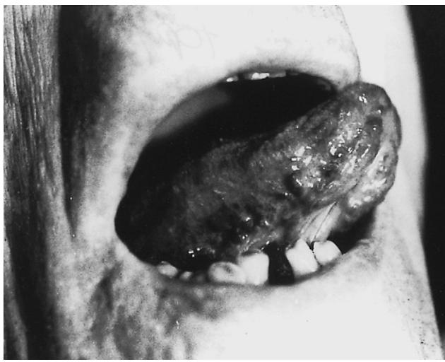

Figure 76-1. Caviar lesion (sublingual varices) in a patient with occult upper gastrointestinal bleeding. *(Reproduced from Brandt LJ. Gastrointestinal disorders of the elderly. Lippincott-Raven, 1986, New York.)*

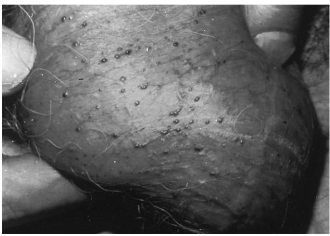

Figure 76-2. Phlebectasias in the scrotum of the same patient as in Figure 76-1. *(Reproduced from Brandt LJ. Gastrointestinal disorders of the elderly. Lippincott-Raven, 1986, New York.)*

Therapy usually consists of reestablishing the normal microbiologic flora by discontinuing antibiotics. In the immunocompromised host and the individual with significant morbidity, topical therapy with nystatin suspensions or troches is usually successful, although treatment with absorbable oral agents such as fluconazole may be required. Antifungal agents may be supplemented by the use of topical anesthetics to provide symptomatic relief (see later discussion).

### **Stomatitis**

Cancer patients treated with radiation or chemotherapy frequently develop painful inflammation and erosions of the oropharyngeal mucosa. Stomatitis complicating cancer therapy is the direct consequence of drug and radiation toxicity to susceptible, rapidly dividing cell populations of the upper gastrointestinal tract and the indirect consequence of neutropenia, which impairs regeneration of injured tissues. Radiation to the head and neck also causes xerostomia secondary to fibrosis of the salivary glands. An absence of lubrication by saliva further aggravates mucosal damage, and a lack of salivary IgA permits overgrowth of bacteria and fungi. Oral lesions may become infected, contributing to persistent injury, discomfort, and poor nutrition and posing a risk of more widespread infection in immunocompromised individuals.

The initial therapy for stomatitis is promotion of good oral hygiene. Brushing and flossing are contraindicated in neutropenic patients because of the risk of disseminated infection. Instead, mouthwashes containing dilute hydrogen peroxide or a salt and soda solution are used to reduce mucosal bacterial and fungal colonization.

A number of therapeutic mouthwash "cocktails" have been recommended to relieve symptoms, promote healing, and treat superficial mucosal infection in patients with stomatitis.14 Some of these cocktails have been tested in controlled trials, but the use of most is empirical, based on the known analgesic, antibiotic, and protective effects of widely available liquid medicines. Viscous lidocaine (2%) is frequently used as a topical anesthetic, as is diphenhydramine, which is often mixed with oral antacids or kaolin-pectin. Many recipes include sucralfate suspension because it coats damaged epithelium and promotes the production of mucus and protective prostaglandins. Antibiotics used alone or in combination in mouthwash cocktails to treat superficial infection include chlorhexidine gluconate, nystatin, tetracycline, neomycin, vancomycin, and clindamycin. Hydrocortisone and other glucocorticoids also have been added to reduce inflammation, but rapid absorption across the denuded oral mucosa into the systemic circulation may compromise the patient's immune defenses. Artificial saliva replacements (Salivart, Moi-Stir, Xero-Lube) are also available for patients with xerostomia.

### **Hairy tongue**

"Hairy tongue" is characterized by hypertrophy of the filiform papillae of the tongue and a lack of normal desquamation. In this condition, the color of the tongue varies from yellow to brown or black, depending on staining by exogenous substances, such as tobacco or food, and on the presence of various chromogenic microorganisms.15,16 Hairy tongue is frequently seen in patients who have had extensive radiotherapy to the head and neck. Although these individuals are usually asymptomatic, some complain of nausea, dysgeusia, and halitosis. On occasion, the lingual papillae reach such considerable length that they brush against the soft palate, gagging the patient.

Many organisms have been cultured from papillary scrapings from this entity; there is, however, no proof of a cause-and-effect relationship with any microorganism, and invasion of the lingual epithelium has not been demonstrated. Species of microorganisms that have been isolated are, in all probability, simply colonizing an already abnormal, excessively papillated tongue.

Therapy for this disorder consists of vigorous brushing of the tongue to promote desquamation and to remove accumulated debris. In extreme cases, topical treatment with podophyllin, an alcoholic extract of the mayapple, may result in a dramatic response.

### **Leukoplakia**

The term *leukoplakia* was introduced by Schwimmer in 1877 to describe any white plaque. Today, some authors use this term to refer to histologic zones of hyperkeratosis, acanthosis, and chronic inflammation, whereas others reserve it to describe malignant dyskeratosis and epithelial atypia. Although leukoplakia is considered by many clinicians to be a premalignant condition, its natural history is uncertain because of a lack of uniform definition in case selection. The term should be abandoned because of its lack of specificity. Any persistent white lesion of the oral mucosa should be biopsied in an attempt to make a specific histologic diagnosis.

Leukoplakia is more common in men than in women, and most often occurs during the sixth and seventh decades.17 It can be found anywhere in the oral cavity, although it is most common on the buccal mucosa, tongue, and floor of the mouth. Leukoplakia varies in appearance, partly depending on the age of the lesion. Some investigators consider verrucous patches to be of higher malignant potential than smooth plaques, whereas others believe that granular pinkishgray to red islands, also called erythroplakia, are most likely to be associated with carcinoma in situ or even invasive malignancy. Such controversy stresses the importance of taking a biopsy in the management of all such lesions. Approximately 10% of patients with leukoplakia have or will develop invasive carcinoma in the lesion.17–19

Once the diagnosis of leukoplakia has been substantiated by microscopic examination of a biopsy specimen, therapy is initiated. When dysplasia is present, or when the lesion fails to resolve after a source of physicochemical trauma has been eliminated, treatment consists of ablation.

#### **Epidermoid carcinoma**

Approximately 5% of human cancers arise in the mouth; 95% of oral malignancies are epidermoid carcinomas.18,19 The lower lip is the most common site of malignancy in the area of the oral cavity. Epidermoid carcinoma of the lip occurs almost exclusively in elderly men; causal factors include actinic radiation, syphilis, and tobacco use, especially pipe smoking.

Carcinoma of the lip varies in clinical appearance and may be bulky or ulcerated. It metastasizes slowly, usually to the ipsilateral submental or submaxillary lymph nodes. Surgical resection or radiation therapy produces equally good results, with cures in approximately 80% of affected individuals. Successful treatment depends on the duration of symptoms, size of lesion, and presence of metastases.

Within the oral cavity, one half of epidermoid carcinomas originate in the tongue, and the rest arise with equal frequency in the palate, buccal mucosa, floor of the mouth, and gingiva. The disease is seen mainly in older individuals and occurs most often in males. Factors suspected of contributing to the development of oral cancer include tobacco, alcohol, nutritional deficiencies, syphilis, and miscellaneous forms of physicochemical trauma, such as irritation from pipe stems and dentures. Almost 90% of patients have a combination of predisposing factors.

Intraoral epidermoid carcinomas display a considerable amount of histologic variation, although lesions tend to be moderately well differentiated. Early carcinomas arising in the tongue typically are painless, even though they may ulcerate. Pain develops later, as the lesions grow, especially if they become secondarily infected. Tumors are usually located on the lateral or ventral surface of the tongue. The site of the primary lesion is of prognostic importance because cancers of the posterior aspect of the tongue tend to be more aggressive. Nodal metastases are located on either or both sides of the neck. Tumors also spread by direct invasion. Early detection is mandatory if patients are to survive more than a year after diagnosis.

Keratoacanthoma is a spontaneously resolving benign lesion often mistaken for epidermoid carcinoma.20 It occurs most frequently in adults 50 to 70 years of age, involves the upper and lower lips equally, and usually presents as a painful umbilicated lesion seldom more than 1 to 1.5 cm in diameter. It initially appears as a small nodule, which reaches full size within 4 to 8 weeks. It persists as a static lesion for another 4 to 8 weeks, after which the keratin core is expelled and the mass resorbed over a period of 6 to 8 weeks. Recurrence is rare.

#### **THE OROPHARYNX**

The oropharyngeal phase of swallowing is exceedingly complex, requiring the participation of multiple distinct structures in the mouth, pharynx, and esophagus coordinated by six cranial nerves and orchestrated by the swallowing center of the central nervous system. After food has been masticated and moistened with saliva, the tongue initiates swallowing by thrusting the food bolus into the oropharynx. The soft palate prepares for the arrival of the bolus by elevating, so that material from the mouth cannot enter the nasal passages. The glottis also shuts, and the epiglottis tilts downward to prevent the bolus from entering the trachea. Relaxation of the upper esophageal sphincter in association with contraction of the pharyngeal muscles allows propulsion of food into the esophagus.21

Striated muscle involved in the oropharyngeal phase of swallowing, like the muscles of mastication, may be impaired during aging by a decrease in lean body mass. A radiographic study of 100 individuals beyond the age of 65 suggested that 22 had pharyngeal muscle weakness along with abnormal cricopharyngeal relaxation with pooling of barium in the valleculae and pyriform sinuses.22 Several individuals also were noted to have tracheal aspiration of barium. All the subjects, however, were asymptomatic. Thus, although functional changes in the oropharyngeal phase of swallowing may occur with aging, these changes have not been identified as a cause of morbidity in elderly people.

#### **Oropharyngeal dysphagia**

Patients with oropharyngeal (cervical or "transfer") dysphagia complain of difficulty shifting food from the front of the mouth into the back of the throat, or of trouble initiating a swallow once the food bolus has been positioned in the oropharynx. Symptoms may be most severe when the patient attempts to swallow liquids. Signs of transfer dysphagia include nasal regurgitation or aspiration of oral contents during swallowing as a result of a failure to seal the nasopharynx or the trachea by appropriate muscle contraction. Inasmuch as oropharyngeal dysphagia may be due to a neuromuscular disorder, the patient may display other signs of neuromuscular dysfunction, including dysarthria, nasal speech, cranial nerve dysfunction, weakness, or sensory abnormalities.23

A variety of conditions interfere with the transfer of food from the mouth to the esophagus (Table 76-1).24 Mechanical lesions, including tumors, abscesses, and strictures, may block passage of the food bolus or disrupt structures that

#### **Table 76-1. Causes of Oropharyngeal Dysphagia in Elderly People**

- Malignancy—pharyngeal carcinoma Central nervous system disease—tumor, Parkinson's disease, stroke Peripheral nervous system disease—diabetes mellitus
- Muscle disease—hypothyroidism
- Mechanical—strictures, osteophytes, thyromegaly
- Postoperative—laryngectomy
- Medications
- Motility disorders of the upper esophageal sphincter

directly mediate the oropharyngeal phase of swallowing. A neoplasm, infection, or cerebrovascular accident may damage the central nervous system, producing brain stem or pseudobulbar palsy and associated transfer dysphagia. The initiation of swallowing also may be impaired by degenerative diseases of the central or peripheral nervous system, the motor end plate, or the muscle itself. Finally, oropharyngeal dysphagia is often caused by a failure of upper esophageal sphincter function. Many of these problems are encountered in older individuals.

### **Cricopharyngeal achalasia**

The term *cricopharyngeal achalasia*, partly derived from the Greek word meaning "absence of slackening," is a misnomer, as the cricopharyngeus muscle of patients with this disorder is capable of relaxing. The problem in cricopharyngeal achalasia is failure of the muscle to function in synchrony with other elements of the swallowing mechanism. As a result, the pharyngeal muscles propel all or part of the food bolus against a closed sphincter, producing symptoms of cervical dysphagia.

Cricopharyngeal achalasia is usually encountered in elderly individuals. Many disorders may cause this problem, but central nervous system diseases predominate. The clinical features are those of oropharyngeal dysphagia in general. Depending on the cause, the onset of symptoms may be sudden, as with a cerebrovascular accident, or intermittent, as with more insidious disorders such as diabetic neuropathy. The natural history of cricopharyngeal achalasia is also variable, again probably reflecting its many causes: dysphagia may diminish, remain unremitting, or follow a relapsing, remitting course. Most individuals with this disorder have more difficulty swallowing liquids than solids. Many patients have a pulmonary presentation with laryngitis, bronchitis, recurrent pneumonia, bronchiectasis, and pulmonary abscesses as the sequelae of otherwise quiet cricopharyngeal dysfunction.25 In some patients, symptoms result in such a fear of eating that weight loss, malnutrition, and psychological problems overshadow the motility disorder.

# **Postintubation dysphagia**

Special mention must be made of cervical dysphagia occurring as a sequela of endotracheal intubation. Unilateral vocal cord weakness is a common complication of endotracheal intubation and because the vocal cords are important to the formation of a tight laryngeal seal during the oropharyngeal phase of glutition, patients with vocal cord weakness may experience coughing and aspiration with swallowing. Individuals who have undergone a tracheostomy also may develop symptoms of oropharyngeal dysphagia. Scar

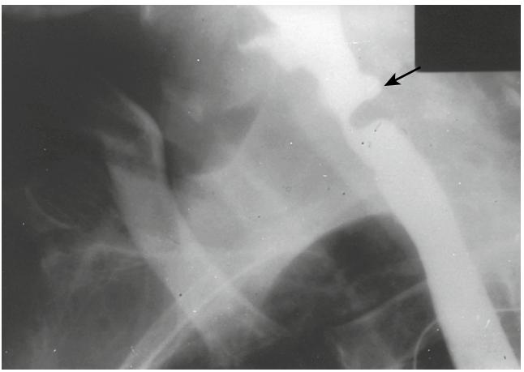

Figure 76-3. Oblique view of a barium-filled esophagus showing a small Zenker's diverticulum (*arrow*) proximal to a hypertrophied cricopharyngeus. *(Reproduced from Brandt LJ. Gastrointestinal disorders of the elderly. Lippincott-Raven, 1986, New York.)*

formation from a tracheostomy occasionally prevents normal elevation and anterior rotation of the larynx, causing decreased pharyngeal contraction and incomplete upper esophageal sphincter relaxation during swallowing.

Management of oropharyngeal dysphagia depends only in part on its cause. Any underlying disorder, such as parkinsonism, should be treated. If dysphagia persists despite such therapy, or if significant complications result from impairment of the swallowing mechanism, treatment can be directed at the esophagus itself.

Bougienage of the upper esophageal sphincter with mercury-weighted rubber dilators is beneficial to some patients but often gives only temporary relief. This technique is contraindicated by the presence of a pharyngoesophageal diverticulum because of the high risk of perforation (see later discussion).

Many individuals with cricopharyngeal achalasia benefit from surgical interruption of the upper esophageal sphincter.26 Failure to respond is observed most often in patients with central nervous system disease or peripheral neuropathy, although even these individuals are occasionally relieved of symptoms by this procedure. Serious complications following cervical myotomy are rare. Botulinum toxin injection and balloon dilation also have been employed. Gastroesophageal reflux or severe distal esophagitis indicating reflux is an absolute contraindication to cricopharyngeal myotomy unless the lower esophageal defect is corrected first.

### **Pharyngeal diverticula ZENKER'S DIVERTICULUM**

Zenker's diverticulum (Figure 76-3) is a posterior herniation of the hypopharynx through the triangular area just above the upper esophageal sphincter where the oblique and transverse fibers of the cricopharyngeus muscle join. It is seen once in every 1000 routine upper gastrointestinal series and is more frequent in males. Approximately 85% of cases occur in individuals over the age of 50.27

Symptoms of Zenker's diverticulum usually develop insidiously. An annoying irritation in the back of the throat is an early complaint, which may be followed later by the more classic symptoms of oropharyngeal dysphagia. Occasionally, an affected individual complains of a noise like the "roar of the ocean" or a "washing machine" during swallowing. Postcibal and nocturnal regurgitation of undigested food are common complaints. Obstructive symptoms may be caused by associated cricopharyngeal achalasia or, rarely, by compression of the esophagus by a large diverticulum.

Incoordination and incomplete relaxation of the upper esophageal sphincter during swallowing have been described in association with Zenker's diverticulum, lending support to the theory that cricopharyngeal dysfunction leads to high pharyngeal pressures, which result in the formation of hypopharyngeal diverticula. Many patients with a Zenker's diverticulum, however, have normal function of the upper esophageal sphincter or even reduced upper esophageal sphincter pressure, suggesting that high pharyngeal pressures may be due to stiffening of the pharyngeal muscles with loss of compliance.28

Zenker's diverticula most often are seen during x-ray examination but when small may be missed in the posteroanterior view because of superimposition over the main column of barium in the esophagus; this problem can be avoided by rotating the patient during the study (Figure 76-3). Endoscopic examination of the upper gastrointestinal tract in the presence of a hypopharyngeal diverticulum may be associated with an increased risk of perforation; however, this danger is minimized by passage of the instrument under direct vision.

Complications include compression and obstruction of the distal esophagus by a large diverticulum, respiratory difficulties caused by aspiration of diverticular contents, and diverticulitis with perforation. Rarely, carcinoma may develop in a Zenker's diverticulum.29 Worsening of dysphagia, weight loss, and the appearance of blood in regurgitated material suggest the development of a malignant neoplasm.

The therapy for a symptomatic Zenker's diverticulum includes surgical excision alone or cricopharyngeal myotomy with or without removal of the diverticulum.30 Endoscopic techniques for the treatment of Zenker's diverticulum also have been described.31

#### **Lateral pharyngeal diverticula**

Lateral pharyngeal diverticula, or pharyngoceles, occur with increased frequency in elderly people and are especially common in men.32 They develop in the gap between the superior and middle pharyngeal constrictors. Symptoms are the same as those of a Zenker's diverticulum. In addition, patients may complain of a neck mass that enlarges with a Valsalva maneuver. Increased intrapharyngeal pressure may be an important causal factor, as exemplified by the frequency of this entity in muezzins and wind instrument players. Surgical repair is safe and effective.

#### **THE ESOPHAGUS**

The muscularis propria of the esophagus is composed of striated muscle fibers proximally and smooth muscle fibers distally. The central nervous system governs the activity of the striated muscle by means of sequential activation of extrinsic nerves. In humans, the dominant mechanism for control of the smooth muscle of the esophagus is unknown; both central and intramural neural pathways have been demonstrated. Orderly peristaltic contractions of esophageal muscle are necessary for normal esophageal function.

Although no information is available about the effects of aging on the regulation of esophageal muscle activity, alterations in esophageal muscle function have been identified manometrically in elderly individuals. These changes were described first in 1964 by Soergel et al,33 who referred to motility disturbances in the elderly as "presbyesophagus." Soergel and his co-workers studied 15 subjects beyond the age of 90 and found a variety of abnormalities; 13 of their patients, however, had diseases known to affect esophageal motility. Subsequent studies have confirmed that, in the absence of other disorders, esophageal motility may be abnormal in elderly individuals, but the only manometric change identified in all the published work is a reduction in the amplitude of muscle contraction after a swallow.34–36

Elderly people also may be noted to have disordered motility, or "tertiary contractions," during a barium esophagogram, but this finding is rarely associated with symptoms.37 Because motility changes that develop with aging do not appear to have clinical importance, the diagnosis of presbyesophagus should be abandoned. Elderly patients with dysphagia should be evaluated for the presence of disease processes involving the esophagus, and complaints should not be ascribed to motility changes occurring as a result of age alone.

#### **Dysphagia and heartburn**

Dysphagia and heartburn (pyrosis) are the principal symptoms of esophageal diseases; patients with esophageal disorders, especially elderly people, also may complain of respiratory difficulties, painful swallowing (odynophagia), chest pain resembling the pain of myocardial ischemia, regurgitation, and vomiting.38–40

Dysphagia is caused by impaired passage of food through the esophagus and is experienced immediately after the act of deglutition. Patients often complain that food "sticks on the way down." Since sensation in the esophagus is referred proximally, lesions at the gastroesophageal junction often appear as symptoms experienced at the level of the sternal notch. When a patient has symptoms apparently originating in the area of the proximal esophagus, evaluation of the entire esophagus, often with both esophagoscopy and barium radiography, is required.

The pattern of dysphagia frequently suggests the nature of the underlying disease.41 Schatzki observed that a correct diagnosis can be made after taking a careful history in up to 85% of patients with this complaint.42 Thus intermittent dysphagia connotes a motility disorder or a pliant mechanical obstruction such as an esophageal web. Progressive dysphagia often represents a neoplasm. Individuals who experience difficulty in swallowing liquids and solid food usually have a primary neuromuscular abnormality and disordered esophageal motility, whereas dysphagia produced only by solid foods is associated with mechanical obstruction of the esophagus.

Heartburn is a manifestation of the reflux of gastric contents into the esophagus and, as its name suggests, is described as being a hot sensation behind the sternum or in the left parasternal area. Pyrosis is relieved by antacids and intensified by bending at the waist or lying supine, especially when the stomach is full. Pyrosis also may be aggravated by some medications, smoking, and ingestion of alcohol, fruit juices, caffeine, chocolate, or peppermint. Discomfort is often accompanied by regurgitation of gastric contents, belching, vomiting, or secretion of saliva (water brash). The nature or extent of esophageal abnormalities associated with gastroesophageal reflux and heartburn cannot be predicted on the basis of the intensity of symptoms, especially in elderly people; severe reflux disease as evidenced by esophageal ulcers may be present in the absence of substantial symptoms.43

#### **Esophageal motility disorders**

After individuals with structural lesions have been excluded, more than 50% of adults of all ages with a complaint of dysphagia are found to have esophageal motility disorders.44,45 These abnormalities may be primary or secondary and are classified according to their manometric signatures. Most often, adults with dysphagia have disordered motility with nonspecific and inconsistent manometric features.

#### **NONSPECIFIC SECONDARY MOTILITY DISORDERS**

In elderly people, nonspecific disorders of esophageal motility frequently are secondary to a systemic disease. Examples of generalized disorders sometimes responsible for esophageal dysmotility are myxedema, amyloidosis, connective tissue diseases, and diabetes mellitus.

Approximately 50% of patients with diabetic neuropathy have abnormal esophageal motility. Findings in these individuals include a decrease in the amplitude of muscle contraction, delayed esophageal emptying, esophageal dilation, and reduced lower esophageal emptying sphincter pressure. In patients with diabetes, the severity of motility changes correlates with the severity of other neuropathic complications; however, affected individuals usually do not have significant dysphagia. For this reason, esophageal symptoms in a diabetic must be fully evaluated and not simply attributed to diabetes.

#### **PRIMARY AND SECONDARY ACHALASIA**

Primary achalasia is the second most common motility disorder diagnosed in patients with nonstructural dysphagia, but it is rare in elderly people.46 In persons beyond the age of 50, achalasia is most often secondary to gastric adenocarcinoma (Figure 76-4); pancreatic adenocarcinoma, oat cell carcinoma, reticulum cell sarcoma, and anaplastic lymphoma are responsible for isolated cases.47,48 Manometric findings in secondary achalasia are identical to those in the primary disorder: absence of esophageal peristalsis, usually in association with elevation of resting lower esophageal sphincter pressure and failure of the lower esophageal sphincter to relax following an appropriate stimulus. The elevation of resting lower esophageal sphincter pressure typical of achalasia is less pronounced in elderly people, who also experience less chest pain in association with this disorder than do younger patients.49 Pneumatic dilation typically is the treatment of choice for patients with primary achalasia.

Patients with both primary and secondary achalasia may experience progressive difficulty in swallowing. Food collects in the esophagus, which may become distended and tortuous even when the patient has an underlying carcinoma. In the absence of proximal dilation of the esophagus, a diagnosis of malignancy is favored. When the patient reclines, pooled food flows out of the esophagus back into

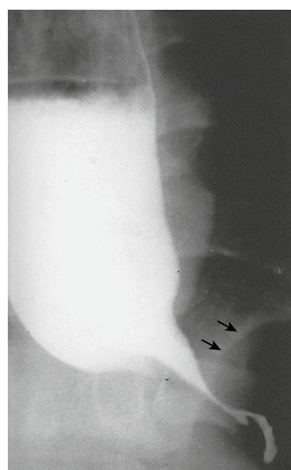

Figure 76-4. Barium esophagram showing tapering of the distal esophagus simulating achalasia. The subtle presence of a mass in the gastric fundus (*arrows*) suggested a diagnosis of carcinoma. *(Reproduced from Brandt LJ. Gastrointestinal disorders of the elderly. Lippincott-Raven, 1986, New York.)*

the pharynx, resulting in coughing and aspiration. Affected individuals, therefore, may have aspiration pneumonia. In addition to an infiltrate, a chest x-ray may reveal an air-fluid level in the esophagus and absence of the gastric air bubble. Because the presentations of primary and secondary achalasia may be identical, malignancy must be excluded in an elderly patient with this syndrome. Computed tomographic x-rays of the chest and upper abdomen, and endoscopy with biopsy of the distal esophagus, are recommended.50 Endoscopic ultrasound may be helpful in differentiating primary from secondary achalasia.

The pathogenesis of secondary achalasia is unknown. Submucosal infiltration of the distal esophagus by tumor has been noted in some cases and normal histologic appearance in others.51 It is possible that, in the absence of tumor infiltration, the motility disorder reflects a paraneoplastic neuropathy; manometric and roentgenographic abnormalities may disappear after resection of a gastric carcinoma or therapy for a lymphoma.52,53

#### **DIFFUSE ESOPHAGEAL SPASM**

Although primary esophageal motility disorders usually occur in middle-aged individuals, manometric recordings in elderly persons with intermittent dysphagia occasionally display the pattern of diffuse esophageal spasm.38 *In this motility disturbance,* the patient has simultaneous, repetitive muscle contractions of prolonged duration occurring spontaneously or after a swallow. Normal peristalsis is present most of the time, explaining the intermittent nature of symptoms, which may be triggered by hot or cold food, pills, or carbonated beverages. The pathogenesis of diffuse esophageal spasm is obscure; on the basis of case reports, some have speculated that in some cases this disorder represents a stage in the development of achalasia.

#### **"NUTCRACKER" ESOPHAGUS AND NONCARDIAC CHEST PAIN**

It is usually assumed that in persons free of significant coronary artery disease with chest pain resembling the pain of myocardial ischemia, symptoms are due to an esophageal motility disorder. Such patients, however, rarely have chest pain during esophageal manometry, and provocative testing may be used to precipitate symptoms. Provocative testing with intravenous edrophonium chloride and infusion of acid into the esophagus causes chest pain in about 30% of subjects with a history of noncardiac chest pain.54 A similar number of patients with noncardiac chest pain have been found to have an esophageal motility disorder, but only 25% of these individuals have symptoms during provocative testing.44 It is often difficult, therefore, to prove that the esophagus is the source of the patient's complaints.

The most common motility disorder found in patients with noncardiac chest pain is "nutcracker" esophagus.44 This abnormality is characterized by peristaltic muscle contractions of extremely high amplitude and long duration in the distal portion of the esophagus. A defect in esophageal transit can be demonstrated in many affected patients using a radionuclide marker. In one large series of individuals with noncardiac chest pain, 50% of patients with a motility disorder had nutcracker esophagus; other symptomatic individuals were found to have diffuse esophageal spasm.44 A causal role for these motility defects in the production of chest pain has not been proved. In recent studies, many patients with noncardiac chest pain were found to have musculoskeletal disorders.

A number of medications have been used to treat primary esophageal motility disorders, especially diffuse esophageal spasm and nutcracker esophagus. Nitrates, anticholinergics, calcium channel blockers, or sedatives are occasionally effective in relieving symptoms of dysphagia and chest pain; their benefit in this setting, however, has never been evaluated in an appropriately designed trial. Some patients also obtain relief from dysphagia after bougienage.

#### **Hiatus hernia**

The incidence of hiatus hernia (Figure 76-5) increases with each decade of life from less than 10% of those under age 40 to approximately 40% in the sixth and seventh decades and 70% in patients beyond the age of 70. Symptoms such as pyrosis and regurgitation formerly attributed to the hernia are now known to be due to lower esophageal sphincter dysfunction. Sphincter dysfunction and gastrointestinal reflux are independent of the presence of a hiatus hernia, and the common "sliding" hiatus hernia is not considered by itself to be pathogenic.

One type of hiatus hernia that deserves special mention is the paraesophageal hernia (Figure 76-6), an uncommon hernia that occurs most often in persons between the ages of 60 and 70. Paraesophageal hernias often result in significant complications and therefore are of major importance. These hernias are frequently asymptomatic or cause only nagging discomfort until mechanical entrapment occurs. Such a catastrophe is associated with progressive distention of the incarcerated segment, vascular embarrassment, hemorrhage, gangrene, and perforation. In the absence of contraindications, a paraesophageal hernia demands surgical repair.

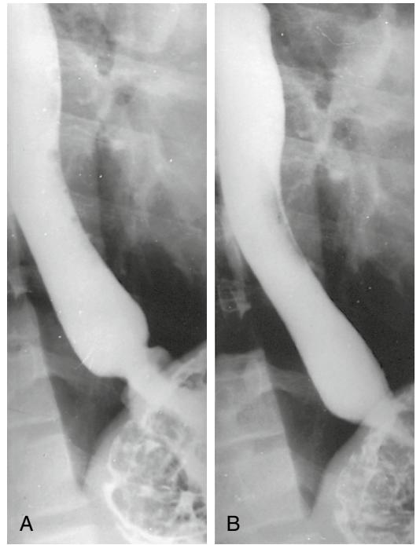

Figure 76-5. A small hiatus hernia sliding in (A) and out (B) of the thorax. The esophagogastric junction is seen above the diaphragm. *(Reproduced from Brandt LJ. Gastrointestinal disorders of the elderly. Lippincott-Raven, 1986, New York.)*

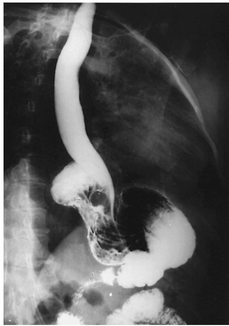

Figure 76-6. Barium esophagogram demonstrating a paraesophageal hernia with the gastric fundus above the diaphragm. The esophagogastric junction is at the level of the diaphragm. *(Reproduced from Brandt LJ. Gastrointestinal disorders of the elderly. Lippincott-Raven, 1986, New York.)*

### **Reflux esophagitis**

The only notable change in the lower esophageal sphincter seen with aging is a reduction in the amplitude of postdeglutitive contraction or relaxation. Nevertheless, because the secretion of gastrin, which potentiates contraction of the lower esophageal sphincter, increases with age, and because gastric acid secretion declines with age in many individuals, it is unusual for reflux esophagitis to appear for the first time in elderly people.55 The nature or extent of esophageal injury associated with gastroesophageal reflux cannot be predicted on the basis of the intensity of symptoms in older patients.43 Complications of chronic, asymptomatic reflux such as stricture formation may be the initial clinical presentation of esophagitis in about 20% of affected elderly patients. When an aged individual complains of the recent onset of pyrosis, other causes of esophageal symptoms, such as candidiasis, must be considered. The therapy of reflux in elderly patients is the same as in younger patients, however, attention must be paid to the potential development of adverse effects of medications (see later discussion).56

### **Barrett's metaplasia**

In patients with Barrett's metaplasia, the lower esophagus is lined for a variable distance by columnar, rather than the usual stratified squamous, epithelium.57 The metaplastic columnar epithelium may be continuous with the columnar epithelium of the stomach and extend in tongues into the distal esophagus, or it may be present in islands surrounded by normal squamous epithelium. The importance of Barrett's metaplasia lies in its association with reflux esophagitis, (deep) esophageal ulcers, (high) esophageal strictures (Figure 76-7), and adenocarcinoma. The metaplastic columnar lining is believed to develop as a consequence of prolonged gastroesophageal reflux. Esophageal squamous epithelium damaged by exposure to gastric contents is replaced by a specialized columnar epithelium (intestinal metaplasia), a junctional type of epithelium, or a gastric fundic type of epithelium. Each of these three cell types may be seen alone or in combination with the others.

Most cases of Barrett's esophagus probably occur between the ages of 50 and 70; the exact incidence is unknown. The most common symptoms are those related to the reflux of stomach contents, and the entity is diagnosed best by esophagoscopy with multiple biopsies. The presence of

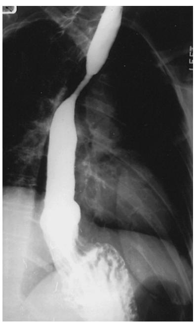

Figure 76-7. Barium esophagogram revealing a stricture of the esophagus at the level of the aortic arch in a patient with Barrett's esophagus. A hiatus hernia is also present. *(Reproduced from Brandt LJ. Gastrointestinal disorders of the elderly. Lippincott-Raven, 1986, New York.)*

specialized columnar epithelium establishes the diagnosis of Barrett's esophagus.57 If the columnar epithelium in the biopsy specimen is one of the other two types, the biopsy must have been taken at least 3 cm above the gastroesophageal junction to make the diagnosis. Intestinal metaplasia can be recognized in situ by staining with Alcian blue.

Stricture and neoplasia are long-term complications of Barrett's esophagus. There is increasing evidence that cancer arises only in the specialized columnar epithelium. By careful screening using esophagoscopy with a directed biopsy every 1 to 2 years, premalignant dysplastic changes can usually be detected.58,59 The development of severe dysplasia or carcinoma in situ requires resection of the involved esophagus. Thermal ablation of Barrett's epithelium with multipolar electrocoagulation, laser coagulation, or argon plasma coagulation has been investigated. Destruction of the Barrett's epithelium by these techniques is successful initially, but recurrence of the Barrett's tissue may occur. Therapy of reflux usually results in symptomatic improvement, but regression of the columnar epithelium does not occur without surgery.

### **Lower esophageal ring**

A lower esophageal or Schatzki ring (Figure 76-8) is a thin, annular ridge of mucosa projecting perpendicularly into the esophageal lumen at or near the squamocolumnar

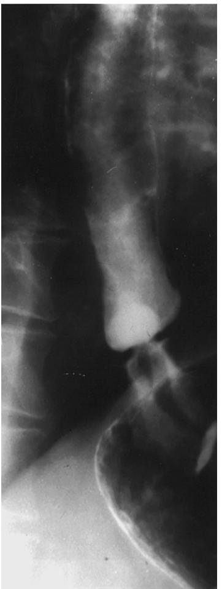

Figure 76-8. A Schatzki ring prevents passage of a barium pill in a patient with intermittent dysphagia. *(Reproduced from Brandt LJ. Gastrointestinal disorders of the elderly. Lippincott-Raven, 1986, New York.)*

junction.60–62 A Schatzki ring may be asymptomatic, found incidentally during evaluation of the upper gastrointestinal tract for unrelated reasons, or it may cause intermittent episodes of dysphagia and an uncomfortable sticking or pressing sensation as a result of food lodging above the ring. Episodes commonly occur during hurried meals, meals requiring a great deal of mastication, or meals consumed with alcohol, hence the appellation "steakhouse syndrome." As the lumen of the ring diminishes to less than 12 mm (0.047 in.) in diameter, attacks become more frequent. Attacks usually last several minutes or more until the patient regurgitates the food bolus or flushes it into the stomach with a beverage.

Total obstruction of the esophagus secondary to food impaction frequently brings patients to the emergency department. Relaxation of the esophagus by administration of a small dose of intravenous benzodiazepine or 1 mg of glucagon is occasionally effective in relieving the impaction. Papain solution (meat tenderizer) should not be used to try to digest the meat because its use has been associated with esophageal perforation. If the impacted bolus does not pass, it must be removed by esophagoscopy. Alternatively, it may be gently nudged into the stomach if a patent lumen can be seen distally, the esophageal mucosa is intact, and there is no bone or other sharp object present. Multiple biopsies to disrupt the ring or dilation with bougies are techniques used to treat symptomatic rings.

#### **Dysphagia aortica**

Degenerative changes in the aorta may produce compression of the esophagus and dysphagia. Obstruction of the upper esophagus is occasionally caused by a thoracic aneurysm, while the distal esophagus may be squeezed between an atherosclerotic aorta posteriorly and the heart or esophageal hiatus anteriorly. Most patients are women beyond the age of 70.63–65 Symptoms are usually prevented by having the patient thoroughly masticate solid food, but occasionally the obstruction is severe enough to warrant surgical mobilization of the esophagus at the hiatus.66

#### **Medication-induced esophageal injury**

Esophageal injury can occur as a result of the local caustic effects of medications.67,68 The most frequent offenders are antibiotics, especially tetracyclines, potassium chloride, ferrous sulfate, nonsteroidal anti-inflammatory drugs, alendronate, and quinidine.

Most patients with medication-induced esophageal injury have no underlying esophageal disorder. Some individuals, however, have nonspecific, asymptomatic disorders of esophageal motility, peptic strictures, esophageal compression from left atrial enlargement, a prominent aortic knob, or mediastinal adhesions following thoracic surgery. Pills commonly lodge in the esophagus at the level of the aortic knob or the lower esophageal sphincter without the patient's knowledge. Many cases of pill-induced esophageal injury probably remain unrecognized with full recovery. The most frequent symptoms of medication-induced esophageal injury are odynophagia and retrosternal pain. Symptoms usually resolve within 6 weeks of stopping the medication or changing it to a liquid formulation; damage, however, may result in esophageal stricture formation or, occasionally, hemorrhage or perforation. Pills should always be taken with a generous amount of water, and elderly patients should not take pills immediately before bedtime because a decrease in salivation and esophageal motor activity accompanies sleeping.69

#### **Esophageal diverticula**

Diverticula of the esophagus are much less common than diverticula of other parts of the gastrointestinal tract. In a review of 20,000 barium studies on the upper gastrointestinal tract, Wheeler noted only six midesophageal (traction-type) and three epiphrenic (pulsion-type) diverticula, as compared with 1020 duodenal diverticula.70 The terms *traction* and *pulsion* refer to commonly accepted theories regarding the pathogenesis of esophageal diverticula. Traction diverticula are thought to be caused by the effects of fibrotic disease in structures contiguous with the esophagus, whereas pulsion diverticula are hypothesized to result from increased intraluminal pressure. Pseudodiverticulosis of the esophagus also has been described.

#### **MIDESOPHAGEAL DIVERTICULA (TRACTION DIVERTICULA)**

Traction diverticula occur most commonly in the middle third of the esophagus, where a large group of lymph nodes lies in direct contact with the esophageal wall. Nodal inflammation of this area may lead to periesophagitis, fixation of the esophagus to the lymph nodes, and distortion of the esophageal wall. In the past, tuberculosis was the most common cause for this process; any infection with lymph node involvement, however, may lead to the formation of a traction diverticulum.

Traction diverticula usually occur in patients of middle age or older and are slightly more common in men. They rarely cause symptoms, perhaps because they are small, have a broad neck, and can contract and empty because they contain all the layers of the esophageal wall including muscle.

#### **EPIPHRENIC DIVERTICULA (PULSION DIVERTICULA)**

Pulsion diverticula are found in the lower 10 cm of the esophagus, usually on the right wall. Like traction diverticula, they contain all the layers of the esophageal wall; the muscular layer, however, may be quite attenuated.

Epiphrenic diverticula usually develop in males during middle age. Patients may complain of dysphagia or chest pain, but symptoms are probably due to an associated esophageal motor abnormality, such as achalasia or diffuse esophageal spasm.71 The occurrence of an epiphrenic diverticulum without an underlying motility disorder or a hiatus hernia appears to be rare.

Many epiphrenic diverticula are asymptomatic, and in these instances no therapy is required.72 Treatment of esophageal reflux or an underlying, motility disorder may afford the patient symptomatic relief.73,74 In cases of larger diverticula, surgical resection may be necessary.75

#### **INTRAMURAL PSEUDODIVERTICULOSIS**

In esophageal pseudodiverticulosis, dilation of the excretory ducts of submucosal glands causes multiple small (1 to 3 mm) invaginations of the esophageal wall.76,77 These defects involve all, or segments of, the esophagus in a circumferential fashion. Pseudodiverticula are best detected by barium contrast studies; their roentgenographic appearance is quite

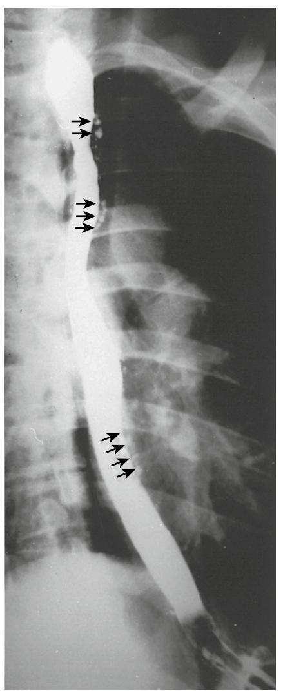

Figure 76-9. Intramural pseudodiverticulosis with multiple outpouchings (*arrows*) on a barium esophagogram. *(Reproduced from Brandt LJ. Gastrointestinal disorders of the elderly. Lippincott-Raven, 1986, New York.)*

characteristic (Figure 76-9). Pseudodiverticulosis is usually diagnosed during the seventh decade of life in patients with dysphagia. In at least 20% of cases, gastroesophageal reflux, a motility disorder, or a malignancy is found, and in approximately one half of patients, smears or cultures of the esophageal mucosa reveal *Candida albicans*. Stenoses, or areas of reduced distensibility, are found in up to 90% of cases of pseudodiverticulosis and preferentially seem to involve the upper esophagus. Surprisingly, there is no fixed relationship between the narrowed area and the segment involved with pseudodiverticula.

The cause of pseudodiverticulosis is unknown. The term *adenosis* has been used to refer to this entity because the number of deep esophageal mucous glands is markedly increased. Therapy consists of treatment of associated abnormalities. Coexisting strictures should be evaluated to ensure that they are benign.

#### **Esophageal candidiasis**

Infection of the esophagus is rare in patients without acquired immunodeficiency syndrome, with the exception of infection with *C. albicans*. *C. albicans* is a normal inhabitant of the alimentary tract; the yeast form is found in almost 50% of oral washings and 80% of stool samples.78 The population of *C. albicans* is suppressed in healthy adults by other intestinal flora. Comparison of fecal specimens from subjects aged 70 to 100 with those of individuals aged 20 to 69 have revealed fungi to be more common in the elderly group. This finding may be explained by a diminution in esophageal peristalsis, a reduction in gastric acid secretion, and age-related alterations in cellular and humoral immunity.

In the absence of antibiotic therapy or an underlying immune disorder, esophageal candidiasis is a disease of elderly people. Most cases in this age group, however, occur in association with predisposing conditions, including malignancy, therapy with immunosuppressive or cytotoxic drugs, diabetes mellitus, malnutrition, and treatment with broad-spectrum antibiotics.79,80

In the proper clinical setting, dysphagia, odynophagia, substernal burning, or an awareness of food passing down the esophagus should suggest the possibility of candida infection, although even in the presence of infection with *C. albicans*, up to one half of patients may be asymptomatic. Esophageal candidiasis often results from the extension of oral lesions, and a careful examination of the oral cavity is important in any debilitated patient complaining of esophageal symptoms.

A diagnosis of candida esophagitis may be suggested by an abnormal barium esophagogram, although a normal study does not exclude the presence of this organism. Esophagoscopy is the best method for detecting candida infection; raised white plaque, hyperemia, ulceration, and friability are characteristic. The gross appearance of candida esophagitis may be confused with that of exudative esophagitis, and therefore the diagnosis must be confirmed by brushings and by taking biopsies. Typical hyphae are revealed under the microscope in scrapings placed on a glass slide and macerated with 20% potassium hydroxide.

In the appropriate setting, a trial therapy may be initiated without attempting an invasive diagnosis. As in oral and vaginal candidiasis, therapy usually consists of promoting the reestablishment of normal microbiologic flora by discontinuing antibiotics. In an immunocompromised host or in an individual with significant morbidity, fluconazole is considered the drug of choice. Odynophagia can be treated with viscous lidocaine or with a "swish-and-swallow" preparation of the type used to treat stomatitis (see previous discussion). Failure to respond to simple treatment necessitates endoscopic confirmation of the diagnosis and often systemic therapy with additional antifungal agents.

#### **Esophageal neoplasms**

Esophageal cancer (Figure 76-10) occurs most frequently after age 55 and is three times more common in males than in females in the United States, and two times more common in males than in females in the United Kingdom.1 In the United States, it accounts for approximately 2% of all reported cancers. Factors associated with the development of esophageal cancer include alcohol and tobacco use, thermal irritation, poor oral hygiene, and esophageal stasis.1,81,82 Furthermore, an association has been noted with certain esophageal diseases, notably achalasia, Barrett's esophagus, lye stricture, and Plummer-Vinson syndrome, and with previous gastric surgery.83–85

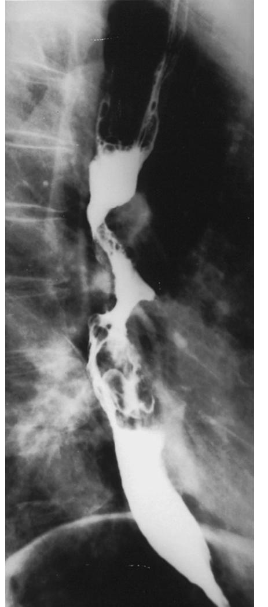

Figure 76-10. Barium esophagogram demonstrating an ulcerating esophageal carcinoma. *(Reproduced from Brandt LJ. Gastrointestinal disorders of the elderly. Lippincott-Raven, 1986, New York.)*

Surveillance, epidemiology, and end results (SEER) data show an increase in adenocarcinoma from 8% to 18% of all esophageal cancers during the years 1973–1984; it now represents the most rapidly increasing malignancy in the United States.86 Esophageal adenocarcinoma is either cancer of the gastric fundus or a malignancy that has developed in a segment of Barrett's esophagus. Squamous cell carcinoma most commonly involves the middle third of the esophagus. Local spread occurs early and because the esophagus dilates so readily, dysphagia, the most common complaint at the time of diagnosis, is a late symptom.

In elderly people an important manifestation of esophageal cancer is an achalasia-like syndrome. Primary achalasia is uncommon in patients beyond the age of 50. Elderly individuals who have symptoms of achalasia of less than 1 year's duration associated with notable weight loss should be suspected of having a malignancy, most often gastric adenocarcinoma. The pathogenesis of secondary achalasia is unknown; in some cases the lower esophagus is infiltrated with tumor cells, but in other cases achalasia may reflect a paraneoplastic process.

The prognosis for esophageal cancer is dismal. Management is directed at relieving progressive obstruction.87–89 Surgical resection and radiation are the accepted modes of treatment. Surgical resection offers the only chance for long-term survival, but fewer than half of all patients having esophageal cancer have a resectable lesion. If there is evidence of nodal or distant metastases, a thoracotomy should be avoided. Thoracic radiation, while useful, may be followed by the development of esophagitis, usually within 3 weeks of initiating therapy and continuing for several weeks after its completion. Chemotherapy may result in symptomatic improvement but does not substantially prolong survival. New chemotherapeutic agents should be administered under an investigational protocol. Combined modality therapy may offer advantages over more traditional approaches. Palliative therapy with endoscopically placed stents, lasers, or photodynamic therapy is often very useful and has improved the quality of life for many patients, albeit without prolonging survival.

#### **THE STOMACH**

Aging is associated with alterations in both the motor and secretory functions of the stomach but, as in other parts of the gastrointestinal tract, changes in gastric physiology attributable to age alone rarely are responsible for symptoms.

The motor activity of the stomach allows it to behave as two individual, albeit coordinated, organs: one that processes liquids and another that processes solids. The fundus and proximal body of the stomach serve as a reservoir for liquids. In contrast, the distal gastric body and the antrum grind solids into small particles and pump them into the duodenum. The activities of both the proximal and distal stomach are controlled by complex neural and hormonal mechanisms. Studies employing food labeled with radioactive isotopes suggest that gastric emptying of liquids is prolonged in elderly persons, whereas emptying of solids is unaffected by age.90,91

Changes in gastric secretion also occur in individuals as they grow older. In the past, almost every study on gastric acid production showed a decline in basal and stimulated acid output with advancing age.92 Work by Goldschmiedt et al,93 however, suggests that in the absence of *Helicobacter pylori* infection, aging is actually associated with an increase in gastric acid secretion. Previous confusion about the effect of aging on gastric acid secretion is probably related to the high incidence of *H. pylori* infection and chronic atrophic gastritis with secondary achlorhydria in older individuals (see later discussion).94

#### **Gastric and duodenal mucosal injury**

Advances in our understanding of the pathobiology of gastric and duodenal mucosal injury, and improvements in our ability to examine the upper gastrointestinal tract and detect diseases responsible for mucosal injury, make it important for physicians to use descriptive and diagnostic terminology carefully in clinical practice.95,96 Unless diagnostic findings are reported with a precision that accurately reflects current understanding of mucosal injury, the benefits of medical advances made during the past few decades may be lost to patients.

In usual cases of gastric or duodenal mucosal injury, endoscopic inspection often reveals the presence of gross epithelial defects. Small epithelial defects, or erosions, do not penetrate the muscularis mucosae. Ulcers are defined as being larger than 3 mm in diameter and extend a variable distance through the muscularis mucosae, in some instances freely perforating into the peritoneal cavity or penetrating into an adjacent organ. A typical ulcer is composed of four layers or zones: a superficial layer of fibrinopurulent debris overlying a zone of inflammation, a layer of granulation tissue, and, at its base, a collagenous scar. Both erosions and ulcers may be sources of bleeding.

Diffuse mucosal erythema, a common finding at endoscopy, in most instances represents microvascular congestion and, although it is interpreted by many endoscopists as indicating the presence of "gastritis," this conclusion is unjustified. Mucosal erythema due to microvascular congestion is caused by a variety of factors and is without any specific causal significance or clinical association.96 Conversely, patients often have histologic gastritis without the presence of mucosal erythema.

The term *gastritis* implies the presence of inflammation and should not be used unless examination of a biopsy specimen has revealed typical mucosal inflammatory changes, including infiltration of the lamina propria with polymorphonuclear leukocytes and mononuclear cells. Neutrophils are seen early in the course of inflammation (acute gastritis). With the passage of time, mononuclear cells, mainly plasma cells, and eosinophils appear in increasing numbers (chronic gastritis). Most patients with gastritis have a predominance of mononuclear cells in the lamina propria with a lesser number of neutrophils (chronic active gastritis).97 The inflammatory changes of gastritis are accompanied by signs of cell injury and regeneration. Cell damage and death cause submucosal hemorrhage and edema and lead to development of epithelial defects. Hemorrhage and edema may be visible grossly at endoscopy and evident on microscopic examination of biopsy specimens, as are erosions and ulcers. In response to injury, the epithelium regenerates by proliferation and differentiation of mucous neck cells, a process that leads to elongation and tortuosity of the gastric pits (foveolar hyperplasia). The vast majority of cases of gastritis are caused by infection with *H. pylori* (type B gastritis). Gastritis also may be due to other less common bacterial infections, granulomatous disease, autoimmune disease (type A gastritis), and hypersensitivity reactions.

Other agents of gastric injury damage the mucosa without exciting an inflammatory response. This gastropathy is sometimes referred to as type C gastritis, an unfortunate misnomer given the noninflammatory nature of the process.98 Microscopic examination of biopsy specimens from patients with gastropathy typically reveals vascular congestion and edema of the lamina propria, hypertrophy of the muscularis mucosae, and mucosal regenerative changes with foveolar hyperplasia.99 As in gastritis, cell damage and death are accompanied by submucosal hemorrhage and edema and lead to the development of epithelial defects. The latter changes are all often grossly visible on endoscopy. The most common causes of gastropathy are ingestion of nonsteroidal anti-inflammatory drugs (NSAIDs) and ethanol.

### *Helicobacter pylori,* **gastritis, and peptic ulcer disease**

Infection with *H. pylori*, a spiral gram-negative microaerophilic rod, is the most common chronic bacterial disease in humans. This organism attaches to receptors on the surface of gastric mucous neck cells and is also found on metaplastic gastric epithelium in the duodenum but not on the duodenal mucosa itself or on metaplastic duodenal mucosa in the stomach (Figure 76-11).100 *H. pylori* causes alterations in cell structure and function, inflammation, metaplasia, and cell death.101 A number of virulence factors, including urease, make it possible for the organism to colonize the stomach and produce disease.102

*H. pylori* infection is the most common cause of chronic gastritis (type B antral gastritis) and is one of the two principal causes of peptic ulcer disease, the other being ingestion of NSAIDs. More than 90% of patients with duodenal ulcer and more than 75% of patients with gastric ulcer also have *H. pylori* infection and chronic active gastritis.102 The relationship between ulcer disease and gastritis was recognized long before the causal role of *H. pylori* in the pathogenesis of peptic ulcer disease was understood. *H. pylori* infection also has been linked to the development of gastric cancer, another gastritis-associated disease.103

Infection with *H. pylori* is usually acquired during childhood and occurs most often in persons living under conditions of poverty, crowding, and inadequate sanitation.104 The prevalence of *H. pylori* infection in the United States and in the nations of western Europe increases with advancing age, a result of the poorer living conditions in these countries during the early years of the twentieth century.105 Thus regardless of present socioeconomic status, infection is most prevalent in older individuals. The incidence of peptic ulcer disease also increases progressively with advancing age, reflecting the age-related increase in *H. pylori* infection.

Under experimental conditions, acute infection with *H. pylori* causes transient dyspeptic symptoms accompanied by the development of active antral gastritis.106 Mucosal

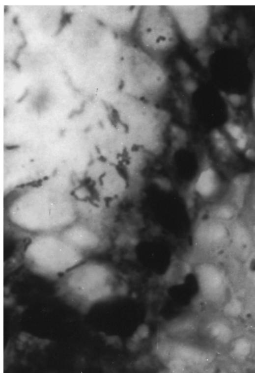

Figure 76-11. Gastric biopsy showing *H. pylori* in the surface mucous layer (Giemsa stain, 1000x). *(Courtesy of Sumi Mitsudo.)*

inflammation apparently may resolve spontaneously in the minority of patients or become chronic, gradually spreading proximally into the body and fundus of the stomach. As the disease progresses, inflammation extends into the deeper, glandular part of the epithelium containing the gastric secretory cells. These include parietal cells, which make hydrochloric acid and intrinsic factor; chief cells, which make pepsin; pylorocardiac gland cells, which make mucus; and endocrine G cells, which make gastrin. Normal glands are gradually destroyed and replaced by metaplastic glands (intestinal metaplasia) or by atrophic gastric mucosa (atrophic gastritis), a process that takes many years. Atrophic gastritis often is associated with low serum gastrin levels and antibodies to gastrin-secreting cells. Patients with chronic active gastritis frequently also have submucosal hemorrhage, edema, epithelial erosions (erosive gastritis), and peptic ulcers.

Individuals with active gastritis and gastric mucosal atrophy are usually asymptomatic but may complain of intermittent dyspepsia, abdominal pain, distention, nausea, and vomiting (nonulcer dyspepsia). The relationship, if any, between symptoms of nonulcer dyspepsia and gastritis is unclear (see later discussion); many persons with dyspepsia do not have gastritis, and many persons with gastritis do not have dyspepsia.107 Dyspeptic symptoms may be due to the development of a gastric or duodenal ulcer, although at least 50% of patients with acute ulcers are asymptomatic.

*H. pylori* infection may be diagnosed by a transendoscopic pinch biopsy of the stomach. Microscopic examination of biopsy specimens from infected individuals reveals chronic active gastritis and typical spiral gram-negative rods in the mucus coating the surface epithelium (Figure 76-11). The absence of gastritis strongly argues against *H. pylori* infection, whereas its presence suggests that a failure to identify *H. pylori* is due to sampling error. Tissue also may be implanted in commercially available agar plates containing urea and a pH indicator. If *H. pylori* is present in the tissue specimen, bacterial urease will split the urea into bicarbonate and ammonia, raising the pH and producing a color change. Because infection may be patchy, testing several specimens obtained from different parts of the stomach improves the sensitivity of the assay.

Noninvasive diagnosis of *H. pylori* infection can be made by detecting serum antibody to bacterial antigens. This method of diagnosis is satisfactory, presuming there is no indication for endoscopy if the patient has not previously been treated with antibiotics to which *H. pylori* is sensitive. Antibody titers decrease gradually after eradication of infection, but qualitative serology remains positive for a number of years, leaving what has been referred to as an "immunologic scar." The presence of an immunologic scar makes it impossible to use antibody testing to assess the effectiveness of therapy or the occurrence of reinfection. This problem is avoided by using the urea breath test, which is positive only in a setting of active infection. In the urea breath test, the patient is given an oral dose of urea labeled with either a stable (13C) or unstable (14C) isotope of carbon. If the patient is infected with *H. pylori*, the urea will be metabolized by bacterial urease to ammonia and bicarbonate, and bicarbonate containing the isotopic tracer will be converted to CO2 and expired. The presence of labeled CO2 in samples of expired gas indicates active *H. pylori* infection. A stool assay for detection of *H. pylori* also is available commercially.

Simultaneous treatment with a combination of two antibiotics and a proton pump inhibitor is the most consistently effective means of curing *H. pylori* infection.108 *H. pylori* is sensitive to a variety of antimicrobial agents, including metronidazole, tetracyclines, macrolides, some quinolones, β-lactams, bismuth preparations, and proton pump inhibitors. The most commonly used regimen is a combination of amoxicillin, clarithromycin, and a proton pump inhibitor. Regimens containing metronidazole are limited by the frequent occurrence of bacterial resistance to this agent. Because of the morbidity caused by *H. pylori* infection, the National Institutes of Health Consensus Development Panel has published guidelines mandating treatment of all *H. pylori*-infected ulcer patients, including those currently without an active ulcer crater or dyspeptic symptoms.109 The significant treatment failure rate makes it desirable to document a cure by conducting a urea breath test 4 weeks after the completion of therapy. In addition to antibiotic therapy for *H. pylori* infection, patients with acute ulcers should be treated with an antisecretory agent to promote ulcer healing.

#### **Nonsteroidal anti-inflammatory drugs, gastropathy, and peptic ulcer disease**

Nonsteroidal anti-inflammatory drugs (NSAIDs) are among the most frequently prescribed medicines in the world. Approximately 3 million people in the United States, or 1.2% of the population, take at least one NSAID daily. Uncounted others regularly use over-the-counter NSAID preparations, including aspirin. As a result, NSAID-related morbidity is exceedingly common; each year 2% to 4% of chronic NSAID users have a serious drug-induced complication involving the gastrointestinal tract.110 The use of NSAIDs and complications of NSAID use are most prevalent in elderly people.111–113 In the United Kingdom, NSAID prescription rates for the entire population increased steadily from 1967 to 1985 and did so in direct proportion to the age of the recipient, with progressively more prescriptions being written for progressively older patients.114 Thus in 1985, an astonishing 1400 NSAID prescriptions were written for every 1000 women in the United Kingdom aged 65 years or older. These chronic NSAID users are estimated to have a twofold to threefold greater mortality rate than nonusers because of drug-related gastrointestinal complications.

Each and every nonselective NSAID is capable of injuring the gastrointestinal mucosa and does so in a dose-dependent fashion roughly proportional to its anti-inflammatory effect. Virtually 100% of patients who take a NSAID preparation, including aspirin, develop acute gastropathy during the first 1 to 2 weeks of therapy.115 This gastropathy has the typical histologic features described above and characteristically is associated with submucosal hemorrhage and some degree of edema, both of which are often grossly visible at endoscopy. Many NSAIDs, such as aspirin, are weak acids that remain nonionized as the tablets break up and are dispersed in low-pH gastric secretions. Because they are nonionized, NSAIDs move easily across the membranes of epithelial cells and then ionize at the neutral pH of the cytoplasm. In the ionic form, they interact with cell constituents and cause cell damage and death.116 Dead epithelial cells leave shallow mucosal defects (erosions), which may bleed. Patients often have dyspeptic symptoms during this acute phase of injury.

In a significant minority of chronic NSAID users, mucosal defects enlarge and form true ulcers; approximately 12% to 30% of patients develop a gastric ulcer, and 2% to 19% of patients develop a duodenal ulcer.117 Elderly people seem to be particularly vulnerable to the harmful effects of NSAIDs. In a study of peptic ulcer disease in persons aged 65 and older, Griffin et al118 found that almost 30% of ulcers diagnosed in these individuals may have been caused by NSAIDs. The principal mechanism by which NSAID use leads to the development of peptic ulcers is dose-dependent systemic inhibition of prostaglandin synthesis. Prostaglandins protect the upper gastrointestinal mucosa by stimulating the secretion of bicarbonate and mucus, increasing mucosal blood flow, and promoting a number of cellular processes crucial to mucosal defense and repair. A decrease in prostaglandin synthesis tips the balance between defensive and aggressive factors in the upper gastrointestinal tract in favor of those that injure the mucosa, leading to the formation of ulcers and the possible development of complications, including hemorrhage, obstruction, perforation, and penetration into an adjacent organ.

The cyclooxygenase-2 (COX-2) specific agents have been shown to be equally efficacious as nonselective NSAIDs in the treatment of both osteoarthritis and rheumatoid arthritis, but with significantly fewer gastrointestinal side effects. These agents have a greater affinity for COX-2 as compared with COX-1; COX-2 is induced in response to inflammation, whereas COX-1 is a constitutive enzyme that functions in a variety of maintenance and housekeeping roles. Many studies have demonstrated a decreased incidence of both gastric and duodenal ulcers in patients taking COX-2 selective agents as compared with those using nonselective NSAIDs. The use of COX-2 selective agents is associated with ulceration rates in the gastrointestinal tract that are no different than a placebo.119 Some COX-2 specific agents have been withdrawn from the market because of adverse side effect profiles; celecoxib remains available in the United States as of 2009.

A variety of treatment strategies for preventing the development of gastric and duodenal ulcers in patients on chronic NSAID therapy have been tested.120 Many commonly used medicines are without any demonstrable prophylactic benefit in this setting. Ranitidine and omeprazole have been shown to prevent duodenal but not gastric ulcers in arthritis patients taking NSAIDs.120–122 Similar results were obtained by Taha et al123 in arthritis patients treated with prophylactic famotidine; however, in the same study, high-dose famotidine reduced the incidence of both duodenal and gastric ulcers.123 An alternative approach to ulcer prevention in patients who require chronic NSAID therapy is prostaglandin replacement with an oral synthetic prostaglandin E analog. The prostaglandin E1 analog, misoprostol, like famotidine, has been shown to prevent development of both duodenal and gastric ulcers.124 This agent also reduces the incidence of bleeding, perforation, and gastric outlet obstruction in patients on chronic NSAID therapy.112 The use of misoprostol has been limited by its tendency to cause loose stools, abdominal cramps, and flatulence in a significant minority of individuals during initiation of treatment.

The large number of eligible patients makes it impossible to prescribe prophylactic famotidine or misoprostol for every NSAID user, or to use COX-2 selective agents in all. Instead, an effort should be made to identify and treat those who both require chronic NSAID therapy and are at greatest risk for developing a significant NSAID-related complication. Included in this high-risk group are elderly people and persons with a history of peptic ulcer disease or previous upper gastrointestinal bleeding, individuals also taking steroids, and patients with cardiovascular disease.112,113 Once an ulcer develops, a serious complication is often the first sign of its presence. Approximately 50% of persons with ulcers have no dyspeptic symptoms. Patients taking NSAIDs who have dyspeptic symptoms require evaluation for ulcer disease and possible *H. pylori* infection, and those with ulcers should be treated with an antisecretory agent and also antibiotics, if indicated.

### **Peptic ulcer disease in elderly people**

Ulcer disease, whether due to *H. pylori* infection, NSAID use, or some other less common cause, frequently exhibits a virulent course in elderly people with more complications and higher mortality than in the young.125–127 A duodenal ulcer occurs two to three times more frequently than a gastric ulcer, but the latter is responsible for two of every three deaths from peptic ulcer disease in older individuals, and the death rate increases with advancing age.

The presentation of ulcer disease in elderly people tends to be acute, often with bleeding or perforation, but symptoms may be subtle; this is particularly true of gastric ulcers. Gastric ulcers produce chronic blood loss more commonly than duodenal ulcers, and resultant anemia may lead to cardiac or neurologic symptoms. Weight loss and fatigue suggesting malignancy may be the only complaints, a presentation characteristic of giant ulcers. So-called geriatric ulcers (Figure 76-12) high in the cardia may cause misleading symptoms such as dysphagia mimicking esophageal neoplasm or

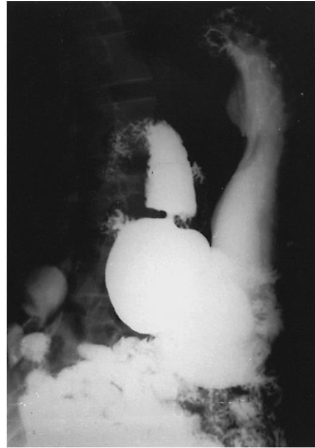

Figure 76-12. Upper gastrointestinal series revealing a large benign "geriatric ulcer" high on the lesser curvature. *(Reproduced from Brandt LJ. Gastrointestinal disorders of the elderly. Lippincott-Raven, 1986, New York.)*

chest pain suggesting angina. A history of NSAID use is commonly obtained from elderly patients with peptic ulcer disease.

The complication rate of peptic ulcer disease rises progressively from 31% in patients 60 to 64 years of age to 76% in those 75 to 79 years of age. Surgery should not be withheld or delayed solely because of advanced age because it is often life-saving in older patients. Bleeding, the most common complication, accounts for one half to two thirds of all fatalities (see later discussion). Perforation is the second most common complication of peptic ulcers in elderly people. The presentation of a perforated ulcer is subtle in this age group, delaying the correct diagnosis and contributing to the high mortality rate. Gastric outlet obstruction complicates ulcer disease in 10% to 15% of patients beyond 60 years of age, generally occurring in those with a long history of disease; an obstructing malignant lesion must be excluded in such patients.

Duodenal ulcers greater than 2 cm in diameter were once considered a distinct entity because of their poor prognosis, but it is probable that most of these "giant" duodenal ulcers are caused by either *H. pylori* infection or NSAID use, just like smaller lesions. Giant duodenal ulcers occur most often in men over 70 years of age who have no prior history of peptic ulcer disease. The most frequent complaint is of abdominal pain radiating to the back or right upper quadrant, suggesting pancreatic or biliary disease. Pain may be relieved by antacids, but aggravated by eating, and is often accompanied by significant weight loss. The ulcer crater is so large that it sometimes is mistaken for the duodenal bulb on an upper gastrointestinal series (Figure 76-13). Although giant duodenal ulcers were often fatal 30 years ago, today they usually respond to therapy with histamine antagonists or proton pump inhibitors and with antibiotics when indicated by the presence of *H. pylori* infection.

Giant gastric ulcers have a diameter of more than 3 cm.128,129 They also are most likely caused by either *H. pylori* infection or NSAID use. Giant gastric ulcers are slightly more

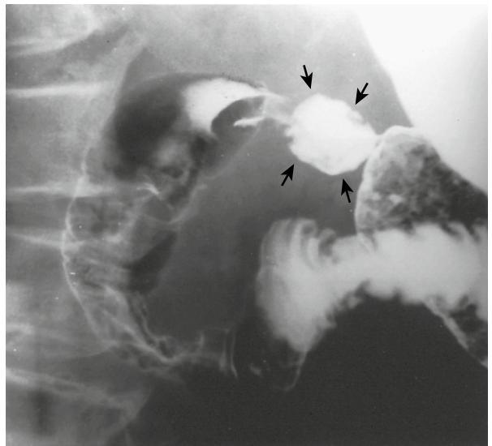

Figure 76-13. Upper gastrointestinal series demonstrates a giant duodenal ulcer resembling the duodenal bulb (*arrows*). *(Reproduced from Brandt LJ. Gastrointestinal disorders of the elderly. Lippincott-Raven, 1986, New York.)*

common in males and are usually seen in patients over 65 years of age. Pain is not a prominent complaint, but only about 10% of patients are completely free of pain. Pain may radiate to the chest, periumbilical region, or lower abdomen. Morbidity and mortality rates are high, with hemorrhage being the most common complication. These ulcers are usually benign and can be treated with histamine antagonists or proton pump inhibitors and with antibiotics when there is documented *H. pylori* infection. Patients should be followed carefully with endoscopy to demonstrate healing. Candidiasis of the ulcer crater may delay healing and requires adjunctive antifungal therapy.

A number of potential problems must be considered in prescribing acid-suppressive therapy for elderly patients with peptic ulcer disease. Many antacid preparations contain large amounts of mineral salts, which may produce undesirable effects, such as fluid retention, diarrhea, or constipation. Aluminum hydroxide forms insoluble chelates with a number of drugs, including digoxin, quinidine, and tetracycline, interfering with their absorption. Histamine antagonists variably inhibit the oxidative metabolism of many drugs, prolonging their duration of action. Cimetidine impairs the elimination of lidocaine, nifedipine, phenytoin, propranolol, quinidine, theophylline, and warfarin, to mention a few. Ranitidine is a less potent inhibitor of mixed-function oxidases than cimetidine, and alterations in drug metabolism caused by ranitidine are usually not associated with pharmacologic effects. Famotidine has no effect on the oxidative metabolism of drugs. Intravenous administration of cimetidine in elderly patients with impaired renal function may produce mental confusion in a dose-related fashion. Cimetidine may also cause a mild elevation of serum creatinine levels unassociated with impairment of renal function. Ranitidine is a rare cause of hepatitis, and ranitidine and famotidine may cause headache. Sucralfate frequently causes constipation in elderly individuals. The National Institutes of Health Consensus Development Panel has published guidelines mandating antibiotic treatment of all ulcer patients infected with *H. pylori*, including those without an active ulcer crater or dyspeptic symptoms.109

#### **Nonulcer dyspepsia**

Patients with nonulcer dyspepsia suffer from chronic, recurrent upper abdominal pain and nausea, which may or may not be related to meals and which occurs in the absence of an ulcer crater.130 Nonulcer dyspepsia is at least twice as common as true peptic ulcer disease. Most patients with this problem have no recognizable pathologic abnormality, although many have histologic gastritis.107 Nonulcer dyspepsia is further defined by the absence of reflux esophagitis, disease of the biliary tract or pancreas, or most symptoms of irritable bowel syndrome. The criteria used to select patients for inclusion in clinical studies of nonulcer dyspepsia are very inconsistent, perpetuating confusion about this diagnosis among physicians and patients.131

The cause of nonulcer dyspepsia is unknown; numerous explanations have been proposed for this syndrome, including psychosocial factors, altered sensation, abnormal gastrointestinal motility and compliance, and *H. pylori* infection.130,131 Gas washout studies show that individuals with nonulcer dyspepsia do not have increased gas in their digestive tracts, and therefore complaints of bloating are probably explained by sensitivity to normal volumes of gas; in some, the transit of infused gas is abnormal, suggesting a motility disorder. Gastric antral hypomotility and impaired gastric emptying of solids have been observed in 40% to 50% of patients with nonulcer dyspepsia, and treatment with drugs that affect upper gastrointestinal motility relieves symptoms in many patients.132–134 Thirty to 50% of patients with symptoms of nonulcer dyspepsia have chronic active gastritis, even when the gastric mucosa appears grossly normal at endoscopy. It has been suggested that nonulcer dyspepsia is part of the spectrum of disease caused by *H. pylori*, which includes chronic active gastritis, duodenitis, and peptic ulcer disease. The successive development of nonulcer dyspepsia, duodenitis, and duodenal ulcer disease has been termed Moynihan's disease.135 *H. pylori* infection, however, has not been shown to be the cause of nonulcer dyspepsia, nor has a definite relationship between nonulcer dyspepsia and peptic ulcer disease been proved.136

In practice, therapy for nonulcer dyspepsia is the same as for peptic ulcer disease, despite the fact that in double-blind, placebo-controlled trials, histamine antagonists, and proton pump inhibitors are only a little better than a placebo in treating this disorder, and the role of gastric acid hypersecretion in nonulcer dyspepsia is unproved by formal measurements of basal and peak acid outputs.137,138 Peptic ulcer disease, NSAID use, *H. pylori* infection, and gastric cancer must be excluded in elderly patients who have dyspeptic complaints.

#### **Upper gastrointestinal bleeding**

Thirty-five percent to 45% of all cases of acute upper gastrointestinal hemorrhage occur in patients beyond age 60, and of these, half are caused by peptic ulcer disease.139–141 Other important causes of gross upper gastrointestinal bleeding in elderly people are gastric erosions and esophagitis; these two entities in combination with peptic ulcer disease account for 70% to 80% of hospital admissions for upper gastrointestinal bleeding in older patients.

It is unclear whether elderly patients with upper gastrointestinal hemorrhage frequently have a long history of underlying acid-peptic disease, for example, chronic peptic ulcer disease, or whether they usually bleed from newly developed lesions. In one series, 36% of older individuals admitted to the hospital with acute upper gastrointestinal bleeding gave no history of preceding symptoms.139 Alternatively, some patients complain of prior epigastric pain, pain in other parts of the abdomen, anorexia, dyspepsia, pyrosis or, simply, weight loss. Elderly patients with acute upper gastrointestinal bleeding usually have hematemesis, although 30% of patients have only melena.139 Hemorrhage is often seen in persons with chronic medical illnesses, the most common being degenerative joint disease. Therapy with NSAIDs for rheumatologic and other problems has been found to be an important cause of upper gastrointestinal bleeding in elderly patients.141,142 Other causes include disease found in younger patients, and entities seen almost exclusively in older individuals. Geriatric ulcers and giant duodenal ulcers are not associated with an unusually high incidence of hemorrhage, whereas giant gastric ulcers frequently do bleed.129

Aortoenteric fistula is an uncommon cause of gastrointestinal hemorrhage seen most often in men during the seventh and eighth decades of life. The most common cause is rupture of an arteriosclerotic abdominal aortic aneurysm. Other causes of aortoenteric fistulas include graft-enteric fistula, aortitis, mycotic aneurysm, carcinoma, trauma, foreign body, and peptic ulceration.143,144 The overwhelming majority of fistulas between the aorta and the alimentary tract occur in the duodenum and, as a result, usually produce upper gastrointestinal bleeding. Other reported sites of communication include the esophagus, stomach, distal small bowel, and colon. Most patients experience an initial self-limited or "sentinel" bleed, followed hours to days later by massive hemorrhage. Mortality rate is very high but may be reduced by early endoscopic detection of the fistula during investigation of the cause of bleeding. An elderly patient with an aortic graft who has upper gastrointestinal bleeding, no matter how trivial, must undergo immediate endoscopy because of the possible presence of a graft-enteric fistula.

Another rare cause of massive upper gastrointestinal hemorrhage in elderly people is a dilated gastric artery with an overlying mucosal defect, typically located within 2 cm of the cardioesophageal junction. This lesion, called exulceratio simplex, or the ulcer of Dieulafoy, often requires surgical therapy, although it has been treated effectively with electrocautery, laser, argon plasma coagulation, and banding.145,146

Occasionally, vascular abnormalities of the type found in Osler-Weber-Rendu syndrome (hereditary hemorrhagic telangiectasia) may also be responsible for upper gastrointestinal bleeding in elderly people. There may be no history of childhood epistaxis and no family history of similar occurrences, although typical telangiectatic lesions are often found in the oral cavity, lips, nailbeds, and skin.

The hospital course of elderly patients with upper gastrointestinal bleeding is similar to that of younger patients with respect to duration, amount of blood transfused, and frequency of surgery.147,148 Older patients, however, suffer significantly more morbidity than do younger patients; complications include cardiac, neurologic, and renal disease; sepsis; and reactions to medications and transfusions. Elderly patients are more likely than young patients to die during a hospital admission for gastrointestinal bleeding, especially if peptic ulcer is the cause.

The evaluation and treatment of upper gastrointestinal bleeding in elderly people are the same as in younger individuals. Age per se is not a contraindication for surgery; the decision to operate on an individual patient must be made in the context of the clinical setting. Early surgery should be contemplated for elderly patients who have bled from ulcers, who have signs of major hemorrhage (e.g., hypotension), and when endoscopic findings imply a significant risk of recurrent bleeding.

#### **Volvulus of the stomach**

Volvulus of the stomach is a relatively rare condition occurring most often after age 50 and requires relaxation of the gastric ligaments for its development.149,150 Gastric volvulus may be responsible for chronic abdominal symptoms or may be manifested acutely with strangulation and gangrene.

Gastric volvulus is classified according to the axis around which the stomach rotates: torsion about a longitudinal axis formed by a line connecting the cardia and pylorus is known as organoaxial volvulus; rotation about a vertical axis passing through the middle of the lesser and greater curvatures is

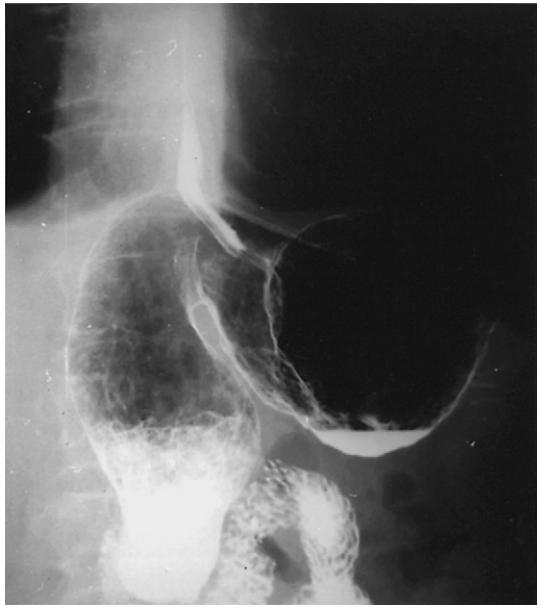

Figure 76-14. An organoaxial volvulus of the stomach identified on upper gastrointestinal series. *(Reproduced from Brandt LJ. Gastrointestinal disorders of the elderly. Lippincott-Raven, 1986, New York.)*

referred to as mesenteroaxial volvulus. Approximately 60% of affected patients have the organoaxial type, 30% have the mesenteroaxial type, and 10% have a combination form. Rotation may be partial or complete; complete twists often severely impair gastric blood flow and may cause gangrene, whereas partial twists may be asymptomatic or responsible for chronic symptoms.

Organoaxial volvulus usually has an acute presentation and often is associated with the presence of a large paraesophageal hiatus hernia or eventration of the diaphragm. Patients complain of the abrupt onset of upper abdominal or lower thoracic pain. Vomiting gives way to retching, and it is difficult to pass a nasogastric tube beyond the gastroesophageal junction. This group of symptoms and signs has been referred to as the Borchardt's triad. Roentgenograms may reveal a gas-filled viscus in the chest or an "upside-down stomach" in the upper abdomen (Figure 76-14). Gangrene ensues in approximately 5% of cases, mostly in individuals with a traumatic diaphragmatic hernia. Organoaxial volvulus usually requires surgical correction.

Mesenteroaxial volvulus is often intermittent and incomplete. Affected persons complain of chronic postprandial pain, belching, bloating, vomiting, and early satiety; strangulation is rare. Diagnosis is made by barium roentgenogram. Decompression with a nasogastric tube may return the stomach to its normal position. Surgery is indicated for persistent symptoms. Some patients have been successfully treated by fixation of the stomach with two percutaneous endoscopic gastrostomy tubes; these are removed after adhesions fix the stomach to the anterior abdominal wall.

#### **Benign gastric tumors**

The incidence of benign gastric tumors increases with age. A hyperplastic polyp accounts for 75% to 90% of such growths and typically is a small, solitary lesion at the junction of the gastric body and antrum.151 Hyperplastic polyps are not considered true neoplasms and are not premalignant. They rarely produce symptoms and thus are found incidentally in an evaluation of the upper gastrointestinal tract. In contrast, adenomatous polyps are true neoplasms and account for 10% to 25% of gastric polyps. The mean incidence of malignant change in gastric adenomas is reported to be anywhere from 6% to 75%, probably reflecting their heterogeneity in size, age, and histology (tubular, villous, or mixed).

Gastric polyps may occur in some gastrointestinal polyposis syndromes, but the only one appearing in older individuals is the Cronkhite-Canada syndrome. This disorder is acquired, not inherited, and is characterized by diffuse gastrointestinal polyposis, protein-losing enteropathy, and ectodermal abnormalities, including hyperpigmentation, alopecia, and dystrophic nail changes. Polyps in this syndrome are hamartomas composed of tubules and mucusfilled cysts.

Mesenchymal tumors, including leiomyomas, fibromas, and tumors of neural origin, account for a significant percentage of benign gastric tumors. Symptoms of these tumors are usually related to their size and not their type. Pain and bleeding are the most common manifestations.

### **Malignant gastric tumors GASTRIC ADENOCARCINOMA**

Inexplicably, the incidence of gastric cancer is decreasing in elderly people, while relatively more cases are being diagnosed in younger patients.152 Nevertheless, the vast majority of gastric cancers occur in patients beyond 60 years of age.1 Carcinoma of the stomach is usually incurable by the time symptoms appear because symptoms often do not develop until the tumor is large. Initial symptoms are often mild and nonspecific. The tendency to treat dyspepsia in older patients without a diagnostic evaluation prompted Sir Heneage Ogilvie to say in the early 1900s, "in carcinoma of the stomach, alkalis are the undertaker's best friend."

Vague epigastric discomfort, anorexia, early satiety, and weight loss are the most frequent symptoms of gastric cancer. Physical examination may reveal enlarged left axillary and supraclavicular lymph nodes, an umbilical nodule, or a hard palpable left hepatic lobe. Rarely, the patient develops acanthosis nigricans, dermatomyositis, or an explosive outbreak of skin tags or keratotic lesions (sign of Leser-Trélat), raising the suspicion of a visceral neoplasm.

Laboratory abnormalities are nonspecific. Surgical excision is the only potentially curative treatment. Seventy percent to 90% of patients with gastric cancer are considered suitable for laparotomy, but only half are found to be eligible for potentially curative resections and death occurs in most of these individuals within 1 year. Five-year survival rates are 5% to 15%. Combined chemotherapy and irradiation may be of some benefit, but irradiation alone is ineffective except for palliation of bone pain from metastases.

#### **GASTRIC LYMPHOMA**

The stomach is the most frequent site of primary, extranodal lymphoma and accounts for one half to three fourths of patients with lymphoma of the gastrointestinal tract. Gastric lymphoma produces nonspecific symptoms, but epigastric pain with weight loss and a palpable mass in a

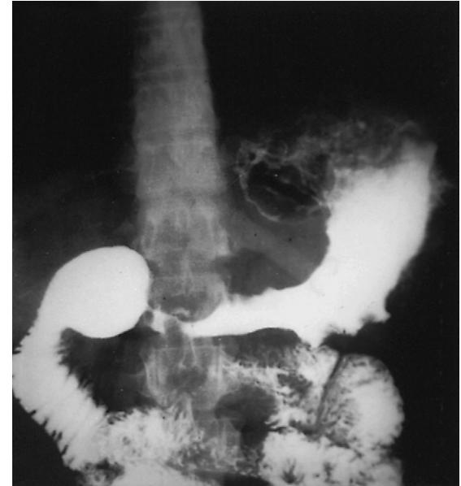

Figure 76-15. Upper gastrointestinal series showing a gastric lymphoma with antral narrowing mimicking an adenocarcinoma. *(Reproduced from Brandt LJ. Gastrointestinal disorders of the elderly. Lippincott-Raven, 1986, New York.)*

patient who is otherwise well is typical. Radiographically, lymphoma resembles carcinoma in up to two thirds of cases (Figure 76-15). Large, ulcerated masses, hyperrugosity, polypoid lesions, or antral narrowing suggests lymphoma. A definitive diagnosis cannot be made from gastroscopic brush cytology and biopsy, and laparotomy may be necessary. Therapy is wide excision followed by radiation and leads to a 5-year survival rate of about 40% to 50%.

# **SYSTEMIC DISEASES**

### **Diabetes mellitus**

Patients with long-standing diabetes mellitus often have profound abnormalities of gastrointestinal motility, including delayed gastric emptying of solids.153 Such abnormalities are frequently without clinical manifestations, although difficulty controlling plasma glucose, due to an inconstant and unpredictable rate of gastric emptying, may be a subtle indication of gastroparesis. Gastric atony may be manifested by a gradual onset of upper abdominal fullness, satiety, and vomiting. Gastroparesis and accompanying hypochlorhydria probably underlie the development of gastric bezoars and bacterial and fungal overgrowth in this population.

Diabetic gastroparesis is caused by an abnormality of the autonomic nervous system almost always associated with peripheral or autonomic neuropathy. Metoclopramide has been used to improve gastric motility and relieve symptoms but causes intolerable central nervous system effects in many patients.

### **Amyloidosis**

The gastrointestinal tract is involved in 50% to 75% of patients with amyloidosis, and in approximately one half of these cases the stomach is affected. It is unusual for signs and symptoms of gastrointestinal involvement to be directly attributable to the amyloidosis per se. Outlet obstruction may be caused by an obstructing mass of amyloid in the distal stomach. Amyloid may also diffusely infiltrate the gastric wall, making surgery difficult, and may be associated with giant gastric ulcers resistant to medical therapy. Prognosis is related to that of the primary disease.

# KEY POINTS

The Upper Gastrointestinal Tract

- Evaluation of the upper gastrointestinal tract should begin with the mouth; changes in the oral cavity, such as candidiasis, stomatitis, leukoplakia, and vascular lesions, may limit the ability of elderly people to enjoy a normal diet.
- Oropharyngeal, or transfer, dysphagia is an important problem in the elderly, caused by uncoordinated muscular contractions that are the result of a wide spectrum of disorders including stroke and Parkinson's disease.
- Dysphagia, or difficulty swallowing, in the elderly should not be ascribed to aging alone and should prompt a search for the presence of disease processes involving the esophagus, such as gastroesophageal reflux disease, esophageal motility disorders, structural abnormalities including rings and webs, and neoplastic disorders.
- Aging is associated with alterations in both the motor and sensory functions of the stomach, but changes in physiology related only to aging rarely account for dyspeptic symptoms.
- Peptic ulcer disease in the elderly is very common, largely due to the frequent use of NSAIDs for arthritis and pain, and often is associated with severe complications including bleeding and perforation.

For a complete list of references, please visit online only at www.expertconsult.com