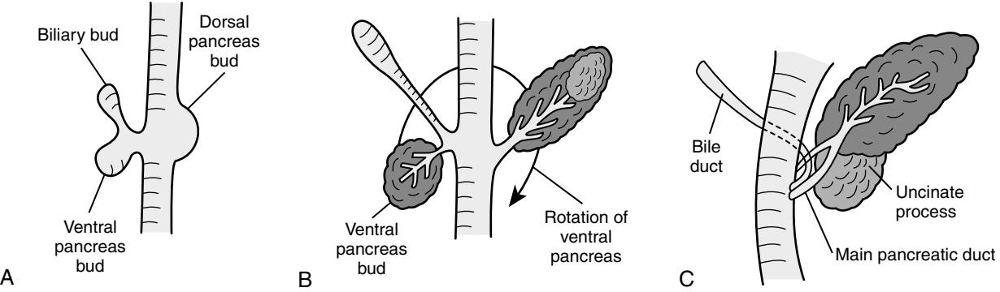
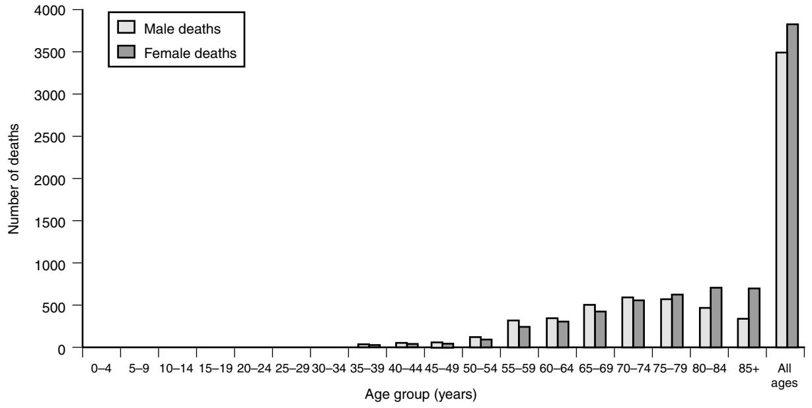
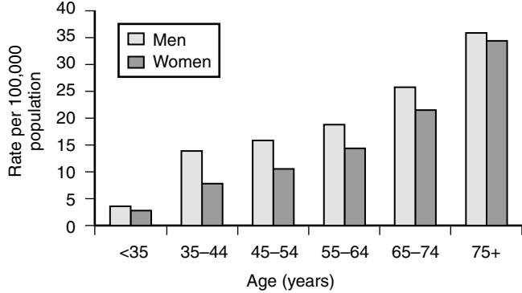

# The Pancreas

# **BACKGROUND**

The pancreas is a retroperitoneal organ located deep to the stomach and has both endocrine and exocrine functions. Some knowledge of its development and structure is necessary as a foundation on which to base an understanding of the diseases that affect it and its changes with age.

# **Development of the Pancreas**

The pancreas begins to develop at day 26 as dorsal and ventral endodermal buds arising from their respective aspects of the primitive tubular foregut. The ventral bud arises together with the embryonic bile duct, and it then migrates posteriorly around the duodenum. Late in the sixth week, the two pancreatic buds fuse to form the definitive pancreas (Figure 77-1). The dorsal pancreatic bud gives rise to part of the head, the body, and the tail of the pancreas, whereas the ventral pancreatic bud gives rise to the uncinate process and the remainder of the head. The two ductal systems fuse, and the proximal end of the dorsal bud duct usually degenerates leaving the ventral pancreatic duct as the main duct opening at the ampulla. The opening of the dorsal duct, if it persists, forms the accessory duct. The pancreatic endoderm of each bud develops into an epithelial tree that will form the duct system draining the exocrine products manufactured in the acini. Endocrine cells arises separately from the ducts and aggregate into the islets.1

A failure of migration or fusion of the early pancreatic buds can result in pancreas divisum (this occurs in about 7% of people); alternatively, the pancreas can surround the duodenum resulting in an annular pancreas. Abnormal development of the ventral duct can result in a common channel whereby the junction of the biliary and pancreatic ducts is outside the wall of the duodenum allowing reflux and mixing of bile and pancreatic juice; this can result in damage to the bile duct in the fetus resulting in a choledochal cyst or damage to the pancreas causing acute pancreatitis.

# **Anatomic Relationships**

The adult pancreas is a retroperitoneal structure 12 to 15 cm long extending from the duodenum to the hilum of the spleen. The neck of the pancreas lies anterior to the superior mesenteric vein and the uncinate process curls around the vein to lie on its right and the posterior border. Posterior to the head and uncinate process is the inferior vena cava. The splenic artery and vein pass deep to the upper border of the pancreas and provide much of its vascular supply. The right-hand border of the head is closely applied to the concavity of the duodenum, and its superior part is related to the portal vein.

# **Histology**

The pancreas has a lobulated structure and there are intralobular ducts penetrating the secretory acini, which are flask-shaped structures consisting of typical zymogenic cells. The larger interlobular ducts contain some nonstriated smooth muscle.

The million or so islets of Langerhans are distributed throughout the adult pancreas and consist of endocrine cells. The alpha cells constitute 15% to 20% of the islet cells and produce glucagon. The insulin-secreting beta cells constitute about 65% to 80%; delta cells (3% to 10%) produce somatostatin. The PP cells (3% to 5%) produce pancreatic polypeptide, and the epsilon cells (<1%) produce ghrelin.

# **Exocrine function**

The pancreas secretes 1400 mL per day of an alkaline, bicarbonate-rich solution containing proenzymes that are converted into active enzymes (proteases, lipases, and glycosidases such as amylase). In the gut, a proenzyme, like trypsinogen, is converted into trypsin by enterokinases; trypsin then, in turn, releases more trypsin from trypsinogen.

Enzyme secretion is stimulated by cholecystokinin released by the duodenum in response to the presence of food. Secretin, also released from the gut wall, controls the secretion of water and electrolytes, most of which is secreted from the ducts of the pancreas.2

Pancreatic exocrine function deteriorates with age; the secretion of bicarbonate and enzymes have been found to be reduced in a group of subjects with average age 72 years compared with a group with average age 36 years.3 However, 80% to 90% of pancreatic function must be lost before malabsorption becomes apparent, and this happens only occasionally in the elderly where other causes of malabsorption are more common.4

# **Endocrine function**

Synthesis and release of insulin from the beta cells of the pancreas is controlled by the level of glucose in the beta cells, which will reflect the plasma level. However, overall control of pancreatic function is the result of many complex interrelated feedback loops. Somatostatin, for example, secreted from the delta cells in response to an increasing blood sugar level, inhibits enzyme release and decreases gut motility. The full complexity of the hormonal control of glucose in the body is as yet not fully elucidated; however, it is clear that there are some functional changes with age.5

# **Age changes**

Besides the age-related changes in pancreatic function, there are morphologic changes; after the age of 60 the pancreas shrinks and can become more fatty.6 Patchy fibrosis can also occur in the pancreas from the seventh decade onward, but without the other changes of chronic pancreatitis this agerelated focal lobular fibrosis is associated with ductal papillary hyperplasia, which can be premalignant.7

# **TUMORS OF THE PANCREAS**

Adenocarcinoma is the most common pancreatic tumor, accounting for 90% of all tumors in the pancreas; it is a malignant tumor with a poor prognosis. Many of the remaining 10% are cystic, often with a more benign behavior but malignant change cannot be ruled out. Truly benign tumors such as fibromas, lipomas, and hemangiomas do occur but are exceedingly rare.

Figure 77-1. Embryology of the pancreas. A, The two pancreatic buds form at 26 days of development. B, Rotation of the ventral pancreas. C, At 45 days, the final position is reached and the ventral and dorsal pancreases have fused.

# **CYSTIC TUMORS**

These tumors are often an incidental finding on imaging, but once they have been detected, determining the exact nature of a cystic lesion in the pancreas is difficult in spite of modern computed tomography (CT), magnetic resonance imaging (MRI), and ultrasound (US) by both transcutaneous and endoscopic techniques. It is often difficult to distinguish an inflammatory lesion from a neoplasm.8,9 Biopsy is often difficult or inconclusive, and the general advice is to err on the side of resection.10 Although these tumors tend to occur more commonly in the young or middle aged, they also occur up to the seventh and eighth decades and they are more likely to be malignant in patients older than 70 years, when resection should be considered.11

# **Solid-pseudopapillary neoplasm**

These occur most commonly in young women and are generally benign but can undergo malignant change. They should be treated by resection, which results in an excellent prognosis.12

# **Serous cystadenoma**

This is sometimes known as a serous microcystic tumor. The mean age of presentation is in the sixth decade, and 70% occur in females. The vast majority are benign; only a handful of cases of malignant serous cystic tumor of the pancreas have been reported.13

### **Mucinous cystic neoplasm**

This neoplasm accounts for 50% of cystic tumors and is either malignant or potentially so. It is most common in middle-aged women and it should be treated by resection of the affected part of the pancreas.14

# **Intraductal papillary mucinous neoplasm (IPMN)**

This tumor is twice as common in males as in females and has a mean age at presentation in the seventh decade. It is characterized by copious mucous draining at a patulous ampulla from a dilated duct. It has a favorable prognosis following appropriate resection.15,16

# **Lymphoepithelial cyst of the pancreas**

This is a rare epithelium-lined cystic lesion similar histologically to a branchial cyst.17

# **Cystic islet cell tumors**

This tumor results from cystic degeneration of a solid endocrine tumor. Although it is rare, it is important to consider this diagnosis when evaluating a cystic lesion in the pancreas and test for endocrine activity in order to exclude a functioning tumor, although the majority of these tumors are in fact nonfunctioning.

# **Von Hippel–Lindau syndrome**

This is rare genetic condition with autosomal dominant inheritance. Several types of pancreatic tumor can occur in this condition including serous cystadenoma, multiple cysts, and endocrine tumors.18

# **SOLID TUMORS Adenocarcinoma EPIDEMIOLOGY AND AGE INCIDENCE**

Pancreatic cancer is the sixth most common cause of cancer death in the United Kingdom and the fourth most common in the United States. In 2005, the number of deaths from pancreatic cancer in the United Kingdom was 7238, with a rate of 12.1 per 100,000 population; for the United States in 2004, the death rate was 9.24 per 100,000 population.19,20

The incidence of pancreatic cancer in the United Kingdom increases sharply with age and the average age at presentation is 69 years.19,21 (See Figure 77-2.)

Pancreatic ductal adenocarcinoma has the lowest 5-year survival rate for all cancers for both men and women at 2% in the United Kingdom and 5% in the United States. The mortality rate is 94% of the incidence rate.20,22 The mortality rate for pancreatic cancer remained static across most of the world from 1992 to 2002.23

Risk factors for pancreatic adenocarcinoma include chronic pancreatitis, diabetes mellitus, smoking, possible relation to increased body mass index (BMI), and genetic (BRCA2, Peutz-Jeghers, von Hippel-Lindau and hereditary nonpolyposis colorectal cancer).24,25

# **PRESENTATION**

Approximately 85% of patients present with disseminated or locally advanced disease, and symptoms frequently include epigastric or back pain, anorexia, weight loss, and obstructive jaundice.26

#### NUMBER OF DEATHS BY SEX AND AGE IN THE UK 2005

Figure 77-2. Death rate from pancreatic cancer in the United Kingdom in 2005. *(Derived from Cancer Research UK 2008 data.)*

*PAIN* Pain can be caused by tumor compression of surrounding structures, tumor size, invasion of pancreatic nerves, and invasion of the anterior pancreatic capsule. Pain intensity at presentation has been found to correlate with survival (29 months for patients without pain, 9 months for those with severe pain).27 Back pain may predict unresectability and shortened survival after resection.28

*WEIGHT LOSS* Weight loss is a common presenting symptom and can be due to anorexia, catabolic metabolism, or malabsorption; however, weight loss is also a common symptom in the elderly and can be nonspecific.

*JAUNDICE* Sixty percent to 70% of pancreatic adenocarcinomata affect the head of the pancreas, and these patients often present with obstructive jaundice resulting from compression of the biliary tract.21

*OTHER* Tumors of the body and tail of the pancreas are frequently associated with late presentation and inoperability. When an older patient presents with a new diagnosis of diabetes mellitus, then the presence of an underlying pancreatic cancer should be borne in mind especially if the patient has other suggestive symptoms. Tumor has been found to be the underlying cause in 1% of patients over 50 years old diagnosed with diabetes.29 Other presentations may include acute pancreatitis and acute upper gastrointestinal or retroperitoneal hemorrhage.21

#### **DIAGNOSIS**

The investigations performed in suspected pancreatic cancer are undertaken with the following aims:

- Establishing the diagnosis
- Locating the tumor
- Staging the tumor
- Assessing resectability
- Obtaining a tissue diagnosis

# **Blood Tests SERUM ANTIGENS**

Carbohydrate antigen 19-9 (CA 19-9) is a glycoprotein synthesized by pancreatic cancer cells as well as being produced by normal epithelial cells of the pancreas, bile ducts, stomach, and colon.30 It has been found to have a sensitivity of 70% to 90% and specificity of 75% to 90% for pancreatic cancer, but it is also elevated in obstructive jaundice, chronic pancreatitis, and biliary and gastrointestinal cancers.30,31 Other tumor markers such as carcinoembryonic antigen (CEA) and carbohydrate antigen 125 (CA 125) have limited use because of lower sensitivity and specificity.31 Although tumor markers cannot actually confirm a diagnosis, they are particularly useful later in the patient's management when a rise in CA19-9, especially if it originally decreased after treatment, may indicate a recurrence. It is of no use as a screening test.32

# **Imaging**

## **TRANSABDOMINAL ULTRASOUND**

Transabdominal ultrasound (US) is frequently the first-line imaging investigation performed in the elderly patient presenting with upper abdominal symptoms. The results are variable and dependent on the operator, the patient's body habitus, and the presence of overlying gas-filled bowel loops. The sensitivity of diagnosing pancreatic cancer with ultrasound ranges from 44% to 95%,30,33,34 with the very high sensitivities in groups where patients were not scanned on an intention to treat basis and difficult scans were excluded from the analysis.

### **COMPUTED TOMOGRAPHY**

Computed tomography (CT) is considered the imaging modality of choice in pancreatic cancer as it can give additional staging information by imaging the chest, abdomen, and pelvis, and more detailed information regarding the resectability of pancreatic tumors. Helical CT has been found to be effective in detecting and staging adenocarcinoma, with sensitivity of up to 97% for detection and up to 100% accuracy in predicting unresectability, although it is not as good at predicting resectability.35 When directly compared with endoscopic ultrasound (EUS) and MRI in a cohort of patients deemed fit for surgery, CT had the highest accuracy in assessing the extent of the primary tumor (73%), locoregional extension (74%), vascular invasion (83%), and tumor resectability (83%).36 Multidetector CT used with an appropriate protocol for timing the injection of contrast agent can provide images in both venous and arterial phases, and the data can then be reformatted in transverse, coronal, and sagittal planes allowing for improved precision in assessing any vascular involvement.21 The value of CT in predicting resectability, however, can be as low as 38%, with patients predicted to have resectable disease on CT found to be unresectable at laparotomy, with the most common causes of unresectability including small peritoneal or liver metastases and vascular involvement of the tumor.35 The contrast material used for CT is potentially nephrotoxic, and patients must be well hydrated and serum creatinine checked; this may be a problem in the elderly, in whom renal impairment is more common.

#### **MAGNETIC RESONANCE IMAGING**

MRI has the advantage of demonstrating the anatomy of the biliary tree better than CT, but in comparison to multidetector CT, MRI is not thought to offer any diagnostic advantage with respect to the pancreas.37 Magnetic resonance cholangiopancreatography (MRCP) has been shown to be as diagnostically effective as endoscopic retrograde cholangiopancreatography (ERCP) in patients with symptoms suggestive of pancreatic cancer (84% sensitivity and 97% specificity).38 MRCP has the added advantage of fewer complications, compared with ERCP, although a number of elderly patients are unable to tolerate the confined space in an MRI scanner.

#### **ENDOSCOPIC RETROGRADE CHOLANGIOPANCREATOGRAPHY**

In the diagnosis of cancer of the pancreas, ERCP has a sensitivity and specificity of 70% and 94%38 and offers the opportunity to obtain a cytologic diagnosis by sampling bile or taking brushings. The value of such sampling can be questionable, however, as a sensitivity of only 60% has been reported with a specificity of 98%.39 ERCP carries a significant rate for serious complication such as pancreatitis, cholangitis, hemorrhage, and death.

#### **ENDOSCOPIC ULTRASOUND**

Endoscopic ultrasound (EUS) is rapidly growing in importance. The high-frequency ultrasound probe positioned in the stomach and duodenum allows high-resolution imaging of the pancreas and surrounding tissue. The accuracy of EUS in evaluating tumor and nodal status was found to be 69% and 54%, respectively,40 and EUS has been found to be at least as valuable as CT41 and equal if not superior to CT in evaluating vascular invasion.42 EUS also offers the opportunity of performing fine needle aspiration of the tumor to aid diagnosis, but in potentially resectable patients this should generally only be performed via the duodenum rather than the stomach as the duodenum will be removed during resection and there have been concerns regarding seeding malignant cells in the needle track.

#### **POSITRON EMISSION TOMOGRAPHY**

Positron emission tomography (PET) exploits the increased glucose metabolism observed in malignant tumors by administering a radioactive glucose analogue and scanning for increased uptake by tumor cells. PET images may be captured with coincident CT images to aid in localizing any accumulation of tracer. There is still uncertainty about the ability of PET scans to distinguish between inflammatory and malignant lesions.43 PET is useful in diagnosing small (<2 cm) tumors and has sensitivity and specificity as good as EUS, ERCP, and US and is particularly useful in detecting distant metastasis—for example, cervical nodes.44

### **Management**

#### **RESECTABLE DISEASE**

The only curative treatment for pancreatic cancer is surgical resection; however, only 15% of patients presenting with pancreatic cancer are considered to be resectable.26 Preoperative imaging is useful for determining clearly inoperable tumors, but at operation a further proportion will be found to be inoperable because of local or distant involvement of other tissue.

To be considered as resectable on imaging, there should be no involvement of the superior mesenteric artery or celiac axis, a patent superior mesenteric vein (SMV) and portal venous confluence and no evidence of distant metastasis. At the time of surgery, findings including previously unidentified metastasis or a tumor that cannot be dissected of the SMV would preclude progression to resection.

Surgical options for resecting cancer of the head of the pancreas include the traditional Whipple pancreaticoduodenectomy or a pylorus-preserving pancreaticoduodenectomy (PPPD). PPPD involves dividing the bile duct close to the liver hilum, dividing the duodenum 2 cm beyond the pylorus, dissecting the pancreas off the superior mesenteric vein, and dividing the pancreas between the head and neck and dividing the small bowel at the duodenal-jejunal flexure. The reconstruction then involves three anastomosis: restoring gut continuity by a pylorus-jejunal anastomosis, connecting the stump of the bile duct to the jejunum just distal to the pylorus-jejunal anastomosis, and finally a pancreatic anastomosis. This last anastomosis is the Achilles' heel of the operation and there is much debate about the technique.45 The authors prefer a pancreaticogastric anastomosis rather than the alternative pancreaticojejunal anastomosis. Most surgeons use the technique that in their hands gives them good results; however, the published leakage rate is up to 10% in some series.46

The Whipple procedure differs in that a distal gastrectomy is also performed, although it would be expected to cause possible long-term morbidity because of gastric dumping, marginal ulceration, and bile reflux gastritis when compared to the PPPD. There have been questions regarding adequacy of resection in a PPPD, but a Cochrane review in 2008 has demonstrated no significant difference between a Whipple and PPPD in terms of in-hospital mortality, overall survival, and morbidity rates.47

The overall complication rate for PPPD is around 39% with a mortality rate ranging from 0 to 7%.47–49 Early complications including postoperative bleeding and bile leak are quoted at rates of 4.8% and 1.2%, respectively, in a meta-analysis.47 Other significant early complications that are of particular importance in the elderly because of preexisting comorbidities include cardiac and respiratory complications, and the elderly have been shown to be treated for significantly more cardiac events following PPPD (13% versus 0.5%).50 The overall mortality for pancreatic cancer resections in octogenarians is over twice that for younger patients (15.5% vs. 6.7%).51 Late complications related to the nature of the operation include delayed gastric emptying, which occurs in 21% of PPPD patients, and pancreatic fistula in 11%.49 Pancreatic endocrine function is generally maintained,52 and pancreatic exocrine function should be assessed by measuring fecal elastase, as malabsorption will result in malnutrition postoperatively.53

Surgery for cancer of the body and tail of the pancreas is less frequently performed, as patients usually have only nonspecific symptoms and a diagnosis is often only made when the tumor is inoperable. However, when a distal pancreatectomy is possible, it involves dissecting the pancreas off the SMV, dividing the pancreas, and then oversewing the cut end. A splenectomy is also performed in cancer operations to ensure as much clearance as possible.

The question of the appropriateness of performing surgery of such magnitude in an elderly patient is an important one. The patient should be evaluated on an individual basis with regard to comorbidities and fitness for anesthetic, possibly using assessments such as Physiological and Operative Severity Score for the enUmeration of Mortality and Morbidity (POSSUM), a multifactorial scoring system54 and cardiopulmonary exercise testing (CPX) (which defines the physiologic stress level at which the patient becomes anaerobic).55 Patients must be made fully aware that their short-term function, and nutritional condition may be compromised after a major pancreatic resection.50

It has been demonstrated that patients older than 75 years of age, when compared with patients younger than 75 years of age, undergoing pancreatic surgery for cancer have increased mortality rates (10% compared with 7%), are more frequently admitted to the intensive care unit unplanned (47% compared with 20%), are treated for more cardiac events (13% compared with 0.5%), are more likely to have a compromised nutritional and feeding status, and are more likely to be transferred for further nursing care before the discharge home.50 The operative mortality rate for pancreatic cancer surgery has been shown to increase with advancing age: 7% at 65 to 69 years, 9% at 70 to 79 years, and 16% at 80+ years.51 However, when looking at significant predictors of survival, some studies have not found age to be an independent variable.56,57

*UNRESECTABLE DISEASE* For patients with unresectable disease, the three most important symptoms for palliation are pain, jaundice, and gastric outlet obstruction. A multidisciplinary team consisting of representatives from surgery, medical oncology, gastroenterology, radiology, and palliative care medicine is essential for the optimal palliation of symptoms.58

#### **PAIN**

The World Health Organization approach to pain management in patients with advanced cancer is still recommended,59 and analgesics should be titrated according to the three-step analgesic ladder: (1) nonopioids, including nonsteroidal anti-inflammatory agents, (2) weak opioids, and (3) strong opioids. Attention should be paid to the route of administration in pancreatic cancer patients, as gastric outlet obstruction may be present and absorption of oral analgesics may be unpredictable.

In patients with severe pain, a celiac plexus block (CPB) with neurolytic solutions may provide analgesia by interrupting visceral afferent pain transmission from the upper abdomen. This can be performed percutaneously, surgically (at the time of laparotomy or bypass), or under EUS guidance. In a prospective, randomized, double-blinded, placebo-controlled trial percutaneous CPB with absolute alcohol has been shown to significantly improve pain relief in patients with unresectable pancreatic cancer, compared with opioids although CPB did not affect quality of life or survival.60 The major complications from percutaneous CPB include lower extremity weakness, paresthesia, lumbar puncture, and pneumothorax, and they have been quoted at a rate of 1%. The technique of EUS-guided CPB has therefore developed in popularity recently and has been found to be safe and effective in pancreatic cancer.61,62

#### **JAUNDICE**

Jaundice can have severe consequences, including intolerable itching, liver dysfunction, and eventually hepatic failure caused by bile stasis and cholangitis;63 relief of the jaundice has been shown to result in a dramatic increase in quality of life.64 Biliary drainage can be achieved by endoscopic or percutaneous placement of a biliary stent or by a surgical biliary-enteric anastomosis. Biliary stents are plastic (Teflon and polyethylene) or made of an expandable metal meshwork. Plastic stents are associated with a higher complication rate including migration, blockage, and infection, although they can be replaced and are cheaper, whereas metal stents have a significantly longer time to first blockage but cannot be removed and are not recommended for patients with a prognosis greater than 2 years because of metal fatigue.63,65

Percutaneous stenting is often performed if endoscopic stent placement was difficult or impossible in patients with hilar obstruction, bilateral or multiple strictures, or previous upper gastrointestinal tract surgery. In the case of metal percutaneous stenting, it provides good palliation with a procedurerelated morbidity rate of 9%.66 The choice of an endoscopic or percutaneous approach may depend on local expertise.

A Cochrane review of palliative biliary stents for obstructing pancreatic carcinoma concluded that based on metaanalysis, endoscopic stenting with plastic stents appears to be associated with a reduced risk of complications but with a higher risk of recurrent biliary obstruction before death when compared with surgery. No trials comparing endoscopic metal stents to surgery were identified.67

#### **GASTRIC OUTLET OBSTRUCTION**

A number of patients with unresectable pancreatic cancer will develop functional or mechanical gastric outlet obstruction (GOO); this can be caused by a dysfunction of gastric or duodenal motility as a result of celiac nerve plexus infiltration by tumor or duodenal blockage caused by tumor infiltration of the wall and lumen. These cases should be fully assessed radiologically with a video contrast meal to assess both motility and the existence of tumor blockage before planning management. For mechanical blockage, surgical gastrojejunostomy can be performed either laparoscopically or at open operation. It should, however, be performed at the time of laparotomy if the intended resection of a pancreatic cancer is found to be not possible and it may be combined with a biliary bypass. This method of preempting GOO was studied by comparing two groups that underwent either single bypass (hepaticojejunostomy) or double bypass (hepaticojejunostomy and retrocolic gastrojejunostomy) and researchers found that there was a significantly higher incidence of GOO in the single bypass group (41% as compared to 5%) with no significant difference in length of stay, survival, or quality of life.68

It is, however, pointless to trying to drain a stomach that is paralyzed. Pharmacologic agents such as metoclopramide or erythromycin may occasionally be helpful in this situation.

Endoscopic palliation with a self-expanding metal duodenal stent is an option in GOO. It has been found to be simple and effective with no complications related to the insertion or the stent, and a 93% reported improvement in symptoms.69 Subsequent stent obstruction was observed, however, in 11% of patients.

*CHEMORADIOTHERAPY* Chemotherapy with or without radiotherapy can be used as an adjuvant treatment in patients following attempted curative resection for pancreatic cancer or as a primary treatment in advanced or metastatic pancreatic cancer. The decision to recommend chemotherapy or chemoradiotherapy for an elderly patient with pancreatic cancer should be made after careful evaluation of the patient's health status, comorbidities, and quality of life, and consideration that physiologic decline and alterations in pharmacodynamics may make the older patient more susceptible to cytotoxic medication.70

The role of adjuvant chemotherapy following curative resection for carcinoma of the pancreas still remains controversial. A recently published meta-analysis of randomized controlled trials estimated a prolongation of median survival time of 3 months for patients in the chemotherapy group, but there was no difference in the 5-year survival.71 A randomized controlled trial specifically looking at the impact of gemcitabine in patients following gross complete resection of pancreatic cancer demonstrated an improved disease-free survival of 7.5 months with no difference in overall survival or quality of life.72

A Cochrane review evaluated various chemotherapeutic regimens used in advanced inoperable pancreatic cancer and concluded that chemotherapy (5-fluorouracil [5-FU] combination regimens), when compared with best supportive care, resulted in improved mortality at 1 year.73 There was no significant difference in outcomes when chemotherapeutic regimens (mostly including 5-FU and gemcitabine) were compared with each other, although current trends seem to favor gemcitabine as it is clinically more acceptable.73 The evidence for the use of chemoradiotherapy was less convincing, and the authors suggest that although there may be benefit from using chemoradiotherapy over supportive care or radiotherapy alone, the potentially greater toxicity needs further review.73

The evidence for chemo- and chemoradiotherapy specifically in an elderly population with advanced pancreatic cancer is limited to retrospective evaluations of patients who had been considered suitable for therapy. Chemotherapy with gemcitabine-based regimens was found to be as acceptable in patients over 70 as in those under 70 with no difference in overall survival, but more elderly patients required dose reduction and experienced increased toxicity.74 Chemoradiotherapy (5-FU and radiotherapy) was also found to be acceptable in the over-70s, with no difference in toxicity and an actual increase in median survival for elderly patients (11.3 months versus. 9.5 months).

### **NEUROENDOCRINE TUMORS**

Pancreatic neuroendocrine tumors (pNET) are rare with an incidence of 1 to 2 per 1 million population.75 They have a median age of presentation of 57 years.76 pNETs are a heterogeneous group of tumors that can be classified according to functionality, tumor localization, rate of proliferation, and metastatic disease.77 The World Health Organization (WHO) classification defines three types of pNET: well-differentiated neuroendocrine tumor (WDT), well-differentiated neuroendocrine carcinoma (WD-Ca), and poorly differentiated neuroendocrine carcinoma (PD-Ca).76 This classification is useful in estimating prognosis with 5-year survival rates quoted as WDT, 95%; WD-Ca, 44%; and PD-Ca, 0%.76

Management is controversial involving surgery, chemotherapy, octreotide therapy, interferon-α, and peptide receptor radionuclide therapy. The main goal of surgery is curative resection of tumor, but other indications include relief of symptoms from hormone-secreting tumors or obstruction.77

# **ACUTE PANCREATITIS**

Acute pancreatitis is an acute inflammatory process of the pancreas with variable involvement of the other regional tissues or remote organs.78 It is a potentially fatal disease, and the incidence in the United Kingdom is increasing although the mortality has decreased. The incidence and mortality increase with age.79 (See Figure 77-3.)

# **Etiology**

Acute pancreatitis has multiple causes. Gallstone disease (44% to 54%) and alcohol (3% to 19%) are the predominant causes in the United Kingdom, although in the elderly population gallstones is the most common cause.79 Drugs are responsible for a small proportion (about 5%) of cases of acute pancreatitis, and as the elderly are more likely to

Figure 77-3. Rate of acute pancreatitis by age group in the United Kingdom, 1987–1998. *(Data derived from Goldacre MJ, Roberts SE. Hospital admission for acute pancreatitis in an English population, 1963–98: database study of incidence and mortality. BMJ 2008;328:1466–9.)*

be prescribed medications such as furosemide, nonsteroidal anti-inflammatory drugs, steroids, some antibiotics, and cancer drugs, this should be considered as a possible etiologic factor. Other causes include hypertriglyceridemia, hyperparathyroidism, trauma, and infection. There is accumulating evidence that the underlying cause of acute pancreatitis is premature intracellular activation of trypsin.80

### **Presentation**

Abdominal pain and vomiting are the most common presenting symptoms of acute pancreatitis, and an elevation of plasma amylase (to four times normal) will often confirm the diagnosis. The serum amylase level peaks early and then declines over 3 to 4 days; in a patient presenting late, this peak may be missed. A raised serum lipase is more specific for pancreatitis and persists for slightly longer. The amylase level may be increased for other reasons, such as acute gastrointestinal ischemia, gastrointestinal perforation, or a leaking abdominal aortic aneurysm; it should be noted that these conditions are also more common in the elderly.81

### **Assessment**

Immediate assessment should include clinical evaluation, blood tests (including complete blood count; liver, bone, and renal profiles; blood glucose), a chest x-ray, and any other tests necessary because of comorbidities present in an elderly patient. It is important to determine the severity of an attack of acute pancreatitis in order to help predict outcome and manage the patient in a suitable setting; care in a highdependency unit is recommended for patients with severe acute pancreatitis.82 There are several methods for assessing severity: Ranson83 and Imrie or Glasgow84 are specific acute pancreatitis scoring systems based an a range of factors; a score of 3 or more predicts a severe attack (Table 77-1). APACHE II is based on an assessment of Acute Physiology and Chronic Health. It is more complicated to calculate than Imrie or Ranson scores but can give an accurate initial prediction of severity; a score greater than 8 predicts a severe attack.82 Additionally, it may be used repeatedly to assess the progress of a patient.85 Trypsinogen activation peptide (TAP)86 and C-reactive peptide (CRP).87 are based on the assay of a single marker and are useful adjuncts to assessing severity. The British Society of Gastroenterology (BSG) guidelines recommend that APACHE II is performed on admission and the Glasgow score be calculated at 48 hours.82

Abdominal ultrasound is useful in acute pancreatitis to confirm the presence of gallstones or bile duct dilatation. Gas-filled loops of bowel overlying the pancreas will often diminish the value of these images; contrast-enhanced ultrasound may, however, be more helpful.88 Early CT is

### **Table 77-1. The Glasgow Scoring System Includes a Point for Each of These Parameters**

| Albumin | < 32 g/l      |
|---------|---------------|
| WCC     | >15,000/mm3   |
| LDH     | > 600 units/L |
| AST/ALT | > 200 units/L |
| Glucose | 10 mmol/L     |
| Calcium | < 2 mmol/L    |
| Urea    | > 16 mmol/L   |
| PO2     | <8 KPa        |

occasionally indicated for diagnosis if clinical or biochemical findings are inconclusive and alternative diagnoses need to be excluded. Abdominal contrast-enhanced CT is most useful in acute pancreatitis between 6 and 10 days after admission to look for pancreatic necrosis in patients with persisting organ failure, signs of sepsis, or clinical deterioration.82

# **Management**

Approximately 75% of acute pancreatitis is *mild* and is usually self-limiting, requiring simple supportive management.89 *Severe* acute pancreatitis, however, can produce a systemic inflammatory response syndrome (SIRS) and subsequent multiorgan dysfunction syndrome (MODS). The principles of management in severe acute pancreatitis (SAP) are, therefore, to support each organ system and establish appropriate monitoring to detect deterioration or the onset of complications, which may need some form of intervention. Elderly or obese patients should also be managed in a high-dependency unit.90

### **RENAL**

Adequate and timely intravenous fluid (IV) replacement lowers the risk of developing renal insufficiency and failure. Rapid or aggressive fluid resuscitation can be difficult in the elderly patient who may well have underlying cardiac or respiratory compromise.91 Hemofiltration or hemodialysis can be necessary if renal failure develops.

### **RESPIRATORY**

Respiratory failure is the most frequently encountered single organ malfunction in SAP, and all patients should receive oxygen therapy and monitoring with oxygen saturation, arterial blood gas sampling, clinical evaluation, and radiologic investigation. Intervention with positive pressure ventilation may be required, and in severe cases high-frequency ventilation may be indicated.

# **CARDIAC**

Cardiac failure is more commonly seen in those with preexisting cardiac problems including hypertension, myocardial infarction, and atrial fibrillation and is therefore more common in elderly patients. Inotropic support is often needed in these patients.

# **GUT**

Gut anoxia and the inflammatory syndrome can result in intestinal barrier failure and subsequent bacterial translocation, which has been suggested as a factor in the development of infected pancreatic necrosis. Enteral nutrition is recommended by the BSG guidelines (2005) as it may help preserve gut mucosal barrier function.82 Enteral feeding may be nasojejunal or, if the stomach is emptying, nasogastric. If the stomach is, however, not draining, nasogastric aspiration should be used to manage the gastric stasis.92

# **GENERAL**

The inflammatory response alters capillary permeability and results in edema and hypovolemia.93 As already mentioned, aggressive IV fluid replacement should be initiated in the patient with SAP,94 and cardiovascular response should be monitored with, for example, central venous pressure measurement, Swan-Ganz catheter or the pulse contour computer (PiCCO),95 and urinary output measurement. There is no consensus as to whether prophylactic antibiotics should be administered.96

The elderly patient is more likely to have pre-existing organ dysfunction and so the capacity to tolerate an insult such as SAP is limited; this is reflected by the higher incidence in development of organ failure in the elderly (64% compared with 48%).97

#### **MANAGEMENT OF PANCREATIC NECROSIS**

Nonperfusion of the pancreas on contrast-enhanced CT implies pancreatic necrosis and indicates a poor prognosis.98 The Atlanta Classification provided a definition of necrosis, but it has not been strictly adhered to and a more recent classification has been suggested.78,99 It is important to determine if the necrosis is infected, as sterile necrosis can be left to resolve.100 Infection may be confirmed by CT-guided needle aspiration. Untreated, infected necrosis is almost always fatal and the necrosis must be débrided and drained at open operation or by a minimally invasive technique.89,90

### **MANAGEMENT OF FLUID COLLECTIONS**

Fluid collection can occur within or adjacent to the inflamed pancreas (i.e., within the lesser sac) or elsewhere in the abdomen, remote from the pancreas. There is much controversy in the literature concerning the nomenclature and management of these collections.78,99 In essence, sterile collections will often resolve, whereas an infected collection (a pancreatic abscess) will need drainage by open operation, endoscopy, or a minimally invasive technique; the choice often depends on local expertise and preference.82

# **CONCLUSIONS**

Pancreatitis is more likely to be severe in the elderly, and this contributes to the higher mortality rates observed in elderly patients: 2.7 deaths per 100 patients in the 45- to 54-yearold age group compared with 18.9% in those 75 years or older.101 Patients with SAP, especially the elderly in whom there may be complicating comorbidities, should me managed in a specialist unit by experienced intensivists and pancreatic surgeons. Those patients who survive long-term management of complications such as diabetes and malabsorption caused by destruction of the pancreas will require specialist management. Attempts must be made to determine the cause of the pancreatitis to try to prevent further attacks. Patients with gallstone pancreatitis will require either cholecystectomy or ERCP and duct clearance.

# **CHRONIC PANCREATITIS**

Chronic pancreatitis is an inflammatory disease resulting in progressive, irreversible destruction of the pancreatic parenchyma affecting exocrine and endocrine function. Onset is typically in the fourth decade with a strong male predominance, and presentation in those over 65 years is rare.102 Chronic pancreatitis shortens life expectancy by 10 to 20 years and is therefore not typically a disease of the elderly.102

In up to 80% of cases of chronic pancreatitis (CP), the etiology is alcohol related,103 and long-term alcohol consumption (>35 years) increases the risk of developing CP.104 The remaining 20% of cases of chronic pancreatitis can be attributed to tropical CP, hereditary CP, pancreatic strictures, pancreas divisum, pancreatic trauma, or idiopathic CP. Idiopathic senile chronic pancreatitis is a subtype of idiopathic CP that presents after the age of 50 and is more prevalent in the elderly.105 Various theories have been proposed as to the mechanism of cell destruction, inflammation, fibrosis, and atrophy seen in CP, but this is still controversial.

The predominant symptoms of CP include pain, typically remitting and relapsing; exocrine dysfunction characterized by weight loss and malabsorption secondary to steatorrhea; and endocrine dysfunction manifesting as diabetes mellitus. Patients often present with symptoms related to the complications of chronic pancreatitis, which include pseudocysts, ductal calculi, distal bile duct strictures, pancreatic duct strictures, and duodenal stenosis.

The diagnosis of chronic pancreatitis can be difficult, but clinical history and examination, biochemical investigations, and radiologic investigations should be used in combination. Fecal elastase is a useful test to confirm pancreatic exocrine failure and has increasing sensitivity with increasing severity of disease. Other pancreatic exocrine function tests are possible but are more unreliable and generally not used.

The role of imaging in CP is both diagnostic and therapeutic. Ultrasound can be used to demonstrate changes in pancreatic tissue and the ductal system; however, CT has greater sensitivity in identifying pancreatic atrophy, pancreatic calcification, dilatation of the pancreatic duct, and pseudocysts, which are typically seen in chronic pancreatitis. MRCP is a useful, noninvasive method of imaging the biliary and pancreatic ductal system, especially if the pancreatic duct is dilated, and the administration of secretin can improve duct visualization. ERCP can provide similar images and has the advantage of offering therapeutic interventions such as sphincterotomy, dilatation of strictures, extraction of calculi, and stenting, although these procedures do carry a complication rate of 5% to 10%.106 EUS has become a useful tool in the diagnosis of CP, particularly in the early stages,107 and is useful therapeutically in celiac

# KEY POINTS

# The Pancreas

### **Pancreatic Adenocarcinoma**

- The incidence increases with age.
- It has the lowest 5-year survival for all cancers.
- Most patients present with advanced disease.
- It is managed with surgery, chemotherapy, or palliation.

#### **Acute Pancreatitis**

- It is most commonly caused by gallstones in the elderly.
- Severity scoring is important to indicate prognosis and guide management.
- Management is supportive according to BSG guidelines with input from intensivists.
- It results in a higher incidence of organ failure and death in elderly.

#### **Chronic Pancreatitis**

- It is not typically a disease of the elderly.
- It is often caused by alcohol.
- It is characterized by pain and pancreatic insufficiency.

plexus blockade, drainage of pseudocysts, and obtaining a tissue diagnosis. The incidence of pancreatic cancer is increased in chronic pancreatitis. Radiologic imaging may be utilized to distinguish between the two diseases; although this can be difficult and the conclusion is often equivocal,108 many patients will be found to be inoperable when they are diagnosed.

Management of patients with CP initially involves symptom control and the goal should be to improve quality of life. Pain should be initially treated with analgesics according to the analgesic ladder, but if this becomes intractable, then celiac plexus block can be considered—operatively, percutaneously, or endoscopically.

The main indications for surgery in CP are intractable pain, suspicion of malignancy, and involvement of adjacent organs. It is recommended that surgery should be individualized according to pancreatic anatomy (small or large duct), pain characteristics, exocrine and endocrine function, and medical comorbidity.109 In an elderly patient, careful consideration should be given to the risks and benefits of what is potentially major and complicated surgery. Options include gastrojejunostomy, feeding jejunostomy, PPPD, Whipple procedure, total pancreatectomy, lateral pancreaticojejunostomy (Puestow procedure), duodenum-preserving pancreatic head resection (the Beger's procedure), and local resection of the pancreatic head with longitudinal pancreaticojejunostomy (the Frey's procedure).

The nutritional status of a patient with CP should be carefully assessed and addressed with appropriate feeding and supplements, and exocrine insufficiency should be managed with enzyme supplements. Endocrine dysfunction may require referral to a specialist diabetologist.

The prognosis for patients with CP is poor, with a 20-year survival rate of 45% and a significantly worse survival for older patients and those with alcoholic CP.110

For a complete list of references, please visit online only at www.expertconsult.com