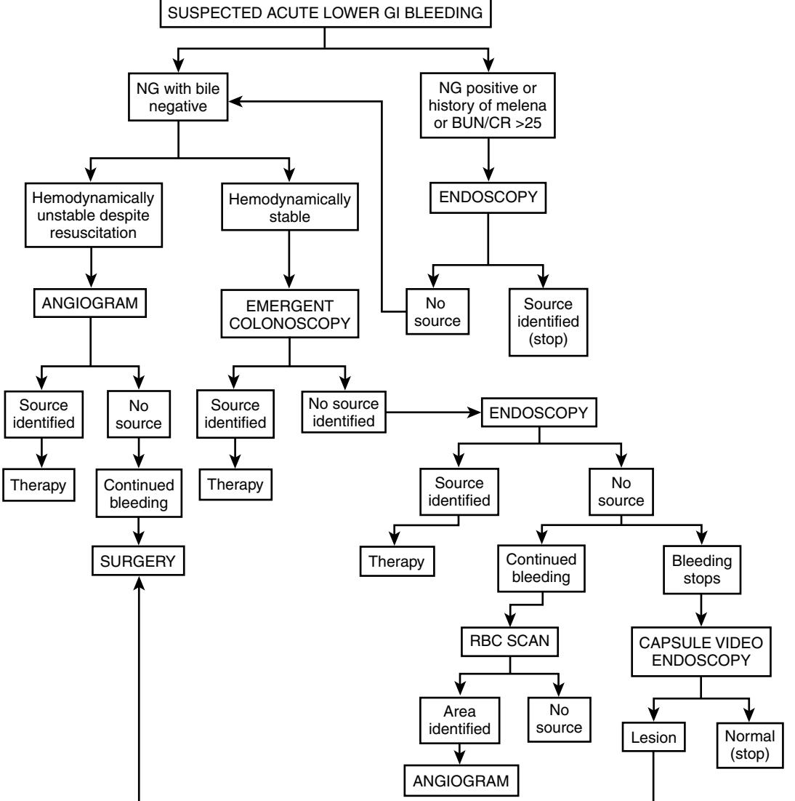

# The Large Bowel

## **ANATOMY**

The colon is a large, hollow organ that is derived embryologically from the primitive midguts and hindguts.1 The appendix and transverse and sigmoid colons have mesenteries, whereas the ascending and descending colons do not. Like the stomach and small intestine, the colon has both circular and longitudinal smooth muscle layers, but uniquely, the longitudinal muscle of the colon is separated into three bundles known as taenia. The configuration of the taenia causes the colon to be divided into haustral folds, which presumably help to slow the passage of fecal material and thus facilitate absorption.

The superior mesenteric artery supplies the right colon to the midtransverse colon, whereas the inferior mesenteric artery supplies the left colon.2 The anorectum derives its blood supply from branches of the internal iliac arteries.3 In the distal transverse to mid-descending colon, the superior and inferior mesenteric arteries are linked by a series of anastomoses known as the marginal artery of Drummond. This anatomic arrangement increases the vulnerability of this area to ischemic damage.

Innervation of the colon is via the autonomic nervous system and the enteric neurons.4 Parasympathetic innervation is by the vagus nerve in the right colon and by sacral parasympathetics from the second, third, and fourth sacral nerves. Sympathetic innervation is derived from the lowest cervical to the third lumbar nerves via the splanchnic nerves. However, colon function may persist even after vagal or splanchnic interruption because of the presence of a well-developed enteric nervous system, which can function in the absence of extrinsic innervation.

# **FUNCTIONS AND SYMPTOMS**

The principal functions of the colon and rectum are to store fecal wastes for prolonged periods of time and to expel them in a socially appropriate manner. Storage is facilitated by adaptive compliance of the bowel and by muscular contractions of colonic smooth muscle, which retard the forward movement of stool, thereby promoting electrolyte and water absorption and reducing stool volume. Forward movement occurs principally by relatively infrequent peristaltic contractions, which move intraluminal contents over long distances. Continence is maintained by recognition of rectal filling and coordinated function of the anal sphincters and pelvic floor muscles to defer defecation until socially appropriate. Colonic motility and transit in healthy elderly people are similar to that in younger individuals,5 whereas aging is associated with diminished anal sphincter tone and strength and a less compliant rectum.6,7 The latter changes may lead to greater susceptibility to fecal incontinence in elderly people (see Chapter 103).

The major symptoms of colonic and rectal disorders are constipation, diarrhea, pain, and rectal bleeding. The conditions that produce these symptoms are not unique to the elderly population; those occurring with increased frequency in elderly people include diverticulosis, neoplasms, ischemic colitis, vascular ectasias, fecal incontinence, constipation, and antibiotic-associated diarrhea and colitis. Inflammatory bowel diseases occur in all age groups, but onset of these diseases is less likely in the elderly population. In short, a challenge of evaluating older people with bowel symptoms is that these not uncommon complaints can arise from disorders that range from the minimally disruptive to the likely fatal, with a higher probability of worse illness as age increases. As with any other illness, disease in the colon can present in elderly people who are frail as delirium, falls, or immobility.

## **DIAGNOSTIC TESTING Radiology CONTRAST STUDIES**

Contrast examination of the large intestine has traditionally been done by using barium sulfate in either a single- or a double-contrast technique in which a thickened barium suspension is used to coat the mucosa followed by insufflation to expand the viscus. Alternatively, water-soluble contrast agents can be used if perforation is suspected.

The single-contrast technique is preferred when studying patients with suspected obstruction, diverticulitis, or fistula, whereas the double-contrast technique is preferred for demonstrating fine mucosal lesions and neoplasms. Although there continues to be some controversy concerning the choice of barium contrast or colonoscopy when investigating colonic diseases, most clinicians favor colonoscopy for its greater sensitivity and opportunity for biopsy and therapy. Contrast studies may be indicated in cases where severe stricturing disease or adhesions make colonoscopy hazardous, where conditions such as diverticulitis are suspected, if the location and nature of a colonic obstruction requires assessment, and if functional and structural information is required. A barium enema should not be attempted when increases in colon pressure may worsen the patient's condition, for example, in patients with suspected toxic megacolon or those with peritoneal signs that suggest ischemic colitis.

When patients complain of constipation or a recent change in bowel habit, barium radiographs complement sigmoidoscopy in detecting organic causes and are also useful in diagnosing functional megacolon and megarectum. Complete filling of the colon with barium is neither necessary nor desirable in patients with megacolon. However, conventional barium studies provide limited information about colonic motor function in most patients with chronic constipation.8 Moreover, they are frequently inadequate in frail or hospitalized elderly patients.9,10

# **IMAGING TECHNIQUES Abdominal computed tomography**

This procedure allows visualization of the thickness of the bowel wall, the solid viscera within the abdomen, the mesenteries, and soft tissues adjacent to the bowel. It offers a modest advance in the diagnosis of diverticulitis by

# Arnold Wald

demonstrating inflammation of pericolic fat, abscesses that may contain collections of fluid and gas, and intramural sinus tracts. Fistulas to other organs can be identified when gas is found within the bladder or vagina. It also can identify extension of disease at a distance from the colon, including unsuspected intra-abdominal abscesses.

Computed tomography (CT) is also valuable when evaluating and managing complications of Crohn's disease, including abscesses, fistulas, and involvement of psoas muscles and ureters, and occasionally for percutaneous drainage of collections. Other complications, including sacral osteomyelitis, cholelithiasis, nephrolithiasis, and vascular necrosis of the femoral head associated with corticosteroid therapy, can also be diagnosed.

In appendicitis (and cecal diverticulitis, which is usually misdiagnosed as appendicitis), computed tomography may augment the clinical diagnosis by showing the periappendicular inflammatory process and differentiating phlegmon from abscess.11 Occasionally, appendicoliths are identified, which are considered pathognomonic of appendicitis when associated with periappendicular inflammatory signs.

CT colonography is a new technique devised to detect colon polyps for screening purposes. Detection rates for colonic polyps of greater than 6 mm are similar to colonoscopy, but the test has low sensitivity for smaller polyps.12 The use of 3-dimensional evaluation in addition to 2-dimensional evaluation may reduce perceptual errors.13 CT colonography is now recommended as an alternative for colon polyp screening in the United States.

#### **Anal and rectal endosonography**

Endoscopic anal and rectal ultrasonography accurately delineates the layers of the rectal wall, the internal and external anal sphincters, and the levator muscles.14 It can be used to evaluate pelvic floor structures in patients with fecal incontinence to detect occult sphincter injuries arising from childbirth or other conditions associated with potential injury to continence mechanisms.15,16

Endoscopic ultrasonography is a rapid, minimally invasive technique used to image rectal polyps, focal malignancy within polyps, tumor masses penetrating into the bowel wall, and extramural lesions such as prostatic tumors and ovarian lesions. Perirectal fistulas and abscesses can also be evaluated (including determining whether there is destruction of pelvic muscles). It is considered the reference standard for the preoperative staging of rectal and anal cancers with relatively high accuracy in categorizing tumors and lymph nodes.17

#### **Colonoscopy and flexible sigmoidoscopy**

These procedures are usually performed in the prepared colon except when evaluating diarrheal illnesses. Colonoscopic examinations provide unparalleled evaluation of the mucosal surfaces and opportunities for biopsy and therapy. These include diagnosis and determining extent of inflammatory bowel disease, evaluation of patients with overt or occult gastrointestinal bleeding, evaluation of chronic watery diarrhea, endoscopic sampling and removal of polyps, decompression of sigmoid volvulus or functional megacolon, and ablation of vascular lesions. Colonoscopy is generally done under conscious sedation, whereas flexible sigmoidoscopy usually is not.18 In many elderly patients, the physician must be aware of their increased sensitivity to sedatives and analgesic medications. As elderly people are susceptible to hypotension and respiratory depression, careful monitoring of the patient during the procedure is especially important. Even so, such procedures are generally safe in experienced hands and when done in units that monitor blood gases and cardiorespiratory functions. Major complications include bleeding and perforation, which should not occur more than 2 or 3 times in 1000 routine diagnostic procedures.

#### **Histopathology**

Mucosal biopsies are often indicated when evaluating undiagnosed diarrhea, in longstanding ulcerative colitis during surveillance for precancerous dysplasia, in obtaining tissue for viral culture, and in evaluating polypoid or ulcerated lesions. In inflammatory disorders of the colon and rectum, biopsies serve to establish the presence, extent, and distribution of colitis and to differentiate ulcerative from Crohn's colitis and these disorders from other inflammatory conditions such as infectious colitis. Biopsies should be obtained from endoscopically normal and abnormal areas, as characteristic changes may be patchy and therefore missed if too few biopsies are obtained. This is especially true in pseudomembranous, collagenous, and lymphocytic colitis in which the distal colon may be spared. As hypertonic phosphate enemas and purgative laxatives may induce mucosal changes that can be mistaken for mild colitis, they should be avoided when evaluating suspected inflammation of the colon.

#### **Fecal occult blood testing**

Fecal occult blood tests (FOBTs) identify hemoglobin or altered hemoglobin compounds in the stool. Food containing peroxidases, such as melon and uncooked broccoli, horseradish, cauliflower, and turnips, may produce false positive results, whereas reducing agents such as ascorbic acid may decrease sensitivity.19 Tests that extract the protoporphyrin from hemoglobin, such as Hemo Quant, are more specific and are quantitative but are also more timeconsuming and expensive. Rehydration of Hemoccult slides increases sensitivity but decreases specificity and is not recommended. A weakly positive slide may become negative after 2 to 4 days of storage. Oral iron supplements do not interfere with any of these tests.

#### **COLONIC DIVERTICULOSIS**

Colonic diverticula are herniations of colonic mucosa through the smooth muscle layers. Diverticula occur in areas of anatomic weakness of the circular smooth muscle created by penetration of blood vessels to the submucosa. They are most commonly found in the sigmoid and descending colons and rarely, if ever, in the rectum.20

This disorder has been recognized with increasing frequency in modern Western countries.21 Colonic diverticula are present in about one third of persons by age 50 and about two thirds by age 80. Dietary fiber insufficiency and the increased longevity of modern Western populations have been hypothesized to explain the increased prevalence of diverticulosis. Dietary factors may promote increased colonic motor activity and intraluminal pressures, whereas aging may lead to structural weakness of the colonic muscle.20 As diverticula are asymptomatic in most individuals, caution must be taken before attributing nonspecific gastrointestinal symptoms to them.22

## **Painful diverticular disease**

Painful diverticular disease is characterized by crampy discomfort in the left lower abdomen. Symptoms are often associated with constipation or diarrhea and with tenderness over the affected areas. These symptoms are similar to those of irritable bowel syndrome and partial bowel obstruction due to tumors or ischemia. Studies have shown that these patients have altered motor activity in the segments containing diverticula, which are associated with reporting of abdominal pain.23 In contrast to diverticulitis, there is no fever, leukocytosis, or rebound tenderness.

## **Diverticulitis**

Diverticulitis develops in approximately 10% to 25% of individuals with diverticulosis who are followed for 10 years or more; however, less than 20% of these patients require hospitalization. Inflammation begins at the apex of the diverticulum when the opening of a diverticulum becomes obstructed (e.g., with stool), leading to microperforation or macroperforation of a diverticulum.24 The presence of a palpable mass, fever, leukocytosis, and/or rebound tenderness indicates an inflammatory process, which often remains localized in the adjacent pericolic tissues but may progress to a peridiverticular abscess.25 Other complications include fibrosis and bowel obstruction, fistula formation to the bladder, vagina, or adjacent small intestine, and free perforation with peritonitis. The frequency of complications rises to about 60% with recurrent attacks of diverticulitis.

Making a clinical distinction between painful diverticular disease and diverticulitis carries a sizable rate of error.24 In an elderly or debilitated patient, the absence of fever, leukocytosis, or rebound tenderness does not exclude diverticulitis.25

Recently, a disorder characterized by localized inflammation associated with diverticulosis (SCAD syndrome) has been described in older symptomatic patients.26 Symptoms appear after the age of 40 years and are most often characterized by rectal bleeding, diarrhea, and abdominal pain.

Other disorders such as carcinoma, inflammatory bowel disease, and ischemia may mimic symptomatic diverticular disease. Diagnostic studies include barium enema, CT, ultrasonography, and colonoscopy. In most cases of suspected diverticulitis, barium enema should be delayed for about a week to allow some resolution of the inflammatory process. A single-contrast study should be performed cautiously to minimize the risk of perforation. Radiographic findings suggesting diverticulitis include longitudinal fistulas connecting diverticula over segments of colon, fistula into adjacent organs, a fixed eccentric defect in the colon wall, contrast outside the lumen of the colon or diverticulum, and intraluminal defects representing abscesses.20 CT and ultrasonic imaging of the abdomen provide superior definition of colonic wall thickness and extraluminal structures and are the procedures of choice at the time of initial evaluation. Colonoscopy is a less attractive option during an acute episode and is best employed to exclude tumors or other conditions if other diagnostic tests are inconclusive.

The treatment of painful diverticular disease is designed to reduce symptoms based on smooth muscle spasm, in contrast to the treatment of diverticulitis, which is designed to treat bacterial infection (Table 81-1). Patients with severe pain, nausea and vomiting, or complications should be hospitalized and given intravenous antibiotics until clinical improvement occurs.

Surgery is recommended for patients with diverticulitis who fail to respond to medical therapy within 72 hours, for immunocompromised patients, and those who have fistula to the bladder with pneumaturia and urinary infection or fistula to the vagina with discharge of stool into the vagina. Although some surgeons recommend elective sigmoid resection after two episodes of diverticulitis, others favor a more conservative approach.27 A one-stage operation, in which the diseased segment of bowel is resected and continuity restored by a primary anastomosis, is preferred.28 In cases of generalized peritonitis or emergent surgery for perforation with abscess or high-grade obstruction, a two-stage procedure requiring a diverting colostomy should be used.29 Large abscesses can often be drained percutaneously by an interventional radiologist using CT or ultrasonography as a guide.30,31 Elective surgery can then be performed after 2 to 3 weeks of antibiotic therapy, often allowing for a singlestage resection.

Emergent surgery is required for generalized peritonitis or persistent high-grade bowel obstruction. Most patients with complicated diverticular disease require surgery, even if clinical recovery occurs, since there is a high risk of recurrent attacks.

| Measure                              | Painful Diverticulosis                                                                                                                        | Diverticulitis                                                                                                                                                                                                                                                                                                                                               |
|--------------------------------------|--------------------------------------------------------------------------------------------------------------------------------------------------|--------------------------------------------------------------------------------------------------------------------------------------------------------------------------------------------------------------------------------------------------------------------------------------------------------------------------------------------------------------|
| Diet Bulk laxatives Analgesics | Increase fiber Sometimes effective Avoid narcotics                                                                                         | Reduce fiber (or NPO) Not indicated Avoid morphine; meperidine is best                                                                                                                                                                                                                                                                              |
| Antispasmodics                       | Propantheline bromide (15 mg tid); Dicyclomine hydrochloride (20 mg tid); Hyoscyamine sulfate (0.125 mg– 0.250 mg q 4 h) | Not indicated                                                                                                                                                                                                                                                                                                                                                |
| Antibiotics                          | Not indicated                                                                                                                                    | Oral: Amoxicillin/clavulanate K+ (875/125 mg bid) Ciprofloxacin (500 mg bid) and metronida zole 500 mg tid) Parenteral 1.Gentamicin or tobramycin (5 mg/kg/ day) plus clindamycin (1.2–2.4 g/day) or 2.Levofloxacin 500 mg/ day and metronidazole (500 mg q 8 h) 3.Piperacillin-tazobactam (3.375–4.5 gm q 6 h) |

#### **Table 81-1. Medical Treatment of Diverticular Disease**

*Updated and modified from Wald*20 *with permission.*

Most patients with localized inflammation associated with diverticulosis respond with long-term resolution of the disease to 5-aminosalicylate therapy. On occasion, spontaneous remissions may occur or persistent chronically active disease may require resective surgery.26

#### **Bleeding**

Bleeding associated with diverticula is typically brisk and painless and often arises from the proximal colon. Bleeding is thought to occur when a fecalith erodes into a vessel in the neck of the diverticulum or there is rupture of the penetrating arteriole in its course around the diverticular sac.20

An important indication for emergent colonoscopy is to identify the source of bleeding in patients with diverticula, as other lesions not seen by contrast studies may be the actual source. If bleeding is brisk, a bleeding scan or selective mesenteric angiography can often locate the site of bleeding; superselective embolization of distal arterial branches has been demonstrated to be highly effective and relatively safe (<20% ischemia rates)32 (see Lower Gastrointestinal Bleeding).

#### **APPENDICITIS**

Elderly patients with appendicitis are at increased risk (about 60%) for perforation. They have a higher mortality and often do not exhibit a fever or elevated white blood cell count.33

Classically, the onset of abdominal pain is abrupt, begins in the midabdomen, relocates to the right lower quadrant, and is often associated with nausea, vomiting, and fever. Physical examination characteristically reveals signs of local peritonitis in the right lower quadrant, and the white blood cell count is frequently elevated. The differential diagnosis includes pyelonephritis, Crohn's disease, gastroenteritis, pelvic inflammatory disease, ovarian cyst, and cecal diverticulitis. In elderly patients, appendicitis may occur in association with colon cancer in which low-grade obstruction results in distention of the appendix and mimics true appendicitis.

If the diagnosis is uncertain, ultrasonography has been shown to have positive and negative predictive values of about 90% for appendicitis and is also useful in identifying another cause of symptoms in patients with right lower quadrant pain.34 One sonographic criterion for acute appendicitis is visualization of a noncompressible appendix with a diameter of greater than 6 mm.

# **INFECTIOUS DISEASES** *Clostridium difficile*

*Clostridium difficile* is responsible for approximately 3 million cases of diarrhea and colitis each year and is the most common cause of nosocomial diarrhea in the United States.35

The vast majority of cases are associated with two protein exotoxins (A and B) produced by *C. difficile*. Toxin A is an enterotoxin that triggers diarrhea, epithelial necrosis, and a characteristic inflammatory process in animals, whereas toxin B is a cytotoxin in tissue culture but does not by itself cause toxicity in animals.36 The disease spectrum ranges from mild diarrhea, with little or no inflammation, to severe colitis often associated with pseudomembranes,

which are adherent to necrotic colonic epithelium. Acquisition of *C. difficile* occurs most frequently in elderly persons in hospitals or nursing homes, potentially because of environmental contamination with *C. difficile* and spores carried on the hands of hospital or institutional personnel.37 Acquisition is often asymptomatic but may have clinical consequences if elderly patients receive certain antibiotics or chemotherapeutic agents. Other possible risk factors include surgery, intensive care, nasogastric intubation, and length of hospital stay. A smaller number of patients have antibiotic-associated diarrhea but no evidence of *C. difficile* infection.

Although virtually all antibiotics have been implicated, the most common are cephalosporins, ampicillin or amoxicillin, and clindamycin.38 Less commonly mentioned antibiotics include other penicillins, erythromycin, and fluoroquinolones.

Currently, the United States, Canada, and Europe are experiencing an outbreak of a new virulent strain of *C. difficile* designated as ribotype 027.39 This strain has been shown to be resistant to the newer fluoroquinolones, as is the case of other existing strains of *C. difficile*. 35

The typical clinical picture of *C. difficile*–associated colitis includes nonbloody diarrhea, lower abdominal cramps, fever, and leukocytosis. Fever is usually low grade although, on occasion, it can be quite high. In severe cases, dehydration, hypotension, hypoproteinemia, toxic megacolon, or even colonic perforation may occur.

In severely ill patients, the diagnostic test of choice is flexible sigmoidoscopy or colonoscopy. As the distal colon is involved in the majority of cases, flexible sigmoidoscopy is usually satisfactory; however, changes may be confined to the right colon in up to one third of cases, making colonoscopy necessary if less extensive procedures do not confirm a suspected diagnosis. The yellowish-gray pseudomembranes are densely adherent to the underlying colonic mucosa, interspersed with mucosa that appears normal. Mucosal biopsies may exhibit characteristic findings of epithelial necrosis and micropseudomembranes ("volcano lesions") even when pseudomembranes are not grossly visible. Endoscopy particularly has a role in severely ill patients who present atypically and therefore require a rapid diagnosis.40

Several tests identify *C. difficile* or its toxin. The enzyme immunoassay (EIA) for toxin A and/or B is the preferred test to detect toxin. On average, EIA tests range in sensitivity from 87% to 96% in confirmed cases of *C. difficile* diarrhea.41 Thus it should be emphasized that a negative EIA test does not exclude a diagnosis of *C. difficile* colitis.

The offending drug should be discontinued if possible. If symptoms persist, patients who are not seriously ill should receive oral metronidazole 500 mg tid for 7 to 10 days. Patients who are seriously ill and those with complicated or fulminant infections should receive oral vancomycin 125 mg PO qid for 7 to 10 days.42 If oral intake is not possible, metronidazole 500 mg IV q6h is given until oral administration can be accomplished. Metronidazole and vancomycin appear to be therapeutically comparable in nonseriously ill patients, but metronidazole costs less and there are current concerns about vancomycin-resistant enterococcus.43 In general, fever resolves within 24 hours and diarrhea decreases within 4 to 5 days.

Relapses average about 20% to 25% following successful treatment with either agent,44 often involving sporulation,

#### **Table 81-2. Practice Guidelines for Prevention of** *Clostridium difficile* **Diarrhea**

- 1. Limit the use of antimicrobial drugs.
- 2. Wash hands between contact with all patients.
- 3. Use enteric (stool) isolation precautions for patients with
- *C. difficile* diarrhea. 4. Wear gloves when contacting patients with *C. difficile* diarrhea/ colitis or their environment.
- 5. Disinfect objects contaminated with *C. difficile* with sodium
- hypochlorite, alkaline glutaraldehyde, or ethylene oxide. 6. Educate the medical, nursing, and other appropriate staff
- members about the disease and its epidemiology.

*From Fekety,*40 *with permission.*

which leads to relapse within 4 weeks after completion of successful treatment. These episodes invariably respond to another course of antibiotic therapy. About 5% to 10% of patients have multiple relapses. In such individuals, vancomycin in conventional doses should be followed by a 3-week course of cholestyramine 4 g tid and/or Lactinex 500 mg PO qid, or vancomycin 125 mg PO every other day. Others advocate a 6-week schedule consisting of a 2-week course of vancomycin given daily in the standard dose, a 2-week course in the same dose given every other day, followed by a 2-week course at the same dose given every third day. *Saccharomyces boulardii* is a nonpathogenic yeast which inhibits the binding of toxin A to rat ileum, with consequent prevention of enterotoxicity.45

Guidelines for prevention of *C. difficile* diarrhea and colitis are based upon a few simple practices and attitudes and are shown in Table 81-2. 40

# *Shigella*

These organisms consist of four groups: (1) *Shigella dysenteriae*, (2) *S. flexneri*, (3) *S. boydii,* and (4) *S. sonnei,* the last of which accounts for most clinical infections in Western countries. In contrast to other enteric pathogens, very few organisms are needed to produce infection, which is spread by fecal-oral transmission between humans and which continues to occur despite high standards of water purification and sewage disposal. At least 30 gene products are involved in *Shigella* invasion and its intercellular spread. Disease is caused by invasion of colonic epithelial cells, perhaps in part mediated by cytotoxins produced by *S. dysenteriae* and *S. flexneri,* but enterotoxins may also contribute to early symptoms of nondysenteric diarrhea.46 Enterotoxins similar to Shigalike toxins secreted by enterohemorrhagic *Escherichia coli* are believed to mediate the hemolytic-uremic syndrome associated with severe colitis caused by *S. dysenteriae* type I.

## **SYMPTOMS**

Colitis is heralded by the passage of bloody mucoid stools associated with urgency, tenesmus, abdominal cramping, fever, and malaise. The frequency of stools is highest during the first 24 hours of illness and gradually diminishes thereafter.

## **DIAGNOSIS**

Stool examination reveals numerous polymorphonuclear cells, and leukocytosis is common. Stool culture grown on selective media is the definitive diagnostic study. Sigmoidoscopy is usually not necessary, but if done, will demonstrate a friable hyperemic mucosa. Barium contrast studies are not indicated.

## **TREATMENT**

If the illness is mild and self-limited, antibiotics can be withheld. As resistance to sulfonamides, ampicillin, tetracycline, and even trimethoprim-sulfamethoxazole is now common, treatment with a fluoroquinolone (e.g., ciprofloxacin 500 mg twice daily for 5 days) is indicated in frail or otherwise debilitated patients with acute disease to shorten the illness and the period of fecal excretion of the organism.47 Antidiarrheal agents prolong the clinical illness and carrying of the organism and should not be administered.48 The development of a chronic carrier state is rare and difficult to treat.

# **Pathogenic** *Escherichia coli* **that cause colitis**

These organisms commonly cause disease in developed countries and are a major cause of diarrhea in tourists visiting underdeveloped countries. As older individuals increasingly engage in overseas travel, these organisms can be a major impediment to a successful trip.

Of the five major classes of pathogenic *E. coli,* only enteroinvasive (EIEC) and Shiga toxin–producing *E. coli* (STEC) primarily involve the colon. Both produce a clinical illness similar to that of shigellosis. Once thought to be a pathogen restricted to developing countries, STEC has been shown to produce diarrhea in the United States and is a relatively uncommon cause of traveler's diarrhea. It is more difficult to identify in stool cultures and is not a reportable illness. The clinical illness is generally milder than with shigellosis. A reasonable approach is to treat with a fluoroquinolone similar to treatment for shigellosis.35

Preventive measures include eating cooked food only while it is still hot and avoiding local water, including fruits and vegetables washed with local water. In elderly tourists, the disease can be shortened by prompt use of a fluoroquinolone.46

# **Shiga toxin–producing** *E. coli* **0157:H7**

This organism has been identified as a major pathogen in the United States and Canada, causing approximately 70,000 cases in the United States annually.35 In addition to sporadic infections, epidemics have been traced to consumption of undercooked and raw ground beef, as healthy cattle serve as the primary reservoir for Shiga toxin–producing strains. Infections have also been associated with exposure to patients with bloody diarrhea, contaminated water supplies, and nonpreserved apple cider. Clinical manifestations include nonbloody diarrhea, hemorrhagic colitis, and hemolytic-uremic syndrome (HUS).49 Unlike most bacterial enteric diseases, *E. coli* 0157:H7 is often characterized by low-grade fever or the absence of a fever.50 The pathogenesis of colitis has been linked to Shigalike toxins (verocytotoxins 1 and 2), which bind to a glycolipid on the surface of colonocytes, but adherence factors may also play a role. Older age is both a risk factor for this infection and increases the risk of HUS and death. It is generally believed that antibiotics are not indicated for active infections and appear to predispose to hemolytic-uremic syndrome.49

An important emerging group of related pathogens are the non-0157 toxin–producing *E. coli,* which can produce an illness similar to 0157:H7 strains.51 Indeed, in Europe, a majority of STEC strains belong to the non-0157 serogroup.

#### *Campylobacter* **species**

*Campylobacter jejuni* and *C. coli* are among the most common bacterial causes of diarrhea and can be manifested by gastroenteritis, pseudoappendicitis, or colitis. These organisms are usually transmitted from animals to humans through contaminated food and water and sometimes by direct contact with pets. Constitutional symptoms usually precede diarrhea and abdominal cramps by up to 24 hours, and colitis may be characterized by fever and dysentery lasting for a week or more. Diagnosis is made by stool culture. Convalescent carriage up to a mean of 5 weeks is common after the onset of illness and is significantly reduced by antimicrobial treatment.

Although the infection is usually self-limited, antibiotics may be given if the illness is severe or in patients who are immunosuppressed.52 Treatment consists of erythromycin or fluoroquinolones; macrolides such as azithromycin and clarithromycin show excellent in vitro activity. Resistance rates to fluoroquinolones of up to 88% have been reported in Europe and Asia. In areas of high resistance, azithromycin 500 mg daily for 3 days is an effective alternative.

#### *Entamoeba histolytica*

This organism remains a primary cause of dysentery, which may be complicated by fulminant colitis, toxic megacolon, bleeding, stricture, and perforation. Severe disease is more common in elderly people and in patients who are immunosuppressed or debilitated.53 The disease is typically acquired by ingesting cysts from contaminated water or fresh vegetables but can also be transmitted venereally through sexual practices that promote fecal-oral transmission. Studies on germ-free animals suggest that intestinal disease does not develop unless bacteria are present. This may partly account for the effectiveness of metronidazole, which is also active against anaerobic bacteria.

Three separate stool specimens should be examined if the diagnosis is suspected. A wet preparation should be performed within 30 minutes of passage to look for motile trophozoites, which may contain ingested red blood cells. A formalin-ethyl acetate concentration preparation should be examined for cysts. Barium, bismuth, kaolin compounds, magnesium hydroxide, castor oil, and hypertonic enemas all interfere with the ability to detect the parasite in stools.53

Colonoscopy may reveal erythema, edema, friability of the mucosa, and scattered ulcers 5 to 15 mm in diameter, covered with a yellow exudate. These ulcers may occur anywhere in the colon but are most common in the cecum and ascending colon. Biopsies from the edge of these ulcers may reveal typical "hour-glass" ulcers containing trophozoites. Cathartics and enemas should not be used because they interfere with identification of the parasite.

As these techniques may miss identifying the parasite, serologic tests for antiamebic antibodies should also be obtained in suspected cases. The indirect hemagglutination assay (IHA) is positive in 75% to 90% of patients with amebic dysentery and in virtually all patients with amebic liver abscesses. The IHA remains positive for years after treatment of invasive amebiasis.53

Treatment of acute amebic dysentery consists of metronidazole 750 mg three times daily for 5 to 10 days or, if not tolerated orally, 500 mg q 6 h by the intravenous route.54 This should be followed by luminal acting oral drugs such as paromomycin 25 to 35 mg/kg in 3 doses daily for 7 days or iodoquinol 650 mg three times daily for 20 days to eliminate all cysts and prevent possible relapse.

#### **Cytomegalovirus**

Cytomegalovirus (CMV) is a member of the herpes virus family, which enters a lifelong latent phase after primary infection in immunocompetent persons. In patients who are immunocompromised with diminished T-cell function, reactivation may occur and may become persistent, with reappearance of IgM anti-CMV antibodies in the serum. Among the gastrointestinal syndromes associated with CMV are focal and diffuse colitis.

CMV colitis is associated with severe small-volume diarrhea, abdominal pain, and fever. Colonoscopy may reveal variable degrees of focal erythema, petechial hemorrhage, erosions, and in advanced cases, scattered ulcers. Mucosal biopsy may reveal characteristic intranuclear inclusions ("owl-eye" lesions) or cytoplasmic inclusions in vascular endothelial cells. In cases in which a biopsy is not diagnostic, polymerase chain reaction assay or in situ hybridization techniques may be helpful, together with serum IgM CMVspecific antibodies.

The treatment of choice is ganciclovir (5 mg/kg IV q 12 h for 21 days) to achieve remission.55 For patients who relapse after discontinuation of the drug, chronic maintenance therapy (6 mg/kg five times per week) may be instituted. Valganciclovir is as effective as IV ganciclovir because of improved bioavailability over previous oral agents. As the drug has hematologic side effects such as neutropenia, regular blood counts should be obtained. Human immunodeficiency virus (HIV)-infected patients with CMV colitis should be placed on maintenance therapy indefinitely. Foscarnet is used in patients who do not respond to ganciclovir or who cannot tolerate its toxicity.

#### **INFLAMMATORY BOWEL DISEASE**

Both ulcerative colitis and Crohn's disease are more common in early adulthood but are found with increased frequency in older adults. In part, this is because increasing numbers of patients with inflammatory bowel disease (IBD) now live into old age. In addition, both ulcerative colitis and Crohn's disease exhibit a bimodal age of onset,56,57 the peak incidence occurring in the third decade and a minor later peak between the ages of 50 and 80 years; more than 10% of cases have their onset after the age of 60. This pattern persists even when other diseases that mimic inflammatory bowel disease, such as ischemic colitis and infectious causes, have been excluded. The reasons for this bimodal pattern are unknown.

#### **ULCERATIVE COLITIS**

Ulcerative colitis is a chronic inflammatory process of unknown cause that affects the mucosa and submucosa of the colon in a continuous distribution. Enhanced humoral immunity is more evident in ulcerative colitis than Crohn's disease and probably reflects disturbed immunoregulation leading to unrestrained T-cell activation and cytokine release.58

#### **HISTOPATHOLOGY**

Histologically, there are diffuse ulcerations and epithelial necrosis, depletion of mucin from goblet cells, and a polymorphonuclear and lymphocytic infiltration involving the superficial layers of the colon to the muscularis mucosa. The finding of crypt microabscesses is characteristic but not pathognomonic. The inflammatory process invariably involves the rectum and extends proximally for variable distances but does not involve the gastrointestinal tract proximal to the colon. Involvement of the rectum only is designated ulcerative proctitis, whereas disease extending no further than the splenic flexure is designated as left-sided disease.

#### **SYMPTOMS AND SIGNS**

Symptoms commonly are similar to those seen in younger persons.59 The severity of ulcerative colitis may be classified as mild, moderate, and severe and is generally proportional to the extent of colonic inflammation (Table 81-3). Most patients exhibit diarrhea, with or without blood in the stools, although older patients with proctitis only occasionally have constipation or hematochezia. Systemic manifestations occur during more severe attacks and carry a poorer prognosis. Indeed, despite the occurrence of less extensive disease in older patients, they more often have a severe initial attack and have higher mortality and morbidity than do younger patients.60

Toxic megacolon is a feared complication of ulcerative colitis, which occurs more frequently in elderly patients. Abdominal radiographs show colonic dilation, often to impressive proportions, and patients may exhibit mental confusion, high fever, abdominal distention, and overall deterioration.61

Extraintestinal manifestations may occur in ulcerative colitis, including arthralgias, erythema nodosum, pyoderma gangrenosum, uveitis, and migratory polyarthritis. These disorders occur less frequently than in Crohn's disease and are generally associated with increased disease activity.

#### **DIAGNOSIS**

The diagnosis is made by sigmoidoscopy and rectal mucosal biopsies since the disorder invariably involves the rectum. The extent of the disease is determined by colonoscopy or barium radiography, both of which should be avoided in patients who are severely ill because of the danger of

#### **Table 81-3. Proposed Criteria for Assessment of Disease Activity in Ulcerative Colitis\***

| Factor                                         | Severe      | Mild     |
|------------------------------------------------|-------------|----------|
| Bowel frequency                                | >6 daily    | <4 daily |
| Blood in stool                                 | ++          | +        |
| Temperature                                    | >37.5° C on | Normal   |
|                                                | 2 of 4 days |          |
| Pulse rate (beats/min)                         | >90         | Normal   |
| Hemoglobin (allow for                          | <75%        | Normal   |
| transfusion)                                   |             | or near  |
|                                                |             | normal   |
| Erythrocyte sedimentation rate (mm in 1 hr) | >30         | <30      |
|                                                |             |          |

\* *Moderate disease is intermediate between severe and mild classifications.*

*(Data from Truelove and Witts: Br Med J 1955;2:4941-8, with permission.)*

inducing perforation or toxic megacolon. The characteristic findings are diffuse erythema, granularity, and friability of the mucosa without intervening areas of normal mucosa. Inflammatory pseudopolyps indicate more severe erosion of the mucosa and must be distinguished from true polyps.

Particularly in elderly people, it is important to exclude other diseases that may mimic ulcerative colitis, including Crohn's colitis (see later discussion), ischemic colitis, radiation proctocolitis, and diverticulitis. In acute presentations, infectious agents should be excluded with appropriate stool cultures, including *Salmonella, Campylobacter, Shigella,* amebiasis, *Yersinia,* and *E. coli* 0157:H7. Finally, *C. difficile*– associated diarrhea and pseudomembranous colitis should be considered in elderly persons, particularly those who have recently been treated with antibiotics, reside in institutions, or have recently been hospitalized.

#### **TREATMENT**

The treatment of ulcerative colitis is based on the extent and the severity of the disease (Table 81-4). Medical therapy consists of a number of effective drugs, which are administered intravenously, orally, or rectally. The major classes of drugs are corticosteroids, 5-aminosalicylate (5-ASA) products, immunomodulators, and anti-TNF-α agents.62 In elderly people, some drugs must be used more carefully than in younger patients. For example, corticosteroids have higher risk complications, such as hypertension, hypokalemia, and confusion, whereas sulfasalazine, 5-ASA products, and immunomodulators are generally tolerated well.60

## **SEVERE DISEASE**

Patients with severe or fulminant disease, including toxic megacolon, should be hospitalized for intravenous therapy. This treatment consists of hydrocortisone or

| Table 81-4. Medical Treatment of Ulcerative Colitis |  |  |  |  |  |
|-----------------------------------------------------|--|--|--|--|--|
|-----------------------------------------------------|--|--|--|--|--|

| Indication                                | Drug                           | Dosage                  |
|-------------------------------------------|--------------------------------|-------------------------|
| Mild to moderate distal disease        | Hydrocortisone hs enemas |                         |
|                                           | 5-ASA enemas                   | hs                      |
|                                           | Sulfasalazine                  | 2–4 g/day PO            |
|                                           | Mesalamine                     | 2.4–4.8 g/day PO        |
| Mild to moderate                          | Sulfasalazine                  | 2.4 g/day PO            |
| disease extensive                         | Mesalamine*                    | 2.4–4.8 g/day PO        |
| disease                                   | Balsalazide*                   | 6.75 g/day PO           |
|                                           | Prednisone                     | 40–60 mg/day PO         |
| Severe disease                            | Prednisolone                   | 60–80 mg/day IV         |
| (recently receiv ing steroids)         | Hydrocortisone                 | 300 mg/day IV           |
| Severe disease (not recently receiving | Corticotropin (ACTH)        | 120 units d/IV          |
| steroids)                                 | Infliximab                     | 5 mg/kg IV at 0.2 and   |
|                                           |                                | 6 wk; then every 4–8 wk |
| Maintenance of remission               | 5-ASA (mesala mine) enemas  | o.n. or q 3rd night     |
| Distal disease                            | Sulfasalazine                  | 2 g/day PO              |
| Pancolonic                                | Mesalamine*                    | 1.2–2.4/day PO          |
|                                           | Balsalazide*                   | 3 g/day PO              |
|                                           | Azathioprine                   | 2–2.5 mg/kgBW/day PO    |
|                                           | 6-Mercaptopurine               | 1.5 mg/kgBW/day PO      |
|                                           | Infliximab                     | 5 mg/kg/BW q 4–8 wk IV  |

*Abbreviations: ASA*, aminosalicylate; *ACTH*, adrenocorticotrophic hormone. \* If patient is intolerant of sulfasalazine.

adrenocorticotrophic hormone (ACTH) infused in fluids containing sufficient amounts of potassium to prevent hypokalemia. One study suggests that ACTH is superior for treating patients who have not previously received corticosteroids, whereas hydrocortisone tends to be more effective in those who have.63 If ACTH or hydrocortisone does not produce significant improvement within 2 to 3 days, IV cyclosporine may be attempted with close monitoring of renal function, an especially important consideration in an elderly patient.

Once improvement is noted, the patient should be converted to oral maintenance therapy (see later discussion). However, in some cases, surgery is preferred unless the patient is an extremely poor operative risk.

Infliximab is a chimeric monoclonal antibody of the IgG subclass directed against human TNF-α, an important proinflammatory cytokine that is elevated in ulcerative colitis and Crohn's disease. Several large multicenter studies have showed efficacy in patients with moderately to severely active ulcerative colitis who fail conventional therapy. The dose of infliximab is 5 mg/kg body weight IV at 0, 2, and 6 weeks followed by infusions every 8 weeks64 and is now accepted as part of the standard treatment options in patients with ulcerative colitis.

#### **MODERATELY SEVERE DISEASE**

Oral corticosteroids are used to achieve remission or to sustain remission after intravenous therapy. Initial therapy should be 40 to 60 mg/day in divided doses, followed by conversion to a single morning dose. Corticosteroids should be viewed as acute phase drugs and should not be used as long-term maintenance therapy because of significant side effects related to both the dose and duration of therapy. Diabetes, congestive heart failure, osteoporosis, cataracts, and hypertension are common in elderly people and may be exacerbated by corticosteroids.60 Corticosteroid reduction should be accomplished in stepwise fashion while monitoring clinical activity and appropriate laboratory studies.

5-ASAs may be started together with oral corticosteroids. Sulfasalazine is quite effective and inexpensive but is somewhat limited by side effects, which are often dose-dependent and occur in as many as 30% of patients. Side effects include nausea, anorexia, headache, and, less commonly, a generalized rash; in most cases, these conditions are due to the inactive sulfapyridine carrier rather than the 5-ASA moiety. If side effects occur, patients should be switched to the more expensive 5-ASA products such as mesalamine. Diarrhea is a potential side effect of all 5-ASA drugs.

If patients fail to respond to 5-ASA drugs and cannot be weaned from oral corticosteroids, a trial of azathioprine or 6-mercaptopurine should be considered as an alternative to surgery.65 These drugs act slowly and have a response time ranging from 3 to 6 months. Complete blood counts should be monitored frequently when these agents are used.

An alternative approach is to use infliximab in an induction dose similar to those with severe disease. Before starting this therapy, a skin test for tuberculosis should be placed, as infliximab has been associated with reactivation of latent *Mycobacterium tuberculosis*.

#### **MILD DISEASE**

Patients with mild disease can be treated effectively with 5-ASA drugs, which can be administered orally, by enema in cases of left-sided disease, or by suppositories in patients with proctitis. Corticosteroid enemas are also effective in leftsided disease but in general are not more effective than 5-ASA products. As up to 60% of the rectal corticosteroid may be absorbed, they also are less suitable for maintenance therapy. Budesonide is a nonsystemic steroid with a significant firstpass hepatic metabolism, which does not affect the adrenalpituitary-hypothalamic axis. It is available in both foam and enema for mild to moderate proctosigmoiditis or left-sided disease.66

#### **MAINTENANCE THERAPY**

For patients in remission, long-term maintenance with a 5-ASA product reduces the frequency of relapses.67 The usual maintenance dose of sulfasalazine is 1 g bid with little or no long-term adverse effects. For patients who are intolerant to sulfasalazine, mesalamine 1.2 mg/day is also effective. For those with ulcerative proctitis or left-sided colitis, 5-ASA suppositories and enemas, respectively, are very effective when given every night to every third night. Nonsteroidal anti-inflammatory drugs have been reported to activate quiescent inflammatory bowel disease and should be avoided if possible.68

#### **SURGERY**

Indications for surgery include failure of medical therapy for acute fulminant disease, inability to wean patients from long-term corticosteroid therapy, development of precancerous colonic lesions identified during surveillance studies, and suboptimal response to medical therapy in chronic ulcerative colitis.

The surgical procedure most commonly performed for acute fulminant colitis in all age groups is subtotal colectomy and ileostomy. In the elderly patient, proctocolectomy and ileostomy also remains the most popular choice for chronic failure of medical treatment or because of the development of premalignant changes. Although procedures that avoid ileostomy, such as the ileoanal reservoir, are a viable choice for many younger patients, the increased morbidity of the treatment makes its use less attractive in elderly patients who also are at greater risk for fecal incontinence because of ageassociated changes in anal sphincter function.

#### **RISK OF COLON CANCER**

The risk of developing colorectal cancer in elderly patients with ulcerative colitis is approximately nine times that of the general population of that age group.69 The risk in all age groups increases about 8 years after the onset of the disease and is greatest in those with universal colitis. Carcinoma almost always develops many years after quiescent disease has been present and occurs at an earlier age than in the general population. For this reason, yearly colonoscopy has been recommended to detect mucosal dysplasia, which is considered a premalignant lesion in ulcerative colitis. Biopsies are obtained randomly throughout the colon and in areas that appear suspicious. Despite some shortcomings in the interpretation of biopsies and in the outcome of surveillance programs, all patients with longstanding ulcerative colitis should receive periodic colonoscopy and biopsy to look for evidence of mucosal dysplasia. The presence of low-grade dysplasia in the absence of active inflammation is an indication for proctocolectomy.69

## **CROHN'S DISEASE**

Crohn's disease is a chronic inflammatory process of unknown cause that most often affects the terminal ileum and/or colon and is characterized by transmural inflammation of the bowel wall, often with linear ulcerations and granulomas.

#### **HISTOPATHOLOGY**

Histologically there is transmural inflammation affecting all layers of the bowel and often associated with submucosal fibrosis. Other features that serve to distinguish this disease from ulcerative colitis are linear ulcerations, fissures, fistulas, discrete mucosal ulcers, granulomas, skip areas, and frequent rectal sparing.70 The disease can involve all areas of the gastrointestinal tract, from the mouth to the anus, but most frequently involves the ileum and colon. According to most published series, Crohn's disease confined to the colon (Crohn's colitis) occurs more frequently in elderly than in younger persons, and left-sided colitis appears to be prevalent in elderly women.60

#### **SYMPTOMS AND SIGNS**

As with ulcerative colitis, the clinical picture in elderly patients is similar to that in younger individuals and includes rectal bleeding, diarrhea, fever, abdominal pain, and weight loss. In patients with colorectal involvement, perianal disease, including fistulas, may be an early manifestation. The prevalence of extraintestinal manifestations such as migratory arthritis, pyoderma gangrenosum, iritis, and erythema nodosum is similar to that in younger patients. Common laboratory abnormalities such as anemia, leukocytosis, hypoalbuminemia, and elevated sedimentation rate vary with the severity of the illness. Rarely, the disease may be manifested by peritonitis due to bowel perforation, but this occurs more commonly with ileal disease. In elderly patients, peritonitis may occur atypically with mild abdominal pain, often minimal abdominal findings, and mental confusion. Uncommonly, Crohn's colitis is characterized by massive lower gastrointestinal bleeding or bowel obstruction.

## **DIAGNOSIS**

Prolonged delays in diagnosis probably occur more frequently in elderly patients. It has been speculated that there is a tendency for Crohn's colitis to appear in a more indolent fashion than does ileal or ileocolonic involvement.60

As the disease may often not involve the rectum and the distribution in the colon is often not confluent, colonoscopy and barium radiography are the diagnostic tests of choice. Both procedures can identify the characteristic ulcerations, skip lesions, and areas of colonic narrowing. Barium studies are superior for identifying fistulas from the intestine to adjacent visceral organs, whereas colonoscopy provides superior examination of the mucosa and allows mucosal biopsies to be obtained. Biopsies should also be obtained from grossly normal-appearing mucosa to help distinguish Crohn's colitis from other diseases that may mimic it. This is particularly important because of the increased frequency with which diverticula occur in elderly people and because of the tendency for ischemic colitis to occur in a discontinuous distribution.

Computed tomography provides superior definition of the wall of the colon and can identify extraintestinal abdominal pathology, such as abscesses in patients with fever or palpable masses. Computed tomography and ultrasonography can also identify renal lithiasis or ureteral obstruction, which often occur silently.

Perianal involvement is a well-recognized manifestation of Crohn's disease and may be characterized by rectal or anal strictures, fissures, fistulas, abscesses, prominent skin tags, and ulcers. Venereal disease (uncommon in elderly people) and carcinoma should be excluded, particularly as the latter may complicate long-standing Crohn's proctitis. Infectious agents should be excluded by appropriate studies.

Small bowel follow-through remains a frequently used radiologic examination to assess the extent of small bowel involvement and to detect fistulas and strictures.70 Increasingly, capsule endoscopy is being used in patients without strictures because it appears to be more sensitive than radiology in the small bowel.71 Assessment of the small intestine should be done at least once in every patient, usually at the time of diagnosis, to stage the disease.70

## **TREATMENT**

As with ulcerative colitis, treatment of Crohn's disease is based on its extent and severity and its distribution. Medical therapy encompasses all the drugs used in treating ulcerative colitis62; in addition, selected antibiotics and methotrexate are helpful in some patients (Table 81-5).

| Indications           | Drug                | Dosage                                                       |  |
|-----------------------|---------------------|--------------------------------------------------------------|--|
| Ileocolitis or        | Mesalamine          | 2.4–4.8 g/day PO                                             |  |
| colitis               | Metronidazole       | 10–20 mg/kg/day PO                                           |  |
|                       | Prednisone          | 40–60 mg/day PO                                              |  |
|                       | Budesonide          | 9 mg/day PO                                                  |  |
| Perineal disease   | 6-Mercaptopurine or | 50 mg/day up to 1.5 mg/ kg/day                            |  |
|                       | Azathioprine or     | 50 mg/day up to 2.5 mg/ kg/day PO                         |  |
|                       | Metronidazone or    | 1–2 g/day PO                                                 |  |
|                       | Ciprofloxacin       | 500 mg bid PO                                                |  |
|                       | Infliximab          | 5 mg/kg/IV q 4–8 wk                                          |  |
| Refractory disease | 6-Mercaptopurine or | 50 mg/day to 1.5 mg/kg/ day PO                            |  |
|                       | Azathioprine or     | 50 mg/day up to 2.5 mg/ kg/day PO                         |  |
|                       | Infliximab or       | 5 mg/kg/IV q at 0, 2, and 6 wk                            |  |
|                       | Adalimumab          | 40 mg SC q 2 wk after                                        |  |
|                       |                     | loading dose of 160 mg SC followed by 80 mg SC in 2 wk |  |
|                       | Certolizumab        | 400 mg SC at 0, 2 and                                        |  |
|                       |                     | 4 wk                                                         |  |
|                       | Methotrexate        | 25 mg SQ/wk                                                  |  |
| Maintenance           | Sulfasalazine or    | 2 g/day PO                                                   |  |
| of remission          | Mesalamine          | 800–1200 mg/day PO                                           |  |
|                       | 6-Mercaptopurine or | 50 mg/day up to 1.5 or 2.5                                   |  |
|                       | Azathioprine        | mg/kg/day, respectively                                      |  |
|                       | Methotrexate        | 15 mg SQ/week                                                |  |
|                       | Infliximab          | 5 mg/kg BW q 4–8 wk IV                                       |  |
|                       | Adalimumab          | 40 mg SC q 2 wk                                              |  |
|                       | Certolizumab        | 400 mg SC q 4 wk                                             |  |

#### **Table 81-5. Medical Treatment of Crohn's Disease**

#### **ILEOCOLITIS AND COLITIS**

Patients with mild to moderate disease often respond to 5-ASA products in doses similar to those used for ulcerative colitis. If the disease remains mild or only moderate in severity but responds inadequately to 5-ASA drugs, metronidazole 125 to 250 mg three times daily or ciprofloxacin 500 mg once or twice daily can be tried before using immunomodulating agents.72 Alternatively, budesonide 9 mg daily, a steroid with fewer side effects than prednisone, can be tried.

If the disease worsens despite conservative therapy or if the patient has moderate to severe symptoms, corticosteroids are begun in doses similar to those used in ulcerative colitis. After remission is induced, prednisone is tapered at a rate of 5 to 10 mg/wk until a dose of 20 mg/day is achieved. Subsequently, prednisone should be reduced by 5 mg/day every 3 weeks while monitoring clinical activity and laboratory studies.

Approximately 60% of patients who cannot be weaned from oral corticosteroids respond to azathioprine (up to 2.5 mg/kg per day) or 6-mercaptopurine (up to 1.5 mg/kg per day). Response may not occur for 6 to 9 months.73 These drugs can be continued indefinitely, but at least one attempt should be made to discontinue them after 1 year of therapy to see if quiescence can be maintained. The folate antagonist methotrexate 25 mg IM once weekly appears to be effective in many patients who are resistant or intolerant to azathioprine or 6-mecaptopurine and has been used successfully to maintain remission.74

Infliximab is now often used for the treatment of active Crohn's disease, which is resistant to immunomodulating agents75,76 and also for active fistulizing disease.77 At all ages, a skin PPD and chest radiograph should be obtained before therapy because of reports of reactivation of latent tuberculosis. In the elderly, infliximab is contraindicated in patients with moderate to severe heart failure and should be used cautiously in patients with mild heart failure.70 Infliximab-treated patients should not receive concomitant immunosuppression with azathioprine, 6-MP, methotrexate, or corticosteroids chronically, as side effects may be increased with no demonstrable benefits.

To avoid the problem of the development of antibodies to infliximab, fully humanized anti-TNF agent have been approved for treating Crohn's disease. Their advantage is that they are administered subcutaneously every 2 weeks, thus obviating the need for infusions and lessening the risk of reactions to infliximab.78,79

#### **PERIANAL DISEASE**

Perianal fistulas and abscesses can be terribly debilitating and frustrating to treat. Although perianal disease often improves with standard therapy for bowel inflammation and control of diarrhea, some patients continue to have persistent symptoms. Short-term success has been reported with metronidazole in doses of 1.5 to 2 g/day, but side effects at these doses are not uncommon and relapses occur when the drug is discontinued or tapered. Ciprofloxacin 500 mg twice daily is a more expensive alternative, albeit one with fewer side effects, but again there is a high relapse rate when the drug is discontinued. If an abscess develops, incision and drainage should be performed.

If perianal disease remains unresponsive to therapy, surgical diversion of the colon may be performed in an attempt to allow healing, but this too may be unsuccessful. Azathioprine or 6-mercaptopurine may be helpful in some patients with refractory disease.80 Infliximab, a monoclonal antibody directed at human tumor necrosis factor, has been reported to be effective in severe Crohn's disease and those with resistant fistula.77

#### **SURGERY**

Unlike ulcerative colitis, Crohn's disease cannot be cured by surgery. Therefore surgical procedures should be reserved for patients who do not respond to medical therapy.

Proctocolectomy with ileostomy is the best surgical option for patients with extensive Crohn's colitis. In elderly patients who are debilitated or malnourished, an initial subtotal colectomy with ileostomy is less debilitating and permits weight gain and improved physical well-being. If proctectomy is subsequently required, it can be done with a low complication rate but may not be necessary if rectal disease is mild or absent. More limited colonic resections may be appropriate if severe disease is localized or obstructive symptoms are caused by relatively circumscribed bowel involvement.

#### **LYMPHOCYTIC AND COLLAGENOUS COLITIS (MICROSCOPIC COLITIS)**

Lymphocytic and collagenous colitis are uncommon disorders characterized by chronic watery diarrhea and histologic evidence of chronic mucosal inflammation in the absence of endoscopic or radiologic abnormalities of the large bowel. They comprise two histologically distinct disorders, which have been grouped under the term "microscopic colitis" and which differ principally by the presence or absence of a thickened collagen band located in the colonic subepithelium.81,82 Both lymphocytic and collagenous colitis occur most commonly between ages 50 and 70 years, with a strong female predominance and a frequent association with arthritis, celiac disease, and autoimmune disorders.

In both lymphocytic and collagenous colitis, there is a modest increase in mononuclear cells within the lamina propria and between crypt epithelial cells, primarily consisting of CD8+T lymphocytes, plasma cells, and macrophages.83 In collagenous colitis, there is a thickened subepithelial collagen layer, which may be continuous or patchy. Although inflammatory changes occur diffusely throughout the colon, the characteristic collagen band thickening is highly variable, occurring in the cecum and transverse colon in more than 80% of cases and less than 30% of the time in the rectum. Although involvement of the left colon appears to be less intense, multiple biopsies of the left colon above the rectosigmoid during flexible sigmoidoscopy is sufficient to make the diagnosis in about 90% of cases.

Patients with collagenous and lymphocytic colitis usually have chronic watery diarrhea, with an average of eight stools each day, often with nocturnal stools, ranging from 300 to 1700 g per 24 hours, occasional fecal incontinence, abdominal cramps, and decreased symptoms when fasting.84 Nausea, weight loss, and fecal urgency have also been reported but are variable. Diarrhea is generally longstanding, ranging from months to years, with a fluctuating course of remissions and exacerbations. In one series of 172 patients, the median time from onset of symptoms to diagnosis was 11 months, whereas in another of 31 patients, it was 5.4 years. Physical examinations are usually unremarkable and blood in the stool is absent. Routine laboratory studies are also normal.

Examination of fresh stools showed fecal leukocytes in 55% of 116 patients with collagenous colitis. Mild steatorrhea, mild anemia, low serum vitamin B12 levels, hypoalbuminemia, and mild steatorrhea have been reported in variable numbers of patients but are not characteristic. Autoimmune markers that have been identified in patients with collagenous colitis include antinuclear antibodies (up to 50%), pANCA in 14%, rheumatoid factor, and increased C3 and C4 complement components.

Colonoscopic examinations are usually normal. Infectious agents should be excluded by testing for stool ova and parasites, standard stool cultures, and *C. difficile* toxin assays. Many patients have been diagnosed to have irritable bowel syndrome, a disorder that can be excluded by abnormal colonic biopsies and the finding of increased stool volume, both of which are not characteristic of irritable bowel syndrome.

There have been very few controlled trials for either collagenous or lymphocytic colitis and therapy is largely empirical. NSAIDs and other colitis-inducing medications should be stopped.82 About one third of patients respond to antidiarrheal agents, such as loperamide or diphenoxylate with atropine and bulk agents such as psyllium or methylcellulose; however, they do not exhibit improvement in inflammation or collagen thickness. In an open-label trial of bismuth subsalicylate in 12 patients,85 eight chewable tablets per day for 8 weeks resulted in resolution of diarrhea and reduction of stool weight within 2 weeks, and in nine patients, colitis resolved, including disappearance of collagen band thickening. Although the basis for its efficacy is unknown, bismuth subsalicylate possesses antidiarrheal, antibacterial, and anti-inflammatory properties.

The majority of other treatment trials for collagenous colitis and lymphocytic colitis have studied 5-ASA compounds and bile acid resins. Alone or in combination, these agents appear to improve diarrhea and inflammation in some but certainly not all treated patients. Although corticosteroids given in either the oral or enema route provide symptomatic improvement and decreased inflammation in more than 80% of cases, relapse usually occurs quickly after stopping the drug.84 Moreover, long-term corticosteroids have undesirable effects, especially in older patients.

Budesonide is a topical steroid with both a high receptor-binding affinity and a high first-pass effect in the liver. It has similar efficacy to prednisone but fewer significant side effects. The recommended dose is 9 mg once daily with tapering by 3 mg daily for 2 to 4 weeks.86,87 Recurrences may occur and maintenance with 3 mg once daily may be necessary in some patients.

Azathioprine and methotrexate may be considered in steroid-refractory patients.88 Some studies suggest that older patients are more likely to be controlled with antidiarrheal agents or require no medication, in contrast to younger patients.89

#### **COLONIC ISCHEMIA**

The blood supply to the colon is derived mainly from branches of the superior and inferior mesenteric arteries and is characterized by a rich collateral circulation, except for the potentially susceptible marginal artery of Drummond and the arc of Riolan located at the peripheral junction of the two mesenteric arteries.90 Occlusion of a major artery results in immediate opening of collateral vessels to maintain an adequate blood supply to the bowel. Intestinal ischemia may occur as a result of generalized reduction of blood flow (nonocclusive ischemia), redistribution of blood flow (e.g., vessel obstruction with poor collateral circulation), or a combination of the two. Colonic ischemia is the most common vascular disorder of the intestines in the elderly population and one that is often misdiagnosed unless there is a high index of suspicion and an aggressive diagnostic approach is used in patients suspected of having this disorder.91

The clinical spectrum of colonic ischemia includes a vast array of presentations and may be associated with a number of potentiating factors. Ischemia may be classified as reversible and irreversible; the former may have submucosal or intramural hemorrhage or transient ischemic colitis, which completely resolves within weeks to months, depending on the severity of the process. Irreversible ischemia may be characterized by chronic ulcerations, strictures of varying lengths, colonic gangrene, or fulminant transmural colitis.92

In most cases, the cause of colonic ischemia cannot be established with certainty and no vascular occlusions can be identified. A significant minority of patients are found to have a potentially obstructing process in the colon, such as a benign stricture, diverticulitis, or carcinoma. Other contributing factors include hypotension, dehydration, congestive heart failure, use of digitalis, polycythemia, volvulus, and cardiac arrhythmias.

#### **Symptoms and signs**

The most common manifestation is the sudden onset of mild to moderately severe left lower abdominal cramping pain; this is often accompanied by bloody diarrhea or hematochezia, which may not appear until 24 hours later. Frank hemorrhage is not characteristic of ischemia. Physical examination reveals tenderness at the site of the involved bowel; these sites encompass the distal transverse, splenic flexure, and/or descending colons in about two thirds of patients. Peritoneal signs may last for several hours, but persistence beyond that time suggests a transmural process. Fever, leukocytosis, absence of bowel sounds, and abdominal distention also suggest the possibility of bowel infarction.

#### **Diagnosis**

If the diagnosis is suspected on clinical grounds, colonoscopy with minimal insufflation with air is the preferred diagnostic test. When an ischemic segment is encountered, biopsies should be taken from the edge of the ulcerated area and of noninvolved tissue, and the procedure aborted. Barium studies may reveal "thumbprinting" in the affected areas of the colon, which represents submucosal or mucosal hemorrhages and edema during the early phase of the process. This corresponds to the hemorrhagic nodules noted on colonoscopic examination. There is no meaningful role for mesenteric angiography in patients with colon ischemia, unless there is involvement of the right colon with suspected mesenteric ischemia of the small intestine.

#### **Treatment**

Patients should be managed with bowel rest, intravenous fluids, or plasma expanders, and in severe cases, systemic antibiotics such as gentamicin and clindamycin.93 Corticosteroids are of no benefit and should not be administered. In mild disease, symptoms resolve within several days, and radiologic healing occurs within several weeks, although some patients may not heal for up to 6 months.

If the patient continues to have diarrhea, bleeding, or significant obstructive symptoms for more than several weeks, surgical resection is usually indicated. If colonic infarction is suspected, emergency laparotomy with resection of nonviable bowel is needed.94 With colonic infarction and gangrene, the mortality rate in the elderly with multiple co-morbid conditions approaches 50% to 75% with surgery and is universally fatal with nonsurgical treatment.

#### **Prognosis**

Recurrent episodes of colonic ischemia occur in less than 10% of patients. Attempts should be made to correct or remove underlying conditions that predispose to this disorder. Peripheral vasculopathy and right colonic involvement are associated with more severe disease.

#### **COLONIC PSEUDO-OBSTRUCTION**

Acute colonic pseudo-obstruction, sometimes termed Ogilvie's syndrome, is characterized by nonobstructive, nontoxic dilation of the colon.95 This condition may develop after surgical procedures, especially orthopedic ones, and also occurs in a setting of serious coexisting illness, including sepsis, pneumonia, acute pancreatitis, spinal cord injury, or administration of anticholinergic, narcotic, or psychotropic drugs. This disorder can compromise respiratory status and cause cecal perforation. The risk of cecal perforation is said to rise when the diameter of the cecum increases beyond 10 cm. A variant of this disorder is "megasigmoid syndrome," often described in psychotic patients but not exclusively seen within this group.

After obstruction has been excluded, treatment includes correction of electrolyte imbalances, discontinuation of offending drugs, treatment of underlying infection or inflammation, nasogastric suction, a rectal or colonic decompression tube with positioning of the patient on the right and left sides at intervals of several hours, or medical treatment with intravenous neostigmine.96 Decompression with colonoscopy may be attempted if there is severe dilation and no response to medical therapy.97 Surgical decompression under local anesthesia using a stab-wound cecostomy can be performed if other measures fail. Postdecompression x-ray films should be obtained for several days to document continued resolution.

Relapses are common after successful decompression of acute colonic pseudo-obstruction, being as high as 33%. The administration of 29.5 g PEG daily in two divided doses after successful treatment resulted in no relapses versus a 33% relapse rate for patients receiving a placebo.98

Chronic colonic pseudo-obstruction, with or without colonic dilation (megacolon), may be associated with amyloidosis, muscular dystrophy, myxedema, dementia, multiple sclerosis, Parkinson's disease, quadriplegia, schizophrenia, and idiopathic visceral neuropathy and myopathy. There may be esophageal, gastric, small intestinal, and genitourinary dysfunction. Although most patients have constipation, diarrhea occurs if there is small bowel bacterial overgrowth or overflow around a fecal impaction.

Subtotal colectomy may be necessary in some patients with refractory symptoms and if anorectal function is normal. If anorectal dysfunction is present, proctocolectomy with ileostomy is indicated. Sigmoid resection may be all that is necessary in patients with megasigmoid syndrome. Most patients can be treated conservatively.

#### **VOLVULUS**

Factors thought to contribute to colonic volvulus include increasing age, chronic constipation, fecal retention, poor peritoneal fixation during embryologic rotation of the hindgut, and, in some areas of the world, diets very high in fiber.99 The clinical setting typical of a sigmoid volvulus is an elderly institutionalized individual with a history of chronic constipation or laxative abuse.99

The sigmoid colon, with its copious mesentery, is most commonly involved, but cecal volvulus can occur when fixation to the posterior parietal wall is incomplete. Volvulus of the transverse colon is by far the least common. Patients have a sudden onset of severe abdominal pain, followed by rapid and marked abdominal distention. Compromise of blood flow occurs as a result of twisting of the mesentery and marked distention of the loop.

Abdominal x-rays reveal massive distention of a single loop of bowel; the obstructed loop frequently is shaped like a coffee bean, with the concavity marking the point of torsion. The concavity points to the left lower quadrant in patients with sigmoid volvulus, and to the right lower quadrant when cecal volvulus is present. Administering contrast through the rectum confirms the diagnosis by the appearance of the pointed twist of the contrast column.

Closely related to a cecal volvulus is a cecal bascule in which malfixation allows the cecum to fold anteriorly and in a cephalad direction, which can result in a flap-valve obstruction with cecal distention. Abdominal x-rays reveal distention of the cecum, but no "bird beak" is seen on a barium enema, as in volvulus. However, treatment is identical to that for conventional cecal volvulus.

Attempts to untwist a sigmoid volvulus may be made by gently inserting an endoscope as far as the twisted segment.100 Successful detorsion must be followed by careful observation should the bowel continue to be ischemic. Nonoperative decompression is more successful with a sigmoid than with a cecal volvulus; indeed, attempts to treat a cecal volvulus by nonoperative means can be dangerous, and even if successful, recurrence rates are high. Opinion is divided as to whether the first episode of sigmoid volvulus should be treated with resection. Fixation without resection is not considered a useful option. Certainly, patients with more than one episode of sigmoid volvulus should have resection.

In elderly and frail patients with cecal volvulus, early surgical intervention to untwist the volvulus followed by cecal fixation (cecopexy) is frequently all that is necessary unless bowel necrosis is present. If the latter is present, resection with ileostomy is indicated. In healthy elderly patients, cecal resection with reanastomosis is the preferred option.

## **NEOPLASTIC LESIONS**

Colonic polyps may be classified into: (1) neoplastic polyps, which include adenomatous polyps and carcinomas; (2) nonneoplastic polyps, which include hyperplastic, inflammatory, and hamartomatous types; and (3) submucosal tumors, such as lipomas, leiomyomas, hemangiomas, fibromas, lymphoid polyps, and carcinoids.101

Most (80%–90%) colonic polyps are either adenomatous or hyperplastic, and of these about 75% are adenomas. However, when only polyps less than 5 mm are considered, half are hyperplastic and most are found in the rectosigmoid colon. Current evidence has suggested that hyperplastic polyps are not of clinical importance.102 However, this view may be too simplistic. There are serrated polyps that appear to be hyperplastic but with important histologic differences, which do have malignant potential. In contrast, it is widely accepted that most carcinomas arise from adenomas.

## **Adenomatous polyps**

These polyps arise from mucosal glandular epithelium and can be described based on the following characteristics:

- 1. Size: Approximately 25% of adenomas are larger than 1 cm, and more than 80% of large adenomas occur in the left colon and rectum.
- 2. Architecture: More than 80% of adenomas are tubular, 5% to 15% are villous, and the rest are tubulovillous. Those with a higher proportion of villous elements tend to be larger and carry a higher risk of malignant transformation.
- 3. Dysplasia: All adenomas are dysplastic, but high-grade dysplasia is strongly associated with malignancy.

In the United States, prevalence rates in men and women are similar. Except in familial syndromes, colonic adenomas are rare before the age of 40, increase steadily, and reach a peak after the age of 60. Population studies suggest that the environment strongly contributes to adenoma prevalence and probably to the frequency of colon cancer as well. For example, obesity may be a risk factor whereas nonsteroidal anti-inflammatory drugs (including aspirin) are associated with decreased risk.103

It is logical to identify and remove all benign adenomas at an early stage to prevent progression to carcinoma. In one study, screening and polyp removal by rigid sigmoidoscopy during the previous 10 years resulted in a 70% reduction in the risk of fatal cancer of the rectum and distal colon compared with the outcome in nonscreened subjects.104 In the National Polyp Study, colonoscopic polypectomy reduced the incidence of colorectal cancer by 76% to 90% during a follow-up of almost 6 years.105 These findings form the basis for current screening recommendations.

There is epidemiologic evidence that aspirin and other, nonsteroidal anti-inflammatory drugs (NSAIDs) may reduce the risk of colorectal cancer.106 Several large studies, although not all, have found a significant reduction in death rates from colon cancer among both men and women who use NSAIDs on a regular basis. Such observations are supported by laboratory studies demonstrating that aspirin and other cyclooxygenase inhibitors demonstrate chemopreventive effects in animal models of colon carcinogenesis. There currently are insufficient data supporting the use of NSAIDs as colorectal cancer chemopreventive agents outside appropriately designed trials.

## **Management of polyps**

Criteria for the adequacy of colonoscopic polypectomy are well established for pedunculated malignant polyps.107,108 In patients having favorable criteria, the risk of residual tumor is 0.3% for pedunculated lesions and 1.5% for sessile lesions, whereas the risk is 8.5% for those having unfavorable criteria. Surgery is therefore strongly considered in the latter situation, although recommendations should be individualized based on patient age and comorbid conditions.

The following recommendations for treatment after polypectomy are based on recent information.109

- 1. Patients should undergo complete colonoscopy at the time of polypectomy and removal of all synchronous polyps.
- 2. In 3 years the first follow-up colonoscopy should be performed to check for missed synchronous and/or metachronous adenomas. If the results are negative, subsequent surveillance intervals may be increased to 5 years.
- 3. Selected patients with multiple adenomas or those with large sessile polyps (>3 cm) or those with suboptimal initial clearing examinations require colonoscopy at 1 year or sooner and again 3 years later if the colon is clear.

## **Screening strategies**

It is generally accepted that colorectal cancer largely can be prevented by the detection and removal of adenomatous polyps. Screening tests may be divided into those that primarily detect cancer early, and those that can detect cancer early and also detect adenomatous polyps that can be removed.110 Although a yearly FOBT for all patients 50 years and older has been suggested, controversy exists regarding the cost and benefits of such a policy. The sensitivity of Hemoccult II tests for detecting asymptomatic colorectal cancer ranges from 45% to 80% in mass-screened populations and is less than 25% for detecting polyps 1 cm or larger in diameter.111,112 Thus a FOBT is a relatively effective way to screen for asymptomatic cancers but is ineffective in detecting even sizable premalignant polyps. Moreover, at least 50% of screened individuals over the age of 40 are false-positive or have an upper gastrointestinal source of bleeding. However, the specificity of an unrehydrated FOBT is about 98% to 99%.

A recent systematic review of colorectal cancer screening using the fecal occult blood test indicated that screening had a 16% to 25% reduction in the relative risk of CRC mortality for studies that used biennial screening.113

A recently published consensus document expressed the strong opinion that colon cancer prevention should be the goal of screening and indicated a preference for tests designed to detect both early cancer and adenomatous polyps if resources are available and patients are willing to undergo an invasive procedure.110 Testing options under this scenario include flexible sigmoidoscopy or double contrast barium enema every 5 years, full colonoscopy every 10 years, and computed tomographic colonography every 5 years for asymptomatic adults aged 50 years or older. The finding of adenomatous polyps on flexible sigmoidoscopy should be followed by colonoscopy to remove all polyps followed by a repeat colonoscopy in 3 to 5 years depending upon number of polyps and histology. Although somewhat controversial, many believe that finding polyps on imaging studies should be confirmed by colonoscopy with removal of any polyps. Others believe that polyps less than 1 cm may be watched with repeat studies every 2 years.12

#### **Colorectal cancer**

Colorectal cancer is the third most commonly diagnosed cancer and the second most common cause of cancer death in the United States and the United Kingdom.113 Epidemiologic evidence strongly suggests that colon cancer is an acquired genetic disease produced by chronic exposure to environmental carcinogens. Thus deaths from colon cancer increase slowly by middle age and rise steeply thereafter. Moreover, immigrants from areas of low incidence acquire, within a single generation, the increased risks of the indigenous population in areas of higher incidence.114 Except for the increased risk for colorectal cancer among individuals with ulcerative colitis and those with a family history of colorectal cancer, no high-risk exposures have consistently been identified in the United States. However, epidemiologic evidence implicates both decreased dietary fiber and increased consumption of animal protein and fat. That colorectal cancer is caused by cumulative alterations in the cellular genome, and not by a single genetic alteration, may explain the long latency period between initial exposure to carcinogen(s) and the appearance of cancer.115

In about 80% of cases, somatic mutations in the APC gene on chromosome 5 are the earliest recognized genetic alterations in sporadic colonic carcinogenesis and are found in the smallest adenomas. These mutations permit unregulated proliferation at the base of the colonic crypt. A multistep genetic model for sporadic colorectal tumorigenesis involves sequential mutations in cellular oncogenes and tumor suppressor genes.115,116 Two cellular proteins associated with the APC gene have been identified and appear to be involved in cell adhesion, which may provide an important clue to the mechanism of tumor initiation.

In about 15% of sporadic cases, a colon cancer "susceptibility gene" on the short arm of chromosome 2 has been identified in patients with families with hereditary nonpolyposis colon cancer (HNPCC) and in sporadic colon cancers as well. Widespread mutations in short, repeated DNA sequences due to defective or mutant DNA mismatch repair enzymes have been identified on chromosome 2p. At least six such repair genes have now been identified in the pathogenesis of colon cancer.117 These tumors appear to have a genetic pathogenesis different from that of the hereditary polyposis syndromes that result in different clinical features and less aggressive behavior.

Colonic cancers can be classified by gross appearance, histology (well to poorly differentiated, mucinous, signetring type) or by DNA content.114 In general, poorly differentiated carcinomas have a somewhat worse prognosis than well-differentiated tumors. More helpful is staging, for example, by the Astler and Coller modified Dukes (Dukes-Turnbull) classifications: A, tumor limited to the muscularis mucosa; B1, tumor extends into the muscularis propria or, B2, penetrates through serosa with no lymph node involvement; C1, four or fewer regional lymph node metastases or, C2, greater than four nodes involved; and D, distant metastases. Actuarial 5-year survival rates diminish from 85% to 95% for Dukes A lesions to less than 5% for Dukes D lesions. As expected, prognosis is much poorer when there is vascular or neural invasion.

In an attempt to provide a uniform classification, the American Joint Committee on Cancer introduced the tumor-node metastases (TNM) classification for CRC.118 This system classifies the extent of the primary tumor (T), the status of regional lymph nodes (N), and the presence or absence of distant metastases (M). Cases are assigned to one of five stages (O through IV); it has in most cases replaced the Dukes classification in therapeutic trials.

The primary treatment for colorectal cancer is surgical resection. Preoperative studies include a complete evaluation of the colon, preferably by colonoscopy and a chest x-ray. Routine measurement of carcinoembryonic antigen (CEA) is often done. Although serial measurements of CEA have been advocated to detect early recurrences after surgery, cancer cures attributable to CEA monitoring appear to be infrequent119 and it must be questioned whether such a practice is justified in view of the substantial cost or the emotional stress that CEA testing may cause patients. Abdominal imaging studies are most useful for detecting advanced disease (i.e., hepatic metastases) but are less useful in finding localized extracolonic spread. Moreover, such information can be obtained directly at the time of surgery, and the presence of metastases does not influence the need for surgery or the type of surgery that is performed. In contrast, rectal endosonography is superior to computed tomography and magnetic resonance imaging in staging rectal cancers.17

There is no benefit from adjunctive radiation therapy for colon cancer outside the rectum. However, adjuvant chemotherapy with fluorouracil (and levamisole)120 or fluorouracil and leucovorin has been associated with a significant reduction in tumor recurrence and enhanced survival in patients with stage III colon cancer.121 These data support the use of postoperative adjuvant chemotherapy in stage III colon cancers. In contrast, the benefit of adjuvant fluorouracil-based therapy in stage II colon cancer is less clear.122 Adjuvant combined radiotherapy and chemotherapy improve postsurgical survival in patients with rectal carcinoma, albeit with increased and often severe toxicity.123 Some patients with unresectable rectal cancer may become surgical candidates following radiation therapy.

#### **LOWER GASTROINTESTINAL BLEEDING**

The two most frequent causes of acute lower gastrointestinal bleeding in elderly patients, defined as originating below the ligament of Treitz, are diverticulosis and vascular ectasias (angiodysplasia).124 These two entities account for two

#### **Table 81-6. Clinical Presentation of Common Causes of Lower Gastrointestinal Bleeding**

| Symptom              | Young Adult                           | Middle Age                           | Elderly                                             |
|----------------------|------------------------------------------|--------------------------------------|-----------------------------------------------------|
| Abdominal pain    | IBD                                      | IBD                                  | Ischemia, IBD                                       |
| Painless bleeding | Meckel's diver ticulum, polyp      | Diverticulo sis, polyp, cancer | Angiodysplasia, diverticulosis, polyp, cancer |
| Diarrhea             | IBD, infection                           | IBD, infection                       | Ischemia, infection, IBD                      |
| Constipation         | Hemorrhoids, fissure, rectal ulcer | Hemorrhoids, fissure              | Cancer, hemorrhoids, fissure                  |

Abbreviation: *IBD*, inflammatory bowel disease.

thirds of hemodynamically significant lower gastrointestinal bleeding (Table 81-6). The most common causes of chronic lower gastrointestinal bleeding are hemorrhoids, angiodysplasia, and colonic neoplasms. Known causes of acute lower gastrointestinal bleeding other than angiodysplasia and diverticulosis make up perhaps 25% of all bleeding episodes. These include neoplasm; radiation enterocolitis; ischemic, ulcerative, and Crohn's colitis; solitary rectal ulcer syndrome; and internal hemorrhoids. Less frequently reported causes of bleeding include small intestinal and Meckel's diverticula, vasculitis, and Dieulafoy lesions of the small intestine and colon.

## **Angiodysplasia**

Angiodysplasia are small clusters of dilated and tortuous veins, which appear in the mucosa of the colon and in the small intestine.125 They are thought to result from age-associated degeneration of colonic submucosal veins, are often multiple, and are an important cause of lower gastrointestinal bleeding in the elderly population; two thirds of patients with angiodysplasia are over 70 years of age. The principal theory concerning their development is that repeated episodes of low-grade partial obstruction of submucosal veins occur during muscular contraction or from increased intraluminal pressure, resulting in dilation and tortuosity of the vein.126 This process may extend to the mucosal veins, which are drained by the submucosal vein. Finally the precapillary sphincter becomes incompetent, and a small arteriovenous communication with an ectatic tuft of vessels develops. The tendency of vascular ectasias to occur in the right colon is best explained by the greater tension on the bowel wall, as expressed by Laplace's law relating tension to the diameter of the bowel lumen. A review of the literature casts doubt on a causal association between vascular ectasias and aortic stenosis.127 Nevertheless, it has been reported that recurrent bleeding from these lesions decreases after replacement of a stenotic aortic valve.128

Vascular ectasias remain asymptomatic in most individuals. The usual manifestation is that of painless subacute or recurrent bleeding, which stops spontaneously in most cases. Bleeding may consist of bright red blood, maroon stools or (rarely) melena, or may be occult.124 About 10% to 15% of patients have episodes of brisk blood loss, and up to half exhibit iron deficiency anemia.

Diagnosis may be made by colonoscopy or angiography; of the two, colonoscopy is preferred, since it can exclude

other causes of bleeding and can be used for therapeutic interventions.129,130 Because lesions are small, often multiple, and difficult to see, thorough cleansing of the colon is necessary to provide adequate visualization of the mucosa. Colonoscopy is usually performed after bleeding has stopped and within 48 hours to permit identification of other bleeding sources.

Mesenteric angiography is the diagnostic procedure of choice when acute bleeding is brisk. The finding of tortuous, densely opacified clusters of small veins that empty slowly represents the advanced ectatic process. Early filling of the vein, indicative of the presence of an arteriovenous communication, is found in most patients who are studied for bleeding. Extravasation of contrast into the bowel lumen is seen when there is active bleeding at a rate of at least 0.5 mL/ min; because bleeding is often intermittent, a bleeding site is identified by angiography in only a minority of patients.

Bleeding can be controlled acutely by intra-arterial administration of vasopressin in doses ranging from 0.2 to 0.6 units/min. This often permits stabilization of the patient and appears to be more effective when bleeding is from the right colon. When bleeding cannot be controlled, surgery is required. Colonoscopic therapeutic modalities generally involve thermal ablation techniques, but rebleeding remains a significant problem.131 A right hemicolectomy is performed if bleeding from the right colon has been identified by angiography or colonoscopy and if other sources of bleeding have not been identified. The extent of resection should not be influenced by the presence of left colonic diverticulosis. Recurrent bleeding, probably due to undetected ectasias, occurs in up to 20% of patients who may require either more extensive colonic resection or exploratory laparotomy.

Treatment should be conservative whenever possible and consists of blood or iron replacement as appropriate. For recurrent bleeding, transcolonoscopic electrocoagulation or laser coagulation may be attempted; difficulties include identifying the ectatic lesion(s) and excluding other causes of blood loss if bleeding has stopped. Perforation of the right colon with coagulation therapy is a hazard.132

The development of capsule endoscopy may reduce the need for diagnostic laparotomy in patients with recurrent bleeding from obscure sites.133

## **Vasculitis**

Inflammation and necrosis of blood vessels may lead to ischemia and ulceration, resulting in pain and/or bleeding. Polyarteritis nodosa, Churg-Strauss syndrome, Henoch-Schönlein purpura, systemic lupus erythematosus, rheumatoid vasculitis, Behçet's disease, and essential mixed cryoglobulinemia have all been reported to produce gastrointestinal bleeding and are best diagnosed with endoscopic procedures in the appropriate clinical setting.

## **Dieulafoy lesions**

These lesions have been reported to cause bleeding, in several cases massive, in the small intestine and colon.134 They are characterized by a small mucosal defect with minimal inflammation and a congenitally large, tortuous, thickwalled arteriole at the base which ruptures into the bowel lumen. The histology of these vessels is normal, and their abnormality is their size relative to their superficial location. Bleeding can be localized with angiography, although occasionally colonoscopy can identify the lesion if bleeding has stopped and the colon is well prepared. Surgical resection, embolization therapy, or thermal coagulation therapy are the treatments of choice.

#### **Evaluation and management of lower gastrointestinal bleeding**

The first goal of management is to rapidly assess the severity of bleeding and cardiovascular status of the patient and to resuscitate those with major blood loss (Figure 81-1). Vital signs reflecting orthostatic changes and other signs of hypovolemia should be checked immediately and at frequent intervals thereafter. If signs of shock or hypovolemia are present, one or two large-bore intravenous catheters should be placed to facilitate fluid resuscitation. Initial blood work, including hemogram, platelet count, coagulation profiles, routine blood chemistries, and type and cross-match should be obtained immediately. Only after these critical tasks are completed should a more detailed history and physical examination be performed to help determine the site of bleeding and potential causes. Another important step is to distinguish acute bleeding from active bleeding superimposed on chronic blood loss. This is best done with the hematocrit and mean corpuscular volume; if the latter is low, chronic bleeding should be suspected.

The third step is to consider the location of the gastrointestinal bleed based on characteristics of the bleeding and a BUN/creatinine ratio.135 Although hematochezia, defined as the passage of red blood through the rectum, suggests a lower gastrointestinal source, up to 20% of patients with upper gastrointestinal bleeding may have hematochezia because of the rapid passage of large amounts of blood through the small and large intestines.136

Such patients always show evidence of severe hemodynamic compromise, and most have a BUN/creatinine ratio greater than 25 on initial evaluation.135 On the other hand, melena is often characteristic of upper gastrointestinal bleeding but can also be seen in patients with bleeding from the small intestine or right colon when colonic transit is slow. Fresh unclotted blood dripping into the toilet after

Figure 81-1. Suspected acute lower gastrointestinal bleeding.

defecation suggests a very distal anorectal source, whereas blood streaking the stool suggests origin in the left colon.

Exclusion of an upper gastrointestinal site begins with passage of a nasogastric tube and examination of gastric contents for red blood, coffee ground materials, and bile. The presence of bile and an absence of blood or coffee ground materials significantly diminishes but does not exclude bleeding proximal to the duodenojejunal junction; thus, an upper endoscopy should be performed in a setting compatible with an upper gastrointestinal source. There is no role for occult blood testing of a nasogastric aspirate in the absence of coffee grounds or bloody material. Finally, hemorrhoidal and low rectal bleeding should be excluded by sigmoidoscopy in patients thought to have lower gastrointestinal hemorrhage.

When evaluating stable patients with acute lower gastrointestinal hemorrhage, colonoscopy preceded by oral bowel preparation is preferred in identifying and potentially treating a colonic bleeding source. If an emergency colonoscopy is to be considered, the nasogastric tube should be left in place to permit rapid administration of a polyethylene glycol electrolyte solution to cleanse the colon.

If bleeding is active and bowel preparation cannot be done, scintigraphy with 129Tc-labeled red blood cells can be used in an attempt to locate a bleeding site. This technique detects active bleeding at rates of approximately 0.1 mL/min, and the patient can be serially scanned for up to 36 hours if bleeding is intermittent. Site localization may be impaired if delayed films are taken too infrequently and, of course, the patient must be actively bleeding at the time of the study. Although there were initial enthusiastic reports of an approximately 90% rate of detection of active bleeding, subsequent studies have yielded conflicting results.137,138 These latter reports have raised serious concerns regarding a rigid policy of routinely performing nuclear scintigraphy before mesenteric angiography, particularly in high-risk patients for whom rapid diagnosis is preferred. It may be more accurate if upper gastrointestinal bleeding has been excluded.138 If bleeding is active and severe and/or scintigraphy is not diagnostic, selective mesenteric angiography can be used to detect extravasated contrast into the bowel when bleeding rates are 0.5 to 1.0 mL/min, or to demonstrate vascular lesions, neovascularity, or tumors in the absence of extravasation.139 Sensitivity declines when bleeding is recurrent or chronic. Attempts have been made to increase diagnostic sensitivity and accuracy by using systemic heparinization, intra-arterial vasodilators, or thrombolytic agents during angiography if the initial study is negative.140 More extensive experience is needed to determine whether the increased yield justifies the increased risk of bleeding complications.

Angiography also offers the potential for local therapy, provided selective catheterization can be achieved. These modalities include infusion of vasopressin to control acute arterial bleeding in colonic diverticular disease or angiodysplasia, and selective embolization of an identified bleeding site with a gelatin sponge, vascular coils, or polyvinyl alcohol particles.141 Complications include electrolyte disturbances, cardiovascular complications, and bowel ischemia with vasopressin infusion and bowel infarction following embolization. The latter should be attempted only at centers that have the expertise to perform superselective catheterization. Some investigators report that urgent colonoscopy is superior to selective mesenteric angiography in identifying the source of severe lower gastrointestinal bleeding. If bleeding is massive, emergent surgery with or without intraoperative endoscopy may be the best option. There is little or no place in modern surgical practice for blind colonic resection.

If no source of bleeding is detected by colonoscopy and no further bleeding occurs, a small bowel enteroscopy or capsule endoscopy should be performed. Enteroscopes can often be advanced to 60 to 100 cm past the ligament of Treitz if the procedure is done by experienced personnel.142 The diagnostic yield has varied from 30% to 60%, with arteriovascular malformations accounting for most of the causes of bleeding. Video capsules allow visualization of most or all of the small intestine.

Barium radiographic procedures have no role in the evaluation of patients with acute lower gastrointestinal bleeding. They are unable to demonstrate active bleeding and interfere with attempts to perform colonoscopy or mesenteric angiography. Even if a lesion is detected, there is no proof that it is the source of the bleeding.

# KEY POINTS

#### The Large Bowel

- Principal functions of the colon are to store fecal wastes and to expel them in an appropriate manner. Colonic dysfunction may result in constipation, diarrhea, or fecal incontinence.
- Making a clinical distinction between painful diverticular disease and diverticulitis carries a sizable rate of error in elderly people. Computed tomography and ultrasonography often help in this process, which is important as treatment approaches.
- Both ulcerative colitis and Crohn's disease are found with increased frequency in elderly people. There are more and better drugs to treat these patients, both acutely and to maintain remissions.
- Colonic ischemia is often underdiagnosed in elderly people, is characterized by the sudden onset of abdominal pain and bleeding, and often is benign and reversible. Colonoscopy is the diagnostic procedure of choice.
- Colon cancers are a frequent but often preventable cause of death in both men and women. The aggressive use of colonoscopy to detect premalignant polyps is the gold standard for prevention and should begin at age 50 in persons of normal risk.
- Lower gastrointestinal bleeding in elderly people is most often associated with angiodysplasias and diverticulosis. Colonoscopy is the preferred diagnostic test, whereas scintigraphy and angiography are helpful if no source of bleeding is seen or if bleeding is so brisk as to exclude colonoscopy.

For a complete list of references, please visit online only at www.expertconsult.com