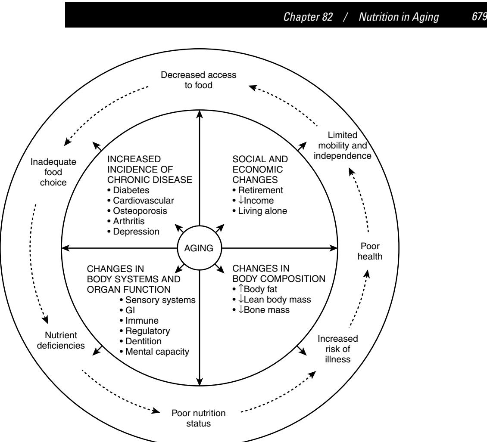

# Nutrition in Aging

### **NUTRITION IN AGING**

The nutrition goals in caring for older adults are to maintain or even improve their overall health and quality of life as well as to prevent or treat age- and nutrition-related problems by improving the nutritional status of individuals and population groups. Whether defined as "the condition of a population's or individual's health as affected by the intake and utilization of nutrients and non-nutrients"1 or as the degree of balance between nutrient intake and nutrient requirements, nutritional status is extremely important to overall health and to maintaining optimal nutritional status. Optimal nutritional status also has been shown to influence the aging process, various physiologic systems and functions, body composition, and the onset and management of various chronic conditions. The process of aging also affects nutritional status. Specifically, aging directly contributes to the changes in nutritional needs, although requirements for specific nutrients can decrease, increase, or remain the same.2 With aging, changes in economic and social status arise that contribute to decreased access to food, poor food choices, nutrient deficiencies, and poor nutritional status, which in turn lead to increased risk of illness, poor health, and limited mobility and independence, as illustrated in Figure 82-1. 3

Like overall health, nutrition is influenced by social determinants such as income, educational level, social support, gender, culture, and other factors outlined in the population health framework.4,5 Such factors partly account for the wide and stubbornly resistant disparities in nutritional and health status that exists in populations. For example, research in the area of food costing shows that seniors living alone are not able to afford nutritious diets.6 The consumption of vitamin and mineral supplement is higher among those older adults with higher levels of education.7 Furthermore, seniors who live alone and lack social support tend to have poorer nutritional status compared to elderly individuals with social support.

#### **NUTRITION SCREENING AND ASSESSMENT**

Many physiologic factors impact the nutritional status and well-being of older adults. An inadequate or excess intake of nutrients is the result of ingestion and utilization of nutrients from a variety of dietary sources, as well as other various elements (e.g., age-related changes, medication intake, socioeconomic factors, and functional and cognitive capacity). These factors facilitate the depletion or storage of tissue stores, change in plasma nutrient levels, enzymatic activity, and other physiologic functions, which affect anthropometric indicators (e.g., weight, body composition). As a result, anthropometric measures, as well as biochemical, clinical, and dietary factors, are critical and must be considered in the assessment of an individual's nutritional status.

*Anthropometric measures* are used to assess nutritional status through the examination of body proportions and composition, as well as the fluctuations in these indicators over

## C. Shanthi Johnson Gordon Sacks

time, and include body weight, weight history, height or other estimates of stature, body mass index (BMI), skin-fold thickness, and circumference measurements.8,9 Self-reported measures are often inaccurate, and trained technicians should adopt standardized measurement protocols to reduce measurement error.10,11 Body weight is a key indicator in nutritional status, and one's weight history serves as an indicator of nutritional risk. Periods of excessive or significant weight loss include 2% body weight in a week, 5% in a month, 7.5% in 3 months, or 10% in 6 months. In addition to weight changes, height changes, which are largely due to the shortening of the spine, are reliable indicators of an at-risk individual. If an individual is unable to stand or stand straight, estimates of stature can be estimated via arm span, demispan, or knee height. Arm span measurements can determine the maximal height in adulthood rather than one's actual height, whereas age-, gender-, and race-specific equations are used to estimate stature from knee height measures12 with supine knee height valued as more reliable than seated knee height. Once height and weight measures are obtained, body mass index (BMI) can be calculated. Body weight (kg) is divided by height squared (m), which evaluates weight independent of height but does not directly measure body fat. For older adults, a BMI of less than 24 is associated with poor nutritional health, a BMI between 24 and 29 is believed to be a healthy weight, and a BMI of over 29 is seen as overweight and may lead to health problems.13 Skinfold thickness measurements are used to determine body fatness. However, with aging, skin changes in thickness, elasticity, and compressibility, and skinfold thickness is not a reliable measurement for older adults as a result. Body fat stores can be assessed through circumference measurements (e.g., waist, waist-tohip ratio, and upper arm circumference), much like measures that are used to estimate skeletal muscle mass (somatic protein stores). Body fat measurement can be used as a quick screening tool to pinpoint high-risk individuals who may be susceptible to under- or overnutrition and are useful alone or combined with height and weight measurements.

Another useful measure for individuals at risk for nutritional problems is *biochemical data*, which can be used to find subclinical deficiencies (e.g., through blood or urine specimens). Through such tests, biochemical indicators of visceral protein status, which include serum albumin, thyroxine binding prealbumin, serum transferrin, and retinol binding protein as well as total lymphocyte counts, can be substantiated. Although serum albumin is a commonly used screening tool, it is not always a reliable measure in older adults. Values can be elevated because of dehydration, or values can decline because of age-related degeneration of muscle mass. Other biochemical measures such as total cholesterol, high-density lipoprotein, low-density lipoprotein, and triglycerides are used to assess lipid status and are also used to measure micronutrient status (e.g., iron status). Biochemical measures of iron status can include hemoglobin, hematocrit, mean cell volume, mean cell hemoglobin concentration, and total iron binding capacity. A combination of these measures is used for a proper clinical diagnosis

Figure 82-1. Changes in economic and social status contribute to decreased access to food, poor food choices, nutrient deficiencies, and poor nutritional status, which lead to increased risk of illness, poor health, and limited mobility and independence.

and can be compared to normative age and gender group values.

*Clinical indicators* are also used to assess nutritional status, and the components of clinical assessment can include medical history and physical signs and symptoms associated with nutritional deficiencies, functional status, and cognitive status. Some clinical signs and symptoms are nonspecific and attributed to the aging process rather than to a particular nutritional deficiency. Functional status can be assessed in several different ways, usually with a focus on the person's abilities to perform basic activities of daily living (ADL), which include basic self-care such as bathing, feeding, and toileting and instrumental activities of daily living (IADL), which includes activities such as cooking, shopping, and managing one's own affairs. These can serve as clinical indicators useful in the assessment of nutritional status. The inability to execute such tasks may indicate a higher risk of poor nutrition, although some clinical signs may be nonspecific and attributed to aging rather than to a specific deficiency. Clinical assessment can include physical signs and symptoms affiliated, not only with nutritional deficits, but also functional and cognitive status. Both functional and cognitive status can be assessed in multiple ways.

Dietary assessment is an integral component in the measurement of nutritional status and can be categorized as retrospective or prospective. A retrospective assessment involves the recall of all foods and fluids consumed in a particular time frame (often 24 hours). Retrospective assessment can be unreliable if the individual has problems with cognition status. In this case, a prospective assessment may be favored, as this involves keeping a written record of all foods and fluids consumed in a given period of time (e.g., 3 days including 2 weekdays and a weekend day or 7 days). Although this aids those with cognitive challenges, it does pose a problem for those individuals who suffer from a particular functional disability such as arthritis of the hand or poor vision. A 3-day food record with intakes of 2 weekdays and one weekend day recorded is considered to be one of the better dietary assessment methods as it does not depend on memory and can provide detailed intake data, although no single best method exists.

Given that a comprehensive assessment of nutritional status is complex and time-consuming, rapid screening is beneficial to identify those who might be at risk for poor nutrition and individuals who might need in-depth assessment. Several screening tools exist. The DETERMINE checklist determine your nutritional health checklist developed as part of the Nutrition Screening Initiative provides public awareness about basic nutrition information and can help identify individuals at risk for poor nutrition in community settings. The checklist is widely used in the United States14 and is executed in two stages or levels. Level I can include the following assessments: body weight, eating habits, living environment, and functional status—particularly ADLs and IADLs—and is usually filled out by the individual's primary caregiver.15 The level II screen can include anthropometric measurements, laboratory data, polypharmacy, and cognitive status assessments. Based on the assessment, specific nutritional care plan or support is provided. In Canada, a screening tool titled Seniors in the Community: A Risk Evaluation Tool for Eating and Nutrition Version II (SCREEN II) has been developed for assessing nutritional risk among community-dwelling seniors.16 The Mini Nutritional Assessment (MNA) is also widely used for initial screening and assessment for individuals in the community as well as in the long-term care settings.17,18

In addition to these commonly used screening tools, several others exist. These include the Payette Nutrition Screening Scale, the Nutritional Risk Index (NRI), the Nutritional Risk Score (NRS), the Nutritional Risk Assessment Scale (NuRAS), the Prognostic Nutritional Index (PNI), the Sadness-Cholesterol-Albumin-Loss of weight-Eating-Shopping (SCALES) measurement, and the Subjective Global Assessment (SGA). Screening tools are beneficial for identifying individuals at risk or as an educational tool as they can provide simple, rapid, and reliable assessments.19 Even so, screening tools may have limited value in apparently healthy elderly people.20 It is therefore important to select and use appropriate screening tools based on the target group (e.g., home care, long-term care), ease of use, and psychometric properties (validity/reliability).

Although researchers and clinicians have traditionally relied on the nutritional assessment and screening based on anthropometric, biochemical, clinical, and dietary considerations as well as the presence of various risk factors that could predispose one to have less than optimal nutritional intake, we need to consider what the appropriate indicators of nutritional health are in the context of the aging population. Is it the nutrient intake of macro- and micronutrients or body mass index (an indicator of weight status based on the proportion of weight for height) as we have traditionally measured, or should we pay attention to the variety, moderation, and balance in food group consumption, or should we include indicators of food security such as availability, access, and affordability of nutritious diet? How do we measure availability and access to traditional diet and the quality and safety of traditional foods or cultural foods for the minority populations? There is a considerable need for identifying appropriate indicators of nutritional health among the aging population.

#### **NUTRITIONAL REQUIREMENTS**

Determination of a person's nutritional requirements is critical to ensure optimal nutrient intake. Reduction in energy requirements is one notable difference between individuals over 65 years of age and their younger counterparts.21 For example, energy needs for individuals 51 to 75 years of age typically decrease by approximately 200 kcal/day. After age 75, energy needs decrease on average by an estimated 500 kcal/day for men, whereas women's energy needs decrease an estimated 400 kcal/day.22,23 The decrease in energy needs is largely attributed to the age-related reduction in resting metabolic rate and activity-related energy expenditure.24–26 Historically, decreases in energy expenditure have been **Table 82-1. Formulas for Estimating the Energy Requirements of Older Persons (kcal/day)**

| Harris-Benedict Equations Males: BEE = 66.4730 + 13.7516 (Wt) + 5.003 (Ht) – 6.7550 (A) Females: BEE = 655.0955 + 9.5634 (Wt) + 1.8496 (Ht) – 4.6756 (A) |
|----------------------------------------------------------------------------------------------------------------------------------------------------------------|
| World Health Organization Equations Males: BEE = 8.8 (Wt) + 1128 (Ht) – 1071 Females: BEE = 9.2 (Wt) + 637 (Ht) – 302                                    |
| Weight-Based Method 20–25 (Wt)                                                                                                                              |

Wt = weight (kg); Ht = height (cm); A = age (yr).

attributed to less physical activity, reduced mean muscle mass, and lower metabolic rate with advancing age. Yet other problems, including chewing difficulties, living alone, and low income, contribute to a decline of intake in the elderly. The third National Health and Nutrition Examination Survey (NHANES III, 1976–1980) reported that women and men aged 60 to 69 years and 70 to 79 years consumed an average of 550 kcal/day and 745 cal/day less than women and men aged 30 to 39 years, respectively.27

Different methods exist for estimating the energy requirements of older individuals, and knowledge of patient-specific information is required such as height, weight, and age. One simple method, only requiring a patient's weight, estimates energy expenditure in the range of 20 to 25 total kcal/kg/ day. Thus, the energy requirements of an elderly 70-kg individual could be met with the provision of 1400 to 1750 total kcal/day. These estimates appear to be appropriate because indirect measurements of energy expenditure in critically ill older adults were found to be 22 to 25 kcal/kg/day.28 If weight gain is the desired objective, an increase in calories up to 30 kcal/kg/day may be warranted.

Although widely used to predict energy expenditures, the Harris-Benedict equations (Table 82-1),29 which are based on the measurement of oxygen consumption and carbon dioxide production using direct calorimeter, are likely not accurate for older adults. They were developed in 1919, and although subjects ranged in age from 15 to 74 years, only 9 of the 239 healthy male and female subjects studied were greater than 60 years of age. In consequence, some authorities favor more recent equations established by the World Health Organization (see Table 82-1). Recommendations from the National Research Council include multiplying the calculated energy expenditure by coefficients accounting for various levels of physical activity.30 An activity coefficient 1 to 1.12 times the energy expenditure is used for older adults who are sedentary or fairly inactive. Activity coefficients of 1.27 to 1.45 should be used to account for energy expended by the elderly with highly active lifestyles.

In contrast to declining energy requirements, protein requirements actually increase with advanced age because of the loss of skeletal muscle mass. Because of changes in metabolism, changes in body composition, and protein utilization efficiency, the age-related increase in protein needs is necessary for the repletion of body protein. In addition, infections, surgery, trauma, and pressure ulcers may also increase protein needs as a person ages. Sarcopenia is used to describe the age-associated loss in skeletal muscle and its functional consequences.31 The etiology of sarcopenia is currently unknown. However, loss of muscle mass has been linked to neurogenic processes, dietary protein deficiencies, and sedentary lifestyles. There is no consensus on the recommended daily protein intake to enhance muscle protein anabolism and minimize the loss of muscle mass with age. Studies show that the average adult needs 0.8 gm of protein/kg of body weight in order to maintain protein equilibrium, whereas older adults require as much as 1.0 to 1.2 gm of protein/kg of body weight.32–35 This level of protein intake is generally recognized as safe and appropriate for maintaining nitrogen equilibrium in free-living, healthy elderly persons. Increasing protein intake to dosages of 1.2 to 1.5 g/kg/day may be required in older individuals with pressure ulcers who are undernourished or those with burns or gastrointestinal diseases that exhibit extraordinary nitrogen losses.36 Elderly patients generally tolerate moderately high protein intakes without deterioration in renal function. However, subjects with existing renal disease should avoid high-protein diets as they may hasten a greater decline in renal function.37

Another key factor in maintaining healthy nutritional status is an appropriate intake of dietary fat. Fats contain twice as many calories per gram as carbohydrates or proteins, and given the fact that higher intakes of dietary fat are associated with an increased risk of developing diabetes, heart disease, and other chronic ailments, lower-fat choices, such as skim milk rather than whole milk, are recommended. However, for older adults who are unable to consume enough of their daily energy requirement, the risks associated with a higher fat intake may be overlooked in favor of meeting the necessary daily energy requirement.

To maintain a healthy nutritional diet and nutritional status, one must maintain an opportune intake of vitamins and minerals as one ages. Because energy needs decrease while vitamin and mineral needs increase, the challenge of creating an optimal intake for the elderly is vital. According to the dietary reference intakes (DRI), calcium, vitamin D, and vitamin B6 needs increase with age. For example, 1200 mg/ day of calcium is essential to protect against bone loss. Similarly, the DRI indicates that vitamin D needs increase from 5 µg to 10 µg for individuals aged 51 to 60, and 5 µg to 15 µg for those over age 70. Hypovitaminosis D is currently a significant problem among elderly individuals. An age-related decline in vitamin D intake is correlated with lower dietary intakes, less sun exposure, less efficient skin synthesis of vitamin D, and impaired kidney function, which in turn impairs the conversion of vitamin D from its inactive to active form. Also, insufficient levels of folate and vitamins B6 and B12 are known to contribute higher than normal levels of serum homocysteine, a known risk factor in the development of coronary artery disease, stroke, and depression, as well as a decrease in cognitive function. Individuals over age 50 need to consume more vitamin B12 or rely on supplements to avoid the malabsorption of food-bound B12, because as many as 30% of older adults are deficient in vitamin B12 daily.

Water is often overlooked as an essential nutrient, and inadequate hydration poses an additional risk for increased morbidity and mortality in the elderly. Age-related decline in intracellular water and fluid reserves, paired with changes in renal function (causing an inability to concentrate urine), can result in difficulty maintaining appropriate fluid levels in older adults. Not only do these physiologic factors impair fluid levels, but altered thirst perception resulting in reduced fluid intake also becomes an obstacle. Furthermore,

#### **Table 82-2. Risk Factors for Dehydration Among Residents of Long-Term Care Facilities**

| Deterioration in cognitive status in the past 90 days |  |
|-------------------------------------------------------|--|
| Failure to eat or take medication                     |  |
| Diarrhea                                              |  |
| Fever                                                 |  |
| Swallowing problems                                   |  |
| Communication problems                                |  |

Adapted from Weinberg AD, Minaker KL. Council on Scientific Affairs, American Medical Association. Dehydration: evaluation and management in older adults. JAMA 1995;274:1552–6.

external factors provide the elderly with more impediments to balanced fluid intakes. Residents of long-term care facilities (LTCF) are especially at risk for dehydration because of their limited access to oral fluids or underlying conditions (vomiting, diarrhea, colostomy/ileostomy) that increase fluid losses. Institutional issues including inadequate staffing and a subsequent need for better supervision places the frail elderly at greater risk.38 Untreated dehydration in hospitalized elderly can result in mortality exceeding 50%.39 As a result, LTCF staff members use specific triggers to detect inadequate hydration (Table 82-2). As such, older adults should make a conscious effort to increase fluid intake and not just rely on thirst perceptions. A water intake of 1 mL per calorie ingested or 30 mL/kg per day is generally recommended to meet dietary water requirements and achieve adequate fluid intake in older adults.40

In accordance with Canada's Food Guide to Healthy Eating, dietary guidelines have been created to help avoid energy and vitamin deficiencies in the older population, by encouraging the elderly to meet their needs from healthy dietary sources. The DRI encourages older adults to acquire 45% to 65% of their daily energy intake from complex carbohydrates in order to obtain enough dietary fiber (25 to 30 gm/day). Dietary recommendations from the 2005 Dietary guidelines for Americans include the consumption of nutrient-dense beverages from the food groups that limit saturated and trans fats, cholesterol, added sugar, salt, and alcohol; a diet rich in fiber found in natural sources such as fruit, vegetables, and whole grains; and limiting sodium intake to 1500 mg per day. Other recommendations such as the consumption of calcium and vitamin D through foods or supplements and the maintenance of a healthy body weight through a balanced diet and exercise also play a key role in helping older adults meet their daily nutritional needs.

#### **COMMON NUTRITIONAL PROBLEMS AND DEFICIENCIES**

Imbalance between nutrient intake and nutrient requirements or less than optimal nutritional status can result from less than optimal dietary intake, age-related changes, disease conditions and their treatment, or other contextual factors such as cultural and religious beliefs, practices, and socioeconomic conditions. This imbalance can result in nutritionrelated problems and deficiencies among older adults. The most common nutritional deficiencies include malnutrition, which encompasses both under- and overnutrition, micronutrient deficiencies, and dehydration. Malnutrition is common in elderly adults and can be divided into protein energy malnutrition and micronutrient deficiency. Whether the imbalance is a result of poor dietary intake, age-related changes, disease conditions/treatments, or other factors such as cultural or religious beliefs, practices, or socioeconomic issues, malnutrition varies in its prevalence. Protein energy undernutrition varies from 1% to 15% in the community to 25% to 85% in long-term care facilities.41 It is important to recognize that undernutrition is not simply a result of poor dietary intake but is the combination of many factors that interrupt the balance between intake and need. The presence of cognitive decline or dementia, depression, chronic disease, or functional deficits are also factors in undernutrition, which are common in individuals suffering from sarcopenia (loss in skeletal muscle and its functional consequences as one ages) and geriatric failure to thrive (GFTT), a syndrome where individuals suffer involuntary weight loss and cannot maintain functional capacity or social and cognitive skills with no visible cause. Although the exact prevalence is unknown, the incidences increase with age and are more common in men and those living in LTCF. In both cases, nutritional interventions and the use of an interdisciplinary team approach have been successful through an increase of energy and protein intake through both dietary sources and oral supplements.42 Other interventions such as exercise programs have also been beneficial to prevent sarcopenia.

Micronutrient deficiencies among older adults occur when calcium, vitamin D, iron, vitamin B12, and other minerals or vitamins are lacking. Such deficiencies are common and can be easily remedied through the use of supplements. Vitamin D deficiency is widespread among all age groups but is especially prevalent among the elderly.43 Adequate vitamin D nutrition is important for maintaining healthy bone status and reducing the risk of fractures and osteoporosis. The Institute of Medicine (IOM) recommendations for vitamin D daily intake are 400 IU for adults 51 to 70 years old and 600 IU for adults > 71 years old.44 Calcium also plays an important role in maintaining bone health in the elderly. The IOM-recommended calcium intake for adults 51 years and older is 1200 mg/day, with the maximal dose of elemental calcium not to exceed 500 mg at any one time.44 Calcium carbonate is the most cost-effective form of calcium, well absorbed, and tolerated by most individuals when consumed with a meal. Of note, calcium citrate is the preferred form to be used in elderly with intestinal absorption problems, such as achlorhydria or inflammatory bowel disease.45 Noteworthy changes in B vitamin status occur with advancing age. Observational studies suggest that low plasma concentrations of B vitamins folate, cyanocobalamin (B12), and pyridoxine (B6) in elders may be linked to greater bone loss.46 Concern for toxicity of fat-soluble vitamins, such as vitamin A, exist in older adults because of increased liver stores and declining renal function associated with increasing age. Osteoporosis and hip fracture are associated with vitamin A intakes that are only twice the current recommended daily intake of 1000 µg retinol equivalents (RE)/day in males and 800 µg RE/day in females.47 Thus, caregivers of elders who take vitamin supplements should understand the risks and effects that chronic high intakes of vitamin A may have on bone loss.

The prevalence of obesity has steadily increased since the late 1980s. Obesity is generally defined as an unhealthy excess of body fat characterized as a body mass index

(BMI ≥ 30 kg/m2). In 1991, approximately 15% of individuals aged 60 to 69 years old and 11% of those over 70 years old were obese.48 The prevalence of obesity in these same age groups increased to approximately 23% and 16%, respectively, 9 years later.49 Higher risks of mortality and other serious medical complications, including hypertension, arthritis, obstructive sleep apnea, urinary incontinence, and cancer, are associated with older men and women who have a BMI over 30 kg/m2. The current treatment guidelines for weight management in older persons are lifestyle intervention involving diet, behavior modification with physical activity, and pharmacotherapy.50 A reduction in calorie intake by 500 to 750 kcal/d with an intake of 1 g protein/kg/d of high-quality protein is recommended. Regular physical activity in the form of stretching and aerobic and resistance activity is important to increase flexibility and endurance while preventing frailty. Experience with weightloss medications is limited, however, orlistat appears to be the safest for older individuals. Bariatric surgery is reserved for selected individuals who fail diet and medication therapy and continue to suffer from disabling obesity. The perceived benefits of the procedure in terms of quality of life must be weighed against the postoperative morbidity and risk of potential complications.

#### **NUTRITIONAL STRATEGIES**

Several strategies can be used to increase dietary intake of the frail elderly person. High nutrient-dense feeds can be incorporated into the diet if the individual tolerates traditional solid foods. Peanut butter spread on whole-wheat bread, enriched cereal, or powdered instant breakfast products can be substituted at breakfast to increase caloric intake. Highprotein and high-calorie snacks, in the form of crackers and cheese, milkshakes, or sandwiches, can be given throughout the day to supplement oral intake.36 Dietary adjustments and special utensils are often beneficial when physical or neurologic disorders contribute to poor oral consumption. Institutionalized residents often require assistance from staff for eating and drinking.51 Use of semicircular tables is a simple method to assist understaffed caregivers in feeding several residents at a time in an LCTF. Modified spoons have been used to decrease spillage by elders afflicted with hand tremors. Changes in food texture, such as pureed vegetables or puddings, can avoid intake problems in subjects with poor dentition. Patients with swallowing dysfunction should be taught appropriate eating positions and safe swallowing techniques to minimize dysphagia.

Enteral nutrition (EN) delivered through a feeding tube can be initiated when older subjects are unable to maintain adequate nutrient and fluid intake by oral ingestion. Smallbore gastric or duodenal tubes may be placed through the nose to provide short-term (i.e., a few weeks) enteral access to treat elderly patients admitted for rehabilitation after hip or knee surgery, patients with pressure ulcers, or those with temporary swallowing disorders. Chronic disorders such as head/neck cancer, stroke, head injuries, or neuromuscular disorders impairing the ability to swallow would necessitate placement of a long-term (months to years) enteral access device. Long-term enteral access is achieved with gastric tubes that are inserted directly into the stomach by a surgeon in an operating room or by a gastroenterologist at the bedside. Percutaneous endoscopic gastrostomy (PEG) tubes placed with an endoscope are becoming more common than open surgical gastrostomy tubes because the expense and risks associated with an invasive surgical procedure can be avoided. If gastroparesis or an anatomic defect is present that prevents normal gastric emptying, a feeding tube placed in the jejunum is most appropriate to reduce the risk of aspirating EN into the lungs.

Complications of EN include pulmonary aspiration, diarrhea, and mechanical obstruction of the feeding tube. Aspiration of EN remains one of the most dangerous complications of EN administration. Mortality rates from aspiration of gastric contents range from 40% to 90%.52 Recommendations for reducing the risk of aspiration in older individuals receiving gastric feedings include elevating the head of the bed over 30° and frequent exams for abdominal distention. EN is often identified as a cause of diarrhea, despite numerous other factors such as medications, hyperosmolar EN formulations, hypoalbuminemia, and infection. Sorbitol is used as a vehicle for many liquid formulations of pharmacologic agents and has been associated with diarrhea. Antibiotics or prokinetic agents like metoclopramide are examples of concurrent therapies more likely to cause diarrhea than the EN formulation. *Clostridium difficile* is a well-known cause of diarrhea in patients receiving EN and should be ruled out before antidiarrheal agents are initiated.

Elderly patients who require nutrition support but do not have functional or accessible gastrointestinal tracts are candidates for parenteral nutrition (PN). This may include patients with severe inflammatory bowel disease (e.g., Crohn's disease or ulcerative colitis), malabsorption (e.g., celiac sprue), bowel obstruction, a history of extensive bowel surgery (e.g., short bowel syndrome), and severe acute pancreatitis when enteral nutrition has failed. The primary goal of PN should be to prevent undernutrition from inadequate energy and nutrient intake or to treat undernutrition and its complications. Guidelines published by the American Society for Parenteral and Enteral Nutrition exist for appropriate use of PN.53 Table 82-3 lists some monitoring guidelines for fluid, electrolyte, and micronutrient abnormalities that should be performed in geriatric patients during PN administration.

#### **NUTRITION PROGRAMS AND SERVICES**

Many services are available to support the nutritional and health needs of the elderly. Examples include meal-delivery programs, community meals, grocery-delivery services, food banks and food stamps, and nutrition screening and education initiatives. In-home programs such as the Elderly Nutrition Program (ENP) in the United States, mandated through the Older Americans Act, provides in-home and community-based nutrition services to individuals over 60 years of age and targets those at highest economic and social need.54 ENP offers meal-delivery services and congregate meals, as well as nutrition screening and assessment. Although a program such as ENP is not available in Canada, for-profit and not-for-profit organizations provide a similar array of services.

Many *meal-delivery services* in Canada, such as the Meals on Wheels program, offer meals for elderly Canadians for a nominal fee, and many church groups, for-profit, and not-for-profit organizations offer similar programs for those who have difficulty preparing meals for themselves, thereby placing them in a high-risk category. These meal-delivery services provide one hot meal, usually lunch, to people's homes at least 5 days a week. Frozen meals are also available to the elderly on request. The delivered meal is required to meet one third of the daily nutritional requirement. However, for the frail, largely homebound elderly, one meal is insufficient to meet nutritional needs and avoid nutritional deficiencies. This type of meal-delivery service has shown benefit to seniors who have difficulty preparing meals for themselves and are at risk for poor nutrition. A recent study examining the impact of home-delivered breakfast and lunch showed significant improvement in nutritional intake and quality of life among frail, homebound older adults.55

*Congregate and community meals* offered by churches and other community-based organizations not only assist the

| Complication                    | Management                                                                                                                                                               |
|---------------------------------|--------------------------------------------------------------------------------------------------------------------------------------------------------------------------|
| Mechanical                      |                                                                                                                                                                          |
| Pneumothorax                    | Possible chest tube placement; minimize number of catheter insertions; placement by experienced personnel                                                                |
| Air embolism                    | Placement by experienced personnel                                                                                                                                       |
| Catheter occlusion              | Anticoagulation locally with urokinase or streptokinase; routine line flushing                                                                                           |
| Venous thrombosis               | Anticoagulation; catheter removal                                                                                                                                        |
| Metabolic                       |                                                                                                                                                                          |
| Hyperglycemia                   | Slowly initiate PN; check blood glucose frequently before advancing nutrition; administer insulin if needed                                                              |
| Hypoglycemia                    | Decrease amount of insulin administered; avoid abrupt discontinuation of PN by tapering rate of infusion; administer 10% dextrose if PN is abruptly discontinued      |
| Hypertriglyceridemia            | Decrease lipid volume administered; increase length of infusion time; avoid lipid administration >60% of total calories; assess risk factors for hypertriglyceridemia |
| Electrolyte disturbance         | Monitor fluid intake and output and serum chemistries; replace electrolytes as necessary                                                                                 |
| Essential fatty acid deficiency | Provide 8% to 10% of total calories as lipid                                                                                                                             |
| Prerenal azotemia               | Increase fluid intake; decrease protein administered; increase nonprotein calories; analyze nitrogen balance                                                             |
| Gastrointestinal                |                                                                                                                                                                          |
| Cholestasis                     | Avoid over-feeding; use gastrointestinal tract as soon as clinically able                                                                                                |
| Gastrointestinal atrophy        | Use gastrointestinal tract as soon as clinically able                                                                                                                    |
| Infectious                      |                                                                                                                                                                          |
| Catheter-related sepsis         | Remove catheter and place at alternate site; adequately care for catheter site; possible treatment with intravenous antibiotics                                       |

**Table 82-3. Complications of Parenteral Nutrition and Management Techniques**

elderly by providing them with balanced meals, but they also function as social events that many seniors would otherwise not experience. The community meals can be served as breakfast, lunch, or dinner, and their frequency ranges from once a week to once a month. Economic need can be offset through the use of *food stamps* or *food banks* on a short-term basis. The selection of foods offered in food banks primarily includes dry goods and nonperishable food items. Some food banks in Canada have facilities for refrigeration and offer selected perishable foods. For accessing these services, a rent receipt, identification, and proof of income may be required. *Community kitchens* allow small groups of individuals to pool resources and cook meals together that are later taken home, thus saving money and creating social time for elderly individuals. If mobility is an issue, *grocery-delivery services* are available for a fee and can be accessed via telephone or the Internet. Lastly, *nutrition screening* and *education programs* are offered through government agencies such as the ENP who utilize the DETERMINE checklist to aid seniors with nutritional risk assessments. Other lectures and community nutrition education programs are also offered to elderly individuals.

#### **ETHICAL CONSIDERATIONS**

A common but controversial issue is the withdrawal of nutrition when death is imminent (i.e., within 6 months). Although families may decide to discontinue life-sustaining medical treatment such as mechanical ventilation or dialysis, nutrition and hydration are often considered a basic human right. Most health care professionals agree that the wishes of the individual constitute the most important factor to consider in the development of a nutritional care plan.56 Thus, most health care teams consider it ethical and acceptable for a competent individual to refuse or halt administration of artificial nutrition, although cultural differences are notable.57,58 If an individual is considered incompetent, caregivers should provide family members the support needed to facilitate a thoughtful decision with the individual's quality of life taken into consideration. Communication among all parties involved (health care personnel, patients, family, friends, guardian) is paramount in making informed decisions concerning the delivery of artificial nutrition and endof-life issues. Providing hydration solely without EN or PN is an appropriate alternative, as patients do not suffer from signs of dehydration. Additional information concerning the ethics of forgoing life-sustaining treatments may be found at www.partnershipforcaring.org/homepage/index.html.

#### KEY POINTS Nutrition in Aging

- Nutrition affects aging and aging affects nutrition; each amplifies the impact of the other on health status.
- Nutrition assessment combines anthropomorphic, biochemical and clinical/dietary evaluation. Several screening tools exist, but appear to have their greatest impact when screening targeted populations, such as people receiving home care.
- Average energy requirements decrease with age; typically men >75 years require 500 fewer kcal/day, and women 400 fewer kcal/day. Protein requirements, however, increase due to the loss of skeletal muscle mass. The minimum requirement for muscle anabolism has not been established, but absent renal impairment, most older adults can tolerate moderately high protein intakes.
- Individuals over age 50 need to consume more vitamin B12 or rely on supplements to avoid the malabsorption of food-bound B12, since as many as 30% of older adults are deficient in vitamin B12 daily.
- Water is often overlooked as an essential nutrient.
- Protein energy undernutrition varies from 1% to 15% in the community to 25% to 85% in long-term care facilities.
- Vitamin D deficiency is widespread among all age groups, but is especially high in older adults.

For a complete list of references, please visit online only at www.expertconsult.com