# The Prostate

The prostate gland lies between the bladder base and pelvic floor and is intimately associated with each structure. Secretions of the seminal vesicle and vas deferens are conducted through its substance to the ejaculatory duct, which terminates in the urethra at the verumontanum. Exocrine secretion products, largely under androgenic control, are discharged into prostatic acini and include zinc, citric acid, and numerous enzymes—acid phosphatase, coagulases, fibrinolysins, and proteolytic enzymes—that form a significant part of the seminal plasma acting to support the physiologic changes required for transport of spermatozoa.

## **DEVELOPMENT**

The embryonic prostate differentiates in response to androgen secretion by the fetal testis commencing about the eighth week of intrauterine life.1 Androgenic activity at the time of puberty results in rapid growth to a weight of approximately 20 g by the age of 20 years. Thereafter, weight remains reasonably constant until 40 to 50 years of age when growth of benign adenomatous (prostatic) hyperplasia (BPH) becomes increasingly common with advancing years. Autopsy studies reveal BPH in more than 40% of men in their 50s and almost 90% of men in their 80s;2 figures are confirmed by community-based studies involving transrectal ultrasound estimation of prostatic volume.3

Castration before puberty prevents prostatic development as well as the later emergence of both BPH and prostate cancer. Removal of testes in the adult leads to involution of the gland,4 but replacement reactivates growth though only to and not beyond the normal adult size.

The action of androgen on the prostate cell is highly complex and only partially understood. Within the prostate, testosterone is converted to its active metabolite, 5αdihydrotestosterone (DHT), by the 5α-reductase enzyme located on the nuclear membrane. Most evidence suggests that prostatic epithelial cells per se are unresponsive to DHT, which acts via signaling between stromal and epithelial components of the tissue; epidermal growth factor (Figure 86-1) and transforming growth factor-α (TGFα) provide the most potent mitogenic stimulus.5 The importance of DHT to prostatic growth has been illustrated by the studies of Imperato-McGinley and colleagues into males from the Dominican Republic with an autosomal recessive form of male pseudohermaphroditism caused by deficiency of the 5α-reductase enzyme. These children develop phenotypically into men at puberty with normal serum testosterone, but with prostates that remain impalpable.6 These observations form the basis of the development of the 5α-reductase inhibitors presently widely prescribed for men with early symptomatic BPH.

## **Morphology**

Early work by Lowsley7 concerning the anatomy of the prostate has been superseded in recent years by the extensive studies of McNeal and associates.8,9 They described peripheral and central zones of the gland (Figure 86-2) as distinct from earlier lobe terminology; the central zone, approximately one third of the gland mass, completely surrounds the ejaculatory ducts, whereas the peripheral zone extends to the apex and wraps around the central zone like an eggcup. The benign prostatic hypertrophy mass arises from the periurethral zone (within the transitional zone) and this extends from the bladder neck to the region of the verumontanum, but never caudal to that structure. By contrast, prostate cancer usually arises from the peripheral zone, explaining the difficulties in identifying early disease endoscopically via the urethra (discussed later).

Much confusion has been created by this conflicting prostatic terminology over the years. Surgeons refer to "lateral" and "middle" lobes at operation, but clearly these are all contained within the periuretheral transitional zones. The true exocrine prostate is not removed in operations for BPH, although patients frequently assume—not unnaturally—that "prostatectomy" means removal of the entire gland. The operation of radical prostatectomy for cancer does, however, involve extirpation of all prostatic tissue—each zone and contained BPH tissue en bloc.

The substance of the prostate consists of glandular tissue, stroma, and smooth muscle. The preprostatic sphincter lies at the bladder neck (Figure 86-3) and is responsible for preventing retrograde ejaculation during intercourse. This α-adrenergic muscle is inevitably removed during the operation of transurethral resection (TUR) for BPH, but lack of leakage following the procedure shows, however, that this sphincter is not normally responsible for urinary continence. α-Adrenergic fibers are present throughout the gland and

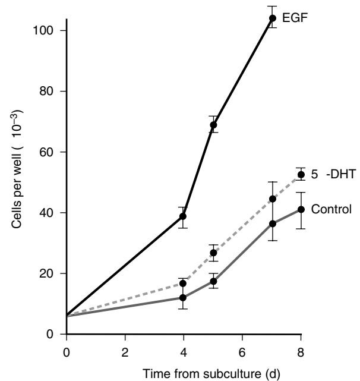

Figure 86-1. Prostate epithelial cells (CAPE-1) in culture. 5-α-DHT stimulation is no greater than control, whereas EGF stimulation leads to significantly enhanced stimulation.

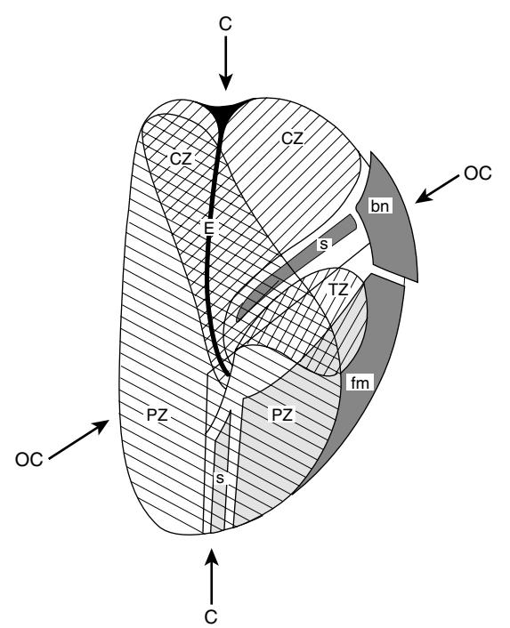

Figure 86-2. Sagittal section through prostate, showing zonal architecture relative to urethra. PZ, peripheral zone; CZ, central zone; TZ, transitional zone; bn, bladder neck; fm, fibromuscular stroma; s, preprostatic, and distal striated sphincter; E, ejaculatory ducts; C, true coronal plane; OC, oblique coronal plane. *(Data from McNeal JE. Origin and evolution of benign prostatic hypertrophy. Invest Urol 1978;15:340.)*

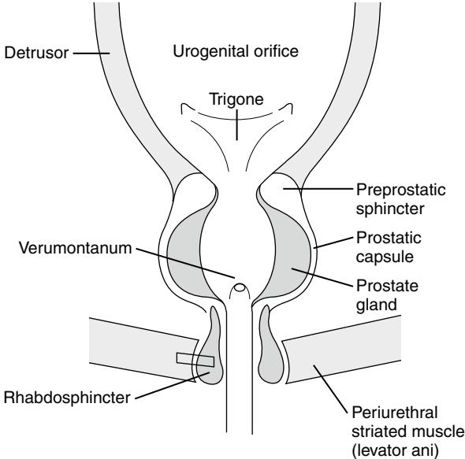

Figure 86-3. Distal sphincter and bladder neck mechanism in the male. P, periurethral striated muscle (levator ani); R, rhabdosphincter; V, verumontanum; PG, prostate gland; PC, prostatic capsule; PPS, preprostatic sphincter; T, trigone; UO, ureteric orifice; D, detrusor. *(Adapted with permission from George NJR. Bladder and urethra: function and dysfunction. In: Weiss RM, George NJR, O'Reilly PH, editors. Comprehensive urology, London: Mosby; 2001, pp. 67–79.)*

may be implicated in the etiology of chronic inflammatory conditions of the gland (discussed later); pharmacologic manipulation by α-adrenergic blocking agents provides a useful therapeutic approach to patients with mild prostatic obstruction.

The continence mechanism lies intimately related to the apex of the prostate at the level of the pelvic floor. Studies by Gosling10 and coworkers clearly show that the true external urethral sphincter lies within a sleeve of connective tissue, which separates it from the periurethral striated (levator ani) pelvic floor muscle (see Figure 86-3). This latter muscle is innervated via the pudendal nerve and is responsible for emergency continence requiring extra voluntary effort such as occurs during laughing, coughing, or sneezing. The nerve supply to the (slow twitch) specialized external urethral sphincter remains debatable; horseradish peroxidase techniques have suggested it travels via the pelvic nerve to terminate in the ventral horn of S2-S3 on Onuf's Nucleus X.11 Damage to this sphincter, which by anatomic definition must be distal the verumontanum, during TUR by inexperienced surgeons will inevitably lead to postoperative genuine stress incontinence.

# **ASSESSMENT OF THE PROSTATE**

The prostate is relatively accessible to a number of techniques that may confirm normal or abnormal morphologic features. In a broader sense, prostatic investigations may also encompass assessment of vesicourethral dysfunction, the gland being intimately involved in the storage and voiding disorders of the lower urinary tract.

## **Rectal examination**

Digital rectal examination can by definition only assess the posterior aspect of the peripheral zone of the prostate. The periphery of the gland and the midline sulcus, as well as the texture of the gland may be recorded, but inevitably the experience of the examiner is crucial for accuracy of diagnosis. Rectal examination gives a poor indication of prostatic size; glands may protrude variably into the rectal lumen and other factors, such as a full bladder in acute or chronic retention of urine, may displace the bladder base and prostate downward leading to an erroneous assessment of volume. Additionally, prostatic size is not related to the presence or absence of outflow tract obstruction,12 but nevertheless the examination remains an essential technique of assessment, particularly with regard to the detection of neoplastic change.

# **Plain X-ray of abdomen**

A single film showing kidneys, ureter, and bladder (KUB) may frequently be performed before prostatic surgery, chiefly to exclude bladder stone. Although the size of the gland cannot be assessed on these films, abnormalities such as calcification may be seen within the gland substance, perhaps indicating past inflammatory disease within the prostatic ducts.

## **Intravenous urogram**

For many years, urography was routinely performed before prostatectomy,13 and although it is now accepted that this is unnecessary in the majority of cases,14 radiologists continue to report on the size of the prostate as judged by shadows on bladder films (Figure 86-4). Clinical experience suggests that such assessment can be very misleading, not only because of other causes of intravesical impressions

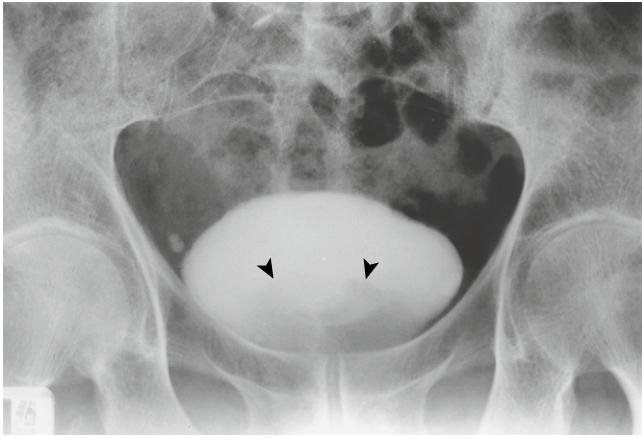

Figure 86-4. Bladder film from intravenous urogram series. Shadows at base of bladder (arrows) are a poor indicator of prostatic size and may represent bladder

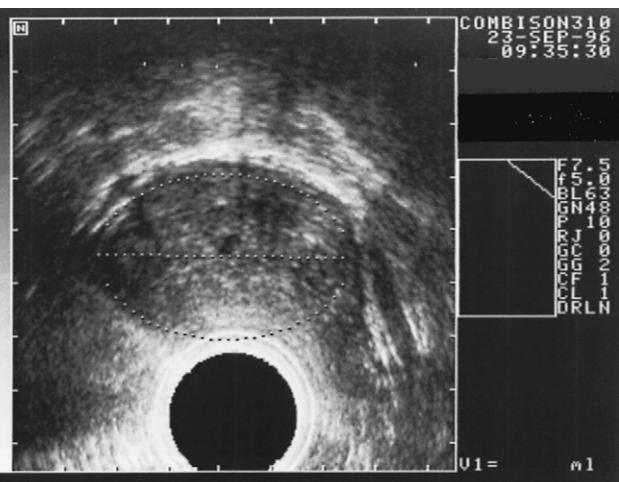

tumor or other intravesical pathology. Figure 86-5. Transrectal ultrasound scan of prostate, showing relatively homogeneous pattern within, but with loss of capsular definition on the left. Biopsy from this area showed well-differentiated prostatic cancer.

(i.e., bladder tumor) but because of technical factors such as the variable angle of incidence of the X-rays through the pelvis.

# **Transrectal ultrasound**

Transrectal ultrasound (TRUS) imaging of a prostate is now accepted as the principal methodology by which accurate anatomic detail of the gland may be obtained. Modern machines linked to sophisticated software packages may give high resolution in both multiple transverse and sagittal planes. Additionally, computer-assisted guided needle biopsies may retrieve tissue from exactly specified areas of the gland to distinguish between benign and malignant disease.

In practice, TRUS technology is rarely applied unless it is necessary to exclude or confirm the presence of carcinoma. Patients with straightforward symptom complexes thought on the basis of tests including prostate-specific antigen (PSA) to be due to BPH are likely to be offered therapy without the need further to image the gland and its appendices.

By contrast, despite insensitivity as a "screening tool," TRUS with biopsy as indicated is an essential preoperative investigation in patients with a suspicious prostate on rectal examination and in those—often younger—patients in whom PSA tests indicate the possibility of cancer. It has been suggested that the cancer detection rate obtained by the traditional sextant biopsy technique could be significantly improved by an extended core protocol,15 though sensitivity for capsular bulge/spread (Figure 86-5) and seminal vesical spread (stage T3b) remains relatively poor.16

It will be appreciated that the large literature that has amassed relating to TRUS and TRUS biopsies relates to the enormous effort to detect prostate cancer in PSA "screened" younger men; for older men (taking into account age adjusted PSA ranges, discussed later), the search for neoplasm becomes more measured as age advances. *Nevertheless, the identification of biologically significant prostate cancer that may adversely affect quality of life is important at any age.*

# **Computed tomography**

Computed tomography (CT) scanning is not commonly employed in the diagnosis of prostatic disorders. Although good resolution may be obtained with modern multislice machines, the technique is not routinely utilized in the treatment algorithm of BPH (see the benign prostatic hyperplasia algorithm). Cross-sectional imaging may occasionally be of advantage in those few older men being considered for radical therapy to a neoplastic gland; however, radiopathologic insensitivity relating to patients with low PSA values (< 20 ng/mL), micrometastatic spread, and detectable nodes (<8 mm) ensure that CT is not routinely utilized for "early" disease,17 even in younger men. It may be of help in clinical management of T3/T4 disease or radiotherapy planning.16

# **Magnetic resonance imaging**

Magnetic resonance imaging (MRI) is not routinely used for the diagnosis of prostate cancer. However, the technique is increasingly utilized in the staging of patients in whom the diagnosis has been established but in whom the curative possibility of radical corrective treatments remains uncertain (Figure 86-6). A number of factors may confuse interpretation of scans; in particular postbiopsy hemorrhage within the gland may cause difficulty. Biologically youthful older men may also choose active treatment and in this group with an increased statistical chance of higher staged disease MRI may identify those unsuited for radical intervention.

Despite variable data regarding sensitivity and specificity,18 good images of capsular distortion and seminal vesical infiltration may be obtained, particularly when the technique employs endorectal (er-MRI) coils. Mullerad and coworkers19 found er-MRI to offer significantly more diagnostic information in 106 patients before radical prostatectomy when compared to digital rectal examination (DRE) or TRUS biopsy findings.

MRI spectroscopy is a relatively novel technique presently under active evaluation in which the pretreatment ratio of intraprostatic elements (e.g., choline and citrate) is correlated to subsequent observations such as Gleason score.20

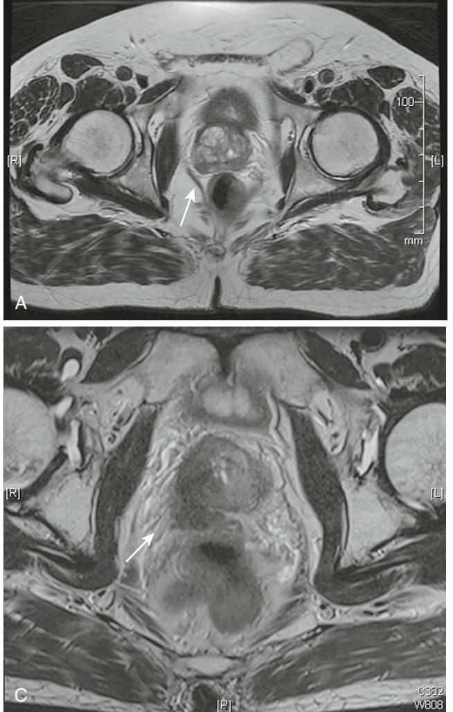

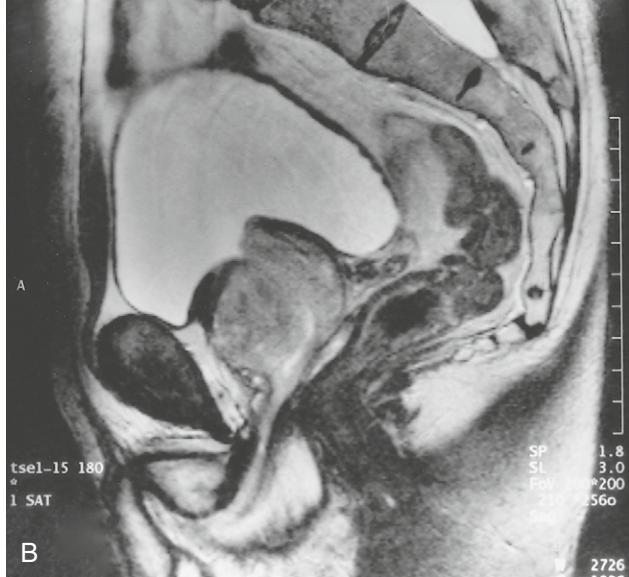

Figure 86-6. MRI scans. A, Transverse (axial) section through prostate. Posterio-laterally on the left a distortion of the capsule is clearly seen but penetration has probably not occurred. B, Sagittal section through the prostate. The relationship of bladder, prostate and other pelvic structures is clearly seen. C, Transverse section showing invasion of right seminal vesicle (T3b). Left SV normal.

Magnetic resonance (MR) scans are commonly employed to detect sites of anatomic treatment failure (PSA elevation) after radical retropubic prostatectomy before salvage therapy; recent studies utilize similar imaging following treatment failure of new therapeutic modalities such as highintensity frequency ultrasound (HIFU).21

Overall it is accepted that the acquisition and interpretation of MR scans requires highly trained personnel. Most uroradiologists agree that under such circumstances there is a marginal advantage to MRI as compared to transrectal ultrasound even when performed by an experienced operator in terms of practical staging diagnostics in patients with localized prostate cancer.22

# **SERUM MARKERS OF PROSTATIC DISEASE Acid phosphatase**

Since the report of Gutman and Gutman23 noting high acid phosphatase levels in men with metastatic prostate disease, acid phosphatase estimations were widely used in the staging of prostate cancer. Unfortunately, lack of sensitivity with regard to localized disease precluded its use for cancer detection, and the test has now effectively been replaced by PSA, although some authorities still employ it to monitor results of therapy in patients with proven bony metastatic disease.

# **Prostate-specific antigen**

This serum protease was isolated from prostatic tissue in 1979 by Wang and associates24 and has rapidly emerged as the most important marker of prostatic epithelial activity. Contrary to widespread public opinion, this marker is not cancer specific (Figure 86-7) but may be elevated in other pathologies such as inflammation or benign hyperplasia. Prostate-specific antigen (PSA) varies with the proportion of ductal epithelial cells, so it is not surprising that higher values are found in patients with larger glands and that ageadjusted ranges have been proposed.25 Damage to epithelial cells either by inflammation or other means such as elective prostate biopsy may elevate levels markedly, often for some weeks, making interpretation difficult in an already

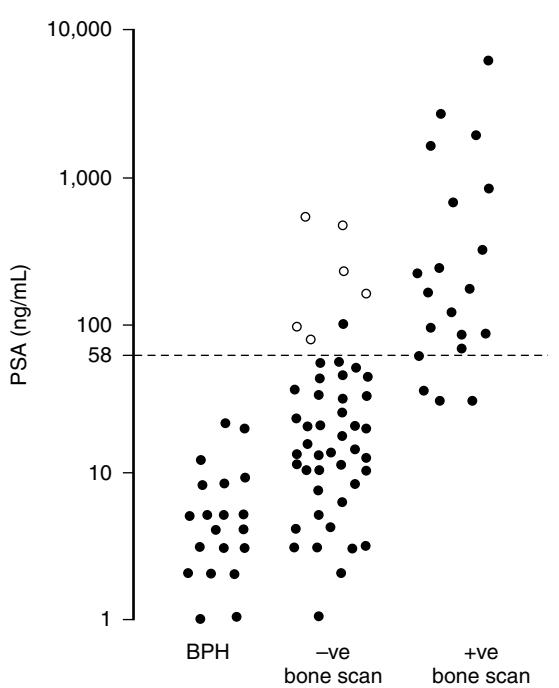

Figure 86-7. Prostate-specific antigen levels in patients with benign prostatic hyperplasia, localized prostate cancer (bone scan negative), and metastatic prostate cancer. Open circles represent seven patients with raised acid phosphatase suggesting metastatic disease despite apparently negative scans. The degree of overlap between the values can be clearly seen, illustrating that PSA is a marker of prostate epithelium and not a specific indicator of prostate cancer. Dotted line: discriminant analysis identifies 58 ng/mL as optimum cutoff distinguishing between skeletal and nonskeletal disease. See text for details. *(Data with permission from Pantelides ML, Bowman SP, George NJR. Levels of PSA that predicts skeletal spread in prostate cancer. Br J Urol 1992;17:299–303.)*

cancer-anxious patient. To avoid unnecessary interventions, *no diagnostic pathway should be entered without at least two confirmatory PSA records.*

In general, cancer may be found on biopsy in 25% to 30% of men with PSA between 4 and 10 ng/mL and an everincreasing proportion in those with greater values. Most patients with PSA above 50 ng/mL will have skeletal metastases (see Figure 86-7). Despite age-adjusted ranges cutoff values remain problematic,26 and even below 4 mg approximately 15% of men may have positive biopsies.27

The level of PSA at presentation guides therapeutic choices available to those later found to have cancer confirmed on biopsy. For patients with PSAs >20 ng/mL, high surgical margin positivity following radical prostatectomy determines that this modality is rarely (discussed later) offered under these circumstances; this option is usually offered to patients with a PSA under 10 ng/mL. Naturally, surgery is usually reserved for patients with cancer discovered at an early age (<70 years), but extended life expectancy has led many surgeons, particularly in the United States, to offer this modality to otherwise fit men between 70 and 80 years of age.

Although such radical treatment options may not be appropriate to the majority of elderly men, increased life span and regular medical checkups determine that active management of elevated PSA levels in this group is of increasing clinical importance. *No patient, whatever his age, should be allowed to develop by default the morbidity associated with skeletal metastases.* Annual PSA checks are a minimum standard for care of the elderly with subsequent management (discussed later) based on PSA risk stratification.

#### **PSA CHARACTERISTICS AND PSA ISOFORMS**

Various aspects of PSA characteristics have been studied to improve its performance in relation to clinical risk including PSA velocity (doubling time) and aged-specific reference ranges,25 which, though very helpful in younger men, are of limited value in the older age group where larger volumes of benign tissue serve to confuse the picture.

Studies have extended the utility of PSA by showing that it may exist in the serum in two modes: free and bound or complexed forms.28 Determination of these fractions has added new impetus to the search for a test that can distinguish between BPH and cancer; tumor cells may stimulate production of α-chymotrypsin (ACT), with which binding may occur, leading to higher levels of complexed PSA-ACT than is detected in patients with simple BPH.29 The determination of the free or complex forms in practical terms is usually limited to the most difficult diagnostic group of patients those with a presenting PSA between 4 to 10 ng/mL. Free levels below 15% have been associated with the increased chance of a positive biopsy (30% to 50%), but a prospective multicenter study showed only a moderate increase in specificity when compared to total PSA values.30 Other isoforms such as proPSA and benign PSA have failed significantly to improve on the free PSA performance.31 PCA3, a marker over expressed in 95% of patients with prostate cancer, is measured in urine after rectal examination.32 It shows diagnostic promise particularly in the problematic 4 to 10 ng group but is not yet widely accepted in clinical practice.33

# **CLINICAL ASPECTS OF PROSTATIC DISEASE**

# **Prostatitis**

Inflammation of the prostatic ducts and acini may occur at any age, although it is more common in its typical form in the third, fourth, and fifth decades. The infection, commonly by coliform organisms, may lead to severe systemic illness with high fever, rigors, and acute perineal discomfort. More chronic forms of the disorder may be difficult to eradicate, and it is suggested that spasm of α-adrenergic smooth muscle as well as general pelvic floor tension may contribute to poor duct drainage and, hence, persisting symptoms. Combination therapy using both antibiotics and smooth/ striated muscle relaxants has been advocated in such cases.34

In older men, prostatic infection is usually related to the presence of residual urine and outflow tract obstruction. Infection commonly spreads distally down the vas deferens leading to epididymo-orchitis; in earlier times, bilateral vasectomy was commonly performed at the time of (open) prostatic surgery to prevent this almost inevitable consequence of the infected residual. In general, the presence of lower urinary tract infection associated with poor bladder emptying will demand surgical intervention after a period of suitable antibiotic treatment so as to reduce the residual volume. In patients for whom surgery is inappropriate or contraindicated, direct installation of antibiotics into the bladder by a self-catheterization has been described35 and tried in the elderly with some success.

## **Benign prostatic hyperplasia**

#### WORK-UP FOR A PATIENT WITH BENIGN PROSTATIC HYPERTROPHY (A NORMAL AGE-ADJUSTED PSA)

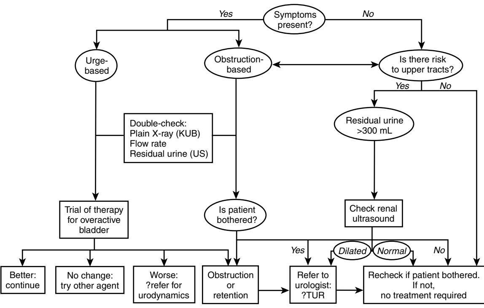

#### **SYMPTOM COMPLEXES AND TERMINOLOGY**

It has already been noted that BPH arises chiefly in the periurethral zone and affects a high proportion of men as part of the aging process. It is essential to appreciate, however, that the presence of hyperplasia per se does not imply either significant obstruction to the lower urinary tract or association with particular clinical symptom complexes that may be related to vesicourethral dysfunction rather than the enlarged prostate gland.

These three components—hyperplasia, symptoms, and obstruction—have been brought together in a classic diagram by Hald36 (Figure 86-8) demonstrating that although all three may be found in a minority of cases, each may exist alone or with one other in a random association.

Urologists have argued for many years against the usage of the common phrase *prostatism* employed to describe a wide range of symptoms relating to the male lower urinary tract. Not only does this imply, often wrongly, that the symptoms may be due to the hyperplasia, but it also suggests that therapeutic attention to the gland will cure the patient. *Obstruction* should be reserved for those patients proven to be obstructed by urodynamic tests—lower urinary tract symptoms (LUTS) more exactly describe the symptom complex that may or may not be associated with the gland.37

## **Associated detrusor dysfunction**

The reaction of the bladder to the presence of emergent BPH is responsible for the symptom complexes that are associated with the condition. These changes are best understood if the filling and voiding segments of the micturition cycle are considered independently.

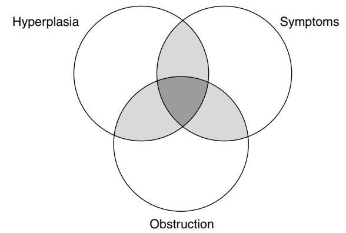

Figure 86-8. Interlocking diagram demonstrating the interdependence of lower urinary tract symptoms, outflow tract obstruction, and hyperplastic tissue when considering symptoms of patients with "prostatism." Significant volumes of hyperplasia may not necessarily be associated either with obstruction or symptoms, whereas all three may be present in some cases. *(Adapted with permission from Hald T. Urodynamics in benign prostatic hypertrophy: A survey. The Prostate 1989; (suppl 2):69–77.)*

#### **FILLING PHASE**

The bladder, receiving urine at 1 mL/min from the kidneys under normal circumstances in temperate climates, normally responds by accommodating the physiologic volume (400/500 mL) at low (less than 5 cm H2O) intrinsic detrusor pressure. This normal reaction to filling may be observed even in the presence of significant outflow obstruction.

More commonly, however, the growth of the emerging gland may give rise to *bladder overactivity*—abnormal intrinsic detrusor pressure waves during filling that lead the patient to experience frequency, nocturia, urgency, and possibly urge incontinence. Unfortunately, not all bladder overactivity is related to prostatic obstruction, there being a significant association with old age and neurologic disorder (when overactivity is correctly called detrusor hyperreflexia). Careful studies have shown that approximately two thirds of older men being investigated for "prostatic" symptoms have bladder overactivity, and of these only two thirds will lose their overactivity following prostatectomy.38 Unfortunately, there is no test at present that can detect preoperatively which patients will not lose their bladder overactivity postoperatively. Persistence of the disorder following surgery leaves a very unhappy patient with significantly worse urge symptoms that may take many months to settle (Figure 86-9).

#### **VOIDING PHASE**

As with the filling phase, significant prostatic hyperplasia may not necessarily affect vesicourethral function. This observation presumably explains in part the large number of elderly men who have apparently enlarged glands on rectal examination but who deny any impairment to micturition performance. More typically, however, two types of bladder dysfunction are found in association with BPH—typical high-pressure obstructed voiding or relatively low-pressure underactive detrusor function.

High-pressure/low-flow voiding is the classic reaction to mechanical blockage of the urethra by BPH leading to typical symptoms of hesitancy, poor stream, and gradually increasing frequency by day and night. Additionally (discussed earlier) symptoms of bladder overactivity may superimpose problems related to urgency and urge incontinence.

Low-pressure/low-flow underactive bladders have been recognized only relatively recently but may account for 20% to 25% of patients with outflow tract symptomatology. The reason for the abnormal detrusor function remains unknown, although the condition has been likened to a nonobstructive myopathy.39 Men with low-flow voiding also complain

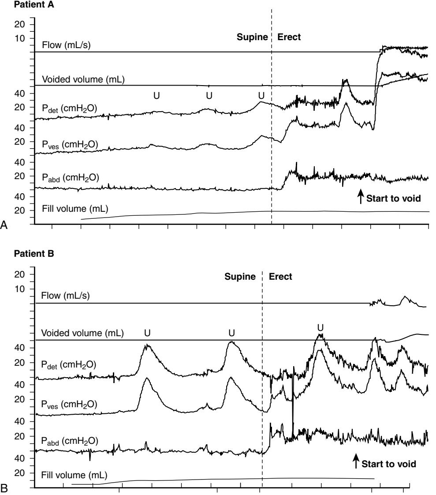

Figure 86-9. Urodynamic (cystometry) traces from patients with (A) bladder overactivity probably associated with obstruction, and (B) bladder overactivity probably not associated with obstruction. In both cases the patient presented with urgency, frequency, and a poor flow. It remains extremely difficult to determine which patient might benefit from outflow tract surgery without urodynamic investigation. In the cases illustrated, patient A would probably benefit significantly from surgery, whereas patient B would probably become significantly worse. Pdet, intrinsic detrusor pressure; Pves, pressure within bladder; Pabd, pressure within abdomen (rectal line). U: patient experienced urgency sufficient to mention to the investigator. Vertical dotted line: commencement of move from supine to erect investigation position.

of frequency and poor stream (often prolonged and interrupted), which is impossible to separate from high-pressure/ low-flow voiding except by invasive urodynamic tests (Figure 86-10). It has been recognized increasingly that inclusion of such low-pressure/low-flow patients in prostatectomy series leads to reportedly "poor outcomes" from the procedure.40,41 In this group, an otherwise satisfactory outcome from TURP will not include a "fire hose" postoperative flow rate, but patients may be well satisfied with such outcomes if counseled appropriately in the preoperative period.

## **Bladder dysfunction and retention**

Sudden increase in prostate size, such as may occur during hemorrhage or infarction, may cause acute (painful) retention of urine, but these conditions are unusual. It is a common observation that patients on urologic waiting lists for outflow tract obstruction rarely present in acute retention; by contrast men admitted with this condition have usually not seen their general practitioner previously, and the precipitating factor seems often to relate to acute fluid loading and subsequent overstretching of the unrelieved bladder—as happens, for example, during a long coach trip.

Chronic (painless) retention of urine is broadly divided into two forms: the relatively common low-pressure "floppy" bladder, which may become complicated by infection but which has normal upper tracts; and the unusual high-pressure "tense" bladder, which frequently is seen in patients with few if any lower tract symptoms but which usually is associated with bilateral upper tract dilatation and obstructive uropathy.42

High-pressure chronic retention (HPCR) is specifically associated with sterile urine, late onset enuresis (discussed later), and renal impairment in its later stages. However, elevated creatinine levels may occur for many reasons in the elderly, and this has led to a misdiagnosis of HPCR in many patients with other forms of retention, the true incidence of the condition only being approximately 1 in 20 men with significant retention of urine.42

## **Investigation in benign adenomatous hyperplasia**

Audit studies have lead to rationalization of investigations required to assess the patient with BPH. Frequency/volume charts filled in by the patient at home are helpful in revealing nonprostatic causes of urinary tract disorders such as fluid excretion patterns related to cardiovascular disease or excessive tea drinking. Following urine microscopy and culture, rectal examination, and palpation of the abdomen for chronic retention of urine, plain X-ray of the abdomen (KUB) will detect potential operative problems such as bladder calculus. An independent flow rate test, correctly performed (greater than 150 mL voided, no Valsalva pushes permitted) is mandatory (see Figure 86-10). Intravenous urography is no longer advised unless the patient complains of, or is found on urine testing to suffer from, significant hematuria.43 As noted previously, only 5% of men with significant residual urine have upper tract changes; for this reason, if a residual urine of greater than 300 mL is detected by suprapubic ultrasound, upper tract ultrasound is advised to assess renal anatomy. In summary, audit studies suggest that patients without blood in their urine or residual urine < 300 mL do not require any form of upper tract studies before consideration for surgery.

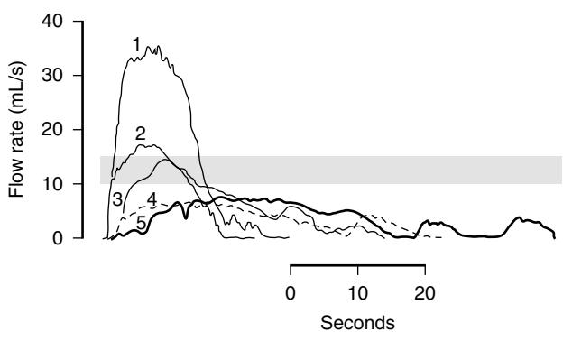

Figure 86-10. Independent flow rate traces. 1: Normal flow rate, younger male. 2,3: Normal flow rates, older male (>70 years). 4,5: Poor flow rate. It is not possible to determine whether the reduced rate is related to outflow tract obstruction or underactive detrusor function—see text for details. Stippled line: lower limit of normality.

## **Management of patients with benign adenomatous hyperplasia**

Many patients come to their doctor because a friend has recently been admitted in acute painful retention or they have seen a television program about prostate cancer. A negative workup followed by reassurance permits these patients to return to their normal lifestyle without the need for any intervention.

#### **PATIENTS WITH INCONTINENCE**

Stress incontinence is rare in neurologically normal males and when observed is usually the result of prostatic surgery where the sphincter mechanism has been damaged during the procedure. By contrast, urge incontinence is common, particularly in the older age group, and is chiefly related, in the presence of sterile urine, to bladder overactivity. The therapeutic approach to overactivity is mentioned later and is discussed more fully in Chapter 109. "Late onset" enuresis, mentioned earlier, refers to the loss of a small amount of urine (damp nightwear or underclothes) when the patient is asleep at night or dozing by day. Direct enquiry is usually required for this highly specific symptom of HPCR to be elicited.

#### **PATIENTS WITH HIGH PRESSURE/LOW-FLOW VOIDING**

Advice for patients with uncomplicated obstructive symptoms—hesitancy, poor stream, and moderate frequency/ nocturia (no urge or urge incontinence)—will depend to a large extent on the patient's own circumstances and preferences. Frequency may not trouble a retired man as much as a clerical officer at his desk. Reassurance, particularly concerning prostate cancer, may be all that is required, and it is tempting to propose that the reduction in α-adrenergic periprostatic tone might be responsible for the noted improvement.

More usually, however, active intervention will be required, and typically the choice will be between medical therapy and operation (transurethral resection of the prostate, TUR). Only in particularly critical cases will (irreversible) surgery be considered before a trial of (reversible) medical treatment, which typically will involve the use of alpha1 blocking agents, alpha reductase inhibitors (ARI), or a combination of both (Table 86-1).

## **Table 86-1. α-Blockers**

| Nonselective α-Blockers Phenoxybenzamine                              |
|--------------------------------------------------------------------------|
| Selective α-Blockers Prazosin Alfusozin Indoramin               |
| Selective Long-Acting α-Blockers Terazosin Doxazosin Tamsulosin |
| Type II 5α Reductase Inhibitor Finasteride                            |
| Dual 5α Reductase Inhibitor Dutasteride                               |

α-Blockers are reasonably fast acting, producing symptomatic relief greater than the observed increment in flow rate might suggest.44 Modified release preparations permitting a long-acting single daily dose may be of benefit to elderly patients. α-Blockers are the accepted first-line therapy for most men with obstructive BPH symptoms and are always indicated for those patients undergoing trial removal of urethral catheter such as maybe required, for example, after routine orthopedic surgery.

The slow ARI onset of action has long been recorded.45 Finasteride, a type 2 ARI, was initially considered no better than placebo when treating symptomatic BPH in the veterans' group study,46 but despite its very slow onset of action, the Medical Therapy of Prostate Symptoms (MTOPS) Study later suggested a benefit for Finasteride in symptom scores and risks of subsequent painful retention in patients with relatively small glands (a mean of 36.3 mL).47 The socioeconomic cost-effectiveness of the reduced acute retention rate had been questioned in a widely quoted editorial comment48 on an earlier study, which observed that treatment with Finasteride for 4 years reduced the probability of surgery and acute painful retention.49 Nevertheless, a recent analysis of MTOPS follow-up data demonstrated that Finasteride led to a significant reduction in prostate volume (25%) over a 4½-year period;50 whether such dual therapy remains economically viable continues as a matter of debate.

Further combination studies have examined men with larger (a mean of 55 mL) prostates, perhaps more appropriate for an elderly population, and found symptomatic improvement using an alpha blocker and the dual 5ARI dutasteride, which was greater than either drug taken alone.51 Importantly, it is advisable that any Finasteride cancer–related anxieties aroused by the Prostate Cancer Prevention Trial (PCPT) should be discussed carefully with the patient before ARI treatment.52 Finally, it is noteworthy that, despite the relatively slow onset of action, Finasteride has been found to be effective in reducing bleeding from the prostate surface, which can be persistent and troublesome in some elderly patients.53

For patients with severe "simple" obstruction, TUR offers the unquestioned gold standard in terms of measured outcomes. Despite the significant comorbidity of the elderly treatment population, a rapid resolution of symptoms ensures that the great majority of patients submitted with the correct indications are delighted with the results of treatment.

## **PATIENTS WITH UNDERACTIVE DETRUSOR FUNCTION**

It has already been emphasized that it is not possible to separate patients with underactive function from those with true obstruction unless full preoperative urodynamic tests are performed;40 hence, overall, it is not surprising that in the absence of such tests, some patients are not satisfied with their postoperative micturition performance.41 Nevertheless, some improvement is seen and the disappointment is a relative measure of the difference in postoperative flow rates between obstructive and underactive groups. The reversibility of medical therapy makes it ideal for a trial of treatment in this group, and transurethral resection may be reserved for those who are dissatisfied or who cannot tolerate blockade therapy.

## **PATIENTS WITH IRRITATIVE SYMPTOMS**

As previously noted, overactive bladder (OAB) is common in men with both obstructed and unobstructed bladders. Although a complete diagnostic picture may be obtained by urodynamic tests on each patient, few units can afford the academic luxury of this purist approach; hence, trials of therapy are commonly practiced in elderly patients with the frequency urge syndrome (see Figure 86-9A).

Physiologic bladder contraction is mediated by a stimulation of postganglionic parasympathetic cholinergic receptors on detrusor smooth muscle, and of the forms of muscarinic receptor, the M3 subtype is thought to be the most important for bladder contraction.54 Hence, atropine and atropine-like agents will induce a lessening of the contraction wave with corresponding decrease in detected urgency by the patient.

Early descriptions of such pharmacologic agents55,56 and subsequent variations in release rate57 were precursors of a plethora of publications comparing efficacy, safety, and sideeffect profiles.58–60 New-generation extended release (ER) preparations such as tolterodine ER and solifenacin have been studied, although only a minority of the patients were elderly men.61 Similar constraints applied to a systematic review of antimuscarinic therapy, and it is acknowledged that more studies are required to address urge problems in the elderly population.62

Despite these laudable efforts, many will be familiar with the statement about any treatment for overactive bladder: "one is always surprised when it works."

# **New modalities for treatment of benign prostatic hyperplasia**

Although it is accepted that transurethral resection remains the gold standard for treatment of patients with obstructive BPH,63 a number of new modalities have been introduced, including prostate incision, laser therapy, stent therapy, and varieties of thermotherapy. All these techniques have their vociferous supporters, but all agree that for the patient with a significant volume of hyperplastic tissue obstructing the bladder outlet, endoscopic transurethral resection remains the treatment of choice. The need for critical evaluation of the new technology in terms of outcome measures continues to be debated in urologic circles.

# **Prostatic surgery in the elderly**

Advances in anesthetic techniques and in some cases introduction of preoperative cardiopulmonary testing64 have allowed a complete reappraisal of treatment options in the elderly, and it is now rare for a patient to be refused prostatectomy on anesthetic grounds alone. Although many patients over 100 years of age have been treated satisfactorily—an unnecessary urethral catheter is undesirable at any age—the chief contraindication to operation is presently the inability of the patient mentally to appreciate what is being offered to alleviate his symptoms. Hence, apart from a few seriously compromised patients, modern anesthesia permits straightforward decisions to be made about the elderly patient, and "lesser" operative techniques such as urethral stent insertion65 no longer require consideration under these circumstances.

## **Prostate cancer**

Since the 1980s, prostate cancer has increasingly been recognized as a major health problem for both younger and older male patients.66,67 It is now the most common cancer diagnosis in U.K. men, accounting for 24% of new cases,68 35,000 of which were diagnosed in 2004.

However, the increasing age of the population and the very slow growth of some tumors mean that, unlike many other neoplasms, not every cancer is a life-threatening event for the patient. Many older men die *with* rather than *of* their prostate cancer, but the prediction as to whether the disease as identified in any one individual patient carries a good prognosis remains extremely difficult. This overall problem is illustrated by the wide difference between the *incidence* and *mortality* of the disease in many Western countries.

In the United States in 2002, the incidence/mortality ratio was 8:1, whereas in Holland it was 2.6:1,67 demonstrating that the diagnostic tests were detecting many more cancer cases than were later dying of the disease. The essential question relates to which of the detected cancers

# **Prostate cancer**

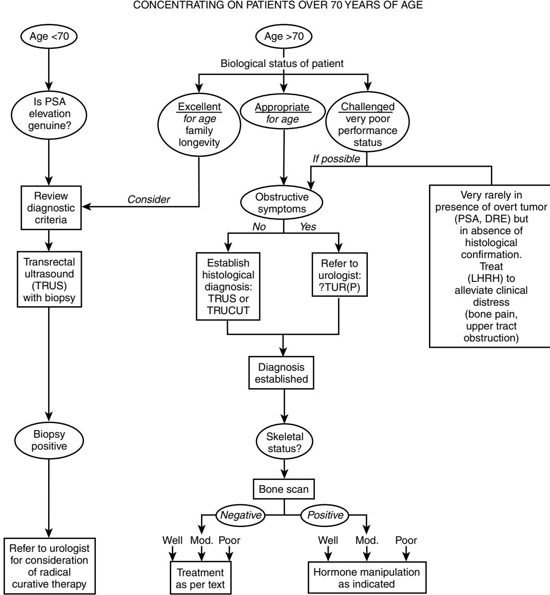

WORK-UP FOR A PATIENT WITH PROSTATE CANCER

Well, Gleason ≤#6; Moderate, Gleason 7; Poor, Gleason ≥#8

#### **SITE OF DISEASE**

Anatomically, most cancers (70% to 75%) are found in the peripheral zone of the gland (see Figure 86-2). Approximately 20% of lesions are thought to originate in the transitional zone, whereas the remainder are located in the central zone. As such, the educated finger on rectal examination should detect most nodules or palpable lesions; in a minority, the transurethral resection of the transitional zone (i.e., for an obstructive lesion thought to be BPH) may occasionally eradicate unsuspected tumor in that area.

#### **EPIDEMIOLOGIC STUDIES**

Prostatic disease is rare in the Far East, Japan, and China. Classical migratory studies have clearly shown, however, that the incidence of the disease increases as males move to a more Western lifestyle. Significant racial differences also exist; within the San Francisco Bay area, Japanese Americans are eight times less likely to suffer from the disease than African Americans.69

#### **PROSTATE CANCER AND THE ELDERLY**

It has already been mentioned that the disease is being diagnosed at an earlier stage in younger men. At the present time, the question of whether to screen for prostate cancer and which treatment to offer for the cases so detected remains at the forefront of medical debate.70 Views are strongly expressed because a tumor discovered at age 53, however indolent its growth pattern, is likely to carry a significant risk of death within the patient's natural life span. For the older person, however, the decision criteria are different, and it is in this context that the following variants of disease presentation are discussed.

## **Localized prostate cancer**

Localized prostate cancer may be detected incidentally or it may be discovered as part of the investigation of a man with developing lower urinary tract symptoms. Prostate-specific, antigen-led ultrasound biopsy may reveal carcinoma (stage T1C, Table 86-2) in a patient who merely presented with anxiety, no symptoms, and a normal rectal examination (i.e., BPH in texture). However, for the elderly patient, lower urinary tract symptoms—irritation or obstruction—are more often the reason for a first visit to his doctor.

#### **PSA ELEVATION IN OLDER MEN**

Although elevation above the age-related cutoffs will almost invariably lead to TRUS-led biopsy in younger men, the same interventional stance may not be appropriate in all older men. Biologically fit septuagenarians *may* follow the protocol pathway of their younger counterparts (discussed later), but increasingly as age progresses management will be more conservative bearing in mind the high incidence of microscopic prostate cancer found in postmortem studies of urologically asymptomatic men. Hence, the common referral of an elevated PSA in an older man (e.g., PSA 18, age 80) will demand an exquisite level of judgment from both doctor and patient, who, after full informed consent, will have to decide between biopsy and an expectant policy. The answer of course will depend on the individuals concerned, but there must be a strong argument for a careful watchful waiting approach and diagnostic/intervention only if a slowly rising (minimal doubling time) PSA enters the range (35 to 40 ng/mL) statistically associated with impending bony metastatic disease, which, as mentioned previously, must be avoided at all costs. This argument is driven by the scientific literature identifying therapy-related problems such as bone fracture associated with long-term androgen deprivation.71

#### **Table 86-2. TNM Staging of Prostate Cancer: 1997 Revision**

| Primary Tumor, Clinical (T) |                                                                                                                                                                  | Primary Tumor, Pathologic (pT) |                                | Regional Lymph Nodes (N) |                                               | Distant Metastasis (M) |                                          |
|-----------------------------|------------------------------------------------------------------------------------------------------------------------------------------------------------------|-----------------------------------|--------------------------------|-----------------------------|-----------------------------------------------|------------------------|------------------------------------------|
| TX                          | Primary tumor cannot be assessed                                                                                                                                 | pT2                               | Organ confined                 | NX                          | Regional lymph nodes cannot be assessed    | MX                     | Distant metastasis cannot be assessed |
| T0                          | No evidence of primary tumor                                                                                                                                     | pT2a                              | Unilateral                     | N0                          | No regional lymph node metastasis          | M0                     | No distant metastasis                    |
| T1                          | Clinically inapparent tumor not palpable or visible by imaging                                                                                                | pT2b                              | Bilateral                      | N1                          | Metastasis in regional lymph node or nodes | M1                     | Distant metastasis                       |
| T1a                         | Tumor incidental histologic finding in 5% or less of tissue resected                                                                                          | pT3                               | Extraprostatic extension    |                             |                                               | M1a                    | Nonregional lymph nodes               |
| T1b                         | Tumor incidental histologic finding in more than 5% of tissue resected                                                                                        | pT3a                              | Extraprostatic extension    |                             |                                               | M1b                    | Bone(s)                                  |
| T1c                         | Tumor identified by needle biopsy (e.g., because of elevated PSA)                                                                                             | pT3b                              | Seminal vesicle invasion    |                             |                                               | M1c                    | Other site(s)                            |
| T2                          | Palpable tumor confined within prostate                                                                                                                          | pT4                               | Invasion of bladder, rectum |                             |                                               |                        |                                          |
| T2a                         | Tumor involves one lobe                                                                                                                                          |                                   |                                |                             |                                               |                        |                                          |
| T2b                         | Tumor involves both lobes                                                                                                                                        |                                   |                                |                             |                                               |                        |                                          |
| T3                          | Tumor extends through the prostatic capsule                                                                                                                   |                                   |                                |                             |                                               |                        |                                          |
| T3a                         | Extracapsular extension (unilateral or bilateral)                                                                                                             |                                   |                                |                             |                                               |                        |                                          |
| T3b                         | Tumor invades seminal vesicles                                                                                                                                   |                                   |                                |                             |                                               |                        |                                          |
| T4                          | Tumor is fixed or invades adjacent structures other than seminal vesicles: bladder neck, external sphincter, rectum, levator muscles, or pelvic wall |                                   |                                |                             |                                               |                        |                                          |

Following histologic confirmation, bony metastatic disease may be confirmed by isotope bone scan, but it has been suggested that PSA is a superior predictor of a negative scan if levels are less than 20 ng/mL, and thus the timeconsuming and expensive scan may be avoided.72 Regardless of the economic arguments, however, the demonstration of a negative bone scan may be a great comfort to an older man who is likely to have widespread osteoarthritic changes in his skeleton.

#### **TREATMENT OF LOCALIZED DISEASE**

Four options are available for the treatment of older men with apparently localized disease: watchful waiting, radical radiotherapy, brachytherapy, or radical prostatectomy. The therapeutic choice will depend *inter alia* on the histologic grade of the tumor, the PSA level at diagnosis, and the biologic age of the patient.

**WATCHFUL WAITING OR ACTIVE SURVEILLANCE.** Since early studies from Scandinavia73 and England,74 there has been a general admission that overtreatment is common in older men who may never experience a clinical problem following discovery of the disease,75 and hence major efforts have been made to establish safe and expectant treatment protocols for patients, particularly those with low-risk disease.76,77 Moderate and particularly poor-grade levels of disease have always been associated with poor survival.74

Watchful waiting implies a low-key but persistent observation of an often elderly man who may have either histologically proven disease or nonbiopsied PSA elevation (discussed earlier); by contrast, active surveillance implies an interventional management protocol that will include rebiopsy of the gland at specified intervals to detect silent (non-PSA-detected) upgrading of histologic pattern.78 The ideal protocol for such regimes has yet to be agreed,79 but increasing (Internet) awareness of the overtreatment dilemma has led even younger patients (e.g., age 60 to 70) to explore the safety aspects of expectant treatment with their physicians.80 The personal and economic importance of this debate, particularly in North America, is emphasized by the remarkable incidence/mortality data already mentioned.

**CONVENTIONAL RADIOTHERAPY.** Local tumor control is dependent on clinical T stage and tumor bulk. In the United Kingdom, radiotherapy was traditionally the mode of treatment for those patients with nonmetastatic (i.e., bone scan negative) disease in whom markers, grade or stage (as judged by rectal examination), pointed to the need for local primary control rather than an attempt to "cure" localized disease. In general, at that time, results of comparative trials with surgery were unfavorable, but it is generally agreed that patients entered to the radiotherapy arm of such studies were poorly staged when compared to those submitted ("selected") to radical surgery. However, centers in the United States in particular have reported more favorable outcomes when patients, accurately staged (including PSA) for localized disease, were submitted either to radical radiotherapy or radical surgery.81,82 Hence, for the many older men in whom watchful waiting or radical surgery is either contraindicated or not the patient's choice, radiotherapy remains an entirely acceptable method of treatment with minimal short- or long-term complications.

**BRACHYTHERAPY.** Brachytherapy—the implantation of an interstitial radiation source within the prostate—has gained rapid popularity in both younger and older men with localized prostate cancer. Relative simplicity, short (if any) inpatient stay, and rapid return to normal activity constitute the unarguable attractions of the technique. Within the United States it is estimated that brachytherapy, chosen by only 4% of men with localized prostate cancer in 1996, will soon be the treatment of choice for the majority, particularly elderly patients.83

Selection criteria for men suitable for brachytherapy are strict. Large prostates (>60 mL), prominent median lobes, previous transurethral resection of the prostate (risk of incontinence), and significant comorbidity (previous pelvic irradiation, diabetes) are contraindications. The treatment morbidity includes irritative voiding symptoms (80%), urinary retention (13%), and late complications of radiation proctitis, stricture, and incontinence.84

Along with external beam and surgery, brachytherapy has established itself as a safe, reliable treatment for correctly staged localized prostate cancer and is a popular choice for elderly patients in particular who wish to consider active treatment options. As always, technical expertise allied to up-to-date hard and software will be necessary to deliver optimum results.84

**RADICAL SURGERY.** Radical prostatectomy has always been the first choice in the United States for the treatment of localized prostate cancer, particularly in younger men. However, enthusiasm has been taken to levels where > 90% of patients with low or moderate risk cancers elect for active therapies.75 Such observations have confirmed the trend to overtreatment,85 particularly in the elderly; to emphasize this point it has been noted that, in the this age group, more than 300 men would have to undergo surgery to prevent one prostate cancer death at 10 years.76

Nevertheless, the treatment preference of biologically fit elderly men with 10-year life expectancy should be respected. Although the majority of the surgical workload will naturally involve younger men, good results can be expected with carefully selected older patients. These comments and caveats apply equally to patients choosing either open or the newly fashionable robotic assisted surgery.86

#### **TREATMENT SUMMARY**

Observational studies, while making due allowance for pathologic stage and grade, have shown that the biologic age of the patient is the most important factor in making a decision between the treatment options. Whereas there is little doubt that the man of 55 years of age should be offered radical therapy on the basis of the 10- to 15-year predicted survival data, for men over 70 the choice widens to include more conservative approaches such as watchful waiting/ active surveillance. Patient preference remains an important part of the therapeutic decision process.

## **Local-regional disease**

The first problem with local-regional disease is to define its boundaries. Disease metastatic to bone, described later, is self-evident; more problematic is the boundary between truly localized (theoretically curable) prostate cancer and disease that has spread away from the gland so as to render it, in all probability, an eventual candidate for palliative treatment only. Certainly in the United Kingdom, where the "PSA screening effect" has generally had a lesser impact than in the United States, patients with locoregional disease constitute the majority of new patients attending the prostate cancer clinic at the present time.

Before the PSA era, anatomic findings on DRE essentially defined "locally advanced" disease—T3 or T4 prostates with a negative bone scan. Subsequently, Partin (and others) added preoperative PSA and Gleason biopsy data to clinical stage data to produce tables capable of predicting the pathologic stage.87,88 Naturally, these tables were primarily designed to indicate whether curative therapy was possible for an individual patient, but the reverse and probably more important observation was to predict and define the group with locoregional disease.

Subsequently D'Amico further refined the chances of disease spread by risk stratification; "high risk" being defined as stage T2c, PSA >20 ng/mL and biopsy Gleason score ≥ 8.89 Such disease, even in the presence of apparently negative cross-sectional imaging, will have a high chance of micrometastatic locoregional spread.

Clearly, spread away from the prostate will demand treatment strategies able to contain the threat of micrometastatic disease; combinations of radiation therapy, androgen deprivation therapy (ADT), or chemotherapy remain under active investigation.

Two important randomized prospective studies have addressed the role of ADT in this patient group. In these trials Neo adjuvant90 and adjuvant91 luteinising hormone (LHRH) therapy was found significantly to improve local control in patients treated with external beam radiotherapy. Although it might be expected that patients randomized to early hormone therapy might show an initial treatment advantage, updated reports92,93 have confirmed an ongoing benefit, at least in certain patient subgroups. It seems likely that these and other studies94 will impact positively on the large number of patients presenting with nonlocalized non- (bony) metastatic disease.

## **Metastatic disease**

Until relatively recently, a majority of patients with prostate cancer presented with bony metastases.74 Increased public awareness and PSA "screening" since the mid-1990s have reduced this figure to 10% to 12% at presentation,95 although great geographic variation continues to exist. Worldwide it is accepted that even with immediate treatment, the survival of such patients is approximately 50% at 2 to 2½ years and 10% to 14% at 5 years.

#### **TREATMENT OF METASTATIC DISEASE**

**HORMONAL MANIPULATION.** Androgen deprivation treatment (ADT) has, since 1940 when Huggins discovered the hormone-dependent nature of the tumor, been the mainstay of treatment for metastatic prostate cancer. Remission occurs for a variable period—usually 9 to 12 months—before prostate markers, which usually fall following treatment, start to rise again. Approximately 10% to 15% of patients fail to respond significantly to the hormonal manipulation, which may be achieved by either medical or surgical means. Bilateral subcapusular orchidectomy was the traditional approach to androgen deprivation, and the serum testosterone

rapidly falls into the "castrate" range. Medical therapy by LHRH analogue96 has, however, become widely established, although the injections are expensive and the serum testosterone does not fall for 8 to 10 days, which may be of clinical importance. It has to be emphasized to the patients that the side-effect profile of these two treatments—impotence and hot flushes—is identical, a point not always well made by the manufacturers.

Diethylstilboestriol (DES) 5 mg was for many years used to achieve the required hormonal manipulation. Wellpublicized cardiac toxicity, however, has led many to avoid this medication even at the lower 1 mg dose, although some continue to advocate the approach in combination with daily aspirin.

**NONSTEROIDAL ANTIANDROGENS.** Nonsteroidal antiandrogens have the attraction of blocking the action of testosterone peripherally without the major side effect problems associated with traditional hormonal manipulations. Each compound, however, has particular drawbacks. Flutamide leads to significant gastrointestinal upset and diarrhea, whereas bicalutamide, which has the attraction of once daily dosage,97 also causes some breast tenderness and leads to elevation of serum testosterone because of a central agonist action effecting a rise in luteinizing hormone. Bicalutamide is licensed for the treatment of metastatic disease in conjunction with LHRH analogues.

Androgen withdrawal syndromes whereby altered expression of the androgen receptor permits an agonist response to antiandrogenic agents, particularly Flutamide, have been described.98 Predictive factors for such a response are high baseline alkaline phosphatase and prolonged drug exposure. The literature suggests that significant PSA reductions might occur in one third of patients with a time to onward progression of 3 to 6 months, and a trial withdrawal of nonsteroidals should always be undertaken in those patients on dual therapy with PSA progression.

Maximum androgen blockade (MAB), the addition of an antiandrogen to (usually) LHRH therapy, has been intensively investigated. Although emotive arguments are frequently put forward, particularly for younger, fit patients with metastases, no significant benefit has been found to accrue from dual therapy.99,100 Despite this scientific conclusion, it is difficult to avoid offering dual therapy in some patients.

#### **THE TIMING OF TREATMENT**

Unusually for a neoplastic condition, the timing of treatment for androgen sensitive prostatic disease is a matter for debate; different approaches can be taken under differing circumstances. Intermittent deprivation therapy and the maintenance of the androgenous environment for cases with low-risk nonmetastatic disease are examples of this dilemma.

Intermittent androgen suppression (IAS) is a technique advanced on the Darwinian basis that the emergence of androgen independent cells might be restricted by the return of the androgenous environment; an improved quality of life (especially sexual activity) might accompany such restoration. Implicit also is the assumption that immediate is preferable to deferred treatment (discussed later). Inclusion criteria, treatment regimens, and timing protocols for IAS vary considerably;101 most investigators exclude patients who fail to achieve a nadir of 4 ng/mL PSA after 6 months initial (usually combined) therapy and patients with metastatic disease in bone (TxNxM1b) at diagnosis. Ideal cases are patients with biochemical failure after surgery or radiotherapy and some men with TxN1-3 M0 disease, although it is realized that this latter group is associated with enhanced survival on conventional treatment.102

The debate on early or delayed treatment was reignited when the Medical Research Council (MRC) initiated a trial of less than ideal construction, which was widely quoted on publication in 1997.103 The trial showed clearly that delayed therapy in patients with metastatic disease to bone was associated with significantly worse morbidity—but not inferior prostate cancer–specific survival—and there seems little doubt that treatment should be commenced immediately in such patients even if no symptoms are present; this applies particularly to patients at risk from spinal collapse. (It had been argued previously that patients with asymptomatic bone metastases [a relatively small group] should not receive immediate ADT as they would suffer the side effects of treatment with no possibility of symptomatic improvement.)

Conclusions relating to patients with nonmetastatic disease were more controversial. Early work by the veterans research (VACURG) group when corrected for cardiovascular (estrogen associated) mortality as well as later studies involving node positive postprostatectomy patients104 seemed to suggest that early ADT would be beneficial for overall survival. The MRC Mo subanalysis also supported this conclusion,103 but later analysis of long-term followup data reversed this finding. EORTC 30891 subsequently reported a "modest" advantage for early ADT in terms of survival but no difference in prostate cancer mortality between the treatment arms. The reason for the reduction in noncancer deaths, which led to the survival advantage in the immediate group, remains unexplained.105

It may be concluded that, bearing in mind the prevalence of CaP in the elderly population, the case for early ADT, particularly in newly diagnosed low-risk disease in elderly patients, has yet to be made with conviction. Meticulous watchful waiting protocols would appear to be the prudent way forward for these patients.

#### **ROLE OF ESTROGENS AND CHEMOTHERAPY**

The great majority of prostate cancers eventually achieve hormone refractory status and regrowth commences. This point probably marks the most difficult therapeutic decision point for the physician and, particularly, the older patient. Estrogens (DES) may directly inhibit growth factors and may produce a PSA response for up to 6 to 9 months in some cases.106 Naturally, such patients will be carefully monitored for thromboembolic events, and the estrogen will typically be prescribed with low-dose (75 mg) soluble aspirin to counter such side effects. At the time of writing, diethylstilboestrol (1 to 3 mg daily) is probably the first treatment choice for patients with newly emerging hormone-resistant prostate cancer.

Chemotherapy, certainly in the United Kingdom, has not previously been routinely associated with older men suffering from prostate cancer. Nevertheless, therapeutic advances and reduced toxicity are gradually opening the door to a treatment modality that intuitively should be the rational answer to a disease with a widespread micrometastatic profile. Modest survival advantage from Docetaxel-based therapy in patients with bone metastases107 has encouraged further work to identify ideal patient groups to undergo further trials; common and distressing side effects include fatigue, diarrhea, Alopecia, and neuropathy.

Theoretically, chemotherapeutic options with lesser toxicity should be of great interest in the nonmetastatic (e.g., postprostatectomy) setting. Slow trial recruitment, however, underscores the reluctance to submit patients—particularly older more frail patients—to chemotoxicity. Active debate continues on this question, which centers on quality of life for the elderly.

#### **BONE PAIN**

Bone pain remains the most troublesome aspect of the disease for the patient and it is often difficult to manage. Radiotherapy remains the basis of local control. Radiation should not be used in hormone—naïve disease as ADT will usually provide rapid and lengthy relief from pain. Focal treatment to local reemergent lesions ("spot welding") is effective for pain relief and may (significantly) prevent fracture and improve quality of life. Metabolically guided therapies such as diphosphonate treatment may reduce skeletal related events, although the natural history of microfracture associated with the metastatic skeleton has always made objective assessment of benefit difficult.108 Radionuclide-based therapy (Strontium89) and hemibody radiation109 are infrequently used today.

**MANAGEMENT OF BONE PAIN.** The management of a patient in the early stages of prostate cancer is relatively simple. Given that satisfactory exchange of information has occurred, first-line therapy is usually effective, and the patient may be seen and reassured on an infrequent basis. The emergence of resistant disease and bone morbidity in particular heralds the need for multidisciplinary team support. Apart from any medical and surgical intervention that may be required, close cooperation with a radiation – oncologist will be essential. Perhaps most important will be the integrated team of support nurses with analgesic expertise who will be crucial to the administration of palliative care at the end of the disease process.

## **PROSTATE CANCER IN THE ELDERLY: A PATIENT SYNOPSIS**

Despite every endeavor, those patients who are destined to progress do so relentlessly, albeit at a slow, drawn-out pace. This poses particular problems as age advances.

Figure 86-11 illustrates a typical episode in an 82-year-old patient presenting with LUTS and subsequently diagnosed with well-differentiated Gleason 3+3 adenocarcinoma following TUR in 1996. PSA was stable between 20 and 25 in the years before the transurethral resection. Bone scan was negative at diagnosis, remaining so during four further tests (red dots) but converting in December 2005.

A watchful waiting policy was instituted, but slow progression led to hormonal manipulation by subcapsular orchidectomy in 1997 (a). Following a long period of remission, hormone-resistant disease gradually emerged, and bicalutamide was added in 2004 (b) but stopped 10 months later because of further progression (c). Stilbestrol was then commenced in 2005, and this was effective

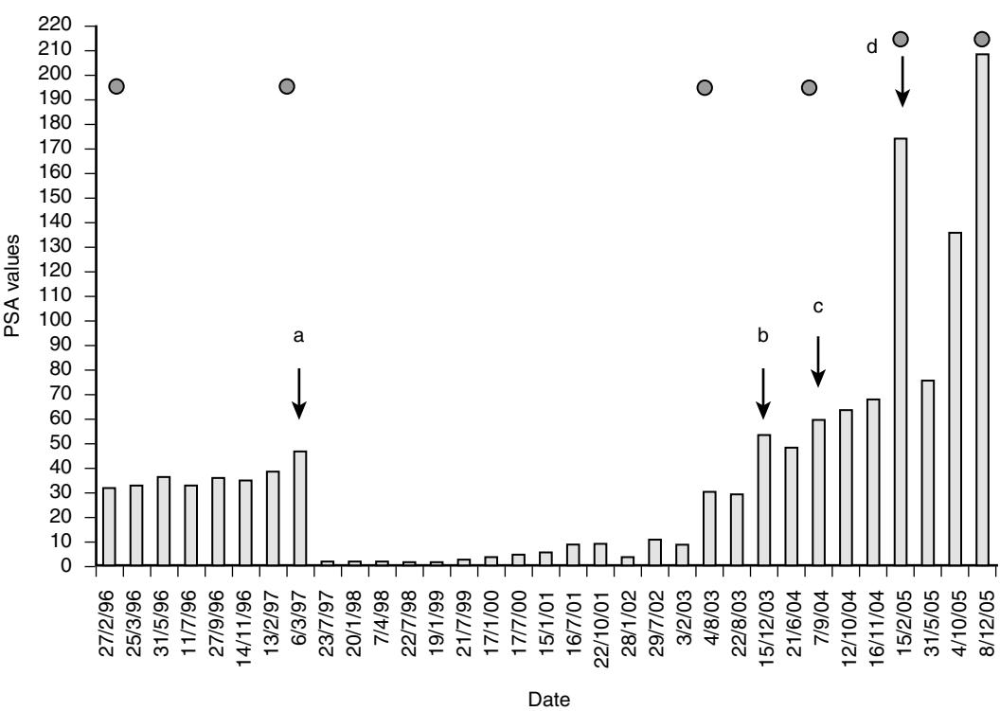

Figure 86-11. Sequential PSA records in man diagnosed with low-grade prostate cancer at age 82. See text for details.

## KEY POINTS The Prostate

- Anatomic knowledge of the sphincter apparatus assists understanding of continence mechanisms.
- Physicians offering prostate-specific antigen (PSA) tests to patients should fully understand the implications of an abnormal result.
- "Prostatic" symptoms may not be related to disease of the prostate gland.
- Elderly patients with localized prostate cancer have a wide range of therapeutic options.
- Elderly patients with metastatic prostate cancer should be treated,

for 12 months (d). Despite the final PSA rise and eventual development of bony metastases, chemotherapy was declined and the patient died on the palliative care pathway in 2006 aged 92.

Quality of life was excellent for the great majority of the patient's final years. It is to be regretted, as noted earlier, that a low-toxicity chemotherapy regime is not available to arrest disease before M1 conversion.

even if no symptoms are present. For a complete list of references, please visit online only at www.expertconsult.com