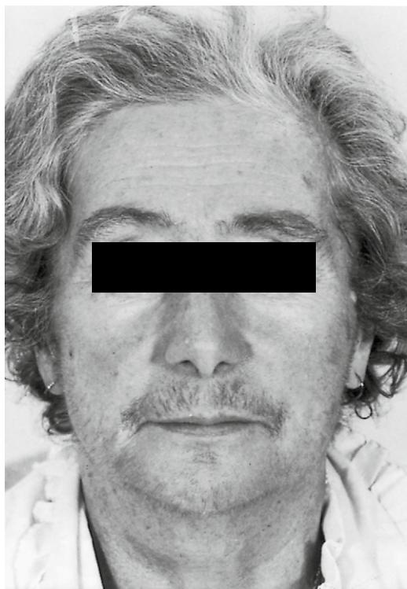
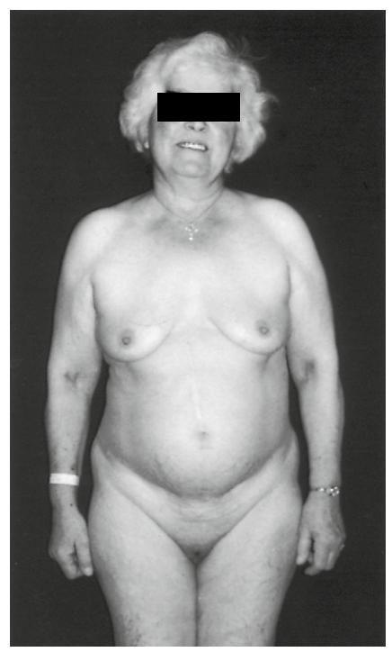
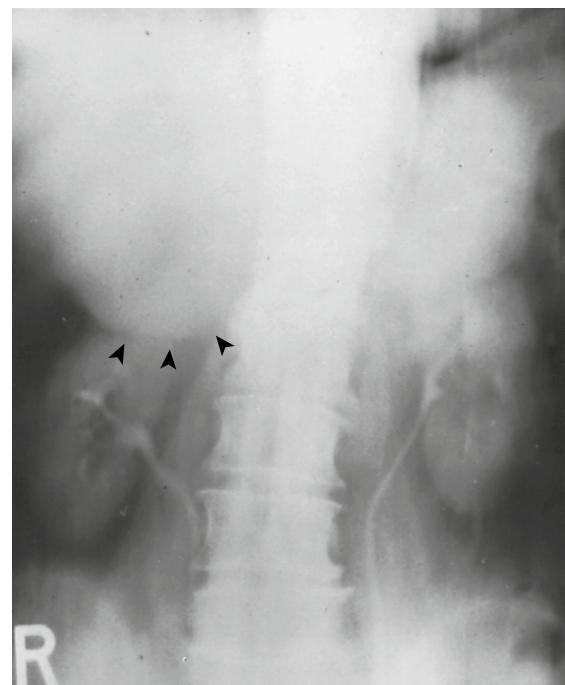

Adrenal and Pituitary Disorders

Paul E. Belchetz Peter Hammond

## **DISORDERS OF THE ADRENAL CORTEX**

The need for normal adrenal functioning continues into old age. After decades of speculation, there is now firm evidence that the patterns of basal and stimulated levels of cortisol secretion are substantially unchanged in the healthy aging population. Subtle age-related changes have been described related to the metabolism of adrenal hormones, and morphologic features such as nodules appear quite commonly in the aging adrenal glands. Their importance arises from much readier and often serendipitous recognition as advanced imaging techniques are more widely used. It is therefore relevant to open this chapter with a résumé of the physiologic and biochemical actions of adrenal steroids, mechanisms controlling their secretion, and techniques available for assessing the function and anatomy of the adrenal glands.

## **Physiologic responses to adrenocortical steroids**

Of the multitude of steroids found in the adrenal cortex, only the secretions of cortisol and aldosterone have undisputed and vital endocrine roles. The distinction between glucocorticoid and mineralocorticoid hormone actions is based on physiologic observations, backed by differential effects on critical enzyme systems in target tissues.

**Glucocorticoids.** Cortisol (hydrocortisone) is the natural glucocorticoid of humans and most other mammals (but not the rat, which is unable to synthesize cortisol and uses corticosterone instead). It has long been recognized that cortisol, especially in high doses, has mineralocorticoid properties and this has led to the widespread use of dexamethasone, a synthetic glucocorticoid, effectively without mineralocorticoid properties as the benchmark glucocorticoid.1

This practice has passed from laboratory experiments to clinical investigation, as will be discussed later. There are growing reasons to question the validity of such assumptions, although the pragmatic clinical tests have proven value. There has previously been a tendency to subdivide the actions of glucocorticoids into those seen at low doses and termed physiologic, and those seen with high doses, classically causing cushingoid side effects, as pharmacologic. There is no sound scientific basis for this differentiation as new effects are not seen with high doses, although the clinical sequelae are, of course, striking.

The term *glucocorticoid* derives from the effects on carbohydrate metabolism: antagonism of insulin action, promotion of hepatic glycogen synthesis, and participation in the defenses against hypoglycemia. It may affect resource use by virtue of tissue differences in response of the key glycolytic enzyme, phosphoenolpyruvate carboxykinase.2 Glucocorticoids have many other actions, often permissive in nature. These include vascular and renal responses affecting control of blood pressure and extracellular water content. Other critical roles include actions on protein and lipid synthesis and complex interactions with the immune system. In addition there is the well-recognized but poorly characterized function that enhanced glucocorticoid secretion plays in combating stress. The stimuli recognized as stressful and capable of evoking enhanced cortisol secretion are numerous, including: fever, trauma, hemorrhage, and plasma-volume depletion, hypoglycemia, and even psychological disturbance. A unifying hypothesis is thus hard to achieve; but with regard to inflammatory processes, it is now widely believed that the role of glucocorticoids is to curtail the effects of the rapidly responding cytokine and acute-phase protein production, which if protracted could be potentially damaging.3

**Mineralocorticoids.** The action of aldosterone is ostensibly simpler, operating primarily via renal mechanisms to control extracellular sodium and potassium levels with secondary consequences on fluid balance and blood pressure. The effects of mineralocorticoids on other tissues such as the colon, brain, and pituitary are documented, but their significance is much less certain. The secretion of aldosterone and its circadian rhythm are maintained in the elderly despite a decrease in tonic levels of renin, its principal regulator.4

**Adrenal androgens.** The adrenal cortex also synthesizes androgens. These include androstenedione and dehydroepiandrosterone; much of the latter is conjugated and secreted as the sulfate. The function of adrenal androgens remains obscure, although much has been made of the phenomenon in childhood of the so-called "adrenarche," when enhanced amounts are made from about the age of 7 years. By contrast with cortisol production, there is a well-documented fall in adrenal androgen production in old age, to as little as 5% of young adult levels, with decreased ACTH responsiveness, which has been termed the "adrenopause."5

Apart from effects on body hair, it is not at all clear what function the secretion of adrenal androgens serves in normal adults. It has been postulated that the decline in dehydroepiandrosterone levels is, in part, responsible for the increased atherogenesis and, hence, cardiovascular disease in old age, but recent evidence does not support this hypothesis.6 It appears more likely that dehydroepiandrosterone has an immunomodulatory, and possibly antioncogenic, action. Dehydroepiandrosterone replacement in an elderly person increases natural killer (NK) cell cytotoxicity and is claimed to dramatically improve the sense of physical and psychological well-being.7

#### **Biochemical actions of steroid hormones**

The effects of hormones on tissues depend on the distribution of specific receptors. Recent advances in knowledge have simultaneously clarified aspects of steroid hormone action and raised paradoxes that await definitive resolution. Steroids are lipophilic and readily enter cells: steroid receptors are intracellular. The classic model of steroid action is that steroid hormones bind to cytoplasmic receptors, forming activated complexes that are translocated to the nucleus where specific genes are activated, leading eventually to protein products as the end point of hormone influence.8 A similar pattern was proposed for the structurally dissimilar thyroid hormones. Molecular cloning techniques have not only revealed that all steroid hormone receptors show strong homologies to each other and the proto-oncogene c-*erb*-A, but that the latter actually appears to be a thyroid-hormone receptor. All these receptors share homologies, both in the hormone and the DNA-binding domains, and can be regarded as constituting a superfamily of genes, whose products are transcriptional regulatory proteins evolved from a common ancestor gene.9 The steroid-hormone receptor is bound to a protein complex containing the heat-shock proteins hsp 90, hsp 70, and hsp 65. Exposure to steroid hormone leads to dissociation of the receptor from the complex so that the receptor is able to bind the hormone.10 Along with the classic genomic mechanisms, the cortisol-glucocorticoid receptor complex can interact with other transcription factors such as nuclear factor-кB and also nongenomic pathways via membrane-associated receptors and second messengers.11

The new complex of hormone-plus receptor adopts a different molecular conformation, exposing the DNA-binding domain of the receptor. Thus far, the generalized scheme for steroid hormones applies to glucocorticoids. When it comes to identifying the molecular basis for mineralocorticoid and glucocorticoid actions, difficulties arise. The type-1 receptor—originally considered to bind mineralocorticoids with higher affinity than glucocorticoids—shows no such distinction with more modern techniques. Indeed there is a marked kinship shown at the molecular level as well.12,13 A possible explanation for the failure of the great molar excess of cortisol to swamp the type-1 receptor with regard to aldosterone binding has been suggested for tissues such as kidney, gut, and salivary glands. These tissues possess a potent 11-hydroxysteroid dehydrogenase enzyme system, which rapidly converts cortisol to cortisone, and cortisone does not bind measurably to the receptor.14

Acting through the genome, glucocorticoids enhance several key metabolic enzymes, such as hepatic tyrosine aminotransferase15 and tryptophan oxygenase.16 In addition to this classic mode of action, it has also been suggested that many of the actions of glucocorticoids on the immune system are mediated by a specific protein product termed *lipocortin* (now known as *annexin A1*), which acts as a second messenger.17 This has multiple sites of action especially, inhibiting polymorphonuclear leukocyte trafficking, reduction of pro-inflammatory cytokines and stimulation of antiinflammatory cytokines.

#### **Regulation of adrenal function**

**Regulation of glucocorticoid production.** Cortisol secretion is under the immediate control of pituitary ACTH secretion acting to promote the conversion of cholesterol to pregnenolone by the removal of the six-carbon fragment from the cholesterol side chain. These steps occur within the mitochondrion. A complex cascade of cytochrome-P450 variants has been implicated as steroidogenesis proceeds, shuttling from mitochondrion to endoplasmic reticulum and back. The chronic effects of ACTH affect many more steps in steroidogenesis than just cholesterol side-chain cleavage.18

Physiologic control of ACTH secretion involves three major areas: circadian rhythms, stress, and negative-feedback inhibition by cortisol. ACTH is synthesized as part of a large 31-kDa precursor polypeptide pro-opiomelanocortin.19 This is cleaved and the major fragments, including ACTH and β-endorphin, are usually cosecreted in equimolar proportions. The stimulus to ACTH release is from the hypothalamus by way of the hypothalamopituitary portal vessels conveying corticotrophin-releasing factors.20

These are a complex of polypeptides, the major constituent of which is a 41-residue moiety, corticotrophin-releasing hormone (CRH). However, this alone has less potent ACTHreleasing properties than crude hypothalamic extracts. It has been shown that vasopressin (AVP) and probably other, as yet unidentified, compounds act synergistically with CRH.21 The secretion of these corticotrophin-releasing factors appears to be pulsatile-driving pulses of ACTH and cortisol in turn. The circadian rhythm is composed of pulses of varying amplitudes and frequency, with a nadir reached at midnight, but the onset of activity at about 3 AM to 4 AM reaching a peak at 8 AM to 9 AM. The pulses of ACTH and cortisol decline in size and frequency thereafter, although there is often a secondary rise at about lunchtime, which seems to be related to food ingestion.22

As mentioned earlier, there is a formidable array of apparently unrelated stressors that can stimulate the release of ACTH and cortisol. There is preliminary evidence that the relative importance of CRH, AVP, and oxytocin varies according to the stimulus.23 Where inflammation is involved, there is growing evidence for interleukin-1, interleukin-6, and tumor necrosis factor (TNF) having the capacity to stimulate the hypothalamic-pituitary-adrenal axis, thus providing a loop to suppress their own production.24

Reports suggesting extrahypothalamic production of ACTH secretagogues lack confirmation of authenticity or physiologic significance.

Negative feedback of cortisol on ACTH production constitutes a sensitive homeostatic regulatory mechanism. The sites of negative feedback include not only the ACTHproducing cells of the anterior pituitary itself, but also higher centers including the hypothalamus and CA3 field of the hippocampus.25

**Regulation of aldosterone production.** Aldosterone is produced by the distinct outer part of the adrenal cortex, the zona glomerulosa. In humans this is found in cell clusters rather than in a distinct zone. The main regulation of aldosterone is by the renin-angiotensin system. The stimuli to renin release from the juxtaglomerular cells of the kidney are low-renal perfusion pressure, sodium depletion, and hypokalemia, although hyperkalemia acting directly on the zona glomerulosa is a more potent stimulus to aldosterone release than hypokalemia. Renin acts on renin substrate or angiotensinogen, released into the circulation from the liver, to form angiotensin-I. This decapeptide is converted to the octapeptide angiotensin-II by angiotensin-converting enzyme (ACE), which is of widespread distribution, but most importantly found in the pulmonary bed.26

Angiotensin-II, apart from being a powerful arteriolar vasoconstrictor, stimulates aldosterone secretion from the adrenal cortex. Aldosterone, as mentioned earlier, acts powerfully to retain salt (and obligatorily water), but promotes kaliuresis, hence closing the homeostatic feedback loop. There are other minor influences recognized as acting on aldosterone secretion, including ACTH, dopamine, and serotonin.

#### **Adrenocortical function in normal aging**

Numerous studies indicate that basal, circadian, and stimulated cortisol secretion remains intact well into old age.27–33 This is particularly important with regard to the ability to withstand stress, and the cortisol response to exogenous ACTH has been shown to be normal in elderly patients following myocardial infarction.34 There are well-documented changes in the metabolism of corticosteroids with age-related decrease in the catabolism of cortisol.35,36 Because of the intact negative feedback mechanisms there is a commensurate reduction in cortisol production rate. Aldosterone secretion is also normally well preserved in the healthy geriatric population.37 The recognized decline in adrenal androgen production30,38–41 has been referred to earlier.

#### **Tests of adrenal function**

Tests of adrenal function in elderly people are for the foregoing reasons largely those established for the younger adult population. The diminishing reliance on urinary collections is beneficial for practical reasons, and also means that some of the physiologically irrelevant changes alluded to earlier will not prove distracting. The key to successful and safe investigation is careful selection.

**Adrenal insufficiency.** To investigate possible adrenal insufficiency, the basal measurement of greatest value is the plasma cortisol, measured at the circadian peak at 8 AM to 9 AM. Measurement of midnight cortisol is uninformative. If the 9 AM cortisol is less than 150 nmol/L, the diagnosis of adrenal insufficiency is made, and if greater than 450 nmol/L, the patient is normal. For values in between, adrenal reserve should be assessed by measuring plasma cortisol before the intramuscular administration of 250 µg tetracosactrin (synthetic ACTH1–24) and then 30 minutes after. If secondary adrenal insufficiency is suspected, central mechanisms need assessing. Although the insulin-induced hypoglycemia test is still the gold standard for younger patients, and indeed, has been used successfully in the elderly,42 there are serious hazards attending its use. If the 9 AM plasma cortisol is not greater than 180 nmol/L, if there is a history of epilepsy, or if there is a significant risk of ischemic heart disease (surely present in all elderly patients), the test is contraindicated.

Alternative tests have been suggested, including several varieties of the metyrapone (Metopirone) test. This drug blocks the 11-hydroxylase enzyme, which is a crucial step in cortisol biosynthesis. If negative-feedback mechanisms are intact, metyrapone provokes enhanced ACTH secretion, which drives adrenal synthesis of 11-desoxycortisol. In the classic version, the adrenal response is measured by urinary 17-oxogenic steroid excretion,43,44 but altered production of urinary metabolites in old age plus the nonstandardized assays used for the measurements diminish the value of this approach. Other investigators have proposed measurement of the plasma 11-desoxycortisol response, but this, too, has not been fully validated, especially in the elderly age group.45–47 Finally, it has been proposed that the ACTH level should be directly monitored, and this has been evaluated in a geriatric population.48 The difficulties of ACTH measurements are many, standardization nonexistent, and the assay is costly and not widely available; thus as a practical test this version does not bear further consideration. Most importantly, it does not assess what one needs to know: the capacity to secrete cortisol adequately in the face of stress. It is popular in North America, but for reasons of tradition rather than sound science.

A test by which contrast has much to recommend is the glucagon stimulation test. In the most widely used version, 1 mg of glucagon is injected subcutaneously and blood samples then taken basally at 90 minutes and thereafter at 30-minute intervals up to 240 minutes. As with the insulin test, the patient fasts overnight. There is no correlation between the cortisol response (or growth hormone response, because it is a reliable test of reserve of this hormone) and blood glucose changes. The diagnostic power of the test closely approaches the insulin stress test.49 Glucagon is, however, safe to use even in the presence of heart disease and in epilepsy. The length of sampling period is dictated by the variable time taken to reach peak cortisol secretion—this adds inconvenience and expense. The use of intramuscular glucagon has been a simpler, more reliable version requiring samples only at 0, 150, and 180 minutes.50 It is a more reliable test than the short synacthen test when compared with the insulin tolerance test as the reference.51 As with the insulin tolerance test, a peak plasma cortisol of 550 nmol/L or higher is regarded as a satisfactory response to glucagon.

Another useful aid in distinguishing primary and secondary hypoadrenalism is the long ACTH-stimulation test using depot tetracosactrin 1 mg intramuscularly and sampling at 0, 30, and 60 minutes as with the short test, but taking further samples at 4, 8, 16, and 24 hours.52 The atrophied adrenals following ACTH deficiency can usually be stimulated, albeit subnormally, over this time span—in contrast to the flat response in Addison's disease.

**Glucocorticoid excess.** Adrenal hyperfunction usually means cortisol excess or Cushing's syndrome. Conventional methods of investigation are employed first to establish the presence of the syndrome. The 24-hour urine-free cortisol is a simple and reliable test.53,54 Its value derives from the fact that at normal levels of plasma, cortisol is much bound to a high-affinity cortisol-binding globulin (CBG). The free cortisol level (though thought to be the biologically active fraction) is generally small, and is readily excreted in the urine. Because the capacity of CBG is limited, and saturated with even minor degrees of cortisol hypersecretion, there tends to be a nonlinear and marked rise in urinary-free cortisol. The overnight dexamethasone suppression test is much used, but also much criticized for unacceptable error rates.55 If a patient is genuinely thought to have Cushing's syndrome, inpatient investigation is usually required. The low-dose dexamethasone test (0.5 mg orally taken strictly every 6 hours for 48 hours) and high-dose dexamethasone test (2 mg every 6 hours for 48 hours) were originally described in terms of suppression of urinary cortisol metabolites and proved useful in the differential diagnosis of pituitarydependent Cushing's syndrome from other causes of the syndrome, namely adrenal tumors (benign and carcinoma) and ectopic ACTH secretion from a wide variety of neoplasms.56 More commonly, the plasma cortisol response is relied upon these days.57 The basis of this test is that in Cushing's syndrome the pituitary lesion, most commonly a microadenoma only a few millimeters in diameter, is not truly autonomous, but shows blunted suppression of ACTH secretion, especially with high-dose dexamethasone. The plasma cortisol is an accurate index of ACTH secretion because its measurement is not affected by the concomitant presence of dexamethasone. (This useful property of dexamethasone can be used to assess adrenal reserve in seriously ill patients with suspected Addison's disease in whom glucocorticoid therapy may need to be given empirically, and the cortisol response to tetracosactrin assessed at the same time to establish diagnosis.) There is increasing use of synthetic CRH, either of ovine or human composition.58,59 Though many investigators find this a helpful and safe test, as with all tests used in Cushing's syndrome it is not infallible.60 Nevertheless, it is useful to know that there is a preservation of response in the healthy elderly population.33

In cases of adrenal carcinoma it is not unusual to have mixed patterns of steroid excess. Virilization in women is not uncommon, and plasma testosterone is raised. A striking rise in dehydroepiandrosterone sulfate is characteristic of adrenal carcinoma,61 and this large production of a weak androgen may greatly raise the urinary 17-oxosteroid excretion.62

**Mineralocorticoids.** The mineralocorticoid status can be monitored by measurement of plasma aldosterone and also plasma renin activity both lying and standing (if clinically possible). The latter measurement of renin requires prior consultation with the laboratory so that rapid handling can be arranged to prevent artefactual results. Primary hyperaldosteronism is very uncommon in the elderly population and is diagnosed by raised aldosterone and suppressed plasma renin activity in hypertensive patients who usually exhibit hypokalemic alkalosis. The much more frequent occurrence of secondary hyperaldosteronism is indicative of disease outside the adrenals, such as renal artery stenosis, cardiac failure, or hepatic cirrhosis leading to raised renin, driving the normal zona glomerulosa to secrete high levels of aldosterone.

Hyporeninemic hypoaldosteronism occurs predominantly in the elderly population and is characterized by hyperkalemia, a hyperchloremic metabolic acidosis, and moderate hyponatremia. It is more common in men, and is often associated with diabetes mellitus, particularly in the presence of autonomic failure or renal impairment. It is aggravated by potassium-sparing diuretics, β-blockers, and nonsteroidal anti-inflammatory drugs.63

**Imaging techniques in adrenal disease.** The adrenal glands are readily visualized using CT scanning, especially if the patient is at all obese. Ultrasound can be useful, but is much less valuable than CT.65 There is growing experience with magnetic resonance imaging (MRI), which may provide an indication of the likely functional status of any lesion. However, potential pitfalls arise with the exquisite sensitivity but nonspecificity of this and advanced CT scanning techniques.64

There remains a small role for isotopic scintigraphy in the diagnosis of adrenal hyperfunction, perhaps more for extraadrenal or bilateral pheochromocytomas using metaiodobenzylguanidine than the use of selenocholesterol or its variants in Cushing's and Conn's syndromes.66 Angiography is invasive, but much less so with the advent of digital venous imaging (DVI), which can be useful in adrenal disease. The pituitary may require imaging in Cushing's disease—often the tiny size of the tumor defies even the latest generation CT scanners,67 but it does seem that MRI with gadolinium enhancement offers a slight edge.68 In cases of hypopituitarism, CT scanning may be valuable.

As a final resort, venous sampling under radiographic control may be useful in the diagnosis of adrenal, pituitary, or ectopic sites of hormone production.69 This approach in the elderly patient should be undertaken only if, after the most careful consideration, a balance of cost-benefit factors points inescapably in this direction. In practice this will rarely be the case.

## **CLINICAL PATTERNS OF ADRENAL DISORDERS**

The patterns of adrenal disease do not differ greatly in the elderly population from those in younger adults. Because these are well-described in standard textbooks of clinical medicine and endocrinology, full descriptions will not be given here in all cases. Instead, emphasis will be placed on points particularly relevant to an elderly person.

# **Adrenal insufficiency**

Primary adrenal failure (Addison's disease) characteristically begins insidiously with nonspecific symptoms, although gastrointestinal features, including weight loss, are often prominent, and in the elderly person functional status may be diminished.70 Though the characteristic ACTH-mediated pigmentation is a useful feature if present, it is occasionally absent.71 A large survey suggested that in elderly patients Addison's disease was not only more likely to be tuberculous than in younger patients, but likely to prove fatal and the diagnosis be made at post mortem.72 Other rarer causes of adrenal failure, such as hemorrhage and amyloid, should be borne in mind.73

Though metastases are commonly found in the adrenal glands, they only exceptionally compromise cortisol secretion.74 The therapeutic dividend from diagnosing Addison's disease is so great that the cortisol response to tetracosactrin should be assessed at the slightest suspicion. It is emphatically not necessary for the electrolytes to be disturbed or random cortisol to be "subnormal" for the significant adrenal insufficiency to be present. Secondary adrenal insufficiency is considered later.

## **Cushing's syndrome and adrenal carcinomas**

Cushing's syndrome is rare in elderly people. It is most frequently due to ectopic ACTH production, usually by smallcell carcinoma of the lung, but these patients typically have cachexia and profound hypokalemia, rather than the characteristic cushingoid appearance. If due to pituitary-dependent disease, transsphenoidal surgery may be considered because it causes little constitutional disturbance. Nevertheless, in mild cases medical treatment with metyrapone alone may suffice and be more appropriate. This mode of treatment is certainly appropriate with other forms of Cushing's syndrome, such as ectopic ACTH secretion. The mixed picture of Cushing's syndrome and virilization in adrenal carcinoma may be difficult to recognize: the hirsuties and thinning of capital hair may be much more prominent than the features of cortisol excess (Figure 89-1). Indeed, the main features of Cushing's syndrome may be skin atrophy and fragility with spontaneous bruising. Obesity and plethora may be conspicuously absent. In the elderly person certain features are more marked, particularly impaired cognitive function, myopathy, osteoporosis, and diabetes. Hypokalemia is common in all forms of Cushing's syndrome other than pituitary-dependent, although a patient with the nodular hyperplasia variety of Cushing's disease was diagnosed following an admission precipitated by an acute diarrheal illness in which the plasma potassium fell to 1.2 mmol/L. Subclinical Cushing's syndrome is increasingly being

Figure 89-1. Patient with a metastasizing adrenal carcinoma causing virilization and Cushing's syndrome. Note hirsuties, slight scalp recession, but absence of cushingoid facies.

recognized in cases of adrenal incidentaloma (see later discussion) and is associated with increased cardiovascular risk.75,76

Adrenal carcinomas may occasionally secrete estrogen. This was retrospectively recognized in a youthful looking elderly woman with Cushing's syndrome (Figure 89-2) following removal of her large adrenal tumor (Figure 89-3) when she had a brisk vaginal blood loss. Rescue of preoperative urine specimens revealed high estrogen levels. Treatment is primarily surgical unless there are widespread metastases. The use of opDDD is probably helpful, but may be associated with severe side effects, in which case it should not be persevered with.77

### **Iatrogenic glucocorticoid excess**

The most common cause of Cushing's syndrome in an elderly person is the exogenous administration of steroids for a variety of medical disorders. The side effects of steroid therapy, often aggravating preexisting problems, are usually more marked in the elderly group. Particular problems include decreased cognitive function, emotional lability, and dysphoria; osteoporotic fractures; myopathy and muscle wasting with limitation of mobility; skin fragility; and impaired glucose tolerance. Furthermore, patients on maintenance steroids (>10 mg prednisolone daily or equivalent for more than 2 weeks) are at risk of adrenal insufficiency in the event of intercurrent illness, and the daily steroid dose should be doubled for at least 3 days in these circumstances.

### **Incidentalomas**

Last, but very far from least, is the vexed problem of what to do with a patient who for usually quite unrelated reasons has an abdominal ultrasound or CT scan that reveals an

Figure 89-2. Patient with adrenal carcinoma causing Cushing's syndrome and feminization.

Figure 89-3. Intravenous pyelogram, showing large right-sided adrenal mass depressing the right kidney.

unsuspected adrenal mass.78,79 Because about 20% of adrenocortical carcinomas are nonfunctioning in the absence of any clinical endocrine syndrome, it is probably prudent to repeat the scans at intervals, particularly for lesions greater than 3 cm diameter, since lesions progressing to greater than 6 cm diameter are almost always malignant. However, the problem must be kept in proportion. Adrenal cancer is rare, with an annual incidence approximately two per million.80 Autopsy studies show that benign nodules are extremely common, especially with advancing age, and particularly in hypertensives.81 Most are microscopic, but lesions of greater than 1 cm are found in approximately 1% of patients undergoing abdominal CT.82 Clearly, there is a need for biochemical screening to exclude pheochromocytoma, Conn's, and also Cushing's syndrome. Hypertension and hypokalemia are particularly good indicators of functioning lesions. It has been estimated that the frequency of these conditions in 100,000 patients with an adrenal incidentaloma would be 6500 pheochromocytomas, 7000 Conn's syndrome, and only 35 Cushing's syndrome. However, subclinical cortisol hypersecretion has been reported in up to 25% of patients with adrenal tumors incidentally discovered on CT in a number of studies.83,84 Cumulative worldwide experience indicates that most adrenal incidentalomas are benign, but a significant number are malignant, especially large lesions, and in patients with a history of malignancy.85,86 Late diagnosis of genetic disorders can occur in the elderly including pheochromocytoma in the proband of a family with MEN2a, a woman aged 73;87 and an 88-year-old woman with congenital adrenal hyperplasia, due to 21-hydroxylase deficiency, presenting with adrenal insufficiency.88

# **PITUITARY DISORDERS Pituitary tumors**

Pituitary tumors are increasingly uncommon in the elderly population, with the exception of nonfunctioning (null-cell) adenomas, which increase in incidence over the age of 50. These tumors have local complications—usually due to compression of the optic chiasm causing bitemporal hemianopia, or more rarely due to invasion into surrounding structures, such as the cavernous sinus—or features of hypopituitarism (see later discussion). Functioning pituitary tumors are associated with the characteristic syndromes of hormone excess, notably, acromegaly and Cushing's disease, and behave in a similar fashion to tumors in younger patients, although it has been suggested that the somatotroph adenomas causing acromegaly are more benign in the elderly person, and thus medical therapy could be considered as a first-line option.89 However, advances in neurosurgical techniques mean that almost all tumors can be at least debulked by the transsphenoidal approach; the relative simplicity and low morbidity and mortality of this procedure make it the treatment of choice for even the very elderly patient, especially one having visual field defects.90–95

Other sellar lesions are very rare, although two occur more commonly in the elderly. Pituitary metastases may present like nonfunctioning tumors. Pituitary incidentalomas-adenomas, usually less than 1 cm in diameter, without clinical sequelae, may be identified on a CT or MRI scan performed for other indications in the same way as adrenal incidentalomas and have a prevalence of up to 10% in the over-80 age group, but intervention is not required in such cases.

## **Hypopituitarism**

Hypopituitarism may be caused by pituitary adenoma as in younger age groups. A valuable clue in postmenopausal women is finding inappropriately low gonadotrophin levels, although it has been reported that these can be depressed in nonspecific illness in the extremely elderly.48 More important, because subtler and more difficult to diagnose, is idiopathic hypopituitarism, in which the pituitary fossa is normal in size. Key features may be orthostatic hypotension, hyponatremia (reflecting adrenal and thyroid insufficiency causing water overload, possibly from inappropriate ADH secretion), or hypothyroidism with inappropriately low TSH.96–99 Computed tomography scanning may indicate a number of abnormalities ranging from a thickened pituitary stalk to empty sella.97 Replacement therapy with hydrocortisone and thyroxine is gratifyingly effective. As with patients on steroid therapy, those patients needing replacement hydrocortisone should be advised to double the dose of hydrocortisone for 3 days with intercurrent illnesses, and they need parenteral steroids if they cannot tolerate oral medication while unwell.

**Growth hormone deficiency.** Growth hormone secretion declines by about 15% per decade from a peak at about 30 years of age,100 and stimulated growth hormone secretion, using both pharmacologic agents and physiologic stimuli, such as exercise, is diminished in elderly people. This fall in growth hormone secretion is due to a decline in the frequency101 and amplitude102 of growth hormone pulses, probably the result of an increase in somatostatinergic tone. Furthermore, there is a decrease in circulating levels of insulin-like growth factor-I (IGF-I), the peripheral mediator of the somatic effects of growth hormone—although, in contrast to young adults, the IGF-I levels do not show as strong a correlation with 24-hour growth hormone secretion.

Some of the features of aging are similar to the characteristics of adult growth hormone deficiency, such as the decrease in lean body mass and bone mineral density, the increase in fat mass,103 and possibly, neuropsychological sequelae and increased cardiovascular mortality.104 The availability of recombinant growth hormone has made the treatment of adult growth hormone deficiency possible, and recently there has been interest in its effects on the healthy elderly individual. In those with low IGF-I levels, administration of growth hormone increases lean body mass, skin thickness, lumbar spine bone density, and nitrogen retention, and decreases adipose tissue. No effect was seen on bone density at other sites or on serum cholesterol, and nonsignificant increases in blood pressure and fasting glucose have been reported. Side effects of fluid retention, in some cases causing bloating or carpal tunnel syndrome, arthralgia, headaches, lethargy, and gynecomastia may occur.105

# KEY POINTS

#### Adrenal and Pituitary Disorders

- Adrenal cortex produces cortisol, aldosterone, and adrenal androgens.
- Steroids act by genomic and membrane-mediated effects plus intracellular conversions.
- Clinical consequences of disordered steroid production/exposure
- Incidentally diagnosed adrenal nodules in old age
- Age-related decline in adrenal androgen and growth hormone secretion
- Diagnosis and management of pituitary disease in the elderly

At present, the only group for whom growth hormone therapy can be recommended are those with pituitary disease, requiring at least one form of pituitary hormone replacement therapy, in whom growth hormone deficiency has been demonstrated using a pharmacologic stimulation test and who have symptoms of growth hormone deficiency. Elderly patients with hypothalamic-pituitary disease and growth deficiency are distinguishable from elderly controls with respect to lipid profiles, body composition, and quality of life.106 They respond as positively to growth hormone replacement as do younger patients.107–110

**Isolated ACTH deficiency.** Less frequent is the development of isolated ACTH deficiency. This has been seen in an octogenarian who developed frequent hypoglycemic comas associated with raised insulin levels. The clue that this was not due to an insulinoma came from the equimolar secretion of insulin and C-peptide. Replacement therapy with hydrocortisone completely abolished the hypoglycemic episodes.111

For a complete list of references, please visit online only at www.expertconsult.com