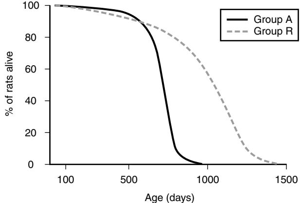
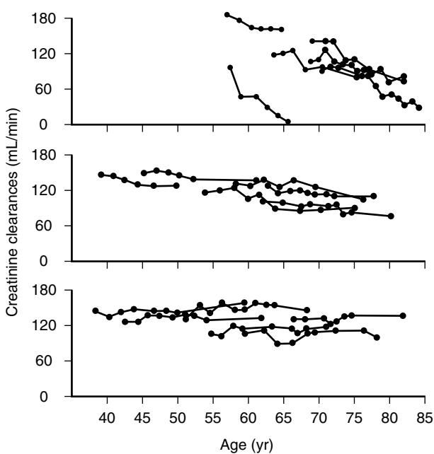
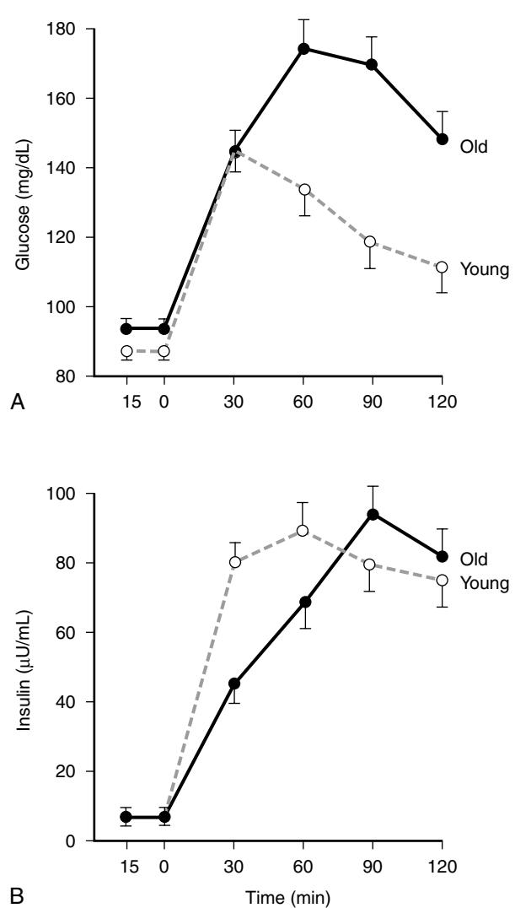

When broadly defined, aging refers to all time-associated events that occur during the life span of an organism. During this time, many changes occur in the physiologic processes. These changes may be beneficial, neutral, or deteriorative. During the developmental period of life, most changes are due to the maturation of the physiologic processes and tend to be beneficial. However, during the postmaturational period of life, most changes are detrimental, although some may be neutral, such as the graying of the hair. Indeed, the term "senescence" is used to specifically denote this postmaturational deterioration. Senescence is defined as the deteriorative changes with time during postmaturational life that underlie an increasing vulnerability to challenges, thereby decreasing the ability of the organism to survive. Although senescence is a subset of aging, in common usage, aging is often used to only mean senescence. Unfortunately, this specialized meaning is usually not explicitly stated. In this chapter, aging and senescence will be used as synonyms, a usage particularly appropriate in a textbook of geriatric medicine.

This brief chapter can cover only concepts and provide a limited number of examples. Section 11 of the *Handbook of Physiology* series published by the American Physiological Society is dedicated to the physiology of aging.1 That volume provides in-depth coverage of most age changes in the physiologic systems and should be consulted by readers who desire further information in a particular subject area.

## **PHYSIOLOGIC DETERIORATION AND THE AGING PHENOTYPE**

A major characteristic of the aging phenotype is the deterioration of the physiologic processes exemplified by comparing elderly people with young adults. Indeed, physiologic deterioration plays an important role in the age-associated increase in the age-specific mortality rate. Thus, knowledge of the age changes in the physiologic systems is invaluable for both the geriatric physician tending elderly patients and the biologic gerontologist in the quest for an understanding of the biologic nature of aging.

# **Causes of age-associated physiologic deterioration**

The progressive deterioration with age of the physiologic systems that starts during young adulthood is caused by the many damaging processes and agents that organisms encounter during life. Apparently, repair systems during postmaturational life are not able to fully eliminate the damage. The result is a progressive functional inadequacy of the physiologic systems due to the accumulation of damage. The extent of this functional inadequacy and its rate of occurrence vary among species and among individuals within a species, and among the physiologic systems of an individual. It is convenient to classify the damaging processes responsible for the age-associated physiologic deterioration in the following three categories: (1) damage resulting from intrinsic living processes, (2) damage caused by extrinsic factors, and (3) damage resulting from age-associated diseases.

## **DAMAGE RESULTING FROM INTRINSIC LIVING PROCESSES**

Many of the processes essential to life also have damaging aspects. For example, aerobic metabolism, which enables organisms to readily generate metabolic energy from ingested nutrients, has the negative aspect of the generation of highly reactive compounds, such as superoxide radicals, hydroxyl radicals, and hydrogen peroxide because of the univalent reduction of oxygen. These oxygen-containing compounds are potentially highly damaging. Protection from, and repair of, damage due to these substances has evolved, but is not totally effective. Therefore, an accumulation of oxidative damage with increasing age occurs.2 The extent of protection and the ability to repair damage varies among species. Thus, it is not surprising that there is interspecies variation in the rate of accumulation of oxidatively damaged macromolecules. Another example involves glucose, a most important fuel for most organisms. However, in addition to serving as an energy source, glucose also participates in the glycation and glycoxidation of proteins and nucleic acids and, in this way, alters their biologic functions.3 Again, there are protective mechanisms and processes that eliminate the damaged macromolecules, which vary in efficacy among species. Probably there is no intrinsic living process that does not also have the ability to cause damage.

# **DAMAGE CAUSED BY EXTRINSIC FACTORS**

There is general agreement that extrinsic factors contribute to the aging phenotype. Despite this, many do not subscribe to the view that these extrinsic factors are part of the aging process. This view is based on long-held criteria for aging processes enumerated by Strehler4 in 1977. One of the criteria is "intrinsicality," the view that aging is entirely an intrinsic phenomenon. Busse5 recognized the conceptual difficulty that this criterion caused and tried to resolve the problem by proposing the concept of primary and secondary aging. Primary aging was defined as universal changes occurring with age within a species or population, changes not caused by environment. Secondary aging was defined as changes as a result of the interactions of primary aging with disease processes and environmental factors. This concept may be faulty for two reasons. First, if aging results from progressive accumulation of unrepaired damage, it is irrelevant whether that damage originates from intrinsic processes or is caused by extrinsic agents. Second, extrinsic agents cause damage only because of interactions with biologic structures and processes. For example, it has been shown that the effect of genes on the life span and aging of *Drosophila melanogaster* is dependent on environmental interactions.6

In a sense, all damage is intrinsic whether it originates as a result of basic living processes or from reactions to extrinsic factors. However, this view downplays the importance of environmental factors that are not desirable because such factors can be modified and thus should be the focus of research on aging interventions.

Indeed, the notable effect that environmental factors can have on the aging process is particularly well illustrated by the

Figure 9-1. Survival curves for ad libitum–fed male F344 rats (group A, n = 115) and rats restricted to 60% of the mean ad libitum intake (group R, n = 115). *(Reprinted with permission Yu BP, Masoro EJ, Murata I, et al. Life span study of SPF Fischer 334 male rats fed ad libitum or restricted diets: longevity, growth, lean body mass and disease. J Gerontol 1982;37:130–141, Fig 6.)*

effects of long-term restriction of food intake by laboratory mice and rats.7 Restricting the food intake by 30% to 50% of that eaten by ad libitum–fed animals markedly increases longevity (see Figure 9-1 for its typical effect on population survival characteristics8), prevents or delays age-associated disease, and maintains a broad array of physiologic processes in a youthful state until very advanced ages. Examples of the scope of these beneficial effects include: immune function,9 cardiac function,10 female reproductive function,11 and gene expression.12 Indeed, reduction of food intake retards most, but not all, age-associated changes in physiologic processes of rats and mice that have been studied. It has been established that the reduction in energy (calorie) intake is the dietary factor responsible for this retardation of age changes in the physiologic systems.7 Thus, this phenomenon is often referred to as caloric restriction (CR). Although there is no evidence that CR during the adult life of humans would globally retard age-associated physiologic deterioration, it has been shown to influence the physiologic systems of nonhuman primates in a fashion similar to its effects on mice and rats.13 Moreover, there is evidence that CR influences the occurrence and progression of age-associated human disease processes,14 such as atherosclerosis,15 hypertension,15 and insulin resistance and impaired glucose tolerance.16

The lifestyle factor that has received the most attention relates to the fact that with increasing age many people become increasingly sedentary.17 Studies on the effect of exercise training in old human subjects indicate that some of the decline in physiologic function with advancing age in sedentary people is due to the effects of exercise deficiency and probably can, at least in part, be reversed by physical activity even at advanced ages.18 Skeletal muscle mass and strength decrease with increasing age,19 and both the mass and the strength can be increased by resistance training even at very advanced ages.20 It is likely that the frequently occurring increase in body weight in people between the ages of 20 and 70 years is primarily the result of a sedentary lifestyle.21 Exercise has also been found to attenuate the age-associated increase in body fat content.22 Most importantly, exercise improves the distribution pattern of body fat in elderly men and women.23 There is also evidence that exercise increases insulin sensitivity and thereby alleviates insulin resistance and impaired glucose tolerance that commonly occur with advancing age.24 There is little doubt that the increasingly sedentary lifestyle with advancing age contributes greatly to the deterioration of physiologic functions observed in old people.

There is no clear demarcation between lifestyle factors and personal habits. For example, exposure to the sun results in changes in skin structure and function,25 referred to as photoaging by dermatologists and commonly viewed as a marker of aging by laypersons. Excessive sun exposure may be an inevitable consequence of the occupation of a person or of the climatic conditions of the geographic region in which the individual resides. If so, the effect of excessive skin sun exposure probably should be in the lifestyle category. However, recreational choice leading to excessive skin sun exposure such as sunbathing can be viewed either as lifestyle or as personal habit. A personal habit that has received much attention in regard to aging is cigarette smoking. It is established that aging of the skin is promoted by smoking.26 Also, age-associated diseases that cause notable physiologic deterioration are promoted by smoking. Examples are chronic obstructive lung disease27 and atherosclerosis.28

Psychosocial factors such as engaging in social activities have been shown to significantly lower the age-specific mortality rate of people in the retirement age range.29 Since this type of engagement has also been found to enhance the execution of activities of daily living (ADL), it is likely that it retards or reverses age-associated deterioration of the physiologic system. Indeed, there is clear evidence that social support retards age-associated decline in cognitive function.30 Although these psychosocial findings are intriguing, remarkably little is known regarding the underlying biologic mechanisms. Indeed, our understanding of this intriguing subject has progressed little since the last edition of this book.

#### **DAMAGE RESULTING FROM AGE-ASSOCIATED DISEASES**

Age-associated diseases are generally viewed as the cause of much of the physiologic deterioration that occurs with advancing age.31 These diseases usually cause morbidity and mortality at advanced ages and are chronic or when acute are the result of long-term processes, such as bone loss or atherogenesis. It is also recognized that the occurrence and progression of age-associated diseases are strongly influenced by age-associated physiologic deterioration. However, there is disagreement regarding two fundamental questions. Are age-associated diseases an integral part of the aging process? Is there a fundamental difference between the aging of physiologic processes and the progression of what are called pathophysiologic processes?

In addressing these questions, the concept of "normal aging" has emerged31 and is widely used by those conducting physiologic studies on aging humans. It is defined as senescence in the absence of disease; probably more appropriately, it should be called "atypical aging" rather than "normal aging." Most elderly people have one or more age-associated diseases. Moreover, Scully32 points out that any definition of disease is problematic because what is called a disease is influenced by medical advances and societal culture. For example, Lakatta and Levy33 view hypertension as a disease and point out that a systolic blood pressure of 140 to 160 mmHg is now considered to be hypertension, whereas in 1990 it was considered to be in the normal range. Indeed, it is to be expected that the fraction of the elderly free of ageassociated disease will become vanishingly small as advances in medicine increasingly uncover occult disease. Moreover, to study what many investigators call "normal aging," great effort is made to exclude from the population to be studied subjects with age-associated disease. Although such studies are invaluable by providing a reductionist approach to the study of aging, a powerful tool in dissecting the details of the aging processes, they provide little assessment of what is occurring as the general population ages.

Furthermore, the view that normal aging does not involve the occurrence of age-associated disease is not conceptually sound in terms of basic biology. Evolutionary biologists propose that aging (senescence) occurs because of the decline in the force of natural selection with advancing age.34 Thus, biologic processes that result in detrimental effects expressed late in life cannot be selected against. It is for this reason that physiologic deterioration increases with increasing age, and it is for the same reason that age-associated disease increasingly expresses with advancing age. It is true that some people (a very small subset) may age without evidence of discernible age-associated disease, but this may relate more to the fact that the distinction between age-associated disease and age-associated physiologic deterioration is arbitrary. For example, loss of bone mass is a well-recognized age-associated physiologic deterioration and osteoporosis is a major age-associated disease; the boundary in this case of when to label a physiologic change as a disease is arbitrary.

For all of the above reasons, in this chapter, deterioration of physiologic systems secondary to age-associated disease will be considered to be an integral part of aging. Of course, it is always important to know the specific reason for the altered physiology, and when age-associated disease is the major immediate cause, it should be identified.

## **INTERSPECIES AND INTRASPECIES VARIATION IN AGE-ASSOCIATED PHYSIOLOGIC DETERIORATION**

In general terms, mammalian species are remarkably similar in that a progressive, but usually not linear, deterioration in the physiologic systems occurs with advancing postmaturational age.35 However, there is considerable interspecies variation in the details of these physiologic changes.

There is also great intraspecies heterogeneity in age changes in the physiologic systems, a phenomenon that has been well characterized in humans. Rowe and Kahn36 have developed the concept of "usual aging" and "successful aging" for considering the differences among individuals in age changes in physiologic functions. "Usual aging" refers to elderly who are functioning well but are at risk for disease, disability, and premature death. They may exhibit modest increases in systolic blood pressure and abdominal fat, and deterioration of one or more physiologic systems. "Successful" aging refers to a small group of disease-free elderly people who exhibit the following characteristics:

- Low risk of disease or disability
- High level of mental and physiologic function
- Active engagement in life

Rowe and Kahn focus on environment and lifestyle as the major determinants for achieving "successful aging" and point to adequate physical exercise, good diet, good personal habits (not smoking or abusing drugs and using alcohol in moderation), and good psychosocial environment as being particularly important. Surprisingly, they barely mention the role of genetics in achieving "successful aging."

Although the concept of "successful aging" is provocative, there are questions regarding its value and usefulness. One question is how common is "successful aging" now or is it likely to become if most people were to live in a good environment and adhere to an appropriate lifestyle. As of now, only a small fraction of those in the eighth decade of life would meet the criterion of being free of chronic disease (i.e., almost all suffer from one or more of the following diseases: osteoarthritis, coronary heart disease, cerebrovascular disease, congestive heart failure, dementia, type II diabetes, Parkinson's disease, cancer, benign prostate hyperplasia, and cataracts).31 And this does not fully cover the list of such diseases.

A related question is what fraction of those who meet the criteria of "successful aging" in the eighth decade of life will continue to when in the ninth and tenth decades of life or when they are centenarians. If most of them undergo notable physiologic deterioration before death, what does the concept of "successful aging" provide in addition to the well-known fact that individuals age at different rates? The concept of biologic age as distinct from chronologic age was proposed long ago.37 Thus the question arises as to whether the concept of "successful aging" is useful or misleading. It is likely that most centenarians were in the "successful aging" category when in the eighth decade of their lives. However, they exhibit notable physiologic deterioration, which must have occurred progressively during the ninth and tenth decades of life culminating after becoming centenarians.31 It seems more appropriate to say that these centenarians undergo a slow rate of aging rather than "successful aging." This is not merely an academic issue but also one with societal implications because "successful aging" implies that physiologic deterioration due to aging can be prevented rather than merely delayed. Such a view may misguide public policy based on the view that an appropriate lifestyle and environment will enable people to reach very old age without the disabilities that are so costly in the use of societal resources. Unfortunately, it is possible that the environment and lifestyle advocated for "successful aging" may have just the opposite effect. Indeed, centenarians have greatly increased in numbers during the twentieth century38 and may become commonplace during the twenty-first century. Furthermore, since the environment and lifestyle advocated for the achievement of "successful aging" is likely to increase the number of centenarians, it may result in an increase in the fraction of the population that consume societal resources because of notable physiologic deterioration.

## **AGE CHANGES IN THE PHYSIOLOGY OF SPECIFIC ORGANS AND ORGAN SYSTEMS**

All organs and organ systems exhibit age-associated physiologic deterioration, if not in all individuals, at least in a significant fraction of the population. This subject area is so vast that it cannot begin to be covered in this brief chapter. The volume on aging1 of the *Handbook of Physiology* series of the American Physiological Society provides a systematic and extensive coverage for those needing in-depth information about a particular organ or organ system. Also many other chapters in this textbook provide a substantial discussion of age changes in the physiology of specific organs and organ systems relevant to the subject matter of the chapter. In this chapter a few specific examples have been selected for discussion solely for the purpose of illustrating general concepts.

Before starting this discussion, it is important to point out that most of the studies on age changes in the physiology of organs and organ systems have used the cross-sectional study design. The interpretation of cross-sectional studies is often confounded by factors not related to aging.39 What are called "cohort effects" is a major confounder.40 For example, during the twentieth century, the number of years of education progressively increased in the developed nations.41 Therefore, when comparing cognitive abilities of 30-year-olds and 80-year-olds in a cross-sectional study, the difference in educational levels confounds any conclusions about the effects of aging. What is referred to as "selective mortality" is the other major type of confounder of cross-sectional studies.42 The older the age group being studied, the smaller is the fraction of its birth cohort still alive. Members of the birth cohort with risk factors for fatal diseases tend to die at younger ages than others in the birth cohort. Thus, for example, a difference in the blood level of HDL-cholesterol between those in the age range of 80 to 90 years compared with those in the age range of 50 to 60 years may relate more to "selective mortality" than to aging.

Aging broadly affects the cardiovascular system, ranging from structural and functional alterations of the heart and vasculature to changes in the neural reflexes regulating cardiovascular functioning.43 Left ventricular hypertrophy commonly occurs with advancing age and its extent varies among individuals.44 Notable left ventricular hypertrophy is associated with heart failure, coronary heart disease, and stroke. Left ventricular compliance commonly decreases with advancing human age and may be a contributor to heart failure.45 The ability to increase heart rate in response to exercise-induced peak oxygen consumption declines with increasing human age.46 Also, there is a decrease with advancing age in the ability of β-adrenergic agonists to increase heart rate.33 There is an age-associated decrease in left ventricular contractility during maximal exercise and this is also a manifestation of reduced β-adrenergic responsiveness.47 With increasing age, the large arteries dilate, stiffen, and the intima thickens.48 Systolic blood pressure and pulse pressure commonly increase with increasing age, a phenomenon primarily due to ageassociated arterial structural changes.49 The extent of the increase in pulse pressure is a strong predictor of risk of cardiovascular disease.

Many of these age-associated changes in cardiovascular physiology may underlie the occurrence of cardiovascular disease, while cardiovascular disease may play an important role in many of the age changes in cardiovascular function. Moreover, lifestyle and other environmental factors undoubtedly are major players in the physiologic deterioration of the cardiovascular system and in the progression of cardiovascular disease. Of course, some of the deterioration may be due to intrinsic aging processes and thus inevitable. However, it is difficult to identify such processes with certainty because one cannot be sure that they do not arise from yet-to-be-recognized extrinsic factor or disease. Moreover, it is important to emphasize that those age changes in cardiac function that are secondary to lifestyle and other environmental factors are not inevitable and may be modifiable even at advanced ages, at least to some extent. Lakatta50 points out that the cardiovascular age-changes are being studied at the molecular level in rodent and nonhuman primate models and that the findings of these studies hold promise for developing interventions for even the intrinsic aging processes underlying cardiovascular disease.

Cross-sectional studies of apparently healthy human populations report a decrease in kidney function after age 40, with the glomerular filtration rate decreasing about 1% per year of age increase.61 However, a longitudinal study52 conducted on subjects of the Baltimore Longitudinal Study of Aging has revealed that not all people exhibit an age-associated decline in glomerular filtration rate (Figure 9-2). The mean decrease in creatinine clearance in 446 male subjects followed over a 23-year period was 0.87 mL per minute per year. However, one third of the subjects showed no decline in creatinine clearance. Others in this study exhibited a small but statistically significant decline and still others had a notable decline in creatinine clearance. It is interesting to note that the mean decline in creatinine

Figure 9-2. Age changes in creatinine clearance of male subjects studied serially in the Baltimore Longitudinal Study of Aging. The top panel presents the findings of six subjects from the group who exhibited notable decreases in creatinine clearance with increasing age; the middle panel presents the findings of six subjects from the group who exhibited a small but significant decrease in creatinine clearance with increasing age; the bottom panel presents the findings of six subjects from the group who exhibited no decrease in creatinine clearance with increasing age. *(From Lindeman et al* 52 *with permission of Blackwell Science Inc.)*

clearance of the subjects in this study group was similar to what has been observed in many cross-sectional studies. The reasons for the differences among people in changes with age in kidney function have not been established. Lindeman51 has suggested that the decline in renal function noted in cross-sectional studies may be due to the fact that many in the populations studied suffered from undetected pathologic processes and that a decrease in glomerular filtration rate is not an inevitable involutional process. Indeed, it has been shown that elevated blood pressure accelerates the age-associated decline in renal function.53 It is also possible that lifetime dietary preferences play a role since excessive dietary protein is believed to promote renal functional deterioration. Indeed, if the deterioration of renal function with age is primarily due to disease and/or environmental factors, then it is potentially modifiable by public health measures.

The appearance of the skin is widely used as an indicator of the age of a person. The skin, indeed, undergoes many structural and functional age-associated changes.54 The skin wrinkles, loses elasticity and is increasingly more fragile. The barrier function of the skin is compromised, as is its immune function. The loss of sebaceous glands leads to dry skin and the loss of melanocytes causes alterations in pigmentation. There is a decrease in subcutaneous fat, which adversely affects the ability to cope with cold environments. However, the magnitude of most of these changes does not result from intrinsic aging processes but is the result of cumulative sun damage since their extent is much reduced in skin areas protected from the sun.25 Cigarette smoking is the other major factor that promotes skin aging.26 Indeed, sun exposure and cigarette smoking appear to act synergistically to promote skin aging.26 Thus, commonly used skin markers of aging have little relation to intrinsic processes but primarily relate to environmental factors and can be readily modified by altering lifestyle.

These three examples make clear that many age changes are not primarily because of intrinsic aging processes but, to varying degrees, are secondary to (or are at least promoted by) age-associated disease or extrinsic factors or both. To view them as not being part of the aging process removes from consideration major problems that confront aging individuals nor is there any biologic basis for such a view. It is true that deterioration due to disease or extrinsic factors may be preventable and, in some cases, reversible, but that hardly lessens their involvement in aging. Indeed, much of what we currently consider to be intrinsic may ultimately be found to be of extrinsic origin or at least influenced by extrinsic factors. And what is considered to be extrinsic has its actions by interacting with intrinsic processes. Indeed, what is considered to be lifestyle may have a strong intrinsic basis (e.g., the sedentary lifestyle adopted by many people as they age also occurs in laboratory rats,55 which in the case of the rodent is probably better viewed to be intrinsic rather than a lifestyle choice). Moreover, as discussed earlier, there are strong reasons to believe that most age-associated diseases are part of the aging process, making their separation from other aspects of aging arbitrary.31 Nevertheless, identification of age-associated diseases is obviously essential in the practice of geriatric medicine and is also invaluable in experimental biogerontology by providing the detailed information needed for interpretation of the findings of human and animal studies.

# **AGE CHANGES IN ORGANISMIC FUNCTION**

Given the many deteriorative changes that occur in the physiology of organs and organ systems, it is to be expected that the functional competence of the organism is compromised with advancing age. Indeed, organismic functional deficits occur that can be classified in the following way: (1) decreased ability to cope with challenges, (2) reduced functional capacity, and (3) altered homeostasis. A few examples of these organismic functional deficits are presented next.

# **Ability to cope with challenges**

The reduced ability to cope with challenges, or what are often called stressors, is a hallmark of the aging phenotype.56 It is well known that secretion of glucocorticoids by the hypothalamic-hypophyseal-adrenocortical system and increase in the activity of the adrenal medullary-sympathetic nervous system are responses common to all stressors, and that they play an important role in enabling mammalian organisms to cope with all stressors.57 Also, induction of the heat shock protein system is a common response, enabling organisms of almost all species to withstand many different cellular stressors.56 Of course, in addition to these general responses, there are defenses that are specific for particular stressors or challenges. However, because the loss with advancing age in ability of organisms to cope appears to occur with all types of stressors, it might be expected that there is deterioration of one or more of the general mechanisms. The currently available evidence does not indicate that the ability of the hypothalamic-hypophysealadrenocortical system to respond to challenges by increasing the secretion of glucocorticoid hormone is compromised by aging.58 Of course, that does not rule out the possibility of a reduced ability of the glucocorticoid target site to respond to the hormone, but studies designed to address this possibility have yet to be done. There is some indication that the response of the adrenal medullary-sympathetic nervous system to challenges may be attenuated with advancing age,59 but these findings are hard to interpret because basal levels of catecholamines are elevated with increasing age. There is also evidence that there is a blunting with age of at least some adrenergic responses in target tissues (e.g., the heart as discussed previously). Nevertheless, based on current information, it does not seem that an inadequate response of the adrenal medullary-sympathetic nervous system plays a major role in the age-associated reduction in the ability of the organism to meet challenges. In contrast to these neuroendocrine responses, the evidence is clear that the ability to induce heat shock proteins in response to cellular stressors markedly decreases with the increasing age of mammals,56 and this may play a major role in the loss in ability to cope with stressors. However, because the physiologic deterioration occurs with advancing age in most organs and organ systems, functional deficits in specific responses may underlie the reduced ability to deal with a broad scope of challenges. A case in point is the decrease in the ability of the immune system to protect the organism from damage due to infectious agents.60 Thus, although it has long been known that successfully meeting challenges is compromised with advancing age, the basis of this deficit remains to be fully elucidated.

#### **Aerobic exercise capacity**

The capacity of the cardiopulmonary system to supply oxygen to exercising muscles along with the capacity of the muscles to use this oxygen in energy metabolism is referred to as the aerobic exercise capacity. It is a measure of the maximum ability to carry out exercise and is determined by measuring the maximum rate of oxygen consumption attainable when performing an exercise test of increasing intensity that requires a large proportion of the total muscle mass. Aerobic exercise capacity decreases in healthy sedentary men and women at the rate of about 10% per decade.61 Since physical fitness markedly influences aerobic exercise capacity, some of this decrease may be a result of the fall in physical activity with advancing age. The loss of aerobic exercise capacity is associated with a decrease in forced expiratory volume per second (FEV1) and maximum heart rate. Hollenberg et al61 believe that these pulmonary and cardiovascular changes play the major role in the age-associated decrease in aerobic capacity. Thus it is not surprising that the decline in aerobic exercise capacity is much greater in elderly people suffering from chronic disease, particularly atherosclerotic disease. Well-trained endurance athletes at all ages have a higher aerobic exercise capacity than untrained people of the same age.62 Katzel et al62 carried out a longitudinal study on the changes in aerobic fitness in endurance athletes of advanced ages. They found that some exhibited a greater longitudinal decline in aerobic exercise capacity than what was observed in sedentary people of the same age. Other old endurance athletes exhibited a very small longitudinal decline in aerobic exercise capacity. The former group was found to have decreased the magnitude of their endurance training during the course of the study, whereas the latter group had not. Katzel et al concluded that the rate of decline in aerobic exercise capacity in older endurance athletes is highly dependent on the intensity of their training. The aerobic exercise capacity of elderly sedentary men and women can be increased by physical training.63

#### **Acid-base homeostasis**

It has long been held that healthy elderly people have no problem maintaining normal acid-base balance when living the usual relatively unchallenged existence.64 However, a careful meta-analysis of published data has challenged this view.65 It was found that that there is a progressive increase in blood hydrogen ion concentration and a progressive decrease in the blood concentration of bicarbonate ion and carbon dioxide from age 20 to 80 years. The apparent steady-state plasma concentration of hydrogen ion was found to increase by 6% to 7% and the bicarbonate ion to decrease by 12% to 16%. It is likely that an age-associated deterioration of kidney function is responsible for the increase in the blood hydrogen ion because, when challenged with an acid load, the ability of the kidneys to excrete the acid load decreases with advancing age.51

#### **Fat-free mass (FFM)**

Body mass is divided into two components: fat mass and FFM. The constituents of FFM are skeletal muscle mass, body cell mass, total body water, and bone mineral mass. In men, peak FFM is reached in the mid-30s and progressively declines thereafter; in women, it is stable in young adulthood until about age 50 when it begins to progressively decline with advancing age.66 Clearly, the homeostatic system regulating FFM is deranged at advanced age. An important component in the age-associated decrease in FFM is the loss of skeletal muscle mass, an important factor in the decrease in muscle strength with age.66 Although physical exercise with an emphasis on weight-training can decrease the loss of muscle mass in the elderly, even individuals who maintain their fitness have some age-associated loss of muscle.67

#### **Fat mass**

Body fat mass increases with age in both men and women through middle age; a slow decrease occurs after age 70.66 Even in those people whose body weight does not increase with age, body fat increases as lean body mass decreases. The homeostatic regulation of fat mass becomes faulty with advancing age. Sedentary lifestyle plays a role in the age-associated increase in fat mass since exercise is associated with a decrease in fat mass in the elderly.68 However, exercise attenuates but does not totally prevent the ageassociated increase in body fat. There is also a redistribution of fat to the abdominal region with increasing age.66 Exercise not only decreases the age-associated increase in body fat but, most importantly, it also preferentially attenuates the disproportionate increase in abdominal fat.69 The great concern about abdominal fat is due to the extensive evidence indicating that it is a risk factor for several age-associated pathologic problems such as coronary heart disease and type 2 diabetes.70 Indeed, abdominal fat mass is positively associated with mortality in the elderly.71 Thus interventions aimed at preventing the abdominal accumulation of fat with advancing age are most important to develop.

#### **Bone mass**

Bone mineral density (BMD), which accounts for 70% of bone strength, declines in both men and women starting in midlife.72 Osteoporosis refers to a disease condition in which the extent of the decrease in BMD makes the individual prone to bone fracture; the age-associated decrease in BMD is probably the major reason that about 75% of all hip, spine, and distal forearm fractures occur in persons older than 65. In many women there is an age-associated postmenopausal increased rate of bone loss that can last for years.73 Since women also have a less massive skeleton than men, it is not surprising that elderly women are more prone to bone fracture than elderly men. Middle-aged and older blacks of both genders have greater bone mass than whites.74 They also have a substantially lower fracture rate, which is only partly due to maintaining a higher BMD. Cross-sectional studies have shown a positive correlation between exercise and BMD.75 Although in postmenopausal women, low dietary calcium intake increases the risk of osteoporosis, this effect is often countered by such women having an increased body mass index.76 Cigarette smoking lowers the BMD.77

Hormone replacement therapy has been the primary method for retarding bone loss in postmenopausal women. Treatment with low-dose conjugated estrogens or lowdose estradiol increases BMD in postmenopausal women.78 Recent concern about the nonskeletal risks associated with long-term use of estrogens (e.g., breast cancer and cardiovascular disease) has lessened the enthusiasm for hormone replacement.

Figure 9-3. Influence of age on the response of plasma glucose and insulin concentration to an oral load of glucose. Young and old healthy human subjects were given 100 g of glucose orally. *(From Chen et al* 86 *with permission of Blackwell Science Inc.)*

## **Body temperature**

The thermoregulatory system has the following components: thermal sensors (cutaneous and central); afferent neural pathways; central system integration; efferent neural pathways (somatic and autonomic); effectors (skeletal muscle shivering thermogenesis, brown adipose tissue nonshivering thermogenesis, cutaneous vasomotor activity, sweat gland activity). With increasing age, there are deficiencies at several levels of the thermoregulatory system.79 Aging is associated with a progressive deficit in the ability to sense heat and cold, and also a reduced ability to generate heat (lower muscle mass for shivering thermogenesis) and dissipate heat (alterations in cardiovascular function and atrophy of sweat glands).80 Also, there is impairment in nonshivering thermogenesis due to a decreased quantity of brown adipose tissue with advancing age.81 The circadian rhythm of core temperature deteriorates at advanced ages.82 Unlike in young men, body temperature in old men continues to increase following the cessation of a submaximal exercise.83 Indeed, the deterioration of the thermoregulatory system makes old people extremely vulnerable to high and low environmental temperature.84

## **Glucose homeostasis**

A diminished homeostatic regulation of plasma glucose concentration is a common characteristic of the aging phenotype.85 When this regulatory ability declines sufficiently, a diagnosis of type II diabetes is made—a common age-associated disease. A major tool for examining glucose homeostasis has been the oral glucose tolerance test. Typical of the findings are those reported by Chen et al (Figure 9-3).86 They administered orally 100 g of glucose to groups of healthy old and young subjects; plasma glucose rose to higher levels and remained elevated longer in the old than in the young, whereas the rise in plasma insulin level was delayed in the old, but with time reached that of the young. With increasing age, there is a reduced ability to secrete insulin87; however, it is not known how important a role it plays in the alteration in glucose homeostasis with age. In contrast, there is strong evidence that an increased resistance to insulin action is a major factor in the diminished homeostatic glucose regulation in old people.88 As discussed previously, people become increasingly sedentary and have increased body fat, particularly in the abdominal region, with advancing age; these two factors are known to increase insulin resistance and to blunt the glucose homeostatic responses. Indeed, the effect of aging on glucose homeostasis can be ameliorated by increasing physical activity and in so doing decreasing adiposity, particularly in the abdominal region.89 It is the increase in visceral fat that appears to be the major factor in increasing insulin resistance with advancing age.90 Indeed, probably exercise increases insulin sensitivity91 because it decreases abdominal fat.

# KEY POINTS

Physiology of Aging

- Physiologic deterioration occurs during the adult life of most, if not all, mammalian species.
- The rate of age-associated physiologic deterioration and its character varies among species and among individuals within species.
- Age-associated physiologic deterioration results from the following three sources of damage: intrinsic living processes, environmental factors, and age-associated disease.
- Whether age-associated disease is an integral part of aging is a fundamental question that has yet to be resolved.
- Whether the concept of "normal aging," defined as aging in the absence of disease, is useful or misleading is an open question as is the related concept of "successful aging."
- The cross-sectional design has been used in most studies on the physiology of human aging; such studies can be confounded by factors other than aging, which makes it imperative that the possibility of confounders be carefully evaluated when interpreting the findings.
- The ability to cope with stressors is diminished with advancing adult age.
- The capacity to carry out activities (e.g., the aerobic exercise capacity), declines with advancing adult age.
- Homeostatic regulation deteriorates with advancing adult age.

#### **SUMMARY AND CONCLUSIONS**

Physiologic deterioration is a hallmark of the aging phenotype. This deterioration is caused by (1) damage resulting from intrinsic living processes; (2) damage due to extrinsic factors, such as diet, lifestyle, personal habits, and psychosocial factors; and (3) age-associated diseases. Although mammalian species are similar in that all show a progressive deterioration of physiologic processes with advancing age, the details of this deterioration vary among species. Thus the detailed characteristics of the deterioration probably have a strong genetic component. There is also a considerable intraspecies variation in the rate and character of physiologic deterioration with advancing age. Many of the differences among individuals of the same species appear to relate to extrinsic factors. Age-associated deterioration occurs in all organs and organ systems. The extent to which extrinsic factors and age-associated disease play a role varies among organ systems and among individuals but, in most cases, one or both appear to have a major role. These age changes in the physiology of organs and organ systems compromise the functional abilities of the organism and underlie the decreasing ability to survive with advancing age. The physiologic deficits of the aging organism can be summarized as (1) a reduced functional capacity, (2) a decreased ability to cope with challenges, (3) an altered homeostasis. Because much of the physiologic deterioration with advancing age is caused by extrinsic factors, aging can be modified by altering lifestyle and environmental factors. Also, the large role that age-associated disease plays in the physiologic deterioration can be modulated by presently available medical and public health measures and undoubtedly much more by those that will be developed in the future.

For a complete list of references, please visit online only at www.expertconsult.com