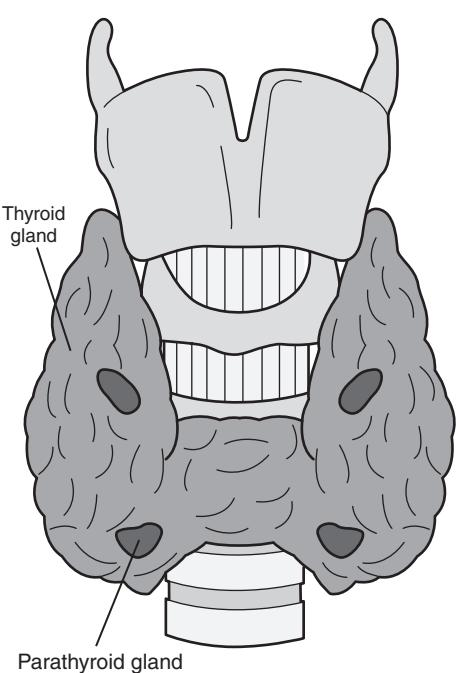
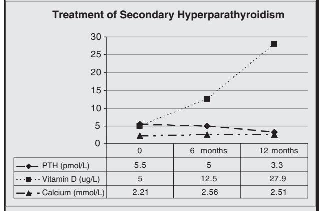
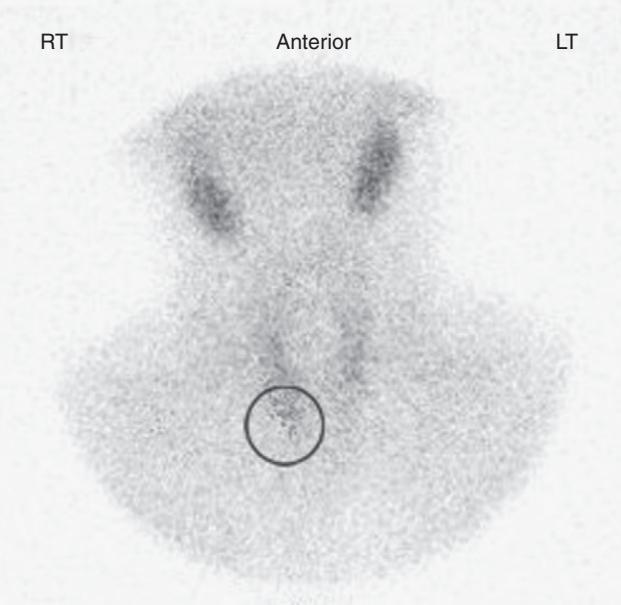
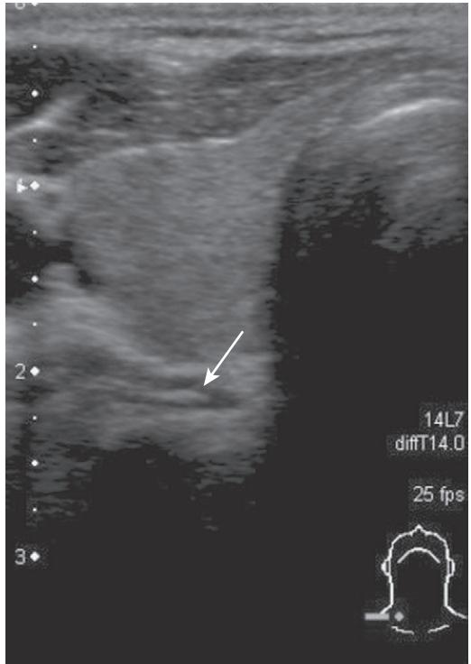
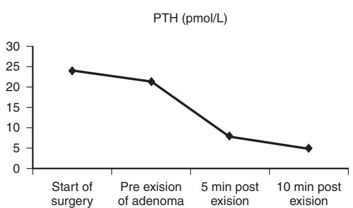
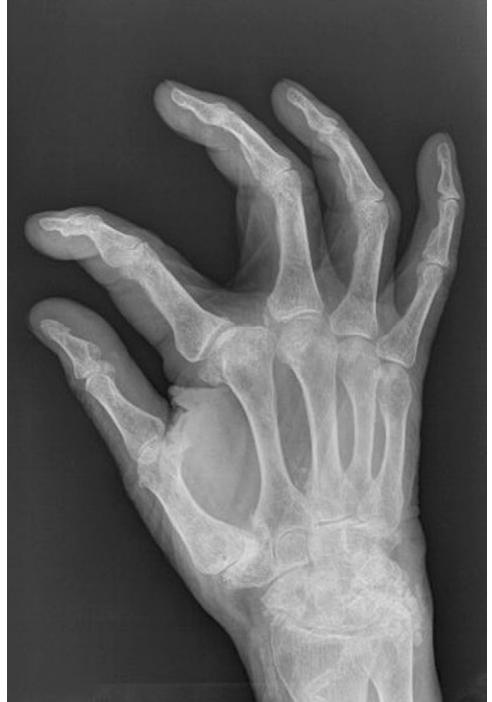

# Disorders of the Parathyroid Glands

Jane Turton Michael Stone Duncan S. Cole

### **INTRODUCTION**

Most individuals have only four parathyroid glands, which are usually located at the superior and inferior poles of the thyroid gland and which arise from the second and fourth branchial arches during fetal development1 (Figure 91-1).

A parathyroid gland is oval, yellow in color, measures about 5 mm across, and usually weighs less than 35 mg. Within a gland, there are four cell types: chief cells, clear cells, oxyphil cells, and adipose cells.2

### **PHYSIOLOGY OF PARATHYROID HORMONE**

Parathyroid hormone (PTH) is produced by the chief cells and is an 84 amino acid polypeptide with biologic activity in the N-terminal portion of the molecule. It is synthesized as pre-pro-PTH and is then sequentially processed to pro-PTH and finally to intact PTH (1-84). PTH is secreted as intact PTH and also in the cleaved C-terminal PTH form (C-PTH). The proportion of C-PTH secreted relative to intact PTH changes in response to circulating free calcium concentration.

Intact PTH has a half-life of less than 5 minutes. It is metabolized by Kupfer cells in the liver, resulting in cleavage of its N-terminal portion and the intracellular degradation of the N-terminal fragment. C-terminal fragments are released back into the circulation from the liver. These fragments are cleared by the kidneys and may be elevated in renal failure. C-terminal fragments have a longer half-life than the intact hormone and constitute the majority of circulating PTH forms.

PTH secretion exhibits both a circadian rhythm, with a peak in the early hours of the morning and nadir in late morning/early afternoon,3 and a seasonal variation that is highest in the winter and lowest in the summer.4

The secretion of PTH occurs predominantly in response to a fall in extracellular free calcium concentration, which is sensed by the calcium sensing receptor (CaSR) on parathyroid chief cells. The CaSR is a G-protein coupled receptor found in the intestine, kidney, thyroid C-cells, brain, and bone, where it is involved in local calcium homeostatic processes.5 The gene mutation of the CaSR in familial benign hypocalciuric hypercalcemia results in an alteration of the calcium homeostatic set point.6

The secretion of PTH is also influenced by circulating levels of 1,25-dihydroxyvitamin D (1,25(OH)2D3) phosphate and magnesium. 1,25(OH)2D3 suppresses PTH secretion by inhibiting gene transcription. Hyperphosphatasemia increases PTH synthesis and secretion; the converse holds for hypophosphatemia. In states of significant chronic magnesium deficiency, PTH secretion is impaired. An acute magnesium deficiency may, however, increase PTH secretion.

In the kidney, PTH stimulates 1α-hydroxylation of 25 hydroxyvitamin D3 (25(OH)D3) to produce the biologically active 1,25(OH)2D3, promotes calcium reabsorption in the distal convoluted tubule, and inhibits the reabsorption of phosphate from the proximal tubule.

In the small intestine, PTH has a small direct local effect, and circulating 1,25(OH)2D3 produced in the kidney promotes gastrointestinal absorption of calcium and phosphate.7

PTH increases osteoclastic resorption of bone at cortical surfaces and causes the release of calcium into the extracellular fluid. The net result of PTH action is an increase in extracellular calcium levels and a reduction in phosphate levels.

### **CALCIUM HOMEOSTASIS AND CHANGES WITH AGE**

In the elderly, average PTH levels can be up to 35% higher than those measured in a young adult population.8,9 The cause of this is multifactorial and is the result of the following conditions:

- A fall in 1,25(OH)2D3 production by the aging kidney as the glomerulofiltration rate falls from 125 mL/min at age 20 years to 60 mL/min at age 80.10
- A reduction in the responsiveness of renal 1α-hydroxylase to circulating PTH.11
- A reduction in dietary intake and absorption of calcium and vitamin D.12
- A reduction in vitamin D production in the skin as a result of less frequent and efficient sunlight exposure. Individuals who are housebound or living in nursing

Figure 91-1. Anatomic drawing of parathyroid glands.

#### **Table 91-1. Clinical Investigation of Parathyroid Disorders**

#### **Measurement of**

Bone profile: calcium, phosphate, albumin, alkaline phosphatase Renal profile: sodium, potassium, urea, creatinine Plasma PTH Serum 25(OH) vitamin D Magnesium (Lithium) 24-hour urinary calcium, phosphate, sodium and creatinine Bone density measurement: dual x-ray absorptiometry X-rays and isotope bone scan Sestamibi and ultrasound scan for preoperative assessment of primary hyperparathyroidism

### **Table 91-2. PTH Assay, Calcium, and Vitamin D Assays**

#### **PTH Assay**

Blood for PTH assay should be collected into tubes containing EDTA, as PTH is more stable in EDTA.14 Intact PTH is measured by noncompetitive immunoassay, which recognizes the C-terminal region. Specificity for the intact PTH is achieved by using a signal antibody that binds to the N-terminal (1-34) region.

#### **Calcium and Vitamin D Assay**

- Total calcium is usually measured using dye-binding spectrophotometric techniques. Forty percent of calcium in blood is bound to albumin, so changes in serum albumin may alter the total calcium result. Laboratories correct for this by reporting an "adjusted calcium" result.
- The more physiologically relevant ionized calcium fraction (by direct ion-specific electrode) may be measured using electrochemical methods.
- Nutritional vitamin D status is assessed using an assay for serum 25-hydroxyvitamin D (25(OH)D), which has a physiological half-life of 3 weeks.

homes are at particular risk of developing abnormal PTH secretion secondary to vitamin D deficiency13 (Tables 91-1 and 91-2).14–16

# **SECONDARY HYPERPARATHYROIDISM**

Secondary hyperparathyroidism is the most common disorder of calcium homeostasis in the elderly and has a prevalence of 20% to 60% in the population aged over 75 years.17 It occurs when there is vitamin D deficiency or insufficiency, and the resultant decrease in serum calcium causes parathyroid gland hyperplasia, which in turn causes a physiologic increase in PTH production.

The combination of vitamin D deficiency and secondary hyperparathyroidism is associated with an increased risk of fracture.17,18 There is an associated increase in mortality from cardiovascular disease19 independent of bone mass, serum 25(OH)D, and renal function.20–22

The first-line treatment for secondary hyperparathyroidism is a combined preparation of elemental calcium 1000 to 1200 mg and vitamin D3 20 micrograms (800 IU) daily. Chapuy et al showed that reducing PTH levels and improving serum 25(OH)D3 levels using this combination could reduce risk of hip fracture by 30% at 18 months and that this efficacy was maintained out to 3 years.23

If for any reason a patient cannot or will not adhere to this regime, vitamin D2 or D3 alone, 1α-hydroxycolecalciferol, or 1,25-dihydroxycolecalciferol can be used. 1,25 dihydroxycolecalciferol is particularly useful for patients with renal failure although careful monitoring of serum calcium is required.

# Case Report: Secondary Hyperparathyroidism

A female Caucasian nonsmoker age 81 years presented to our clinic with a history of falls and a past history of wrist fracture, osteoarthritis, hypertension and hypercholesterolaemia. She was independent in her activities of daily living and mobile with a walking stick but lacked confidence to go outside alone. Her diet was low in calcium. She was referred for a bone density scan and diagnosed osteoporotic (Neck of Femur T score –3.0). She was taking a statin and mild opiate analgesia for arthritic pain. A biochemical screen for secondary causes of osteoporosis was performed, which revealed a profound vitamin D deficiency, secondary hyperparathyroidism, and mild hypocalcaemia. She was treated with a combined preparation of calcium 1000 mg and 800 IU ergocalciferol daily, which normalized her biochemistry (see below).

# **PRIMARY HYPERPARATHYROIDISM**

The biochemical presentation of primary hyperparathyroidism (HPT) is a raised plasma PTH and hypercalcemia. The peak incidence occurs between ages 55 to 64 years at 1:1000. The prevalence is 2% in persons aged over 75 years, and it is three times as common in women as in men.24 Primary HPT is caused by a single adenoma in 80% of cases, four-gland hyperplasia in 15% of cases, and carcinoma in fewer than 1% of cases.25 A rare but notable form of hypercalcemia, which can mimic primary hyperparathyroidism, is benign familial hypocalciuric hypercalcemia.

Changes in the levels of circulating PTH have been shown to have an effect in the bone and in the brain. There is an increase in the bone remodeling space, and in trabecular bone, high levels of PTH increase bone formation. However, in cortical bone, high levels of PTH increase bone loss, cause a fall in bone mineral density (BMD), and increase the risk of fracture independent of 25(OH)D3 levels.26,27

In the brain, high levels of PTH can cause mood disturbance and memory loss secondary to the action of PTH on the PTH2 receptor.28

# Case Report: Primary Hyperparathyroidism

A female Caucasian age 75 years presented with a history of bone and muscle pain, low mood, indigestion, and a BMI of 18.5 She was referred for bone densitometry, which confirmed severe osteoporosis. Screening for secondary causes of osteoporosis revealed hypercalcemia (corrected calcium 2.68 mmol/L), normal 25(OH)D3, a raised PTH of 6.8 pmol/L, and raised urinary calcium excretion. She had no vertebral fractures. She was prescribed regular vitamin D2 and an oral bisphosphonate. She was referred for parathyroidectomy. At surgery, she had a solitary right lower parathyroid adenoma measuring 20 × 3 × 2 mm removed. Since her surgery, her PTH and calcium have remained in the normal range. Her mood has improved, and the muscle and bone pains have eased. Bone mineral densities have increased by 7.5% in the 12 months since her surgery.

A common presentation of primary hyperparathyroidism follows measurement of serum calcium and the identification of individuals with asymptomatic hypercalcemia. The very elderly can present with an acute disequilibrium hypercalcemia as their renal function progressively declines or if they become acutely dehydrated29 (Table 91-3).

Although most patients are now identified while asymptomatic, they can present with symptoms of lassitude, fatigue, mood swings, muscle pain, generalized weakness, and memory loss.25 The classical presentation of primary hyperparathyroidism comprising bone cysts, pathologic fractures, and renal calculi as described by Von Reckinghausen in 1891 is very rare.30

The treatment of primary hyperparathyroidism can be conservative or surgical. The conservative management involves regular monitoring (serum calcium, BMD, and PTH) and the use of oral or intravenous bisphosphonates. Although the effects on serum calcium are limited and transient,31 they are effective in treating the associated loss of bone.32 The use of calcium and vitamin D supplements with bisphosphonates is accepted practice in postmenopausal osteoporosis; however, in primary hyperparathyroidism, calcium supplementation should not be used. It is, however, safe to prescribe regular vitamin D3 alone to these individuals to ensure that serum vitamin D levels remain normal.

The use of surgery as treatment is becoming more acceptable, even for very elderly patients, because improvements in imaging have led to successful minimally invasive surgical techniques.33 The indications for surgery are detailed in Table 91-4. The usual imaging and localization techniques are sestamibi and ultrasound scanning (Figures 91-2 and 91-3), and during surgery intraoperative sampling of parathyroid hormone34 is performed, which confirms when the hyperfunctioning tissue has been removed (Figure 91-4).

After parathyroidectomy, patients can have increases of up to 12% in bone mineral density in the first year, even without further treatment,35 and the dilemma regarding the use of calcium and vitamin D supplementation is removed. The mood disturbance and memory loss associated with hyperparathyroidism has also been shown to improve after surgery.36,37

### **Table 91-3. Symptoms and Signs of Acute Hypercalcemia**

| Differential Diagnosis of Hypercalcemia in the Elderly            |  |  |  |  |
|-------------------------------------------------------------------|--|--|--|--|
| Primary hyperparathyroidism                                       |  |  |  |  |
| Malignancy                                                        |  |  |  |  |
| Renal failure                                                     |  |  |  |  |
| Addison's disease                                                 |  |  |  |  |
| Hyperthyroidism                                                   |  |  |  |  |
| Immobilization                                                    |  |  |  |  |
| Medications: thiazide diuretics, calcium supplements, lithium     |  |  |  |  |
| Milk alkali syndrome                                              |  |  |  |  |
| Paget's disease (when immobilized)                                |  |  |  |  |
| Sarcoidosis                                                       |  |  |  |  |
| Tuberculosis                                                      |  |  |  |  |
| Vitamin D or vitamin A intoxication                               |  |  |  |  |
| Symptoms of Acute Hypercalcemia                                   |  |  |  |  |
| Neurological: drowsiness, confusion, irritability hypotonia, coma |  |  |  |  |
| Gastrointestinal: anorexia, nausea, vomiting, acute pancreatitis  |  |  |  |  |

Cardiovascular: arrhythmias Renal: polyuria, polydipsia, dehydration

### **Table 91-4. Indications for Parathyroidectomy: National Institutes of Health Consensus Conference on Primary Hyperparathyroidism 1991 and 2002 Recommendations for Surgery33**

#### **1991 Recommendations**

Typical bone, renal, gastrointestinal, or neuromuscular symptoms Life-threatening hypercalcemia Calcium level 11.4–12.0 mg/dL (2.9–3.0 mmol/L) Urine calcium level >400 mg/day (10 mmol/day) Renal stones BMD 2 SDs <age, sex-matched controls (*z* score) Reduced creatinine clearance <30% Age <50 y Patient request; Adequate follow-up unlikely **2002 Additional Recommendations**

Calcium level >1 mg/dL (0.25 mmol/L) above normal for each laboratory BMD T score < −2.5 at any site (WHO definition of osteoporosis)

Figure 91-2. Sestamibi scan showing increased uptake at lower right lobe of thyroid.

Figure 91-3. Ultrasound showing a hyperechoic region behind right lower lobe of thyroid.

Calcimimetic medications initially developed for the treatment of hyperparathyroidism related to renal disease and for the treatment of hypercalcemia of malignancy may now be used to treat primary hyperparathyroidism. These medications alter the sensitivity of the calcium sensing receptor in the parathyroid glands, thus reducing the levels of circulating PTH and calcium.38

### **LITHIUM**

Hypercalcemia and hyperparathyroidism is common in patients treated with lithium. It has an incidence of 6.3% to 50%, and it can mimic primary hyperparathyroidism.39,40 However, there are subtle differences between primary HPT

Figure 91-4. Graph of changes in PTH when hyperfunctioning parathyroid tissue is removed. Intraoperative PTH assay is carried out rapidly during the operation and takes 10 to 12 minutes. A drop in PTH of >50% indicates complete removal of the hyperfunctioning tissue.

and lithium-induced HPT. In lithium-induced disease, there is usually a normal serum phosphate, severe hypercalcemia is rare, 24-hour urinary calcium excretion is low or normal, and there is no adenoma. However, there is a hyperplasia of the parathyroid glands, and the condition is reversible on withdrawing lithium.41

Hypercalcemia can occur many years after initiation of lithium therapy, but it is also a recognized effect of a single dosing with lithium, which causes an acute elevation of serum PTH by direct stimulation of the parathyroid gland.42 Surgical treatment of hypercalcemia with subtotal parathyroidectomy is usually unsuccessful when it is a result of lithium administration, and the hypercalcemia can recur if lithium therapy is continued.43

### **TERTIARY HYPERPARATHYROIDISM**

In individuals who have prolonged secondary hyperparathyroidism as a result of renal failure, there is severe hyperplasia of the parathyroid glands, and the set point for normal inhibition of PTH secretion by calcium is altered. The hyperplastic parathyroid glands show a reduction in CaSR expression, and unlike secondary hyperparathyroidism, patients have high serum calcium and high PTH.

There are indications for parathyroid surgery in this condition, including severe bone pain, fractures, hypercalcemia,

# Case Report: Lithium-Induced Hyperparathyroidism

A 65-year-old female presented to clinic with hypercalcemia and osteoporosis identified by screening in a gastroenterology clinic (corrected serum calcium 2.78, total spine T score −4.4, total hip T score −1.9). She had clinical risk factors for osteoporosis, namely smoking, a history of thyrotoxicosis, and celiac disease. She was being treated for bipolar disorder with oral lithium. She was adherent to a gluten-free diet and was taking 1000-mg calcium with 400 IU ergocalciferol and oral bisphosphonates as treatment for her osteoporosis at the time of presentation. Her PTH was raised; vitamin D was normal, and her 24-hour urinary calcium was low (see table). She had preoperative imaging for primary hyperparathyroidism, which did not identify an adenoma and she was not offered surgery. Her calcium and ergocalciferol were replaced with calciferol, and since then serum calcium has remained within normal limits. She continues to be treated with oral bisphosphonate for her osteoporosis.

| PTH              | Calcium            | 25(OH)D      | Phosphate         | 24-Hour Urinary     |
|------------------|--------------------|--------------|-------------------|---------------------|
| (0.9–5.4 pmol/L) | (2.20–2.60 mmol/L) | (8–50 ng/ml) | (0.8–1.45 mmol/L) | Calcium (<7.0 mmol) |
| 6.6              | 2.78               | 25.8         | 1.34              | 0.7                 |

# Case Report: Tertiary Hyperparathyroidism

A 74-year-old male, who had received a renal transplant at age 58 years presented with osteoporosis (total spine T score −2.2, NOF T score −2.8, total hip T score −2.2), gross heterotopic calcification with chalky discharge, cardiovascular disease, and multiple falls.

Biochemically he had a vitamin D deficiency (25(OH)D 12.5 mcg/L), hyperparathyroidism (PTH 29.0 pmol/L), and a raised calcium x phosphate product (calcium 2.57, phosphate 1.81). He had CKD stage 4 disease with a creatinine of 350 micromol/L. He was managed conservatively with intermittent oral etidronate, phosphate binders, and low-dose alfacalcidol as he was unfit for parathyroid surgery. He subsequently died after suffering a hip fracture.

Figure 91-5. Heterotopic tissue calcification in a periarticular distribution.

heterotopic calcification, and bone cysts; however, if this condition is treated surgically, there is a risk that some patients will subsequently develop adynamic bone disease (Figure 91-5).

# **HYPOPARATHYROIDISM**

Hypoparathyroidism is much less common than hyperparathyroidism. It is unusual for it to present for the first time in the elderly. It presents clinically as hypocalcaemia and is a result of insufficiency or resistance to PTH. It can occur after surgery for thyroid or parathyroid disease or reflect autoimmune disease. The reduction in PTH leads to an increase in renal calcium loss and reduced absorption of calcium in the gut because of a fall in 1,25(OH)D3 production. Treatment is with hydroxylated products of vitamin D, Ca supplementation, and thiazide diuretics to reduce renal calcium loss.

# KEY POINTS

### Disorders of the Parathyroid Glands

- Vitamin D deficiency and secondary hyperparathyroidism is common in the elderly.
- Treatment of frail elderly people with simple calcium and vitamin D supplementation significantly reduces the risk of fractures.
- Acute disequilibrium hypercalcemia is an important, life-threatening cause of confusion in the elderly.
- The differential diagnosis of raised serum calcium and raised parathyroid hormone includes primary hyperparathyroidism, lithium-induced hyperparathyroidism, familial hypocalciuric hypercalcemia, and tertiary hyperparathyroidism.
- More elderly patients are now being considered for parathyroid surgery because of improvements in preoperative imaging and the use of minimally invasive surgical techniques.

For a complete list of references, please visit online only at www.expertconsult.com