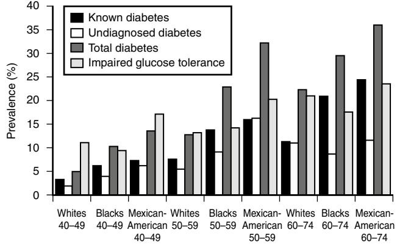
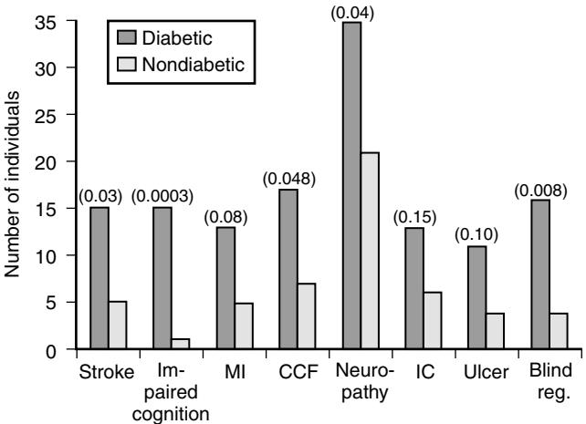
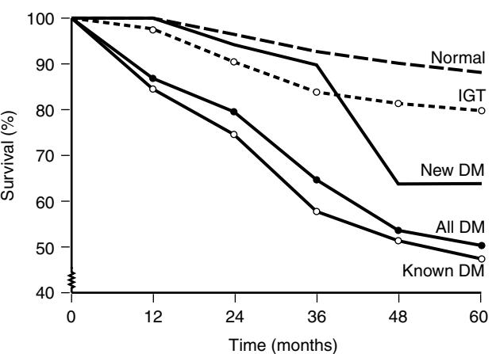

# Diabetes Mellitus

Alan J. Sinclair Simon C. M. Croxson

Diabetes mellitus remains a significant personal and public health burden with unmeasured socioeconomic implications.1–4 Although detailed and focused studies in older people need to be planned, there is the recognition that as a common disabling disorder, diabetes requires interventional strategies at an early stage and the involvement of both patients and caregivers in defining goals of care and treatment plans.5,6

During the last decade, a number of factors suggest that care delivery has been enhanced and attitudes have changed.7 In particular, there is more recognition that older patients with diabetes may be different from younger counterparts8; for example, they have a high degree of comorbidity, an agerelated impairment of functional ability, and an increased vulnerability to hypoglycemia and its consequences. They may also require a different approach to care, which involves a greater focus on managing disability and functional impairment.9 This chapter provides an account of the scientific and clinical basis of managing older people with diabetes, which should be a basis for enhancing the quality of diabetes care delivered. Although this is a large topic, the chapter should be read in conjunction with the European guidelines on diabetes in older people, which are currently being updated.10 Modern aims of care have been identified and should form the basis of any care package (Table 92-1).

### **DIABETES DEFINITION, CLASSIFICATION, AND DIAGNOSIS**

*Diabetes* is defined by hyperglycemia and the tendency to develop specific complications, particularly retinopathy; indeed, the gold standard test for diabetes would be to leave the subject untreated for several years after which the presence of retinopathy is diagnostic.11–13 The diagnostic criteria were developed to diagnose type 2 diabetes mellitus (previously known as non–insulin-dependent diabetes mellitus), since type 1 diabetes (previously known as insulindependent diabetes mellitus) is generally obvious clinically. A venous plasma glucose level equal to or exceeding 11.1 mmol/L (200 mg/dL)14,15 following glucose challenge identifies those subjects who have a dramatically increased risk of retinopathy.11–13,16 The cutoff value of 11.1 mmol/L does actually separate normoglycemic and diabetic populations (each with a gaussian distribution of 2-hour values) in different age groups, suggesting that the World Health Organization (WHO) criteria (see later discussion) apply in both elderly and young people.

#### **Table 92-1. Aims in Managing the Elderly Diabetic Person**

- Maintain an optimal level of well-being and quality of life
- Avoid hyperglycemic malaise and optimize nutritional status
- Assess comorbidity state
- Avoid adverse drug events, particularly hypoglycemia
- Maintain lower limb strength
- Recognize disability and limit handicap

*760*

The majority of elderly diabetic people have type 2 diabetes, but type 1 does occur17 and the age-specific incidence of type 1 is the same from 30 to 80 years of age.18 Type 1 diabetes in the elderly population may have a very insidious onset, when it is termed "latent autoimmune diabetes of the aged" (LADA). LADA has been shown to be quite common in some series (e.g., 10% to 15% of diabetic adults and 50% of the nonobese type 2 diabetic subjects19); the autoantibody screen is not used in routine clinical practice in elderly people because it is not particularly predictive. Diabetes may also be secondary to or exacerbated by other conditions such as pancreatic disease, endocrine disease such as Cushing's syndrome, acromegaly, or thyrotoxicosis, and (most commonly) drug therapy with high-dose thiazide diuretics, oral glucocorticosteroids, and oral β-blockers. A comprehensive list of diabetogenic drugs is given in the National Diabetes Data Group criteria.14 The majority of subjects with secondary diabetes are elderly.20 A simple classification of diabetes mellitus in the elderly population is given in Table 92-2.

Recently, the diagnostic criteria were revised by both the American Diabetes Association (ADA)21 and the WHO22 see Table 92-3 and www.diabetes.org.uk/info/carerec/newdia gnotic.html. These revisions have attempted to make screening for diabetes easier, but the ADA criteria have created pitfalls for the unwary. Both sets of criteria lower the threshold for an abnormal fasting plasma glucose (FPG) from 7.8 to 7.0 mmol/L, which addresses the low sensitivity of the fasting plasma glucose to detect an elevated 2-hour postchallenge glucose. Many studies have shown that this decrease in FPG increases the sensitivity of the FPG (e.g., from 65% to 81% in Bristol, U.K.), but the test still misses diabetic subjects with elevated 2-hour plasma glucose levels.23 Isolated postchallenge hyperglycemia is not a benign mild condition; it carries increased risk of death.24 Finally, the ADA reintroduced the concept of impaired fasting glucose (IFG) for subjects with a fasting glucose of 6.0 to 6.9 mmol/L. It is true that the risk of macrovascular disease increases once the FPG exceeds 6.0 mmol/L, but these IFG subjects have 2-hour postchallenge glucose levels, putting them clearly into normal, IFG, or diabetic categories, which require different management. In the predominantly European population of Bristol,23 one third of IFG subjects have each category of glucose tolerance, whereas in the high-risk Gujerati population of Leicester, U.K., all IFG subjects have either diabetes

#### **Table 92-2. Classification of Diabetes in Elderly People**

| Primary                                                           |
|-------------------------------------------------------------------|
| Type 1                                                            |
| Type 2                                                            |
| Obese                                                             |
| Nonobese                                                          |
| Maturity-onset diabetes of the young                              |
| Secondary                                                         |
| Pancreatic disease                                                |
| Drugs (e.g., steroids)                                            |
| Other endocrine conditions (e.g., Cushing's syndrome, acromegaly, |
| thyrotoxicosis)                                                   |

|                                   |              | GLUCOSE CONCENTRATION (mmol/L) WHOLE BLOOD |                  |  |  |  |
|-----------------------------------|--------------|-----------------------------------------------|------------------|--|--|--|
|                                   | Venous       | Capillary                                     | Plasma (Venous)* |  |  |  |
| Diabetes mellitus:                |              |                                               |                  |  |  |  |
| Fasting or                        | ≥ 6.1        | ≥ 6.1                                         | ≥ 7.0            |  |  |  |
| 2 hours after glucose load        | ≥ 10.0       | ≥ 11.1                                        | ≥ 11.1           |  |  |  |
| Impaired glucose tolerance (IGT): |              |                                               |                  |  |  |  |
| Fasting (if measured) and         | <6.1 and     | <6.1 and                                      | <7.0 and         |  |  |  |
| 2 hours after glucose load        | 6.7–9.9      | 7.8–11.0                                      | 7.8–11.0         |  |  |  |
| Impaired fasting glycemia (IFG):  |              |                                               |                  |  |  |  |
| Fasting and (if measured)         | 5.6 and <6.1 | 5.6 and <6.1                                  | 6.1 and <7.0     |  |  |  |
| 2 hours after glucose load        | <6.7         | <7.8                                          | <7.8             |  |  |  |

Corresponding values for capillary plasma are:

\*

For diabetes mellitus: fasting, 7.0; 2 hr, 12.2.

For impaired glucose tolerance: fasting, <7.0; and 2 hr, 8.9 and <12.2.

For impaired fasting glycemia: 6.1 and <7.0, and if measured, 2 hr, <8.9.

For clinical purposes, the diagnosis of diabetes should always be confirmed by repeating the test on another day unless there is unequivocal hyperglycemia with acute metabolic decompensation or obvious symptoms.

or IGT on the 2-hour PG.25 These facts are important if the FPG is used for diagnosing diabetes.

The latest WHO and International Diabetes Federation (IDF) criteria simplify matters greatly by introducing the term *intermediate hyperglycemia* as somewhere between normal glucose tolerance (fasting venous plasma glucose <6.1 mmol/L and 2-hours postchallenge of <7.8) and diabetes (fasting venous plasma glucose = 7.0 mmol/L and 2-hour postchallenge of 11.1 mmol/L).26

### **IMPAIRMENT OF GLUCOSE TOLERANCE WITH AGING**

The prevalence of diabetes mellitus increases with advancing age and is predominantly type 2. This age-related impairment has been confirmed by more recent studies indicating that glucose intolerance begins in the third decade and continues throughout adulthood.27–30 The magnitude of the rise has been estimated to be 0.33 to 0.72 mmol/L (5.9 to 13.0 mg/dL) per decade in 1- and 2-hour postglucose ingestion samples. The rise is more pronounced in women (about 0.55 mmol/L [9.9 mg/dL] higher than in men).30 The National Health and Nutrition Examination Survey (NHANES III) of U.S. residents found a rise in prevalence of impaired glucose tolerance (IGT) of 11.9% in those aged 40 to 49 years to 20.7% in those aged 60 to 74 years;31 this survey also demonstrated increasing prevalence rates of diabetes with age from 3.4% to 24.4% (Figure 92-1).

Several possible mechanisms may contribute to glucose intolerance during aging and these are listed in Table 92-4. The impairment is clearly multifactorial, being characterized by delays in glucose-mediated insulin secretion, insulininduced suppression of hepatic glucose output, and a rise in insulin-mediated glucose uptake.

### **EPIDEMIOLOGY OF DIABETES MELLITUS IN THE ELDERLY POPULATION**

To promote rational health care planning involving an accurate assessment of the public health burden of diabetes and a needs assessment, we require better ways of identifying

Figure 92-1. Data from NHANES III: rising abnormalities of glucose tolerance with age. *(From Harris MI, Flegal KM, Cowie CC et al. Prevalence of diabetes, impaired fasting glucose, and impaired glucose tolerance in U.S. adults: the Third National Health and Nutrition Examination Survey, 1988–1994. Diabetes Care 1998;21:518–24.)*

individuals with the disease since approximately 50% may be undiagnosed.32 However, even studies of subjects with previously diagnosed diabetes can provide useful information. For instance, the surveys of Poole, Oxford, and Southall (U.K.) of European subjects with diagnosed diabetes33 reveals that 60% of known diabetic subjects are aged 60 years or more.

The prevalence of diabetes rises from youth to old age (Figure 92-1). However, the Melton (U.K.) screening survey,34 the East and West Finland screening survey,35 and a survey of Pima Indians36 found static prevalences from age 65 to 85, suggesting that the age-related increase in diabetes prevalence levels off after age 65. Most developed countries have a prevalence of approximately 17% in their elderly white population and around 25% in nonwhite populations.15,31,35–47 The prevalence in white British elderly people is only around 9%,34,48 although the prevalence in nonwhite British elderly people is still approximately 25%,49 and the prevalence in care-home residents is 25%.50

The prevalence of previously diagnosed diabetes in the United Kingdom elderly population has increased over the last few decades and one could argue that this is because of a higher rate of ascertainment, rather than a true increase. Evidence from screening in Glostrup, Denmark, shows an increased true prevalence in the Danes because of increased obesity and decreased exercise,51 and NHANES III has shown a true increase in prevalence31 from NHANES II32 (Table 92-5).

The risk of developing type 2 diabetes is increased by parental history,32,47,52 obesity,32,45,47,51,52 hypertension,45,52 lack of exercise,45,52 and nonwhite race.31,32 In subjects with these risk factors, exercise seems to protect against the development of diabetes.52 This is important when advising the offspring of patients who are told to stay slim, avoid refined carbohydrates, exercise more (climb 15 flights of stairs per day), and be aware of their risk of diabetes and hypertension.52 Targeted screening of at-risk individuals is now also advised (e.g., fasting venous plasma glucose every 3 years for offspring of diabetic patients, after the age of 40 years),21 remembering to advise the subjects to buy life insurance before the test rather than after.

#### **Table 92-4. Mechanisms of Decreased Glucose Tolerance in Old Age**

| • Delayed/decreased glucose-induced insulin secretion • Impaired insulin-mediated glucose uptake in skeletal muscle and |
|----------------------------------------------------------------------------------------------------------------------------|
| adipose tissue because of predominantly postreceptor defect                                                                |
| • Other factors:                                                                                                           |
| Increased body fat                                                                                                         |
| Decreased physical activity                                                                                                |
| Reduced dietary carbohydrate                                                                                               |
| Impaired renal function                                                                                                    |
| Hypokalemia                                                                                                                |
| Increased sympathetic nervous system activity                                                                              |

Diabetogenic drugs

# **IMPACT OF DIABETES MELLITUS IN THE ELDERLY POPULATION**

### **Overview**

Diabetes places a significant vascular burden on older patients with diabetes, which is partly explained by the traditional risk factors present and also by the effect of aging, itself. Older patients appear to have 2 to 3 times more need for hospital care than the general population53 for various conditions such as heart failure, stroke, and coronary heart disease. This increase occurs from middle age onwards.54 Older people with diabetes also use primary care services 2 to 3 times more than nondiabetic controls.54,55

Several studies have defined the prevalence of elderly patients in hospital diabetic populations. In a study from the Edinburgh Royal Infirmary, elderly patients aged 65 years and over with diabetes accounted for 60% of the overall bed-occupancy because of diabetes, giving a mean hospital prevalence of 4.6%.2 A Cardiff-based study of three district general hospitals found a hospital prevalence (pooled data) of 8.4% with a mean age of 65 years.58

Diabetes in older subjects is associated with considerable morbidity, mainly because of the long-term complications.48–51 A population-based study from Oxford59 measured the incidence of complications over a median period of 6 years in 188 patients aged 60 years and over by using a structured questionnaire and clinical examination. Incidence rates of ischemic heart disease, stroke, and peripheral vascular disease were 56, 22, and 146 per 1000 person-years, which are slightly higher than found in the Framingham study,63 since the Oxford study involved an older age group. Retinopathy occurred at a rate of 60 and cataract at 29 per 1000 person-years, whereas proteinuria (albumin concentration greater than 300 mg/L) was 19 per 1000 person-years. Incidence rates appeared to be unrelated to sex or duration of diabetes, but stroke and peripheral vascular disease rose significantly with age.

### **Table 92-5. Prevalence of Diabetes in Different Screened Elderly Populations**

|                             |           |      |       |     |               | DIABETES IGT RATE |      |
|-----------------------------|-----------|------|-------|-----|---------------|-------------------|------|
| Study                       | Year      | Ref. | Age   | Sex | Ethnic Origin | rate (%)          | (%)  |
| Melton, U.K.                | 1991      | 44   | 65–85 | MF  | White         | 9.1               | 7.1  |
| Coventry, U.K.              | 1988      | 59   | 60–79 | MF  | White         | 7.0               | —    |
| Coventry, U.K.              | 1988      | 59   | 60–79 | MF  | South Asian   | 27.8              | —    |
| NHANES II, U.S.             | 1976–1980 | 42   | 65–74 | MF  | White         | 17.9              | 23.0 |
| NHANES II, U.S.             | 1976–1980 | 42   | 65–74 | MF  | Nonwhite      | 26.4              | 14.5 |
| NHANES III, U.S.            | 1988–1994 | 37   | 60–74 | MF  | White         | 22.3              | 20.9 |
| NHANES III, U.S.            | 1988–1994 | 37   | 60–74 | MF  | Black         | 29.5              | 17.6 |
| NHANES III, U.S.            | 1988–1994 | 37   | 60–74 | MF  | Hispanic      | 36                | 23.5 |
| California, U.S.            | 1972–1974 | 47   | 60–89 | MF  | White         | 16.1              | —    |
| Tampere, Finland (F)        | 1977      | 48   | 85    | MF  | White         | 17.0              | —    |
| Fredericia, Denmark (F)     | 1981–1982 | 53   | 60–74 | M   | White         | 7.2               | —    |
| Glostrup, Denmark (U)       | 1967      | 54   | 70    | MF  | White         | 10.0              | 25   |
| Glostrup, Denmark (U)       | 1977      | 54   | 80    | MF  | White         | 12.0              | 36   |
| Glostrup, Denmark           | 1996–1997 | 63   | 60    | M   | White         | 12.3              | 15.9 |
| Glostrup, Denmark           | 1996–1997 | 63   | 60    | F   | White         | 6.8               | 13.1 |
| East/west Finland (pm gtts) | 1984      | 45   | 65–84 | M   | White         | 29.8              | 31.8 |
| Gothenburg, Sweden          | 1980      | 55   | 67    | M   | White         | 10.8              | 14.2 |
| Amsterdam, Holland (D)      | 1985      | 56   | 65    | MF  | White         | 23.6              | —    |
| Kuopio, Finland             | 1986–1988 | 57   | 65–74 | MF  | White         | 17.8              | 20.8 |

Abbreviations: *F,* FBG–based survey; *D,* recruitment details scanty; *pm gtts,* testing performed in afternoon, which may increase diabetes prevalence; *U,* previously undiagnosed diabetic subjects only recorded.

In Poole, a coastal town in southern England, the prevalence of diabetic neuropathy, an important cause of foot ulceration and amputation, was determined in 1077 diabetic subjects,60 who comprised 94% of the known diabetic population. Neuropathy was diagnosed by the presence of neuropathic symptoms plus one or more physical findings, such as loss of light touch or impairment of pain sensation. The overall prevalence of neuropathy was 16.3% (compared with 2.9% in nondiabetic controls) with similar values in both type 1 and type 2 diabetes patients.

A community survey from Nottingham, U.K.,61 of 98 elderly diabetic patients (mean age 73 years) registered with two inner-city general practices, studied the impact of diabetes in terms of complications and frequency of hospital and general practice contacts. Figure 92-2 shows that diabetic subjects had significantly higher prevalences of stroke, cognitive impairment, diminished leg pulses, visual impairment, and absent vibration senses (vibration perception threshold greater than 50 V at one or more sites, as a marker of neuropathy) compared with nondiabetic controls. Disability was present in four out of five patients. Cataract was the most common cause of disability associated with visual impairment.

### **Visual loss**

Diabetic retinopathy was the third main cause of blindness and partial sight registration in one epidemiologic study in Avon, U.K.64 However, the diabetic person also has a greater risk of cataract, glaucoma, retinal artery thrombosis, and retinal vein thrombosis. Thus it is no surprise that blind registrations for diabetic subjects in Nottingham, U.K., are eight times higher than the subjects not known to have diabetes,60 with 16% of elderly diabetic subjects having blind or partial-sight registrations. The diabetic blind registration is predominantly due to maculopathy, which is treatable, unlike most forms of age-related macular degeneration, the main cause of blind registration in the elderly population.

Many cross-sectional studies show that good glycemic control is associated with less chance of developing

Figure 92-2. Comparison of morbidity between diabetic and nondiabetic individuals. *P* values are shown in parentheses. *(From Dornan TL, Peck GM, Dow JDC, et al. A community survey of diabetes in the elderly. Diab Med 1992;9:860–5.)*

retinopathy.80,81 The U.K. Prospective Diabetes Study has now shown, in a prospective randomized controlled trial of aggressive versus conventional (when the trial was started) treatments, that both blood glucose lowering and blood pressure lowering decrease the risk of retinopathy.67–70 Duration of disease is also associated with increased risk of retinopathy. Because the elderly diabetic subject has often had type 2 diabetes for at least 5 to 7 years before diagnosis,71 it is not surprising that diabetic retinopathy is already present at diagnosis in 10.5% of elderly subjects in whom only one pupil was dilated72; 23.8% of subjects of all ages in the U.K. Prospective Diabetes Study had retinopathy at presentation.73

Laser photocoagulation can preserve vision in edematous and exudative maculopathies if visual acuity is 6/9 or better,74,75 and it has been calculated that screening and treating diabetic retinopathy would prevent 56% of blind registrations that are caused by the retinopathy.76 Interestingly, the EURODIAB controlled trial of lisinopril in insulin-dependent diabetes (EUCLID) showed a 50% reduction in progression of retinopathy in type 1 diabetic subjects randomized to ACE inhibitor.77

Cataract has been shown to be more common in diabetic subjects78,79 even at the time of diagnosis,80 and its presence predicts increased mortality.81 However, The U.K. Prospective Diabetes Study showed that aggressive blood glucose reduction decreased the rate of cataract extraction.67

Although some studies show an association of diabetes with open-angle glaucoma,82 other studies do not.83–85 There is some evidence that glaucoma is associated with worse retinopathy86 and neovascularization is associated with glaucoma,87 particularly if there is rubeosis iridis. It is well accepted that retinal venous thrombosis is a complication of diabetes,88 and there is some evidence that retinal artery thrombosis is associated with diabetes.80,89

Age-related macular degeneration seems very common in diabetic patients; the theoretical reasons for this are discussed in the paper by Klein et al.90 However, most studies show no such association,91–93 and only one study has shown such an association in men aged 75 or more.90

The gold standard ophthalmologic assessment is slitlamp examination by an experienced user,94 but this is often not practicable. Mydriatic retinal photography has a sensitivity of detection of eye disease of 89%, which is significantly better than the sensitivity of direct ophthalmoscopy of 65%.94 If photography is not available, subjects need measurements of visual acuity and dilated fundoscopy by experienced observers each year; this is probably worth doing opportunistically anyway because even photography misses 11% of retinopathy. Although exudative maculopathy is easy to spot in the dilated eye (exudates around or within one disk's diameter of the macula), macular edema is practically impossible to distinguish from a normal eye by ophthalmoscopy; hence, the importance of measuring the corrected visual acuity. Reasons for referral to an ophthalmologist are set out in Table 92-6.

### **Foot disease**

Limb amputation remains an important health problem in the diabetic population, with the rate of lower limb amputation being 15 times higher than for nondiabetic patients.95

It is three times higher in diabetic men than in women.96 Elderly people are particularly affected.97

In 1986 the total annual cost of major leg amputations in diabetic patients in the United Kingdom was estimated to be in excess of £13 million98; in the United States, the direct medical care costs for all amputations in the diabetic populations, not including rehabilitation, exceeded \$500 million.99 A recent study from the Netherlands100 estimated the direct costs associated with diabetes-related lower limb amputations and found it to be more than £10,000 per hospitalization, with a mean inpatient stay of 42 days. This study identified increasing age and a higher level of amputation as important factors leading to increases in both the period of hospitalization and the associated costs (Table 92-7).

The mortality rate for amputees is high. Recent evidence indicates that the 3-year survival following lower extremity amputation is about 50%,101 with a median life expectancy after amputation of less than 2 years.96 Only 5% of elderly amputees become fully independent postoperatively.102

In about 70% of cases, amputation is precipitated by foot ulceration103,104 whose principal antecedents include peripheral vascular disease and peripheral neuropathy, both of which increase with age. Other at-risk groups include those with limited joint mobility, bony abnormalities, diabetic nephropathy, excess alcohol intake, visual impairment, and patients living alone.97

Various risk factors that increase the likelihood of foot ulceration have been identified (Table 92-8). Peripheral sensorimotor neuropathy is the primary cause or contributory factor in 90% of cases.105,106 Both small (often unmyelinated) and large (usually myelinated) nerve fibers are affected, which leads to the common symptoms of numbness, lancinating and burning pain, "pins and needles," and hyperesthesia, which is typically worse at night.97 Physical examination reveals a glove and stocking loss of pain, fine touch, and thermal sensation (small

#### **Table 92-6. Reasons for Referral to an Ophthalmologist**

- Cataract either obscuring examiner's view of fundus or impairing patient's vision
- Diabetic maculopathy as evidenced by exudates within 1 disk diameter of macula or any unexplained loss of visual acuity
- Preproliferative changes, such as intraretinal microvascular abnormalities, venous changes (beading, loops, dilation), six cotton wool spots in one quadrant, large blot hemorrhages, arteries replaced by white lines
- Proliferative changes, such as new vessels visible or vitreous hemorrhage
- To complete blind registration

fibers), with coexisting vibration and proprioceptive loss (large fibers). Small muscle atrophy in the foot can also occur because of motor fiber loss, which can cause flexor/ extensor muscle imbalance resulting in clawed toes, prominent metatarsal heads, and forward displacement of the metatarsal foot pads.107 This can lead to abnormally high foot pressures developing, which can increase the risk of foot ulceration and lead to gait disturbances. In elderly patients with peripheral neuropathy, this may give rise to further foot injuries and falls. The presence of visual loss may exacerbate the situation.108 A trivial foot injury in a patient with severe neuropathy can eventually lead to the development of a Charcot joint, which is a chronic neuroarthropathy whose prevalence varies from 0.15% to 7% depending on the study population.97 The majority of subjects have had diabetes for at least 10 years, and most are elderly people.

Peripheral blood flow in patients with diabetes is disturbed, with loss of blood flow autoregulation, increased arteriovenous shunting, and changes in capillary blood flow. Some of these abnormalities may be reversible or ameliorated by improved glycemic control.109 Risk factors for peripheral vascular disease include smoking, hypertension, and hypercholesterolemia, with prevalence increasing with both advancing age and duration of diabetes. Symptoms include intermittent claudication and/or rest pain with lower limb ulceration or gangrene being important clinical outcomes. Radiologic investigation may show medial arterial calcification, which has been reported to be associated with both diabetic peripheral somatosensory and autonomic neuropathy.110 Objective assessment of limb blood flow by Doppler ultrasound can be affected by extensive medial calcification, giving rise to a misleadingly high ankle-pressure index.111

It seems logical that interventions designed to prevent diabetic foot disease and amputations in patients with diabetes should be directed to the prevention of peripheral neuropathy and peripheral vascular disease and the prevention, early detection, and treatment of foot lesions. Several studies using staff and patient education and a multidisciplinary approach to foot care have demonstrated a reduction in diabetesrelated amputations.112,113 However, elderly people require more assistance than the young because they have difficulty perceiving foot problems and touching their feet.114 By incorporating an intensive multidisciplinary approach in a diabetes foot clinic,112 a London-based study demonstrated a 44% decline in amputation rate after 2 years. By use of suitable-fitting shoes, the recurrence rate of foot ulcers was reduced from 83% to 26%. At the University Hospital of Geneva, an 85% reduction in the rate of below-knee

**Table 92-7. Duration of Hospitalization for Lower-Extremity Amputations, and Mean Costs of Hospitalization (Including Hospital Stay and Surgery) by Age Group in the Diabetic Population**

| Age Group | Duration of Hospitalization* | Mean Costs of Hospitalization (£) | Number of Cases |
|-----------|---------------------------------|--------------------------------------|-----------------|
| <45       | 25.5 ± 20.5                     | 6516                                 | 53              |
| 45–64     | 38.7 ± 36.0                     | 9734                                 | 521             |
| 75        | 43.3 ± 42.9                     | 10,928                               | 655             |
| Total     | 41.8 ± 39.1                     | 10,531                               | 1575            |

\* Results expressed as mean ± SD in days.

#### **Table 92-8. Risk Factors for Foot Ulceration in the Elderly Population**

- Peripheral sensorimotor neuropathy
- Autonomic neuropathy
- Peripheral vascular disease
- Limited joint mobility
- Foot pressure abnormalities
- Previous foot ulcer • Smoking and alcohol

amputations was seen over a 4-year observation period by a combination of education and training in foot care in patients with diabetes.

With many elderly patients having great difficulty in performing the most routine foot care,114 often as a result of poor vision and reduced mobility, it becomes very important to design strategies that enable partners and other caregivers to have a role in prevention and treatment of foot lesions. Educational material needs to be concise and repeated regularly,97 and video presentations may also be helpful. The accompanying box on foot care education provides general principles of foot care reflecting a positive approach that can be adapted to many patients in clinical settings.

# General Principles of Foot Care Education

- Target the level of information to the needs of the patient. Those not at risk may require only general advice about foot hygiene and shoes.
- Assess the ability of the patient to understand and perform the necessary components of foot care. If this is limited, then the spouse or caregiver should be involved at the beginning of the process.
- Suggest a positive approach to foot care with "do's" rather than "don'ts"—the principle of active rather than passive foot care is more likely to be successful and acceptable to the patient.
	- Do inspect the feet daily.
	- Do report any problems immediately.
	- Do have your feet measured every time new shoes are bought.
	- Do buy shoes with a square toe box and laces.
	- Do inspect the inside of shoes for foreign objects every day before putting them on.
	- Do attend a fully trained chiropodist regularly.
	- Do cut your nails straight across and not rounded.
	- Do keep your feet away from heat (fires, radiators, and hot water bottles) and check the bath water before stepping into it.
	- Do wear something on your feet to protect them at all times and never walk barefoot.
- Repeat the advice at regular intervals and check that it is being followed.
- Disseminate advice to other family members and other health care professionals involved in the care of a patient.

Figure 92-3. Mortality of elderly subjects in Melton Mowbray, according to glucose tolerance status. *(From Croxson SCM, Price D, Burden M et al. Mortality of elderly people with diabetes. Diab Med 1994;11:250–2.)*

# **Mortality**

It is a widely held belief that diabetes mellitus confers little or no excess mortality risk in older patients, with life expectancy being similar to nondiabetic risk after age 70 to 75 years.115–117 This apparent finding was explained by a shorter life in elderly subjects with other competing causes of death minimizing the effect of diabetes.118 In line with this, most early reports indicated that the ratio of death rates in diabetics to rates in the general population falls progressively with age, especially in those aged 65 years and over, though it remains above unity up to age 80 years.118 More recently, one study actually found a significantly lower mortality in patients aged 75 years and over (mortality ratio 0.88) compared with the general population,119 and these contradictory findings have created uncertainty about the true impact of this metabolic disorder on the older diabetic population.

It is important to determine whether premature death because of diabetes is observable in elderly patients because this evidence would provide guidance to those responsible for providing health services on how best to focus their resources. An unequivocal finding of increased mortality would argue for a more sustained commitment to diabetic health care provision and research. Alternatively, the absence of excess mortality could redirect care strategies toward reducing morbidity and disability only.

A recent literature review by the authors has confirmed that diabetes in later life imposes an excess mortality risk121 associated with a reduction in life expectancy in both sexes, even in patients aged 75 years and over. The pattern of excess mortality is relatively consistent, even though the duration of follow-up varied between studies. In the Melton study by Croxson et al120 a substantial increase in excess mortality was seen in diabetic subjects aged 65 years and over (Figure 92-3), and impaired glucose tolerance was found to be associated with a relative risk of death of 1.7 (95% confidence interval 0.8 to 3.5). Most studies report a higher mortality in female diabetics and in both sexes; excess mortality is predominantly because of macrovascular disease.

# **Dementia**

There is now better evidence that diabetes may be associated with decreases in psychomotor speed, frontal lobe/executive function, verbal memory, processing speed, complex motor functioning, working memory, immediate and delayed recall, verbal fluency, visual retention, and attention.122 Earlier studies had shown that elderly diabetic subjects have impaired cognitive function,123–126 but these studies were generally not population-based, excluded subjects with dementia,123–126 and generally used a large battery of tests to show the deficit.124–126 Worse cognitive function in these tests was associated with worse glycemic control.123–126

There are several possible explanations for the lower cognitive function in the known diabetic subjects, apart from abnormal plasma glucose levels. First, depression has been found to be associated with known diabetes.129,130 Second, hypertension is associated with diabetes and insulin resistance131 and is itself associated with decreased cognitive function;132 there is even evidence to suggest that among hypertensive subjects, hyperinsulinemia is associated with worse cognitive function.133 Third, cerebrovascular disease is 2 to 3 times more common in people with known diabetes,61,134 which again might be associated with cognitive impairment. Fourth, there is evidence that cortical atrophy is associated with diabetes. Some studies suggest that the excess dementia is because of vascular disease,128 whereas others suggest an excess of Alzheimer type of dementia.127 It is likely that the current diagnosis and classification of dementia in diabetic subjects is inaccurate owing to the multiple risk factors present.135 However, it is vitally important to exclude iatrogenic hypoglycemia (e.g., from long-acting sulfonylureas) as a cause of confusion because it is eminently treatable, although the authors have seen patients rendered permanently confused by a single episode of profound hypoglycemia.

Glycemic control appears to play a role in altering cognitive function. In one study, patients with a HbA1c of greater than 7.0% had a fourfold increase in developing cognitive impairment.136 A study in type 1 diabetes has shown that cognitive impairment is worsened by increasing duration of diabetes and may also be associated with recurrent hypoglycemia.137

Whatever the reason, known diabetic subjects appear to have poorer cognitive function than subjects not known to have diabetes. It is interesting to note the two studies that suggest that improving glycemic control improves cognitive function.138–140 Impaired cognitive function should be borne in mind when treating elderly diabetic subjects because it has implications for their safe treatment. It may cause difficulty with glycemic control as a result of erratic taking of diet and medication. This may occur with hypoglycemia where patients forget that they have taken medication and repeat the dose. One should enlist the help of family and services to optimize glycemic control to see if this makes any difference; if it does not, accept that one has to change glycemic targets to less strict, but safer control.141 It is important to consider screening for other treatable causes of cognitive impairment.

Several recommendations relating to best practice in this area are derived from the European guidelines10:

• Each functional assessment must include a measure of the three domains of function: global/physical, cognitive and affective (grade of recommendation A). *Specific assessment of cognitive dysfunction and depressive illness by screening methods are an essential part of this process and can be undertaken by either medical and/or nursing and therapy staff.*

• Optimal glucose regulation may help to maintain cognitive performance and improve learning and memory. Evidence level 2+; grade of recommendation C.

### **RESIDENTIAL CARE AND THE HOUSEBOUND**

Greater numbers of older people are now living within care homes and other forms of residential care. Several studies have shown that diabetes is an independent risk factor for admission to a care home.142,143 Again, the number of diabetic residents identified is just the tip of the iceberg. These were prevalences of 12% diagnosed and 15% undiagnosed diabetes in a study of Birmingham residential care homes,50 and in Canada a routine screening program led to 30% of residents being diagnosed as diabetic.144 Residence of nursing home is a risk factor for hyperosmolar nonketotic coma and carries increased mortality.145 Compared with nondiabetic residents, diabetic residents have increased rates of stroke, peripheral vascular disease, amputation, urinary catheter, foot ulcer, renal impairment, and dementia.50,146 They suffer poor nutrition, with 20% of residents being at least 20% underweight147 but recent trends in obesity in the West suggest that the proportion of obese residents being admitted to nursing homes in the United States has risen from 15% to 25% over a decade.148 Diabetes is a risk factor for pressure sores, although this is less of a problem in rural American nursing homes,149 so it may be preventable.

It is very clear that the residents of care homes receive inadequate diabetes care compared with their noninstitutionalized peers146,150,151; (Table 92-9). Various common problems make diabetes management more complex in these patients.152 The following are some of the problems:

- There may be irregular oral intake owing to: (1) confusion and/or a poor appetite because of concurrent illness; or (2) dysphagia because of stroke or other neurologic or gastroenterologic disorders. Lack of regular calorific intake can be particularly troublesome for insulin-treated patients.
- Recurrent urinary, chest, and other infections can render the diabetic person liable to hyperglycemia, and possibly ketosis with poor metabolic control.
- Leg ulcers and pressure sores may deteriorate rapidly.
- There can be an increased vulnerability to hypoglycemia (especially in those taking sulfonylureas or insulin) owing to poor appetite and difficulties in ensuring sufficient and regular caloric intake.
- There may be inadequate facilities to cater for the dietary needs of residents with diabetes, and inadequate knowledge on the part of catering staff including the need for snacks outside main meals.
- Adequate arrangements for regular diabetes review may be lacking, particularly for those discharged from hospital clinics and who are unable to visit their primary care physician.
- There may be insufficient provision of health professional input, particularly of specialist nurses, dietitians, dental surgeons, opticians, and state-registered chiropodists and doctors, including hospital specialists.

### **Table 92-9. Care Received by Diabetic Subjects in Care Home or Free Living151**

|               | Care Home (%) | Free Living (%) |
|---------------|---------------|-----------------|
| Annual review | 44*           | 84              |
| Chiropody     | 60*           | 96              |
| Optician      | 36*           | 76              |
| Dietitian     | 48            | 60†             |

\* P < 0.05 care home resident versus free living elder. †Not significant.

Some time ago, the British Geriatrics Society (Special Interest Group in Diabetes)153 and the British Diabetic Association154 published guidelines. In particular the BDA monograph is an excellent reference work on the subject and an incentive to improve care, and this document is being updated by Diabetes UK and is available in 2009. The European guidelines have a section devoted to Care Home diabetes and several of their recommendations are given below:

- At the time of admission to a care home, each resident requires screening for the presence of diabetes. Level of evidence 2++, grade of recommendation B.
- Each resident should have an annual screen for diabetes. Level of evidence 2+, grade of recommendation C.
- Each resident with diabetes should have an individualized diabetes care plan with the following minimum details: dietary plan, medication list, glycemic targets, weight, and nursing plan. Level of evidence 2+, grade of recommendation C.

See the accompanying box on improving care.

# Improving Care Within Residential Nursing Home Settings

- Each resident should have an individual diabetes care plan agreed between patient (or relative), doctor (who is responsible for diabetic care), and home care staff.
- There should be increased community support from experienced health professionals, such as diabetes specialist nurses and dietitians.
- Diabetic patients living in residential and nursing homes should have ready access to other specialist health professionals.
- Each resident with diabetes should be reviewed by either the family doctor or a hospital consultant physician/ geriatrician at least once a year.
- Patients in residential and nursing homes should be included in any local audit of diabetic care.

# **GLUCOSE CONTROL IN DIABETES MELLITUS**

# **Overview**

A major trial to guide the clinician is the U.K. Prospective Diabetes Study (UKPDS). The initial outcomes of intensive blood glucose control68 were disappointing, with sulfonylurea or insulin use reducing microvascular end points from 11.4% to 8.6% (i.e., by approximately one quarter) at 10 years. A 1% decrease in HbA1c,67 was associated with a significant reduction in any diabetes end point (21% decrease), diabetes-related death (21% decrease), all-cause mortality (14% decrease), any myocardial infarction (MI) (14% decrease), any stroke (12% decrease), microvascular end points (37% decrease), cataract extraction (19% decrease), amputation or peripheral vascular disease death (43% decrease), and heart failure (16% decrease). The U.K. study looked at intensive control from time of diagnosis; however, the recent Kumamoto intervention study in middle-aged Japanese subjects with type 2 diabetes for 6 to 10 years found that intensive insulin treatment with good control delayed the onset and progression of specific diabetic complications155; that study suggests that the thresholds for developing specific complications are: HbA1c 7%, fasting plasma glucose 6.7 mmol/L, and postprandial plasma glucose 10 mmol/L.

The main concern is that striving for normoglycemia using insulin or sulfonylurea drugs might result in hypoglycemia. Compared with younger subjects, aging individuals perceive fewer symptoms of hypoglycemia, need a lower plasma glucose level to elicit symptoms, exhibit a reduced counter-regulatory response to hypoglycemia, and recover more slowly from the hypoglycemic insult.157–160 Thus the elderly person may have few symptoms of hypoglycemia until developing neuroglycopenia,161 when nothing can be done about it. Hypoglycemia may be missed entirely or misdiagnosed, especially as one third of hypoglycemic events in the elderly have nonspecific symptoms.162 Although age is an independent risk factor for drug-induced hypoglycemia,163 elderly people are taught very little about it.164 In the Diabetes Control and Complications Trial and Kumamoto studies,155,165 the risk of hypoglycemia increased dramatically, as the HbA1c decreased below the upper normal limit. However, the usual control of the elderly diabetic person's glycemia is poor.61

Sensible and appropriate diabetic care requires a considered judgment of the risks and benefits of treatment. A framework for this management is assisted by the aims of care, which are:

- Achieve metabolic targets at lowest daily doses of therapeutic agents
- Prevent hypoglycemia
- Reduce and limit other associated adverse drug reactions
- Limit weight gain on sulfonylureas and insulin therapy
- Ameliorate microvascular complications
- Attend to macrovascular risk factors and disease

Unless there are other reasons to treat the elderly diabetic individual differently from the younger diabetic person, aim for an HbA1c level less than 7%, fasting plasma glucose 5.0 to 7.0 mmol/L, and random plasma glucose less than 11.1 mmol/L. See the accompanying box on "Treatments to Improve Glucose Control."

### **Pathologic basis for the treatment of type 2 diabetes**

Type 2 diabetes mellitus accounts for more than 90% of cases of diabetes in old age,166 with the remainder being predominantly type 1. Type 2 diabetes has been characterized

# Treatments to Improve Glucose Control

Improve β-cell dysfunction by:

- Stimulating pancreatic β-cells to secrete more insulin; for example, by the use of sulfonylureas or other insulin secretagogues
- Lowering circulating levels of glucose, for example, by dietary modification
- Introducing exogenous insulin to replace the function of the failing β-cell

Decrease insulin resistance by:

- Using drugs that decrease insulin resistance (e.g., metformin, peroxisome proliferator-activated receptor γ agonists, and probably a minor effect of some sulfonylureas)
- Directly reducing hyperglycemia, for example, by dietary modification
- Limit the dietary intake of monosaccharides, for example, by:
	- Diet
	- Drugs that delay the absorption of monosaccharides by inhibiting breakdown of polysaccharides (e.g., αglucosidase inhibitors such as acarbose)

### **Initial Care Plan for the Older Adult With Diabetes**

- Set realistic glycemic goals.
- Agree upon the frequency of diabetic follow-up by primary or secondary health care team.
- Organize monitoring of glycemic control by the patient and/or caregiver; for example, by home urine or blood glucose monitoring or, if the patient cannot manage this, by regular review.
- Advise on stopping smoking, on exercise (ideally a minimum of 3 weekly brisk walks of 30–45 min duration), and on alcohol intake.
- Refer to social or community services as appropriate.

by a combination of insulin resistance (at both hepatic and peripheral tissue levels) because of a potentially decreased number of insulin receptors and a postreceptor defect, and β-cell dysfunction characterized by defective insulin secretion.167 Other disturbances are often associated with hyperglycemia, including hypertension, dyslipidemia, and obesity; this is referred to as Syndrome X, Reaven's syndrome, or the Deadly Quartet.168 Syndrome X is associated with increased risk of large vessel disease, and further abnormalities associated with this syndrome and increased vascular risk are being described (e.g., microalbuminuria, abnormal plasminogen activator inhibitor-1 levels).

# **Treatments for glucose control**

Specific treatments aim to reverse or ameliorate the previously discussed defects of glucose control in one or more of the following ways: improvement of β-cell dysfunction; decrease of insulin resistance; and limitation of dietary intake of monosaccharides (see box on "Treatments to Improve Glucose Control").

# **Table 92-10. Risk Factors for Hypoglycemia**174,175

- Choice of sulfonylurea/insulin
- Tight glycemic control
- Increasing age
- Male gender
- Recent discharge from hospital
- Polypharmacy
- Change of or new hypoglycemic treatment • Impaired renal function
- Excess alcohol
- Hepatic impairment
- Cardiac failure

# **DIETARY TREATMENT**

The foundation of any treatment in diabetes is diet.169 Complex carbohydrates should comprise 50% to 55% of the energy intake, and come from food high in fiber (bread, pasta, rice, and potatoes). Up to 25 to 50 g of added sucrose is allowed, but one would generally not advertise this since refined carbohydrate is very prevalent in the Western diet. The diet should contain as much fiber as possible, but realistically one is looking at a maximum of 30 g per day. Fat intake should be limited to 30% to 35% of energy intake.

Although diet is vitally important, it is unlikely to achieve glycemic targets when used alone. In the U.K. Prospective Diabetes Study, only 6% of subjects were controlled on diet at the end of the second year.170

In most cases, diet alone will fail, and most patients will need oral hypoglycemic drugs. Although there are many hypoglycemic drugs available, the mainstays are metformin and sulfonylureas as these are relatively cheap.

# **SULFONYLUREAS**

Sulfonylureas bind to a specific sulfonylurea receptor on the pancreatic β-islet cell, which blocks ATP-sensitive potassium channels and hence stimulates insulin release.171

Hypoglycemia is the main side-effect of note, and risk factors for hypoglycemia are given in Table 92-10.

Glibenclamide appears particularly likely to cause hypoglycemia and death, more so than other sulfonylureas174–177 including chlorpropamide68,177 and metformin.178 The deaths of elderly patients from hypoglycemia in a Swedish study,179 and the finding that some elderly subjects experience a prolonged hypoglycemic effect from it,180 has placed a question mark over glipizide. Gliclazide has a low (but not zero) risk of hypoglycemia181–186; it may be less likely to cause weight gain, the other common problem with sulfonylureas,181,183–186 and achieves glycemic targets with low rates of secondary failure.184 If hypoglycemia is a major worry, then tolbutamide has the lowest risk175,176 and can be used if the patient's creatinine is over 200 µmol/L.172 Several longer-acting or slow-release preparations are now on the market, including gliclazide MR, and these may aid compliance.

### **METFORMIN**

Metformin reduces insulin resistance particularly in the liver, and so decreases hepatic glucose output by decreasing gluconeogenesis.187 Metformin decreases gluconeogenesis from lactate, but plasma lactate levels stay stable since metformin increases oxidation of lactate.187 However, older biguanides

#### **Table 92-11. Contraindications to Metformin**

- Renal impairment (creatinine >120 µmol/L)
- Hepatic impairment (including alcohol abuse) as indicated by
- abnormal liver function tests
- Cardiac failure, even if treated
- Critical limb ischemia • Any acute illness
- Use of intravenous radiologic contrast media

decreased oxidation of lactate, hence the unpredictable high risk of lactic acidosis. Lactic acidosis is a condition of the elderly group.188 Metformin is predictable and safe if used correctly.178 The contraindications172,173 are given in Table 92-11 and they must be observed. Advantages of metformin are that it does not cause hypoglycemia on its own, it does not cause weight gain, and it is inexpensive. It probably decreases HbA1c by about 1% to 1.5%, and fasting plasma glucose by 4 to 5 mmol/L,189–192 which is similar to sulfonylureas. In the U.K. Prospective Diabetes Study, metformin was used in obese subjects; all-cause mortality, and any diabetes-related end points were significantly lower on intensive treatment with metformin than with insulin or a sulfonylurea.191 Metformin is now available as a slow-release preparation and in combination with either pioglitazone or rosiglitazone.

Apart from lactic acidosis, other side effects include gastrointestinal disturbance, which may be minimized by gradual introduction of the agent. Metformin may also cause vitamin B12 malabsorption, so it is wise to check B12 levels every 5 years, and particularly if the subject has neuropathy.

### **ACARBOSE**

This is an α-glucosidase inhibitor that inhibits the breakdown of polysaccharides in the small bowel, which are then digested or fermented more distally. This leads to lower but more sustained postprandial glucose levels and flatulence, which is the main limiting factor in the use of acarbose. Its advantages are low risk of hypoglycemia on its own (though if the patient is rendered hypoglycemic by co-prescription of a sulfonylurea, polysaccharides will be slower to correct this) and little weight gain.

Although acarbose can be successfully combined with metformin, sulfonylureas, or insulin, its use in many older people with diabetes may be limited because of gastrointestinal side effects and the need for frequent dosing.

### **THIAZOLIDINEDIONES (TZDS)**

These agents are generally well tolerated in older people and can produce a lowering of HbA1c of up to 1.5%. Their use in patients with diabetes has recently come under scrutiny because of evidence that suggests an increased risk of cardiovascular events in patients on thiazolidinediones with the risk apparently confined to rosiglitazone.193 Further analysis of data from ongoing studies is taking place but inevitably there has been restricted use by some clinicians.

Thiazolidinediones reduce insulin resistance by activating the peroxisome proliferator-activated receptor γ (PPAR γ).193 They do not cause hypoglycemia but because they cause fluid retention and may increase the risk of heart failure, they are contraindicated in this latter condition and in those with a history of heart failure. Rosiglitazone should also not be used in those with acute coronary syndrome or in those with ischemic heart disease or peripheral arterial disease. There has also been recent concern that TZDs are associated with an increased risk of bony fractures due to bone loss. This needs further investigation but may warrant clinicians considering the overall fracture risk of patients with diabetes before they decide on treatment with a TZD.

They are safe in mild-to-moderate renal impairment, and pioglitazone is safe even with creatinine clearance as low as 2 mL/min. They can be used as monotherapy (although not all countries have a monotherapy license),194 combined with metformin195,196 or a sulfonylurea,197 or combined with insulin (pioglitazone only) but treatment must be stopped if significant fluid retention develops. A TZD can be added (triple license) to existing treatment with metformin and a sulfonylurea, if human insulin is likely to be unacceptable. It takes 6 weeks at least to achieve the full effect on plasma glucose levels. Both drugs are available in combination with metformin.

### **Prandial glucose regulators, the meglitinides, and amino acid derivatives**

Repaglinide acts on the β-cell for a short time to rapidly and potently stimulate insulin release. Therefore it is taken just before each meal. It is predominantly metabolized to inactive metabolites by the liver, and is safe in mild-tomoderate renal impairment. In a comprehensive review,198 it appears that repaglinide is as effective as sulfonylureas at reducing HbA1c, but with better postprandial glucose levels, and slightly less risk of symptomatic hypoglycemia. It cannot be used with sulfonylureas. However, its use with metformin has been studied in a crossover study with three arms, which found that metformin plus repaglinide (mean HbA1c decrease 1.41%) exerted a greater hypoglycemic effect than monotherapy with metformin (0.33%) or repaglinide (0.38%) without significant hypoglycemia.199 Similarly, it can be used effectively in combination with a thiazolidinedione.

Nateglinide is safe in mild-to-moderate renal impairment, and very usefully safe in mild-to-moderate hepatic impairment.200 It has a modest hypoglycemic effect as monotherapy, but is licensed only in the United Kingdom for use with metformin, with which it works well.201

Newer therapies are becoming available that offer greater choice in the management of type diabetes. These are represented by incretin-based treatments. Exenatide that is a GLP-1 (glucagon-like peptide-1) is an effective glucoselowering agent and is often considered when oral agents fail to achieve glycaemic targets and the patient is unwilling to accept a thiazolidinedione or insulin. It lowers HbA1c by about 0.9% when used at a dose of 10 µg twice daily given subcutaneously. It also lowers weight by an average of 1.4 kg. Treatment may be complicated by nausea. A oncedaily analogue, liraglutide, is also now available. The combination of reduced risk of hypoglycaemia (unless used with a sulphonylurea) and weight loss may be advantageous in older patients unless they are very frail where the impact of nausea and weight loss would not be desirable.

Other new treatments are stagliptin and vildagliptin which are oral DPP-IV inhibitors that can decrease HbA1c by 0.7–1.0% as monotherapy but can be used with other oral agents. These are weight neutral compounds and have a low risk of hypoglycaemia unless used with a sulphonylurea.

#### **Table 92-12. Indications for Insulin**

- Type 1 diabetes
- Type 2 diabetes, inadequately controlled by oral means
- Type 2 diabetes, with an intercurrent illness and associated hyperglycemia
- Type 2 diabetes, with other illnesses contraindicating oral therapy (e.g., liver disease)
- Type 2 diabetes during prolonged surgery
- Hyperglycemic coma

#### **INSULIN**

This is the required therapy for type 1 diabetes, and in view of the progressive deterioration of glucose homeostasis it is commonly needed in type 2 diabetic individuals.

There is often a reluctance to start an elderly diabetic patient on insulin, but given the wide range of insulin and injection devices available, and the benefits of improved glycemic control discussed previously, this attitude is generally inappropriate. Indications for insulin treatment are given in Table 92-12.

There are several advantages to short-acting insulin analogues. They are more convenient for the patient, being given as the meal arrives. They cause fewer hypoglycemic reactions, particularly overnight, and because patients need fewer snacks between meals to prevent hypoglycemia, weight gain may be less problematic.202 They can also be given after a meal,203 which is very useful if one does not know whether the patient is going to eat until he or she has eaten, as in subjects with dementia or where there is intermittent vomiting as in diabetic gastroparesis.

A twice-daily (bid) regimen is the most common. For the older type 1 diabetic subjects, twice-daily premixed insulins seem to work well. For the older type 2 diabetic person going on to insulin, one would generally use a twice-daily isophane regimen204 since it gives good control with low risk of hypoglycemia156,205; one can add soluble insulin later if required.

The more intensive "basal bolus" regimen uses a daily intermediate- or long-acting insulin (isophane- or zincbased) given before bed or before an evening meal, and a bolus quick-acting insulin (either soluble or quick-acting analogue) given before each meal.

One combines insulin with an oral agent in a regimen of daytime oral agent plus bedtime insulin regime, or when trying to limit weight gain on the insulin. Limiting the weight gain associated with insulin has been noted with sulfonylureas,206,207 but is particularly effective with metformin co-prescription.208,209 The main side effect of insulin is hypoglycemia, and one should be aware that 3 AM hypoglycemia is quite common. If this occurs on a regime with the isophane before teatime, moving the isophane to bedtime generally helps. Patients who are frail or who have poor vision may still be able to dial the dose by counting audible clicks, or using the preset preloaded Optiset pen (Aventis), or have someone else prepare the pen for them to use at the correct time. However, sometimes it is necessary to have caregivers or district nurses give the insulin, in which case a once-daily regime is generally necessary. The diabetes specialist nurses are vital for high-quality, safe insulin treatment, particularly initiation.

#### **Choice of treatment strategy**

The first step is to identify the rare elderly-onset type 1 diabetic individuals who need insulin treatment. For the other subjects, the initial treatment is a trial of diet for 6 to 12 weeks with instruction by a trained dietitian. Patients and caregivers should be educated about the indications for referral to hospital as an outpatient and when admission is likely to be required. Oral agents are likely to be needed to get to target HbA1c and we would recommend the following:

For normal weight (body mass index 20 to 25 kg/m2) and overweight patients (body mass index >26 kg/m2), metformin should be considered first and titrated to 1.5 to 3 g per day according to gastrointestinal tolerability if there are no contraindications (see Table 92-11). If there are contraindications, or if metformin fails, then a sulfonylurea should be considered as monotherapy or combination therapy, respectively. A thiazolidinedione should be used if the patient is on either metformin or a sulfonylurea and cannot take the alternative agent; commonly this will be an individual on a sulfonylurea who cannot take metformin owing to renal impairment, when a thiazolidinedione will probably be suitable.

For underweight patients (body mass index <20 kg/m2), one should question the diagnosis of type 2 diabetes. Does this patient have type 1 diabetes needing insulin, or diabetes secondary to chronic pancreatic disease (also probably needing insulin), thyrotoxicosis, or coexistent underlying malignancy? In thin type 2 diabetic subjects, sulfonylureas should be taken as first-line therapy; unless there is a dramatic long-lasting effect, insulin treatment should be used if the sulfonylurea fails to achieve control quickly.

For demented patients or people with a chaotic lifestyle who cannot be relied upon to eat regularly, hypoglycemia is a major worry. Metformin is the first choice, particularly if the once-daily long-acting formulation is available to allow supervision of once-daily medication. If the person is still poorly controlled, and cannot be adequately supervised, a thiazolidinedione is a safe next agent. If the problem is just a chaotic lifestyle, then one of the prandial glucose regulators is sensible.

For people with diabetes secondary to steroid use, the plasma glucose is raised over the afternoon and evening. Intermediate-acting sulfonylureas cause hypoglycemia before breakfast.210 A short-acting insulin secretagogue, such as tolbutamide or repaglinide, before midday and evening meals works quite well or, if insulin is needed, a rapid-acting analogue before midday and evening meals is a good start although it may need converting to a complete basal bolus regimen. Hypoglycemic medication must be decreased as the steroid dose is decreased.

The European guidelines have provided a series of glycemic targets to guide treatment and these are as follows10:

For older patients with type 2 diabetes, with single system involvement (free of other major comorbidities), a target HbA1c (DCCT aligned) range of greater than 7% should be aimed for. Evidence level 2++; grade of recommendation B. The precise target agreed upon will depend on existing cardiovascular risk, presence of microvascular complications, and ability of individual to self-manage.

For older patients with type 2 diabetes, with single system involvement (free of other major comorbidities), a target HbA1c (DCCT aligned) with a range of 6.5–7% should be aimed for. Evidence level 2++; grade of recommendation B. The precise target agreed will depend on existing cardiovascular risk, presence of microvascular complications, and ability of individual to self-manage.

### **HOME MONITORING OF DIABETIC CONTROL**

Blood glucose monitoring is recommended for insulintreated patients on at least two occasions per day for those who are in poor metabolic control, but for stable patients a four-point profile once per week is adequate. Blood glucose estimations should be done before meals and at bedtime. Blood glucose monitoring is also valuable for patients with poor metabolic control (e.g., if considering insulin treatment) or who are at risk of hypoglycemia.

For patients with type 2 diabetes who are taking oral agents, home blood glucose monitoring should be offered, although it is not essential. Monitoring is only of value when a patient or caregiver or doctor is able to interpret and act upon the results.

### **HYPOGLYCEMIA IN THE ELDERLY PATIENT**

Sulfonylurea-induced hypoglycemia is a problem, if severe, owing to the prolonged nature of the event. It is frequently misdiagnosed as a cerebrovascular event, or classified as "confusion query cause." Glibenclamide and chlorpropamide are very long-acting, but other sulfonylureas can have a prolonged effect in the setting of renal or hepatic impairment. Diazoxide, which has a direct inhibitory effect on insulin secretion, may be used as an adjunct to treatment. In the unconscious patient, diazoxide can be given as a slow intravenous infusion of 300 mg over 30 minutes, and can be repeated every 4 hours if necessary. Glucagon can be used in insulin-treated patients to good effect and is valuable since one does not need venous access. However, it should not be used in sulfonylurea-induced hypoglycemia since it stimulates the remaining β-cell activity (upon which the sulfonylureas depend for their efficacy) to release further insulin.

Insulin-induced hypoglycemia is more common, and nocturnal hypoglycemia may present as morning headaches or disturbed sleep. Any subject taking more than 1 unit of insulin per kilogram bodyweight should be closely questioned for unrecognized hypoglycemia.

# **HYPERGLYCEMIC COMA**

# Immediate Management of Hyerglycemic Comas

- Be aware of hyperglycemic coma as a possibility.
- Test for hyperglycemia, ketosis, and acidosis.
- Screen for any precipitating illness (e.g., infection, cerebral or myocardial infarction, inadequate treatment).
- Institute a slow insulin infusion guided by frequent bedside blood glucose monitoring to halve glucose level over 4 hours.
- Arrange prompt, adequate fluid replacement with 0.9% saline (if Na less than 155 mmol/L) or 0.45% saline (if Na greater than 155 mmol/L) at 500 mL/hr over first 4 hours.

Diabetic ketoacidosis (DKA) may occur at any age, whereas hyperglycemic hyperosmolar nonketotic (HONK) coma occurs predominantly in subjects aged over 50 years.212 The tendency to hyperosmolality in HONK coma may be worse in elderly people who may not appreciate thirst well, may have difficulty drinking enough to compensate for their osmotic diuresis,212,214 and may also be on diuretics.215 It also appears that hyperosmolality not only worsens insulin resistance, but may also inhibit lipolysis.214

Diabetic ketoacidosis may be defined as hyperglycemia occurring in conjunction with ketoacidosis as evidenced by significant ketosis (3+ Ketostix in urine or plasma) and significant acidosis (venous plasma bicarbonate less than 15 mmol/L or arterial pH below 7.2). HONK comas may be defined as hyperglycemia occurring in conjunction with raised plasma osmolality (greater than 350 mmol/L) with no evidence of ketoacidosis. The osmolality may be measured directly in the laboratory using a freezing-point depression technique, or can be estimated approximately by calculating the sum of 2 ∞ (Na+ + K+) + urea + glucose, concentrations in mmol/L.

All studies of hyperglycemic comas show a progressive increase in mortality with age.213,216,217 In Birmingham, the mortality due to DKA rose from 5% in the age range 60 to 69 to 100% at age 90,213 although the number of 90-year-olds was small. Most studies suggest that death is primarily because of acute illnesses, such as pneumonia and myocardial infarction.213,216,217 There has been no apparent decrease in mortality over the past 20 years.213,216

The cause of the hyperglycemia may be infection, myocardial infarction, inadequate hypoglycemic treatment, or inappropriate drug treatment. Often, a particular cause cannot be identified213,216; for instance, there was no apparent cause in 354 out of 929 admissions with DKA in Birmingham.213 Thiazide diuretics and steroids are known to increase blood glucose levels and may precipitate DKA; thiazide diuretics and furosemide may be particularly likely to precipitate HONK coma.215

### **Management of hyperglycemic coma**

This is covered in greater detail elsewhere.211 The history and examination should pay special attention to previous diabetic symptoms and treatment, any precipitating infection, infarction or medication, evidence of heart failure, and the degree of dehydration (see box on "Immediate Management of Hyperglycemic Comas"). Blood should be tested for glucose, urea, electrolytes, creatinine, cardiac enzymes, and cultures. Urine and sputum should also be cultured and an electrocardiogram and chest x-ray obtained.

Acidosis should be identified by measurement of either venous bicarbonate or arterial blood gas pH. Urine (or plasma from blood in a lithium heparin tube left to stand) should be dipstick-tested for ketone bodies. Intravenous (IV) fluid replacement should be at a rate of 500 mL/hr over the initial 4 hours, reducing to 250 mL/hr. The patient needs more rapid infusion where there is shock due to hypovolemia, and here a central line is invaluable to monitor aggressive infusions, particularly in the presence of cardiac failure or recent MI. There is a wide choice of IV fluid depending on the condition of the patient. In DKA or a HONK coma with plasma sodium level less than 155 mmol/L, use 0.9% saline. If the plasma sodium level rises above 155 mmol/L, then use 0.45% saline,211,212,214 although if the plasma glucose level is less than 15 mmol/L, 5% dextrose could be used. If the patient is shocked because of hypovolemia, then a plasma volume expander may be needed.

An insulin pump (50 units human soluble insulin in 50 mL of 0.9% saline) is undoubtedly the easiest way to deliver the required insulin, and syringe pumps are now very reliable. The dose of insulin infused is varied according to the result of blood glucose testing, which is initially performed hourly, and then less frequently as the readings stabilize.

Subjects with a HONK coma may need very small doses of insulin to reduce plasma glucose levels; however, if the patient is in hypercatabolic state or has marked insulin resistance, as in obesity or in some subjects with type 2 diabetes, larger doses of insulin may be required. The plasma glucose should halve over 4 hours; if it does not, check that the insulin is actually being given, and increase the insulin infusion rate as necessary—for example, initially by 25%, aiming to reduce the plasma glucose level by 5 to 10 mmol/L per hour.

The potassium level needs to be checked 2 hours after starting treatment, and then 4-hourly until stable; if the level is 4.0 to 5.0 mmol/L, add 20 mmol/L of KCl to each liter of IV fluid, and add 40 mmol/L if the potassium level is below 4.0 mmol/L.

Thrombotic complications may occur or may well have occurred before hospitalization in subjects with a HONK coma. Most authors recommend prophylaxis against deep venous thrombosis with heparin 5000 units tds subcutaneously.211,212,214 If there is decreased consciousness, pay particular attention to pressure areas and use pressurerelieving mattresses and bootees because heels in particular are very prone to ulceration. Unconscious diabetic subjects with hyperglycemia should have a nasogastric tube passed. As the subject improves and the plasma glucose falls below 15 mmol/L, one can either change to 5% dextrose, or feed the patient, to further reduce ketone bodies in DKA. The immediate management of these comas is summarized in the accompanying box on "Immediate Management of Hyperglycemic Comas." Please note that lactic acidosis will not be covered in this chapter.

### **BLOOD PRESSURE CONTROL IN DIABETES MELLITUS**

Hypertension is very common in elderly people with type 2 diabetes (up to 50% prevalence in some studies, and becoming more prevalent as the target blood pressure decreases). The U.K. Prospective Diabetes Study69 showed that a 10 mm Hg systolic BP reduction led to significant reductions in any diabetes end point (12% reduction), diabetes-related death (17%), all-cause mortality (12%), MI (12%), stroke (19%), microvascular end points (13%), amputation or death from peripheral vascular disease (16%), and heart failure (12%). The U.K. study used either ACE–inhibitor-based or β-blocker–based regimens to similar effect, although the ACE inhibitor was better tolerated.

Which agent should be used? Given the HOPE, United Kingdom, Syst-Eur, and SHEP studies, one could make a case for ACE inhibitor, long-acting dihydropyridine calcium channel blocker or thiazide diuretic as first-line agents of choice, or a combination if necessary 218 (e.g., use of an ACE inhibitor plus either a diuretic or a generic calcium channel antagonist in subjects of African-Caribbean descent). If the systolic pressure is more than 10 mm Hg from target, then 98% of patients will need at least two agents to control their

blood pressure, so the question is academic: patients will be taking as many as they can tolerate. One worry is the diabetogenic effect of thiazide diuretics; in SHEP the whole thiazide group's mean glucose rose 1 mmol/L, but we do not know how many needed an escalation of their hypoglycemic medication. If glycemic control is borderline, we generally use indapamide instead of a thiazide since indapamide is said to be metabolically inactive. The main worry about ACE inhibitors (and sartans) is atheromatous renal artery stenosis, which is common in diabetic people with peripheral vascular disease.219 In practice we look at the peripheral circulation and creatinine and, if worried, request Doppler ultrasound of renal arteries.220

The European guidelines offer a series of recommendations relating to blood pressure lowering in older patients with diabetes10:

• The threshold for treatment of high blood pressure in older subjects with type 2 diabetes should be 140/80 mm Hg or higher for more than 3 months and measured on at least three separate occasions during a period of lifestyle management advice (behavioral: exercise, weight reduction, smoking advice, nutrition/dietary advice). Level of evidence 2++; grade of recommendation B.

*This decision is based on the likelihood of reducing cardiovascular risk in older subjects balanced with issues relating to tolerability, clinical factors and disease severity, and targets likely to be achievable with monotherapy and/or combination therapy, and with agreement with primary care colleagues.*

*As most subjects aged 70 years and over with type 2 diabetes and hypertension will already by definition have a high CV risk, no additional weighting for extent of CV risk has been applied. A lower value of blood pressure should be aimed for in those who are able to tolerate the therapy and self-manage, and/or those with concomitant renal disease.*

• Optimal blood pressure regulation should be aimed for to help to maintain cognitive performance and improve learning and memory. Evidence base 2++, grade of recommendation B.

# **LIPID CONTROL IN DIABETES MELLITUS**

Coronary heart disease (CHD) is the most common cause of mortality in type 2 diabetes and remains the principal challenge for older people with this metabolic disorder. Elevated levels of blood lipids is an independent risk factor for CHD and there is published evidence of cardiovascular benefit using a lipid lowering regimen, although this is limited in older subjects. As part of a multifaceted approach to the metabolic consequences of diabetes, effective management of blood lipids is essential to optimize vascular outcomes. Attention to risk factors such as smoking and other metabolic derangements such as blood pressure are also of paramount importance.

Diabetic dyslipidemia is characterized by high triglycerides, low HDL-cholesterol, and an LDL-cholesterol that is rich in highly atherogenic, small, dense LDL particles, which contribute to cardiovascular risk.221 Can we alter this? The Scandinavian Simvastatin Survival Study (4S)222 included 2282 subjects with angina or previous myocardial infarction aged 60 to 70 years with hypercholesterolemia (total cholesterol >5.5 mmol/L) randomized to a placebo or simvastatin to achieve total cholesterol below 5.2 mmol/L; this resulted in a 27% lowering of risk of death and a 29% lowering of risk of a coronary end point (nonfatal MI or CHD death). Subgroup analysis examined the diabetic subjects of all ages, and showed a much greater absolute risk reduction in diabetic than in nondiabetic people,223 with very similar relative risk reductions—emphasizing the much greater benefit of addressing vascular risk in the diabetic than the nondiabetic subject.

The Cholesterol And Recurrent Events (CARE) study224 took subjects with an acute myocardial infarction in the preceding 3 to 20 months with total cholesterol below 6.2 mmol/L (mean 5.4 mmol/L) who were randomized to placebo or pravastatin 40 mg per day. In 2129 subjects aged 60 to 75 years, pravastatin resulted in a 27% relative risk reduction of major coronary events over the 5-year follow-up. The elderly subgroup benefited more than average from the pravastatin.

Thus it appears that lipid reduction benefits the elderly diabetic person. In secondary prevention, a total cholesterol level more than 5.0 mmol/L indicates the need for treatment. In primary prevention, risk assessment is based on age, gender, blood pressure, and microalbuminuria using the color charts.225

We would not measure lipids in subjects aged more than 80 years because there is at present no evidence that dyslipidemia has an adverse effect at that age. However, a more recent study provides convincing evidence of benefit irrespective of age. The Heart Protection Study226 included adults with diabetes aged 40 to 80 years treated with simvastatin 40 mg or a placebo over a 5-year period. Treatment led to an average fall in LDL-cholesterol of 1.0 mmol/L and resulted in a highly significant reduction of 27% in the incidence in first nonfatal myocardial infarction or coronary death and a 25% reduction in first nonfatal stroke or fatal stroke. Evidence of benefit was observed after as early as 12 months of treatment.

One should also attend to other cardiovascular risk factors and consider whether the dyslipidemia is secondary to thyroid, hepatic, or renal disease.

### **VASCULAR PROPHYLAXIS**

Diabetic patients have a twofold to threefold increase in the rate of cerebrovascular accidents or myocardial infarctions, and have a worse outcome than nondiabetic people from either myocardial infarction or stroke.227

Aspirin should be used as secondary prophylaxis in all diabetic people with evidence of macrovascular disease, and it should be strongly considered as primary prevention in diabetic subjects with other risk factors for macrovascular disease, such as hypertension, cigarette smoking, dyslipidemia, obesity, and albuminuria (macro or micro).228 Because of the platelet defects associated with diabetes, it is recommended that the dose of aspirin should be 300 mg per day,228–230 although the American Diabetes Association's position statement (http://www.diabetes.org/DiabetesCare/supplement19 8/s45.htm**)** advocates a dose of 81 to 325 mg enteric-coated aspirin per day. If the patient cannot tolerate aspirin, then clopidogrel231 can be used.

The elderly diabetic person is at increased risk of atrial fibrillation (odds ratio: 1.4 for men and 1.6 for women)232 and at twofold increased risk of thromboembolism from atrial fibrillation.233,234 We can find no subgroup analysis of the major atrial fibrillation trials to examine the benefits of warfarin specifically in older diabetic subjects. It appears that the adverse event rate in diabetic people drops from 8.6 events per 100 patients per year to 2.8 events with warfarin use.234 It is important to check for retinal new vessels when diabetic subjects are placed on warfarin, although the Early Treatment Diabetic Retinopathy Study235 showed no excess vitreous or preretinal hemorrhages in subjects given aspirin for vascular prophylaxis.

Despite our efforts, patients are still likely to suffer myocardial infarction. The Diabetes mellitus, Insulin Glucose infusion in Acute Myocardial Infarction (DIGAMI) study236,237 reported on treating subjects with acute myocardial infarction and either diabetes or raised random plasma glucose (i.e., not necessarily diabetic) with either an intensive insulin infusion and then a four-times daily insulin regimen or conventional treatment. Over a mean follow-up of 3.4 years, there was a 33% death rate in the treatment group compared with a 44% death rate in the control group, an absolute reduction in mortality of 11%. The effect was greatest among the subgroup without previous insulin treatment and at a low cardiovascular risk. Evidence is continuing to accumulate that the diabetic person should have a glucose/ insulin infusion after a myocardial infarction.

# **CARE ISSUES AND FUTURE INITIATIVES**

Diabetes mellitus in old age is increasingly recognized to be a specialist area. It demands skills and commitment often not available to hard-pressed general physicians attempting to cope with the dramatic increase in scientific knowledge and the escalation of clinical involvement required by most employers, whether in hospital or primary care settings. This final section explores several topical themes within the emerging discipline of "geriatric diabetology," which focuses on service delivery.238

### **Models of care**

Four models of care are usually defined in relation to managing older adults with diabetes.239 In the first, where there is effectively a breakdown in patient and doctor education and communication, the patient is essentially self-caring. This model should be avoided. A primary care-based approach is a common and often an acceptable model as long as there is an enthusiastic and informed commitment to diabetes care. It has several advantages, including increased convenience for both patients and relatives, familiarity with practice staff, and continuity of care. Disadvantages such as lack of on-site specialist input and unstructured follow-up practices may lead to suboptimal care.

Hospital service-based care is a third model and has the advantage of regular specialist input, but has two main disadvantages. These are the lack of clinic time to deal with the vast numbers of patients needed to be seen, and the fact that junior medical staff are often expected to provide this "expert" opinion. The extra inconvenience for patients traveling large distances and the excessive waiting times discourage many patients from being involved in this practice. Primary care physicians should always be involved.

The fourth model is the favored one and consists of a "shared care" approach between the hospital (diabetologist or geriatrician) and primary care. Joint management policies are essential for this to be a worthwhile and effective partnership, with an emphasis on early referral to secondary care when problems develop. Good communication is important and a common diabetes record card is mandatory. Clear boundaries of responsibility need to be established, and educational strategies should form the basis of a common approach to management.

#### **Diabetes specialist nurses for elderly people**

Diabetes specialist nurses are an invaluable addition to a diabetes service and can act as a link between primary and secondary care sectors.240 They have many other roles (see box on "Roles of the Diabetic Specialist Nurse for Elderly People") and we feel strongly that some of these specialist nurses should be appointed specifically to manage older

# Roles of the Diabetic Specialist Nurse for Elderly People

- To teach, advise, and counsel patients and caregivers both in the clinic and in the patient's home.
- Where possible, to educate patients to achieve self-care.
- To teach self-monitoring of blood glucose (or urinalysis, if appropriate) and instruct in the use of special monitoring techniques for patients with physical problems, partial-sightedness, or blindness.
- Teaching and advising on insulin administration.
- To liaise with and refer to other health professionals, chiropodists, community nurses, general practitioners, etc.
- To commence insulin treatment in the patient's home.
- To advise and guide residential and nursing home staff to manage patients with diabetes.
- To provide continuing support and advice to patients and health care providers when specific problems arise relating to diabetes.

# Roles of the Geriatrician in Elderly Diabetic Care

- To assess coexisting disease that impacts on diabetes management
- To manage increasing dependency and disability
- To recognize and manage cognitive impairment
- To assess and treat urinary incontinence
- To liaise between hospital and community support services
- To provide respite programs for spouses and caregivers
- 

diabetic patients. In conjunction with the primary care physician, community dietitian, social worker, chiropodist, geriatric liaison sister, and geriatrician (or diabetologist), they should constitute a "Community Diabetes Team" that will provide multiprofessional diabetes health care.

### **Special considerations**

Providing specialist care for older patients with diabetes requires an up-to-date approach to implementing research findings or at least questioning them and deciding if they are applicable. Recent evidence suggests that examining older patients admitted to the hospital with diabetes for the presence of depression may be a valuable aid to improving outcomes.241

The recent introduction of amylin analogues (e.g., pramlintide) and dipeptidyl peptidase-IV inhibitors (sitagliptin and vildagliptin) create new opportunities for treatment in aging subjects but their use needs to be defined from both an efficacy approach but also from a safety standpoint. The emergence of an increased risk of fractures (especially of the hip and wrist) in subjects treated with TZDs242 has more recently been of concern prompting clinicians to consider fracture risk generally in patients before starting a TZD. There remains a great deal to achieve in enhancing diabetes care for older inpatients but recent work by the National Diabetes Support Team (U.K.) has provided a series of recommendations, some of which deal specifically with older people which may bring about an improvement in outcomes.243 (See box on "Roles of the Geriatrician in Elderly Diabetic Care.")

Diabetes mellitus remains an exciting challenge for all health professionals involved in clinical geriatrics, and progress is being made in improving all aspects of the care of this common and serious condition.

### KEY POINTS Diabetes Mellitus

- Diabetes is very common in elderly people, and is frequently undiagnosed.
- Type 2 predominates, but type 1 and secondary diabetes also occur.
- Diabetes has considerable associated morbidity (predominantly macrovascular disease and conditions with mixed etiology, such as dementia and foot ulcers) and increased mortality.
- Glycemic targets are a compromise between improved cognition and quality of life with a lower plasma glucose level, and risks of drug side effects with still lower target levels.
- Control of vascular risk factors using hypotensive and lipidlowering drugs and antiplatelet and anticoagulant drugs is vitally important.
- There must be secondary amelioration of complications, such as eye and foot disease.

• To be a member of a hospital diabetic clinic team For a complete list of references, please visit online only at www.expertconsult.com