# Aging and Disorders of the Eye

Scott E. Brodie

Loss of vision, one of the most feared forms of medical disability, falls disproportionately on the elderly. Unfortunately, the damage to the delicate tissues of the eye from the various metabolic insults that may occur throughout life is generally cumulative. Consequently, most forms of ocular pathology occur ever more frequently, and in more debilitating forms, with increasing age.

Estimates of the prevalence of blindness from all causes vary by perhaps a factor of 13 between industrialized and Third World societies.1 Nevertheless, regardless of the degree of economic development, the prevalence rate for blindness in any society is typically 100-fold greater among individuals over 65 years of age than among children in the same society.2 In developed countries, the major causes of blindness are primarily cataract, glaucoma, and retinal disease (mostly macular degeneration and diabetic retinopathy), all of which are strongly related to advancing age.3 In the Third World, the major causes of blindness are cataract, corneal scarring, glaucoma, and retinal disease.4

Delivery of adequate eye care to elderly individuals remains an unsolved problem, even in wealthy countries. Recent surveys in the United States have identified significant rates of untreated eye disease among the elderly. The nursing home population appears to be notably underserved.5,6

Discussion of age-related ocular problems is conveniently organized by considering the visual apparatus in anatomic order from anterior to posterior.

# **EYELIDS**

The eyelids are vital for the proper circulation of tears and maintenance of the smooth ocular surface necessary for clear image formation by the eye. With increasing age, the skin of the eyelids, as elsewhere, loses elasticity, and the lids become more loosely apposed to the globe. Atrophy of the fascial planes within the eyelids may lead to herniation of the orbital fat into the lid tissue, producing the "bags under the eyes" frequently seen in the elderly (Figure 96-1). Atrophy or disinsertion of the aponeurosis of the levator palpebrae muscle, which ordinarily supports the upper eyelid, may cause the opened lid to fail to uncover the pupil, as seen in senile ptosis, despite normal levator muscle function (Figure 96-2; see also Plate 96-1). Senile ptosis must be differentiated from ptosis due to mechanical and neuromuscular causes, such as oculomotor nerve palsies and myasthenia gravis.7

Laxity of the lower lid may allow the free lid margin to rotate away from the eyeball, a condition known as ectropion (Figure 96-3). If severe, the lacrimal punctum may fail to make contact with the pool of tears adjacent to the lower lid. This prevents the normal conduction of tears into the lacrimal sac, which may result in persistent tearing (epiphora) even in the absence of lacrimal duct obstruction. More dangerous is entropion, in which a loosening of the adhesions between tissue planes in the lid allows the muscle tone of the orbicularis oculi to rotate the lid margin inward (Figure 96-4).8 Frequently, the lashes come to rub directly against the cornea or conjunctiva, producing irritation or scarring.

The treatment of eyelid malpositions is generally surgical. For senile ptosis, resection of the levator aponeurosis is generally performed.9 Ectropion and entropion are generally treated by resection of redundant lid tissue.10

Of the tumors of the eyelid skin, basal cell carcinomas are the most common. These tumors are frequently a consequence of lifetime exposure to sunlight. If the lesions are detected early, a curative local resection is often possible. In advanced cases, the tumor may cause massive destruction of facial structures by local extension. Metastases are very rare.11

# **LACRIMAL APPARATUS**

The lacrimal apparatus consists of the lacrimal glands, which secrete the tears, and the lacrimal sac and ducts, which convey the tears into the nasal cavity. Secretory function of the lacrimal glands declines with age, and many elderly individuals develop "dry eye" syndrome. (This nonspecific reduction in tear production is much more common than the full-fledged Sjögren syndrome, which is an autoimmune disease process affecting both salivary and lacrimal secretion.12) Paradoxically, many tear-deficient patients complain of excess tearing, because the chronically irritated eyes may stimulate reflex tear production. Dry eyes are treated with artificial tear eyedrops, as often as needed. Some patients respond well to topical treatment with cyclosporin A.13 In patients whose eyes dry out overnight, lubricant ointment at bedtime may be helpful. In severe cases, small silicone plugs may be placed to obstruct the lacrimal puncta,14 or surgical

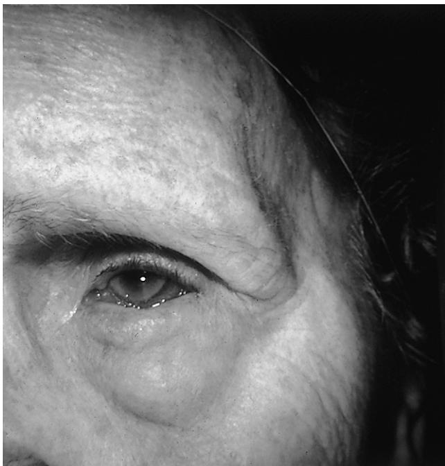

Figure 96-1. Prolapse of orbital fat through atrophic fascial planes in the eyelid produces "bags" under the eyes. *(Courtesy of Murray Meltzer, MD.)*

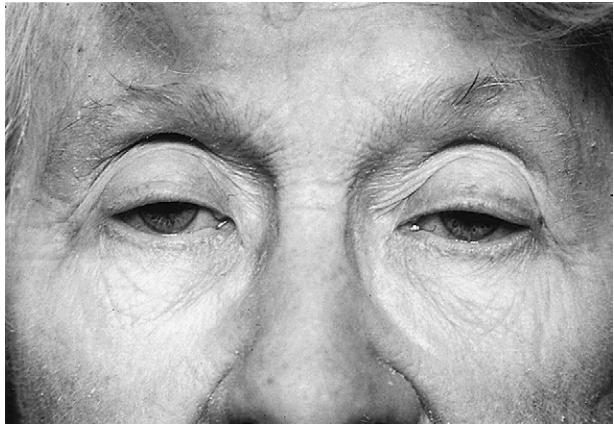

Figure 96-2. Senile ptosis. Note the low lid level and the loss of the normal lid folds. *(Courtesy of Murray Meltzer, MD.)*

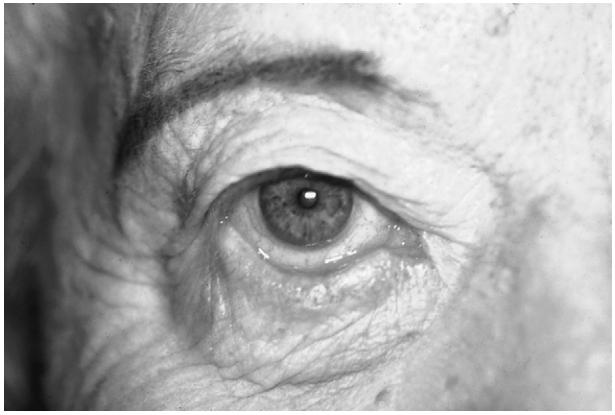

Figure 96-3. Ectropion. Laxity of the lower eyelid allows the lid margin to rotate away from the eyeball. *(Courtesy of Murray Meltzer, MD.)*

occlusion of the lacrimal puncta may be performed, in order to conserve the available tears.

Obstruction of the lacrimal ducts also leads to epiphora. Uncomplicated mechanical stenosis may occasionally be relieved with simple probing, but severe cases (often following bacterial infection of the lacrimal sac) are treated surgically: a dacryocystorhinostomy is performed to anastomose the mucosa of the nasal cavity to the lacrimal sac through an osteotomy made in the lacrimal bone.15

# **CONJUNCTIVA**

Subconjunctival hemorrhage, a localized accumulation of blood seen between the conjunctiva and the globe, is frequently encountered in the elderly, either following minor trauma or occurring spontaneously (Figure 96-5; see also Plate 96-2). Such hemorrhages are rarely of any consequence, but they are often alarming in appearance. They resolve spontaneously without treatment over a period of several days. Occasionally, recurrent hemorrhages may suggest an underlying disease such as hypertension or a coagulation disorder.

Chronic exposure to sunlight, particularly at tropical latitudes, may cause a degeneration of the connective tissue in the exposed sector of the conjunctiva between the eyelids, leading to thickening of the conjunctiva (pingueculum),

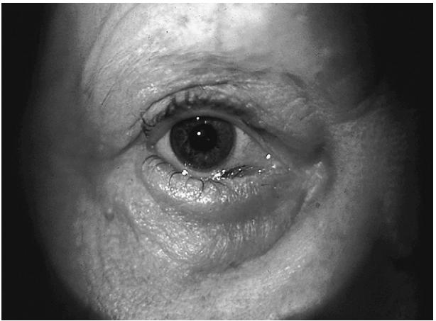

Figure 96-4. Entropion. Breakdown of the adhesion between the tissue planes in the eyelid allows the muscle tone of the orbicularis oculi muscle to rotate the lid margin inward. The eyelashes may chronically irritate the surface of the eyeball. *(Courtesy of Murray Meltzer, MD.)*

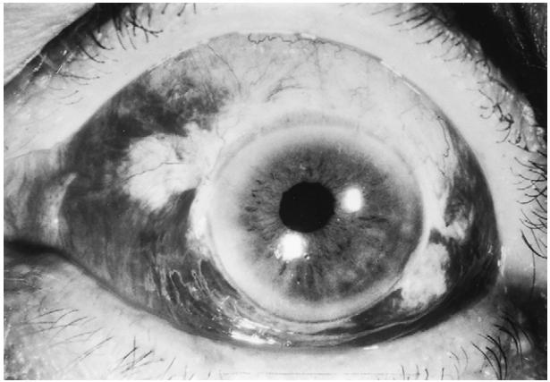

Figure 96-5. Subconjunctival hemorrhage. This small hematoma, seen through the transparent conjunctiva, is benign unless recurrent.

which may grow over the cornea from the periphery toward the pupil (pterygium). If the growth threatens to cover the visual axis, surgical excision may be indicated. Recurrence after surgery is, unfortunately, not uncommon.16

Tumors such as squamous cell carcinoma and melanoma may arise from the conjunctiva. Local excision and cryoablation may be adequate in early cases, but advanced cases may require orbital exenteration.17

# **CORNEA**

The eye is unique in its requirement for transparent tissues, including the cornea and crystalline lens. The need for transparency places many constraints on the architecture and metabolism of these ocular structures. In particular, the eye must nourish these tissues with a cell-free fluid, as red blood cells preclude transparency. Similarly, the transparent tissues must rely primarily on anaerobic glycolytic metabolism, as the enzyme systems required for oxidative phosphorylation (aptly named cytochromes) strongly absorb visible light. Even in the absence of these absorbent components, the tissues must be constructed in a highly compact and regular manner, so that light scattering from tissue organelles does

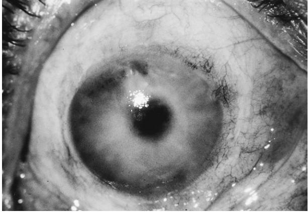

Figure 96-6. Corneal edema. The cornea is thickened and cloudy because of failure of the corneal endothelium to adequately dehydrate the tissue. *(Courtesy of Calvin Roberts, MD.)*

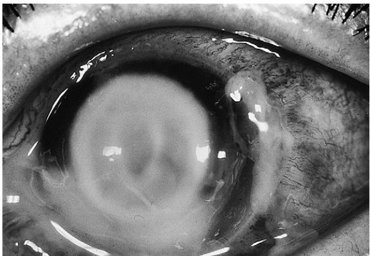

Figure 96-7. Corneal ulcer. A localized infection causes an epithelial defect and attracts an infiltrate of white blood cells. *(Courtesy of Michael Newton, MD.)*

not cause a white, opaque appearance. This requirement is met in the case of the cornea by a highly regular arrangement of collagen fibrils and an active metabolic pump in the corneal endothelial cell layer, which dehydrates the corneal stroma. (Absence of these tissue features explains why the sclera, which is otherwise histologically similar to the cornea, is opaque.18)

The corneal endothelial cells, on which the dehydration critical for corneal transparency depends, do not divide during adulthood. Indeed, the endothelial cell density declines slowly with age.19 If the number of endothelial cells falls below a critical level, the cornea imbibes fluid, swells, and becomes cloudy (Figure 96-6; see also Plate 96-3). Edema fluid percolates to the epithelial surface and may coalesce into subepithelial bullae. Mild cases may be managed with the use of hypertonic saline eyedrops and ointment to withdraw fluid from the cornea osmotically. If these measures fail, a corneal graft, which replaces the deficient endothelium, is necessary to restore vision.20

Bacterial ulcers of the cornea (Figure 96-7; see also Plate 96-4) seem to occur with greater frequency in the elderly, perhaps reflecting impairments of tear secretion, epithelial integrity, and cellular and humoral immunity, and are associated in the elderly with a poorer prognosis.21 Intensive antibiotic therapy is generally required.22

The ring-shaped deposition of lipid in the far periphery of the cornea, referred to as *arcus senilis*, is completely benign.

#### **UVEAL TRACT**

The uveal tract (*uvea*) comprises the iris, ciliary body, and choroid, which form a continuous, highly vascular layer inside the sclera. Inflammation of the uvea occurs frequently: as a primary disease process, in response to infections, in many patients with rheumatic disease, and as a sequela to accidental or surgical trauma. Clinically, inflammatory cells are seen in the aqueous or vitreous humor. These inflammatory reactions can cause ocular injury by many mechanisms. They may occlude the trabecular meshwork, causing glaucoma. They may accumulate on the inner surface of the cornea as keratic precipitates, where they may injure or destroy the corneal endothelial cells and cause corneal edema. Inflamed tissues often develop pathologic adhesions, which may derange normal ocular function. Adhesions between the anterior surface of the peripheral iris and the anterior chamber angle (peripheral anterior synechiae) may occlude the trabecular meshwork, leading to chronic angle-closure glaucoma. Adhesions between the posterior surface of the iris and the anterior surface of the crystalline lens can seal off access of the aqueous humor to the anterior chamber (pupillary block), forcing the iris to bow forward (iris bombé). In cases where the peripheral iris becomes apposed to the trabecular meshwork, the egress of aqueous humor from the eye is blocked, resulting in angle-closure glaucoma. In the posterior segment, inflammatory cells in the vitreous humor may obscure vision and lead to fibrovascular proliferation that may distort the retina, or even cause a retinal detachment.

Treatment in most cases of uveitis is generally empirical. Dilation of the pupil with cycloplegic eyedrops is generally advisable to prevent posterior synechiae and pupillary block and to relieve the discomfort (photophobia) caused by light-induced miosis of the inflamed iris. If the inflammation is confined to the anterior segment, topical corticosteroid eyedrops are usually sufficient. In cases involving the posterior segment, periocular corticosteroid injections or systemic administration of corticosteroids are frequently required. Typically, workup for associated systemic disease is appropriate. If a treatable condition is discovered, such as syphilis or tuberculosis, specific treatment for the underlying condition may simultaneously cure the uveitis. In refractory cases, success may often be achieved with systemic administration of immunosuppressive drugs.23

Intraocular tumors in the elderly occur most frequently within the uveal tract. Melanomas are the most common primary tumor. Though prompt enucleation (surgical removal of the eyeball) was long the traditional management, many authorities now recommend that eyes containing small uveal melanomas be followed closely, rather than enucleated, as they have only a low propensity for metastasis.24 Medium-sized tumors have been successfully treated in many cases with irradiation, either by temporary implantation of a radioactive plaque applied to the overlying sclera25 or administered by external beam.26 A large, prospective, clinical trial found no difference in 5-year survival between groups of patients randomized to treatment by radioactive plaque or by enucleation.27 Primary enucleation is often

#### Major Causes of Blindness in the Elderly

| In Developed Countries • Cataract  |
|---------------------------------------|
| • Glaucoma                            |
| • Diabetic retinopathy                |
| • Macular degeneration                |
| In Developing Countries • Cataract |
| • Corneal scarring                    |
| • Glaucoma                            |
| • Diabetic retinopathy                |
| • Macular degeneration                |

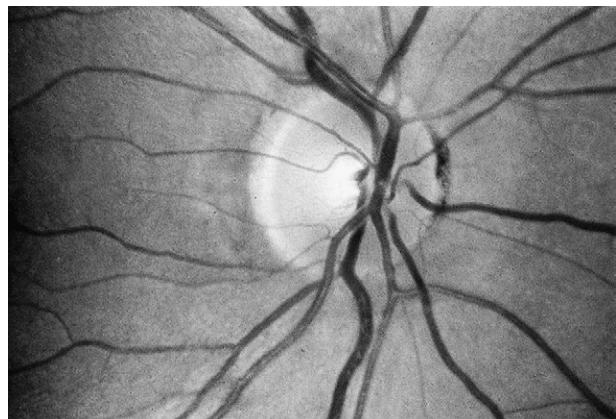

Figure 96-8. Normal optic nerve head. Cup-to-disc ratio is about 0.3.

recommended for large tumors. Metastatic melanoma is usually detected initially in the liver. Regular physical examinations and monitoring of hepatic enzyme activity in the serum are advisable for patients at risk.

Tumors metastatic to the choroid are actually more frequent than primary intraocular tumors. Lung primaries predominate in men, breast primaries in women.28 As the eye is seldom the sole site of metastasis, these patients generally require systemic chemotherapy.

# **GLAUCOMA**

Glaucoma is a form of progressive atrophy of the optic nerve, frequently associated with increased intraocular pressure (Figures 96-8 and 96-9; see also Plates 96-5 and 95-6).

# **Open-Angle Glaucoma**

In many cases, the primary pathology is presumed to lie in the trabecular meshwork, the ring of porous tissue located in the anterior chamber angle through which aqueous humor drains from the eye. Impaired facility of aqueous outflow through the trabecular meshwork is generally idiopathic (so-called primary open-angle glaucoma). This condition is generally reported to increase in prevalence with increasing age, at least in most Western populations.29 Loss of outflow facility may also arise from various insults to the trabecular meshwork, including trauma, uveitis, hemorrhage, and dispersion of intraocular pigment.

Visual impairment from open-angle glaucoma is generally insidious and chronic, with visual field damage occurring initially in the far periphery, where it is rarely noticeable except by formal testing. Our ability to diagnose this condition in its early stages is quite imperfect. The actual risk of visual field loss in untreated individuals with modestly elevated intraocular pressure is only 1% to 2% per year;30 conversely, histologic studies have shown that as many as 40% of the optic nerve fibers must be destroyed before any abnormality of the visual field is detectable by standard techniques.31

Initial treatment is usually medical. The goal of therapy is to lower the intraocular pressure, with topical (or rarely, systemic) medications, to a level that is tolerated by the optic nerve, as demonstrated by the arrest of progressive visual field loss. Available medications include parasympathomimetic miotics (rarely used), anticholinesterase miotics

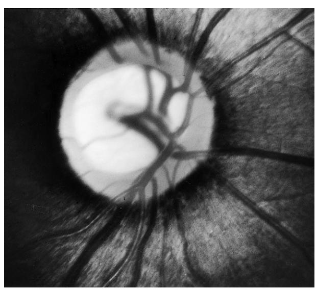

Figure 96-9. Glaucomatous optic nerve head cupping. Loss of neural tissue is seen as narrowing of the neural rim of the optic disc and enlargement of the central cup. (Compare with Figure 96-8.)

(rarely used), sympathomimetics, β-adrenergic blockers, carbonic anhydrase inhibitors, and prostaglandin analogs. The potential side effects of the various topical and systemic pressure-lowering drugs are occasionally serious, particularly in elderly patients (see Systemic Complications of Ophthalmic Medications, presented later). If medical treatment is unsuccessful or poorly tolerated, intraocular pressure may be further lowered by laser treatments to the trabecular meshwork or by "filtering surgery," which creates a fistula between the anterior chamber and the subconjunctival space, allowing easier egress of aqueous humor. Complications of filtering surgery may include hypotony, choroidal effusion, and cataract. Supplementary medical treatment after filtering surgery is may also be required. The optimal stage in the disease process for surgical intervention is unclear. Some authors have reported better long-term visual results with earlier surgery.32 One large study suggests that laser treatment to the trabecular meshwork may also be suitable as initial therapy.33

#### **Angle-Closure Glaucoma**

Occasionally, alterations in intraocular anatomy may predispose the iris to cover the trabecular meshwork, suddenly preventing aqueous outflow and causing an acute elevation of the intraocular pressure. Common scenarios include adhesions between iris and lens (pupillary block), which may cause the iris to bow forward so as to occlude the trabecular meshwork, and dilation of the pupil, such as may occur spontaneously in the dark or following pharmacologic mydriasis. Gradual enlargement of the lens with increasing age or cataract formation is an important factor that predisposes the eye to this process in the elderly. Acute angle-closure glaucoma is generally a dramatic event, with symptoms including severe pain, blurring of vision, perception of colored haloes around lights, nausea, and vomiting. Diagnosis of acute angle closure is easy once attention is directed to the eye, but it may be missed if attention is diverted to the gastrointestinal symptoms. Cases have been reported from the emergency departments of general hospitals where concentration on the nausea and vomiting of a patient with acute angle closure has led to exploratory laparotomy!

The massive elevation of intraocular pressure following acute angle closure (often to triple the normal upper limit of 21 mmHg) may cause permanent optic nerve damage within a matter of weeks. Acute angle closure is initially treated by lowering the intraocular pressure with systemic and topical medications, including miotic eyedrops and systemic osmotic agents. In cases of pupillary block, a small hole (peripheral iridotomy) is made in the iris by laser or invasive surgery to bypass the pupillary block and allow passage of aqueous humor from the posterior segment into the anterior chamber. This prevents subsequent angle-closure attacks. Because the anatomic factors that predispose an eye to acute angle closure are generally found bilaterally, it is usually considered prudent to perform a peripheral iridotomy prophylactically in the fellow eye after an attack of angle closure.

Prolonged episodes of angle closure may result in permanent damage to the trabecular meshwork or even adhesions between the iris and sectors of the trabecular meshwork, leading to chronic angle-closure glaucoma. If the angle is sufficiently compromised, filtering surgery may be necessary.

#### **Normal-Tension Glaucoma**

Although elevated intraocular pressure has historically been the hallmark of the diagnosis of glaucoma, it has become clear in recent decades that many patients with otherwise typical glaucomatous optic atrophy and visual field loss seldom if ever are found to have elevated intraocular pressure. Identification and treatment of this so-called low-tension glaucoma (more accurately termed normal-tension glaucoma) remains problematic, although even in this cohort, reduction of intraocular pressure is thought to convey some benefit. This entity is probably more common than previously thought, as population-based surveys have demonstrated a substantial incidence of otherwise typical glaucomatous field loss in patients with normal intraocular pressures.34

#### **CRYSTALLINE LENS**

The crystalline lens of the eye is a unique ectodermal structure that develops entirely within the primordial lens vesicle. Only the cells on the extreme periphery of the lens divide, adding cells to the outer surface of the growing lens. Thus, the center of the adult lens represents the earliest tissue laid down during embryonic development. There is no mechanism by which these cells can turn over, unlike the situation in typical ectodermal structures, such as the skin. The metabolism of the lens is largely confined to anaerobic glycolysis, as neither hemoglobin-mediated oxygen transport nor cytochrome-mediated oxidative phosphorylation is available owing to the need for transparency. The lens is at a further metabolic disadvantage because of the need to maintain a state of great disequilibrium with its surroundings, as the lens must maintain the highest protein concentration and one of the lowest water concentrations of any tissue in the body. Thus, relatively modest metabolic insults or osmotic stresses may overwhelm the lens metabolism, resulting in protein denaturation and cataract formation.35

The lens of the eye continues to grow and mature throughout life. As the lens ages, it becomes more rigid and responds less effectively to changes in ciliary muscle tone, decreasing the effectiveness of accommodation, the eye's mechanism for focusing from distant to near objects. This loss of accommodation (presbyopia) is managed with reading glasses, bifocals, or other refractive strategies.

The lens responds to virtually any mechanical or metabolic insult by loss of optical clarity, resulting in the formation of a cataract (Figure 96-10; see also Plate 96-7). Several patterns of opacities are commonly encountered:

Oxidation ("browning reactions") of lens proteins, particularly in the older, central portions of the lens, is referred to as *nuclear sclerosis*, which may result in alterations in the refractive index of the lens as well as frank opacity. The most common refractive change is in the direction of an increase in myopia or decrease in hyperopia. In some instances, this refractive shift will allow the patient to read without reading glasses (so-called second sight). This improvement in visual performance is usually only temporary and often heralds the development of a more debilitating lens opacity. Refractive changes in the lens need not be uniform. Patients will occasionally report monocular diplopia resulting from inhomogeneous refraction by distinct portions of the lens resulting in two distinct images being formed on the retina.

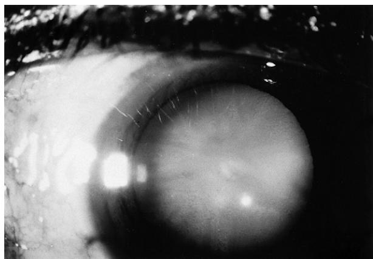

Figure 96-10. Cataract. Loss of transparency of the crystalline lens impairs visual acuity. *(Courtesy of Calvin Roberts, MD.)*

(The notion that monocular diplopia is generally indicative of hysteria is incorrect.)

Denaturation of lens proteins in a sector of adjacent cortical lens fibers results in a wedge-shaped or cuneiform cortical opacity. These are often found in the far periphery of the lens but frequently spare the optical zone near the center.

Aberrant proliferation of lens fibers on the posterior lens capsule produces a posterior subcapsular cataract. These are often induced by topical or systemic corticosteroid treatment and are frequently seen in other disease states, such as retinitis pigmentosa.

Treatment of cataract is generally surgical. With rare exceptions, the lens proteins that constitute the opacity are irreversibly denatured, precluding medical treatment.36 Surgical strategies for removal of the lens material have evolved greatly. In all cases, an incision must be made in the eyeball. A cataract cannot be removed—even with a laser—without an ocular incision. The simplest operation is to remove the entire lens intact within its lens capsule, a so-called intracapsular procedure. At present, the extracapsular procedure, in which the opaque lens tissue is carefully aspirated from within the lens capsule, has become standard, as retention of the capsule to serve as a barrier between the anterior and posterior segments of the eye appears to reduce the rate of complications. Recently, greater emphasis has been placed on the development of minimally invasive surgical methods for cataract extraction. Often, the cataract can be liquefied by the mechanical action of a rapidly vibrating needle (phacoemulsification) and aspirated from the eye through an incision only 3 to 4 mm in length.37 Frequently, such wounds can be constructed to be self-sealing, eliminating the need for sutures.38

Indications for cataract surgery should be determined in relation to the visual needs of each individual patient. Occasionally, cataract extraction is recommended for technical reasons, such as those rare cases when the lens is itself causing injury to the eye (as in phacolytic glaucoma, when lens proteins leak from a cataractous lens and occlude the trabecular meshwork) or when a cataractous lens prevents adequate visualization or treatment of disease of the posterior segment of the eye, such as diabetic retinopathy. Otherwise, cataract surgery is appropriate whenever the anticipated improvement in visual function would be of benefit to the patient. In general, a visual result of 6/12 (20/40) or better may be anticipated in 90% to 95% of cases without other known concurrent ocular disease; thus, surgery is generally recommended only when the acuity has fallen to the level of 6/15 (20/50) or worse. In some patients, difficulties with glare, contrast sensitivity, diplopia, or specific occupational demands may justify cataract extraction even with less severe loss of visual acuity.

Optical rehabilitation of the aphakic eye requires replacement of the focusing power of the cataractous lens that was removed. Where economic conditions permit, this is usually provided by means of a plastic intraocular lens prosthesis, which is generally implanted at the time of the primary cataract operation. Recent intraocular lens designs are even able to restore a degree of accommodation, reducing the need for reading glasses or bifocals in many cases.39 Alternatives include contact lenses (often worn on an extendedwear basis) and thick "aphakic" spectacles, which subject the patient to substantial optical distortions and (if the aphakia is unilateral) may cause substantial difficulties because of unequal perceived image size in the two eyes. (Indeed, the difficulties with spectacle correction of unilateral aphakes are sufficiently severe that, if spectacle correction is the only modality of optical rehabilitation available, most surgeons recommend deferral of surgery until visual acuity in the *better* eye falls to 6/18 [20/60] or worse.) In some Third World countries, local custom may discourage the use of spectacles after cataract surgery. In these situations, the attitudes of the patient must be taken into account in the decision as to whether or not to perform a cataract extraction.

Some yellowing of the lens proteins is nearly universal with aging. Sufficient opacity to impair visual acuity results in more than 1.5 million cataract extractions each year in the United States, the vast majority in individuals over 65 years of age. In developing countries, the rate of cataract formation appears to be even higher, so that untreated cataract typically forms the largest single cause of acquired blindness.3 In India, for example, even at the present rate of millions of cataract procedures each year, present surgical efforts continue to fall behind the rate of new cataract formation in the general population.40

Cataract formation may occasionally reflect an underlying metabolic abnormality, such as galactosemia or renal failure. Cataract onset is accelerated in diabetic patients and may be triggered by various drugs (particularly topical or systemic corticosteroids). In addition to these specific associations, several studies have shown a nonspecific excess mortality among cataract patients compared with age-matched control patients undergoing other elective surgical procedures.41,42

# **RETINA AND VITREOUS**

Diseases of the retina, particularly diabetic retinopathy and so-called age-related macular degeneration (formerly referred to as "senile macular degeneration") constitute the most frequent cause of acquired blindness, at least in developed countries.

# **Diabetic Retinopathy**

Diabetic retinopathy shows a steady increase in incidence and severity with increasing duration of diabetes mellitus, with significant visual complications rarely occurring before 10 to 15 years after the onset of the disease.43 Thus, while juvenile-onset (type I) patients may develop severe retinopathy as early as the third decade, the retinal burden of adult-onset (type II) patients is borne largely by the elderly. The disease seems to attack primarily the retinal capillary circulation. Initially, small, innocuous microaneurysms are noted ophthalmoscopically. With time, the retinal capillaries begin to leak fluid into the surrounding tissue, causing retinal edema and precipitation of exudates into the retina, with a concomitant reduction in visual acuity (Figure 96-11; see also Plate 96-8) At this stage of the disease, loss of visual acuity may be reduced through the use of laser treatments, either directed at leaking microaneurysms or, if the leakage is diffuse, placed in a grid pattern over the leaky sectors of the retinal capillary bed.44

In later stages, perfusion of small regions of the retinal capillary bed fails (capillary dropout), leading to localized retinal infarctions, which may be seen ophthalmoscopically

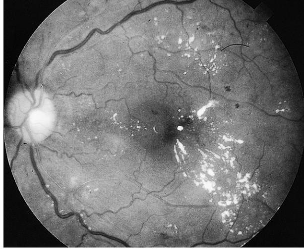

Figure 96-11. Background diabetic retinopathy. Microaneurysms ("dot hemorrhages"), intraretinal hemorrhages ("blot hemorrhages"), and "hard" exudates indicate deterioration of the retinal microcirculation.

as cotton-wool spots. The remaining capillaries are often seen to become dilated, irregular, and leaky. Ultimately, in many patients, the ischemic retina develops a neovascular proliferative response, sprouting new blood vessels that may grow along the retinal surface or along the posterior surface of the vitreous body. These aberrant blood vessels are prone to leaking and hemorrhages. Vision may also be lost through traction exerted on the retina by fibroblastic membranes that accompany the neovascular proliferation (Figure 96-12; see also Plate 96-9). In severe cases, the neovascular response may extend to the anterior segment, producing neovascularization on the surface of the iris (rubeosis iridis). If the fibrovascular membrane extends over the anterior chamber angle, it obstructs filtration of aqueous humor through the trabecular meshwork, producing a refractory neovascular glaucoma.

Proliferative retinopathy may often be arrested through the ablation of a large fraction of the peripheral retina with laser photocoagulation.45 In severe cases, blood in the vitreous cavity and fibrovascular membranes may be removed surgically by introducing mechanized suction-cutter instruments through small scleral incisions over the ciliary body (pars plana vitrectomy).

The benefit of tight control of blood glucose in the management of diabetic retinopathy depends on the stage of the disease. Many attempts to retard the progression of established retinopathy by improving the degree of glucose control have been disappointing.46 Indeed, in some studies, tight control has been associated with a worsening of retinopathy. Similarly, in one study, successful pancreatic transplantation, with near-perfect normalization of blood glucose levels, failed to improve diabetic retinopathy, compared to the retinal disease in fellow pancreatic transplant patients whose allografts failed, requiring resumption of daily insulin injections, with the usual deficiencies in control of blood glucose.47 However, it has been demonstrated (in both type I and type II patients) that better glucose control in recentonset diabetic patients helps retard the onset of diabetic retinal disease.48,49

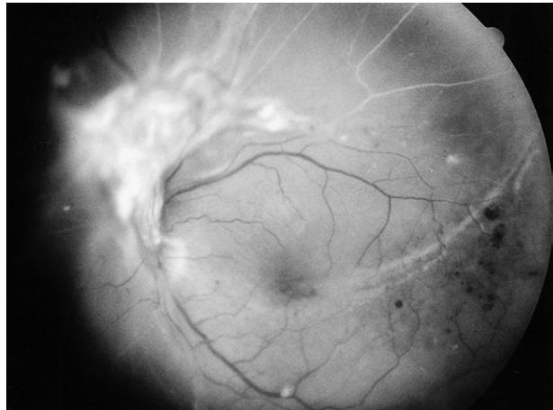

Figure 96-12. Proliferative diabetic retinopathy. A membrane of fibrovascular tissue has sprouted from the optic disc in response to prolonged retinal ischemia.

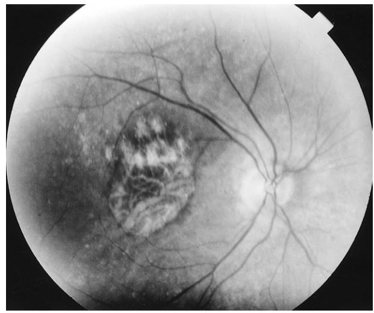

Figure 96-13. Atrophic ("dry") age-related macular degeneration. Geographic atrophy of the retinal pigment epithelium causes loss of central vision.

# **Age-Related Macular Degeneration**

Age-related macular degeneration is a common cause of impaired vision, although not of total blindness, in the elderly population. In the "atrophic" form, the retinal pigment epithelium and choriocapillaris underlying the macula appear to degenerate, resulting in dysfunction of the overlying photoreceptors (Figure 96-13; see also Plate 96-10). There is no known treatment. In the "exudative" form, a neovascular net emanates under the macular region of the central retina from the choroidal circulation, proliferating between the retina and the underlying retinal pigment epithelium or underneath the pigment epithelium.50 Leakage of plasma components and frank subretinal hemorrhage or scarring cause loss of vision (Figure 96-14; see also Plate 96-11).

Treatment of exudative macular degeneration has been revolutionized with the introduction of injectable drugs directed against the tissue factor, vascular endothelial growth factor (VEGF), which is elaborated by ischemic retina, stimulating increased vascular permeability and the sprouting and growth of new retinal blood vessels from adjacent vascular beds.51 The initial anti-VEGF agent Pegaptanib sodium (Macugen, an aptamer directed against VEGF) significantly reduced the likelihood of progression of visual loss in patients with exudative macular degeneration, though improvement of visual acuity with treatment was unlikely.52 The subsequent introduction of ranibizumab (Lucentis, a monoclonal antibody fragment directed against VEGF) has yielded even better results, preventing progression of visual

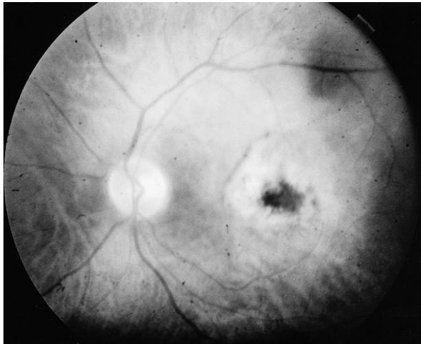

and scarring from a subretinal neovascular membrane destroys central retinal function.

loss in up to 90% of patients and actually inducing significant improvement of visual acuity in up to 40% of patients 53 (Figure 96-15; see also Plate 96-12). Bevacizumab, a similar monoclonal antibody directed against VEGF, has been used extensively to treat exudative macular degeneration on an off-label basis (often at considerable savings compared to ranibizumab) and appears to be equally safe and effective in numerous small case series and large cumulative series.54 A formal head-to-head trial comparing these two drugs is now in progress.

These anti-VEGF treatments are quite demanding of patient and physician. The drugs are administered under operating-room conditions (iodophore skin preparation, sterile drape and lid speculum, sterile gloves) by injection into the vitreous compartment of the eye through the sclera and pars plana of the ciliary body. After injection, the eye must be checked for elevation of intraocular pressure. Injections must be repeated every 4 to 6 weeks, potentially indefinitely. Each eye must be treated separately. Complications are rare, with an infection rate below one per thousand injections in competent hands, and rare incidents of cataract and retinal detachment. Close monitoring of patients in clinical trials of ranibizumab has suggested a possible small excess of thromboembolic events, but this has not been borne out by subsequent clinical experience.

Where available, anti-VEGF treatment has largely supplanted other treatment modalities for exudative macular degeneration. The role of combination treatment with anti-VEGF agents and other modalities (such as photodynamic therapy or corticosteroid medication) continues to be Figure 96-14. Exudative ("wet") age-related macular degeneration. Leakage

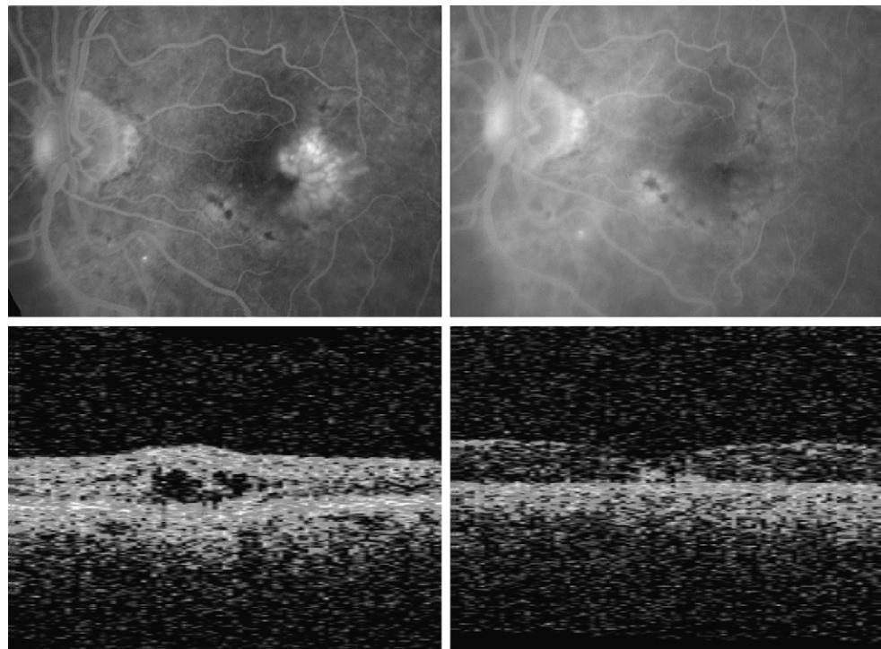

Figure 96-15. Treatment of wet age-related macular degeneration in a 90 year-old woman with intravitreal ranibizumab. Baseline images *(left)* show macular edema in fluorescein angiogram *(top – note patch of white fluorescence at temporal edge of fovea)* and in retinal cross-section as seen in OCT scan image *(bottom – extracellular fluid appears as dark clefts within retinal layers)*. After three injections of ranibizumab, edema has resolved *(right, top and bottom.* Note absence of white fluorescence in angiogram, and resolution of intraretinal clefts in OCT image, with restoration of normal foveal contour). Visual acuity improved from 20/100 (6/30) to 20/40 (6/12).

investigated, but additional benefits beyond those of anti-VEGF treatment have been difficult to demonstrate.55

Previous treatment modalities for exudative macular degeneration have included thermal laser56 and photodynamic treatment using nonthermal laser.57 In favorable cases, laser treatment of neovascular membranes outside of the foveal region may arrest the growth of these membranes before they undermine the central macula, thus helping to preserve central vision. Laser treatment of subfoveal membranes may ultimately limit the size of the central scotoma (blind spot) caused by macular degeneration58 but is seldom recommended if anti-VEGF treatment is available.

Photodynamic therapy is an alternative modality of ablation treatment for subretinal neovascularization. Patients undergo intravenous infusion of a sensitizing agent that binds selectively to neovascular tissue. The involved retinal sector is then treated with a low-power (nonthermal) ultraviolet laser, which interacts with the sensitizing agent to create highly reactive singlet oxygen species in the target tissue. These molecules exert a cytotoxic effect sufficient in many cases to block perfusion of the subretinal neovascularization.57 The treatment effect is often only transient, and retreatments are frequently required. Photodynamic therapy has the potential to ablate subretinal neovascular tissue with considerably less destruction of adjacent, healthy retinal tissue than is typically caused by traditional, thermal, laser treatments. In practice, photodynamic therapy appears to be a modest advance over previous ablation techniques, at least in selected patients,57 but is not as effective as injection of anti-VEGF agents.55

It should be emphasized that these various modalities of treatment for age-related macular degeneration have significant limitations. Anti-VEGF agents are expensive and require frequent injection—in principle, indefinitely. Many patients fail to recover visual acuity. Few patients with advanced visual loss are restored to normal or near-normal visual function.

In both atrophic and exudative types of macular degeneration, the pathologic process appears to be confined to the posterior pole. These diseases thus spare the peripheral retina in nearly all cases, so that most affected patients indefinitely retain sufficient vision for independent ambulation and may be reassured that they are not going to go completely blind.

The pale white dots known as *drusen*, frequently seen in the retinas of older patients, are usually benign. They correspond to small deposits of amorphous hyaline material seen histologically between the Bruch's membrane and the retinal pigment epithelium. However, these lesions appear to serve as a predisposing factor in the evolution of exudative macular degeneration.59 Elderly patients with drusen or who have lost vision in one eye to age-related macular degeneration may be advised to check their vision every day by examination of an Amsler grid, a 10-cm square of ruled graph paper. Any abnormality or distortion of the central vision should prompt an immediate examination of the retina. This will maximize the chance that a subretinal neovascular net will be discovered before it undermines the fovea, when treatment is most effective.

Studies suggest that nutrition may play a role in the development of macular degeneration. In one large prospective randomized study, patients at risk for age-related

macular degeneration were randomized to dietary supplementation with a combination of antioxidant vitamins (C, E, β-carotene, and zinc) or to placebo. Treated patients at high risk for exudative macular degeneration (as indicated by the presence of large or confluent drusen, extensive geographic atrophy or advanced macular degeneration in the fellow eye) experienced a 27% reduction in risk compared with controls.60 There was no benefit to patients at lesser risk. (The antioxidant plus zinc regimen was also of no value in preventing the development of cataracts.) Studies are now in progress to assess the benefit, if any, of additional nutrient supplements, including lutein, zeaxanthin, and omega-3 fatty acids.

#### **Retinovascular Occlusive Disease**

Both retinal arteries and retinal veins are subject to sudden occlusive events, particularly in the elderly. Retinal artery occlusions are usually either embolic or arteritic in nature. Embolic occlusions are due to the occlusion of a retinal artery by a small particle derived from the more proximal circulation, most commonly a cholesterol fragment from an ulcerated atherosclerotic plaque. A small refractile cholesterol crystal may often be visualized within a retinal artery (Hollenhorst plaque). Acutely, the affected sector of the retina appears pale and cloudy. Various measures to encourage migration of the occlusive plaque toward the retinal periphery have been recommended, including lowering of intraocular pressure by medical means or by withdrawal of a small amount of fluid from the anterior chamber with a fine needle and dilation of the retinal arterial tree by breathing an elevated concentration of carbon dioxide. No convincing benefit of these maneuvers has been demonstrated.61

Transient obscurations of vision, typically lasting less than 10 minutes (amaurosis fugax), are generally believed to represent embolic arterial occlusions that are quickly dislodged into the far retinal periphery.62 These attacks indicate an elevated risk of occlusive stroke.63

Arteritic disease (e.g., temporal arteritis) may also cause occlusion of the arteries of the retina or optic nerve head. An elevated erythrocyte sedimentation rate is commonly, but not invariably, observed. The diagnosis is usually confirmed by temporal artery biopsy. Prompt treatment with systemic corticosteroids is indicated and may prevent visual loss in the fellow eye.64 If the diagnosis of temporal arteritis is suspected, most authorities recommend immediate initiation of systemic corticosteroid treatment; it is unwise to wait until the erythrocyte sedimentation rate and the results of a temporal artery biopsy can be obtained, as the fellow eye may lose vision in the interim. If the tests are negative, the steroid treatment can usually be stopped promptly without a period of tapering doses.

Retinal vein occlusions result in a pattern of vascular tortuosity and intraretinal hemorrhage in the affected sector of the retina. Most retinal vein occlusions seem to be due to compression of a retinal vein by an adjacent retinal artery, frequently exacerbated by hypertension, arteriosclerosis, or glaucoma. Although there is no treatment for the occlusion itself, retinal vein occlusion carries a significant risk of subsequent neovascular complications, particularly glaucoma. In cases where retinal ischemia can be demonstrated (typically by fluorescein angiography or electroretinography), retinal ablation by laser photocoagulation can substantially reduce the risk of subsequent neovascularization.65 Attempts to reduce retinal edema with injection of anti-VEGF agents have yielded promising results.66

#### **OPTIC NERVE**

The elderly are particularly susceptible to ischemic injury to the optic nerve. Infarctions of the entire optic nerve head cause sudden obscuration of vision in one eye and present ophthalmoscopically with optic nerve head swelling and hemorrhages. Many patients present with infarction of only a portion of the optic nerve head, resulting in sudden onset of a monocular visual field defect. As with retinal artery occlusions, it is important to distinguish between arteritic and nonarteritic occlusions,67 as only the former respond well to systemic corticosteroids.

Ischemic optic neuropathy is also occasionally seen in the period following otherwise uncomplicated cataract extraction. Visual recovery is rare, and the benefit of corticosteroids in this setting is unproved.68

The term *papilledema* is reserved in ophthalmic usage for optic disc swelling as a result of increased intracranial pressure. In these patients, visual acuity is rarely impaired (at least initially); the only visual field abnormality is typically an enlarged blind spot. In chronic papilledema, optic atrophy may ensue, with progressive visual impairment. Treatment is directed at the underlying intracranial cause of the increased pressure. In occasional cases of idiopathic intracranial pressure elevations (pseudotumor cerebri), medical treatment with carbonic anhydrase inhibitors or surgical decompression of the central nervous system via a shunt or fenestration of the optic nerve sheath may be of value.69 Other causes of optic disc swelling that must be distinguished from papilledema include ischemic optic neuropathy, malignant hypertension, and severe uveitis.

#### **NEURO-OPHTHALMOLOGY**

The oculomotor nerves and the posterior visual pathways are targets in the elderly for ischemic injury and for compressive injuries caused by intracranial mass lesions (typically tumors or aneurysms) and shifts of the intracranial contents. Sudden loss of function of a *single*, isolated cranial nerve is quite common. An isolated trochlear or abducens nerve palsy in a patient otherwise susceptible to atherosclerotic disease is usually a benign event, and spontaneous recovery is frequently seen.70 Ischemic insults to the oculomotor nerve typically spare the pupillary fibers.71 Patients with *multiple* cranial nerve deficits or in whom pupillary dilation has occurred require a thorough neurologic evaluation, preferably including computed tomography or magnetic resonance imaging, if available.

Abnormalities of the visual field should be thoroughly investigated. Scotomas that affect only one eye or that respect the horizontal meridian are generally the result of injury to the retina, optic disc, optic nerve, or to glaucoma. Injuries at or posterior to the level of the optic chiasm will impair vision in both eyes. Of particular importance are bitemporal hemianopsias, which suggest compression of the optic chiasm, typically by a pituitary tumor, and highly congruous homonymous field defects, which suggest an injury of the occipital cerebral cortex.

#### **ORBIT**

Tumors of the orbit generally present with horizontal, vertical, or anterior displacement of the globe (proptosis). In the elderly, the most frequently diagnosed entities include orbital pseudotumor (idiopathic inflammation of one or more orbital tissues, typically the extraocular muscles, lacrimal gland, or infiltration of the orbital fat), hemangiomas and lymphangiomas, lymphomas, and primary tumors of the lacrimal gland. Management frequently requires orbital exploration for histopathologic diagnosis, as well as for anatomic correction.72

Thyroid ophthalmopathy (Graves disease) is a wellknown orbital problem. The impairment of ocular motility, lid retraction, and exophthalmos are largely due to the infiltration of the extraocular muscles. The orbital fat is rarely, if ever, involved.73 Progression of the orbital disease is poorly correlated with the actual thyroid hormone levels, and restoration of the euthyroid state, although desirable for many reasons, is not particularly effective as a tool in the management of the ocular complications. Early cases respond well to systemic corticosteroids, but the benefits are often only temporary. In long-standing cases, patients should be monitored closely for signs of optic nerve compression and should be promptly offered surgical decompression (generally achieved by fracturing the orbital bones to provide greater room for the swollen orbital contents) if the optic nerve is at risk.74

# **OPHTHALMIC COMPLICATIONS OF SYSTEMIC DISEASES**

The vision of elderly patients is at risk, not only from primary ocular diseases, but from the effects of systemic diseases as well. In addition to the effects of diabetes mellitus and thyroid disease mentioned earlier, a few of the more prominent disease entities with serious ophthalmic sequelae include hematologic disorders (such as leukemia and polycythemia), rheumatic diseases (including rheumatoid arthritis, ankylosing spondylitis, and systemic lupus erythematosus), Marfan syndrome, and renal failure. Treatment is usually directed at the primary disease process, but topical or systemic corticosteroids may be needed to control ocular inflammation.

In addition to the local, mechanical effects of metastasis to the eye or orbit, systemic malignancy may also exert a deleterious remote effect on retinal function, greatly impairing vision.75 Chemotherapy directed at the primary malignancy has occasionally led to visual improvement.

# **OPHTHALMIC COMPLICATIONS OF SYSTEMIC MEDICATIONS**

Many elderly patients receive several concurrent medications, some of which may frequently cause ocular symptoms. A few of the more common problems are described here.76

Tricyclic antidepressants have a mild parasympatholytic action, which may cause mydriasis and paralysis of accommodation. Major tranquilizers, such as chlorpromazine, may also cause mydriasis and interfere with accommodation and may cause a pigmentary retinopathy. Significant visual impairment has generally been reported only with protracted, chronic use. Chloroquine may also cause a "bull's-eye" maculopathy with impairment of central vision, particularly after prolonged use with a total dosage exceeding 100 g of the chloroquine base. Hydroxychloroquine appears to be less retinotoxic than chloroquine.

Systemic corticosteroids may precipitate an open-angle glaucoma (which frequently does not abate until several weeks after cessation of the drug), as well as accelerate the formation of cataracts. Digitalis derivatives may produce various visual disturbances, in addition to the classic "yellow vision" (xanthopsia). Ethambutol is also reported to produce dyschromatopsia, as well as optic atrophy and visual field defects. The antiimpotence drugs such as sildenafil may cross-react slightly with the retinal isoform of phosphodiesterase and may cause transient perception of a bluish haze or increased light sensitivity.77

Precipitation of an acute angle-closure attack by the mydriatic action of systemic medications is extremely rare.

# **SYSTEMIC COMPLICATIONS OF OPHTHALMIC MEDICATIONS**

Because the dosages of topical eye medications are generally much smaller than the dosages used in systemic treatment, systemic complications from use of eyedrops are rare. However, these drugs are rapidly absorbed across the conjunctiva and nasal mucous membranes and occasionally cause systemic complications. Of course, it is also sometimes necessary to treat localized eye disease with systemic medications, which may cause further systemic problems.76

The topical anticholinergics used as mydriatic/cycloplegics may occasionally cause the full spectrum of systemic atropinic toxicity. Of the drugs in common use, cyclopentolate appears to cause these problems most frequently. Conversely, the parasympathomimetics, such as pilocarpine and carbachol, and the anticholinesterases, such as echothiophate, may cause side effects such as abdominal cramps, diarrhea, and nausea.

Topical adrenergic agents, such as Neo-Synephrine, may cause tachycardia, hypertension, and even frank arrhythmias. Conversely, topical β-blockers, such as timolol maleate, may cause the full spectrum of side effects of β-blockade, including bradycardia, asthma, and hypotension. The use of "cardioselective" β-blockers, such as betaxolol, has not completely eliminated these problems.

Topical use of chloramphenicol has resulted in a few reported cases of aplastic anemia, generally after prolonged treatment. There have also been rare reports of Stevens-Johnson syndrome following topical administration of sulfa antibiotics. Otherwise, there are few reports of serious systemic toxicity from topical antibiotics, other than local ocular hypersensitivity reactions.

Mannitol and glycerin are administered as osmotic agents to lower intraocular pressure in acute glaucoma. The fluid shifts that result may also cause congestive heart failure, renal shutdown, and altered mentation. Patients undergoing repeated treatments should be closely monitored for electrolyte imbalances and signs of renal decompensation.

Systemic carbonic anhydrase inhibitors, such as acetazolamide and methazolamide, are occasionally used to treat glaucoma. These are difficult drugs for many patients, frequently causing anorexia, depression, impotence, and paresthesias, in addition to such rare complications as bone marrow depression, gout, and acidosis. Carbonic anhydrase inhibitors are now available in topical formulations, which have largely eliminated many of these complications. Patients whose quality of life is intolerable on these medications should be offered medical or surgical alternatives.

# **LOW-VISION REHABILITATION**

The rehabilitation of individuals who have sustained an irremediable loss of vision is an important component of effective medical care, particularly among the elderly. In the United States, more than two-thirds of individuals with acuity less than 6/18 are over 65 years of age. Conversely, of individuals over 65 years of age, 7.8% are reported to have acuity worse than 6/18, a fraction that increases to 25% among individuals over 85 years old. Loss of vision has been ranked as the third most common chronic condition (after arthritis and heart disease) for which individuals over the age of 70 require assistance with the activities of daily living.78

Low-vision rehabilitation attempts to allow visionimpaired individuals to make the most effective use of whatever vision they retain, so as to facilitate activities of daily living, prolong independence, and enhance self-confidence. Successful rehabilitation frequently requires the coordinated efforts of a team of care providers, including the ophthalmologist, optometrist, and occupational therapist, as well as the assistance and understanding of the patient's family and friends or caretakers. Rehabilitation is generally most successful if it begins as soon as permanent visual disability has been diagnosed. Critical to the functional outcome is the acceptance by the patient of the need to adopt compensatory visual strategies to cope with the loss of vision, rather than to continue vain attempts to reverse the visual loss.

Rehabilitation programs should center on the needs of the patient. A thorough functional history should be obtained. Emphasis should include the patient's perceptions of the impact of the visual disability on accustomed activities and on goals for the future. Every attempt should be made to identify specific tasks that the patient's visual limitations have curtailed and whose recovery would be particularly valued. Typical problems include inability to read, mend, or pay bills; loss of independent mobility; and difficulty with distance vision, such as watching television or reading signs.

The severity of the visual deficit should be determined, including measurements of visual acuity, visual fields, and contrast sensitivity. It is often helpful to be more specific in identifying the level of visual acuity than is typical in general ophthalmic practice. Placement of eye charts as close as 1 m may be used to expand the range of acuity testing. It is frequently essential to allow a substantially greater amount of time than usual for visual assessment in low-vision patients, especially the elderly.

Rehabilitation may then proceed.79 A comprehensive program frequently entails the dispensing and instruction in the use of optical aids (such as spectacles, telescopes, and magnifiers) and nonoptical aids (such as improved lighting, largeprint reading materials, high-contrast guides for reading and writing, and closed-circuit television magnifiers). Training in the use of residual vision, such as eccentric viewing for individuals who have lost central macular function, may be attempted but may require many hours of practice over many months in order to obtain optimal performance. Training in

# KEY POINTS

#### Treatments for Major Causes of Blindness

#### Cataract

• Surgical extraction, ideally with intraocular lens implant

#### Glaucoma

- Initial: lower intraocular pressure with topical, systemic medications
- Additional options: laser treatment to trabecular meshwork; filtering surgery

# Diabetic Retinopathy

- Tight control prevents or delays retinopathy in early stages
- Focal or grid laser treatment for macular edema
- Pan-retinal laser treatment for proliferative retinopathy
- Pars-plana vitrectomy for persistent vitreous hemorrhage or traction retinal detachment

# Macular Degeneration

- Atrophic ("Dry")
	- No treatment available
- Exudative ("Wet")
	- Injection of anti-VEGF agents
	- Photodynamic therapy
	- (Thermal) laser ablation of neovascular membranes
- Dietary supplement with antioxidant vitamins and zinc may reduce risk of progression from "dry" to "wet" macular degeneration.

adaptations for activities of daily living and the introduction of suitable equipment, such as needle threaders or large-print playing cards, can help recapture self-confidence and facilitate independence. Professional counseling, often in a group setting, can play an important role in helping patients deal with the emotional impact of visual disabilities.

It is important that the patient adopt reasonable goals for low-vision rehabilitation. In nearly every case, it is impossible to recover the efficiency enjoyed before the loss of visual function. Each patient must individually decide whether the results achieved are worth the extra effort that will remain necessary to perform most visual tasks. The best results are achieved when specific tasks are targeted.

For a complete list of references, please visit online only at www.expertconsult.com