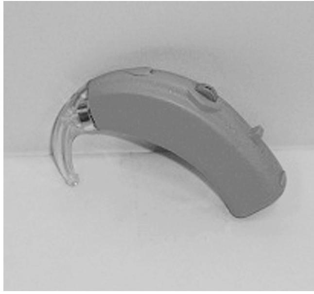
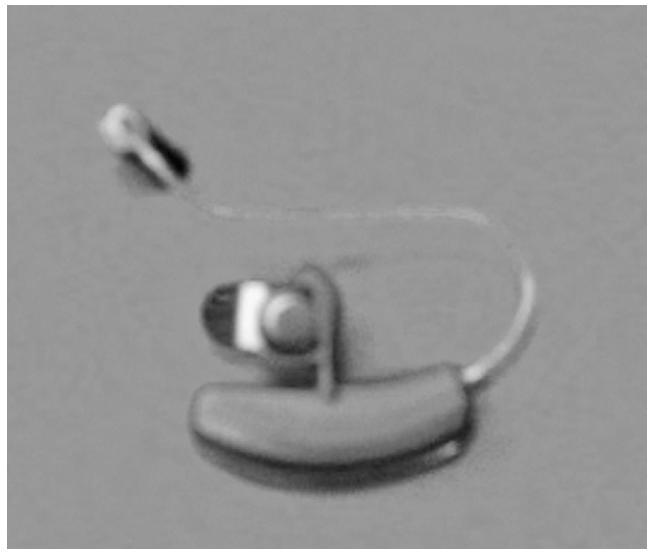
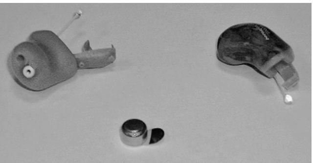
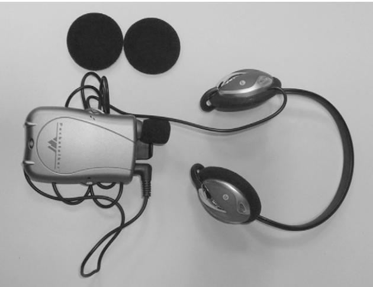
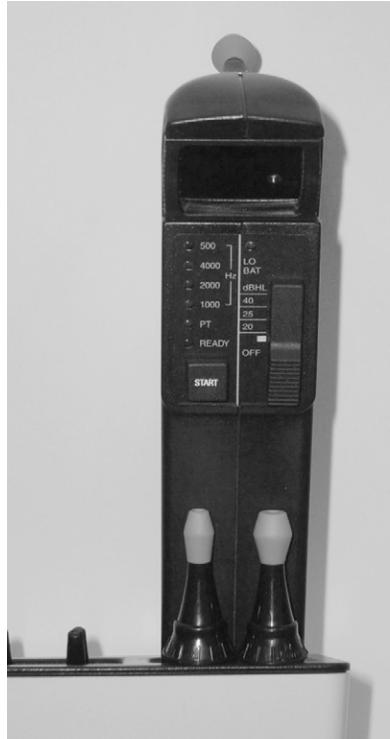

# **DEMOGRAPHICS OF AGING AND HEARING LOSS**

Americans are living longer and are healthier and wealthier than ever before. Life expectancies at ages 65 and 85 have increased dramatically. Under current mortality conditions, people who survive to age 65 can expect to live an average of nearly 18.7 more years, almost 7 years longer than persons aged 65 in 1900. The life expectancy of persons who survive to age 85 today is about 7.2 years for women and 6.1 years for men. Hence, in the United States half of all people who have ever lived to age 65 are currently alive. The increase in longevity brings with it an increase in the amount of time spent in all major activities including work and retirement. A significant proportion of older adults are gainfully employed. Labor force participation rates have risen dramatically for older men and women over the past few decades. Baby boomers are expecting to work longer; in 2004, a substantially larger proportion of people in their early to mid-50s work after 65 years of age as compared to 1992. Of interest is that in 2006, 15% of people over 65 were in the labor force. Because of the increase in life expectancy, older adults are spending a good deal of life in retirement. In fact, the average man aged 20 today can expect to spend a third of his life in retirement. The ability to communicate effectively takes on even greater importance as we move through the twenty-first century because of the lifestyle trends characterizing older adults, the increase in average income projected for older adults over the next 40 years, and declining disability rates.

As people age, the likelihood of experiencing one or more chronic conditions increases. Approximately 88% of adults over age 65 suffer from at least one chronic medical condition that requires ongoing care and management. Interestingly, 75% of U.S. health care expenditures are for the treatment of chronic conditions. Currently, 65% of Medicare beneficiaries have two or more chronic conditions, 43% have three or more, and 24% have four or more types of chronic conditions.1 Hearing impairment is a major chronic condition recently recognized as a major public health problem. Currently, approximately 30% of the population over 65 years of age is hearing-impaired, rising to 40% to 50% among persons older 75 years and to more than 80% in persons over 85 years of age. The risk of experiencing a hearing loss increases dramatically with each additional decade. Nearly half of the 76 million baby boomers in the United States experience some degree of hearing loss. Self-reported hearing problems are less prevalent among persons of Asian and African decent than among whites or Native Americans. In addition to ethnicity and race, gender and baseline hearing thresholds and frequency play a role in hearing loss progression and severity.2 The high prevalence of hearing impairment among persons over 85 years has implications for nursing home staff, as the majority of residents of nursing homes are in their ninth decade of life. That is to say, hearing loss will be the rule rather than the exception among nursing home residents and homebound older adults. It is projected that by the year 2030, at least 21 million Americans beyond age 65 will have a hearing impairment. Approximately 11% of adults suffering from age-related hearing loss experience permanent tinnitus, most commonly described as ringing in the ear. The prevalence of tinnitus rises with age, and agerelated hearing loss is a major predictive factor. The sensation of dizziness is highly prevalent among people over the age of 65, accounting for 8 million primary care physician visits in the United States. Dual sensory impairments are prevalent among older adults, as well. Of persons over 70 years of age, 18% are reportedly blind in one or both eyes, 33% reportedly experience hearing problems, and approximately 10% report concurrent hearing and visual problems.2 Despite the likelihood of experiencing either a sensory, physical, or mental disability, the majority (39%) of older adults assessed their health as excellent or very good in 2006.

Given the high prevalence of hearing loss among persons aged 65 years and older, it is no surprise that the majority of persons purchasing hearing instruments are in this age bracket. Hearing aid adoption rates are higher for older adults than for younger adults with comparable hearing loss.3 Adults over 55 years of age make up 81% of all hearing aid users; yet the majority of older adults with hearing loss do not use hearing aids. The latter is consistent with the tendency of older adults to rate their health as good even in the presence of disability. The stigma associated with hearing aid use coupled with persistent complaints from experienced users about continued difficulty understanding speech in noisy environments have kept penetration rates stable over time.3 Evidence of neural plasticity associated with auditory input from hearing aids and resulting improvements in sound perception should serve as inducement for physicians to understand hearing loss in older adults and the value of available medical and nonmedical interventions, depending on the type and degree of hearing impairment. Physicians play a pivotal role in the early identification of older adults with hearing and balance problems that require attention.

# **AGE-RELATED CHANGES WITHIN THE AUDITORY SYSTEM**

The inner ear is composed of several functional components that are responsible for both hearing and balance. The sensory, neural, vascular, supporting, synaptic, or mechanical structures within the peripheral or central auditory systems are especially vulnerable to the effects of aging.4 The organ of Corti, which extends from the basal convolution to the cupula or apex of the cochlea, houses the sense organ of hearing. It is the structure within the auditory system most susceptible to age-related histopathologic changes. The cochlea rests atop the basilar membrane and is composed of sensory cells (outer and inner hair cells along with their stereocilia), supporting cells, Reissner's membrane, the tectorial membrane, and stria vascularis, among other structures. The fact that various frequencies are registered in different parts of the cochlea is the basis for the tonotopic organization of the auditory system. The organ of Corti is the site of transduction of mechanical to neural energy, and age-related atrophy interferes with the transduction process integral to the reception of sound.

The most critical risk factor for the auditory sense organ is age.5 The term *presbycusis* refers to hearing impairment associated with auditory system changes within the peripheral and central systems that cannot be accounted for by ototraumatic, ototoxic, genetic, or pathologic conditions.4 The peripheral auditory system serves as the interface between the acoustic signals in the external environment and the brain. It is responsible for detecting and coding acoustic stimuli. In combination with the cognitive system, the central auditory system is responsible for perception—that is, modifying and analyzing the code it receives from the periphery. The changes the aging ear undergoes have been studied most extensively by Schuknecht and more recently by Willott, Chisolm, and Lister.4,6,7 In general, hair cell loss is the rule rather than the exception in older adults. Loss of both types of hair cells is most severe in the basal region of the cochlea, with apical and midcochlear involvement of the outer hair cells as well. Although both outer and inner hair cells tend to degenerate with age, the outer hair cells are more vulnerable than inner hair cells, and their degeneration accounts in large part for the "normal" decline in hearing with age.4 It is noteworthy that outer hair cells are most susceptible to the effects of noise and are vulnerable to ototoxic effects especially associated with ingestion of aminoglycosides.

Research clearly demonstrates a relation between age and loss of ganglion cells.8 As would be expected, neural histopathologic studies suggest that age-related loss in ganglion cells is greatest near the base of the cochlea. Similarly, age is associated with a decrease in the average number of fibers in the cochlear nerve, with nerve fiber loss greatest within the basal 10 mm of the cochlea.9 Neural degeneration can occur before or independently of sensory cell loss.10 That is, loss of nerve fibers in one turn of the cochlea or in all turns has been noted without severe hair cell loss.3 Stated differently, loss of inner or outer hair cells is not a condition for age-related pathology of ganglion cells.3 In conclusion, two major age-related structural changes have been observed histologically in the inner ear and auditory nerve. These include extensive atrophy and degeneration of the hair cells, numerous supporting cells, and the stria vascularis, as well as a reduction in the number of functional spiral ganglia and nerve fibers that constitute the auditory portion of the eighth nerve.10

Histologic studies of the central auditory nervous system suggest that portions undergo age-related changes as well.11 These apparent changes, which predominate in the auditory brain stem pathways and the auditory cortex, are not universal across individuals, nor are they universal across the nuclei or tracts within the auditory brain stem. These changes within the central auditory nervous system have profound implications for speech understanding in less than optimal listening conditions and interfere with hearing aid benefit. In short, the locus of the degenerative changes determines the functional effects of the physiologic changes.

Although within the peripheral auditory system the inner ear and central auditory pathways are most vulnerable to aging effects, the outer and middle ear do undergo changes with age. For the most part the changes do not have a dramatic effect on the transmission of sound energy, yet the changes are of relevance because of their functional implications. The glandular structure within the ear canal, most notably the sebaceous and cerumen glands, loses some of its secretory ability. There is also a decrease in the fat present in the ear canal and an increase in the thickness and length of hair follicles in the fibrocartilaginous portion of the canal. Additionally, failure of the self-cleaning mechanism that automatically expels cerumen/earwax, a naturally occurring substance that cleans, protects, and lubricates the external auditory canal, is common in older adults and accounts in part for its high prevalence. Interestingly, cerumen impaction is also more common in those with cognitive impairment and in individuals in nursing homes.12 As a result, the skin in the external ear canal becomes dry, prone to trauma and breakdown, and cerumen tends to become more concentrated, hard, and impacted. One of the functional implications of an excessive buildup of cerumen and a common cause of hearing aid malfunction is physical obstruction of sound emanating from hearing aids. An additional consequence of gradual cerumen buildup is constriction of the ear canal leading to a blockage of the sound-conducting mechanism resulting in a conductive type hearing loss. More than 33% (estimates range from 19% to 65%) of adults over 65 years of age present with excessive or impacted cerumen, which is associated with close to 12 million people seeking medical care for cerumen removal.12

Moving medially beyond the ear canal is the middle ear including the tympanic membrane and tympanic cavity wherein the ossicles lie. The three middle ear ossicles (i.e., malleus, incus, stapes) are connected by joints, similar to joints in the body, and the cartilage within the incudostapedial and incudomalleolar joints undergoes degenerative changes consistent with osteoarthritis. According to a recent study, individuals with osteoarthritis and a negative family history of hearing loss, noise exposure, or chronic middle ear effusion had a higher prevalence of middle ear abnormalities and of sensorineural hearing loss (associated with degenerative changes in the inner ear) than the age-matched control group without arthritis.13 As arthritis is a prevalent chronic condition for which potentially ototoxic medications are prescribed, individuals with osteoarthritis should undergo routine hearing and balance screening after age 65. A question about the presence or absence of tinnitus should be included in the screening given the high association between tinnitus and ototoxic medications.

Age-related morphologic changes also take place in the vestibular system. Most notably there is a significant loss of hair cells in the sensory receptors in the semicircular canals, the saccule and the utricle. Further, there is a decrease in primary vestibular neurons, and a significant loss of neurons in the cerebellum. Finally, the vestibulo-ocular reflex time decreases with age and the vasculature of the vestibular system all undergo changes with age. These changes in combination with changes in the ocular system with age increase the susceptibility of older adults to falls and dizziness. The rate of falls increases with age and falls, and the experience of dizziness accounts for a high proportion of primary care physician visits, emergency department visits and hospitalizations among older adults.14 Despite the high prevalence and consequences of hearing and balance problems among persons of Medicare age, primary care physicians rarely screen for these conditions. Since the United States Preventive Services Task Force has given a "B" recommendation for office-based periodic screening for hearing loss this chapter will conclude with a recommended protocol for screening for these prevalent chronic conditions.

In addition to age-related degeneration, a number of other factors can lead to hearing loss in older adults. These include excessive exposure to occupational or recreational noise; genetic factors; diabetes; acoustic neuroma; trauma; cardiovascular disease; metabolic disease such as kidney problems and Menière's syndrome; vascular disease; infections; and ingestion of ototoxic agents, most notably aminoglycosides, ethacrynic acid, and salicylates. Data suggest that type II diabetics experience significant impairments in hearing sensitivity and speech understanding relative to an age-matched and gender-matched group of adults without diabetes. Further, hearing impairment is more prevalent among adults with diabetes, and the association is independent of such risk factors for hearing loss as noise exposure, ototoxic medication use, and smoking.15 Finally, older adults with hypothyroidism experience impaired speech understanding and reductions in audibility for pure tone signals.

Adverse drug reactions (ADRs) in the form of auditory or vestibular symptoms are prevalent and are known to be more severe among older adults.16 ADRs in older adults occur for a variety of reasons including lack of compliance resulting from a compromised understanding of the prescription because of hearing or visual problems or possibly because of confusion between two medications that might sound alike (e.g., Plavix or Paxil) to a hearingimpaired person or may look alike to a visually impaired older adult. Some of the auditory or vestibular side effects of medications frequently prescribed for older adults include dizziness, ear discomfort, ear congestion, lightheadedness, vertigo, and tinnitus. Similarly, performance on selected electrophysiologic tests conducted by audiologists are affected by selected medications, so audiologists do instruct patients to suspend taking selected medications before performing vestibular studies.

In light of the variety of medical conditions associated with hearing loss and prevalent among older adults, individuals presenting with any of these conditions should be screened for hearing impairment and associated tinnitus. Impacted cerumen, otitis media, glossopharyngeal tumors, and otosclerosis are not uncommon. The latter conditions are associated with conductive hearing loss, yet they can occur in the presence of cochlear involvement. Finally, affective disorders such as depression and cognitive disorders such as senile dementia of the Alzheimer's type are also associated with sensorineural hearing loss. In fact, the prevalence of hearing loss is higher among persons with dementia than among those without it. In addition, inattention or confusion related to depression or dementia may give the impression of significant hearing loss and should be considered in a systematic geriatric assessment. Complete audiometric studies can help identify the existence and etiology of hearing loss in older adults. Hearing loss should be ruled out in individuals being worked up for cognitive or affective disorder.

# **BEHAVIORAL IMPLICATIONS OF ANATOMIC AND PHYSIOLOGIC CHANGES**

The aforementioned age-related degenerative changes are associated with decrements in hearing for pure-tone and speech stimuli, poor word recognition, and decrements in comprehension of connected speech. In addition to loss of audibility for tonal stimuli, compromised frequency resolution and temporal processing, deterioration in central auditory processing, visual deficits, and age-related changes in cognitive abilities ensue and compromise communication.

Most studies on hearing loss characterizing noninstitutionalized older adults confirm that age-related hearing loss commonly referred to as *presbycusis* has several distinct features. First, pure-tone hearing sensitivity tends to decline with increasing age, and the hearing loss tends to be greatest in the frequencies above 1000 Hz. Further, the hearing loss tends to be bilateral, symmetrical, and sensorineural in origin, associated with damage to the sensory structures within the cochlea. The decline in high-frequency sensitivity appears to be greatest in males, whereas the decline in low-frequency thresholds tends to be greatest in females of comparable age.5 The average hearing loss in males can be described as mild to moderately severe, bilateral, and sensorineural with a sharply sloping configuration, whereas women tend to present with a mild to moderate gradually sloping bilaterally symmetrical sensorineural hearing loss. The odds of hearing loss are higher in men versus women, and the probability of hearing loss is lower in black than in white individuals.17 Additionally, age, gender, and frequency effects emerge in most cross-sectional and longitudinal studies of hearing loss, such that air conduction thresholds became poorer as age or frequency increase.4,17,18,19 It is important to note that a large proportion of subjects in many of the cross-sectional and longitudinal studies had history of noise exposure and ototoxicity, so it is often difficult to tease out the hearing loss associated exclusively with aging. Interestingly, the rate of change in hearing varies with frequency and initial hearing threshold levels.18 Further, hearing loss seems to be setting in at younger ages or prevalence of hearing loss is increasing among individuals younger than 65 years of age.17 There is a subset of older adults including octogenarian men who do not present with clinically significant hearing loss.

Among residents of nursing facilities, the sensorineural hearing loss tends to be more significant, moderately severe sloping to severe, and more prevalent, affecting approximately 70% to 80% of residents. The fact that nursing home residents are older accounts for the high prevalence of more severe hearing loss among residents. Similarly, by the year 2011 when the first group of baby boomers will turn 65, there will be an increase in older adults with significant hearing loss who are homebound and are receiving palliative care who will have an increased need to communicate with health care professionals, caregivers, and family members.

The pure-tone hearing loss, site of involvement within the cochlea, eighth nerve, auditory brain stem pathways, auditory cortex, and cognitive factors including memory loss determine in large part the nature of the speech understanding problems experienced by older adults. The classic complaint of older adults with presbycusis, namely "I can hear people talking but cannot understand what they are saying, especially in noisy situations," aptly describes the problems that derive from the reduction in transmission, reception, and perception of the speech signal attributable to sensorineural hearing loss.

The speech recognition difficulties can in part be predicted from an understanding of the interaction between speech acoustics and the compromised audibility of selected frequencies associated with presbycusis. Ordinary conversation takes place over a frequency band that ranges from 250 to 6000 Hz and within a decibel range of about 35 dB. Consonant sounds and diphthongs such as s, sh, th, z, k, t, p, and g are relatively high in frequency or pitch and low in intensity (dB) or loudness. Conversely, vowel sounds such as a, i, o, and u are concentrated in the lower frequencies and are somewhat higher in intensity. Environmental noise is high in intensity and low in frequency as well. Audibility for consonant sounds is critical to the understanding of speech. Hearing loss afflicting most older adults with age-related hearing loss renders consonant sounds (e.g., s, th, t, z) with energy in the high frequencies inaudible, yet low-frequency vowel sounds and environmental noise can be heard normally. As a result of the configuration of hearing loss, older adults claim that they can hear people talking (vowels audible) but they cannot make out the words (consonants inaudible) especially in noise (audible).

A number of variables beyond the audiogram have a dramatic effect on speech understanding in older adults. Speech understanding difficulties are exacerbated in challenging acoustic environments such as a noisy room, as background noise tends to be audible given good low-frequency hearing, yet consonant sounds important to understanding are inaudible. Speech understanding in reverberant environments (e.g., large rooms with high ceilings and walls with windows or mirrors) is also compromised for older adults. Distance between the speaker and listener can erode speech understanding. Characteristics of the speaker's voice, complexity of the message, listener's knowledge of the language, use of gestures, and availability of contextual information influence speech understanding as well. Older adults have difficulty understanding fast speech and accented speech used by non-native speakers of English and understanding speakers with dialects.20 Speech understanding is compromised when presented without the benefit of contextual information, when multiple speakers are talking, and when the speaker is not nearby. Age-related changes in cognitive processing, declines in rapid information processing, decrements in auditory temporal processing because of central auditory effects of peripheral pathology vary across older adults, but those individuals experiencing such changes have dramatic speech understanding difficulties.20 Table 97-1 includes a list of tips for helping to ensure that your patients understand most of what is being communicated to them.

# **PSYCHOSOCIAL CONSEQUENCES OF DECREMENTS IN PURE-TONE SENSITIVITY AND SPEECH UNDERSTANDING**

The behavioral implications of the hearing and speech understanding difficulties characterizing older adults are considerable. Untreated hearing loss impacts daily communication function; restricts one or more dimensions of quality of life including physical functional status and cognitive

## **Table 97-1. Tips for Effective Communication With Patients with Hearing Loss**

- Make sure your face and mouth are visible when speaking.
- If hearing difficulties are observed and no hearing aid or other hearing assist device is functioning, all communication with your patient should be conducted with the use of a commercially available personal sound amplifier.
- Speak when you are at most 3 to 6 feet from your patient.
- Repeat or rephrase what you have said if your patient doesn't understand you.
- Make sure your patient is paying attention to you when you speak.
- Raise the level of your voice to be understood, but never shout.
- Use gestures to enhance your spoken message.
- Be patient when repeating instructions to your patient.
- Make sure your lips and face are visible to your patient.
- Do not have anything in your mouth while conversing with your patient.
- Make sure your face is on the same level as your patient's when you are speaking.
- Make sure there is no glare on your face when speaking to your patient.
- Speak in an area with little noise.
- Turn off radio, close the door, and remove any other sound sources when speaking.
- Inform your patient when you change topics.
- Slightly decrease the rate of your speech.
- Write information down that is important, as multiple modalities are helpful.
- Make sure to provide a context for what you are trying to communicate.
- Make sure the receptionists and billing people in your offices look at your patient and not at the computer when they are checking them in or processing papers and make sure they speak slowly on the telephone or use an amplified telephone when contacting patients with hearing loss to ensure that the patients understand the message.

and emotional function; and interferes with one's capacity to meet personal and occupational demands.21–25 Dalton and her colleagues reported that older adults with moderate to severe hearing loss were more likely than individuals without hearing loss to have impaired instrumental activities of daily living (IADLs) and activities of daily living (ADLs).24 They also reported that severe hearing loss had a significant association with decreased function on the mental and physical component scores of the SF-36.

Moreover, the myth that hearing loss is harmless has been debunked, and it is becoming increasingly clear that, if untreated, hearing loss can be costly to the individual and family members. Untreated hearing loss is costly from an economic vantage point; it is associated with lost wages and lower income in retirement.25 Kochkin's data revealed a link between household income and hearing loss severity, with individuals with mild hearing loss reporting a household income of \$36,400 and persons with severe loss reporting an income of \$33,600.

The adverse effects of untreated hearing impairment presents a global problem. A study conducted in a geriatric medicine clinic in Singapore attempted to quantify the psychosocial consequences of self-perceived handicap in a sample of 63 older adults ranging in age from 62 to 90.26 They reported that of subjects with self-reported hearing difficulty and a fail on the pure-tone screen, 70% indicated that they would be happier if their hearing were normal, 40% indicated that difficulty hearing made them feel frustrated, and 43% admitted to feeling sad because of their hearing handicap.26 Interestingly, the federal government in Australia is designing a comprehensive approach to managing age-related hearing loss because hearing impairment is the second highest cause of disability for every Australian man.27

In general, unaddressed hearing loss undermines familial relationships and impacts nearly every aspect of daily life, ultimately eroding the patient's quality of life. Specifically, hearing loss does the following:

- Negatively impacts communicative behavior
- Compromises efficiency at work
- Alters psychosocial behavior
- Strains family relations
- Limits the enjoyment of daily activities and leads to activity limitations and participation restrictions
- Jeopardizes physical well-being
- Interferes with the ability to live independently and safely
- Interferes with long-distance contacts on the telephone, potentially jeopardizing safety and security
- Interferes with medical diagnosis, treatment, management, and interventions in emergency rooms
- Compromises compliance with pharmacologic regimens
- Interferes with therapeutic interventions, compromising quality of care

## **HEARING TECHNOLOGIES**

Once hearing loss is documented, the etiology determined, medical treatment ruled in or out, and the activity limitations and participation restrictions quantified, an older adult should undergo some form of audiologic rehabilitation. Audiologic rehabilitation (AR) is a patient management proc ess designed to reduce activity limitations, decrease participation restrictions, improve communication efficiency, and improve quality of life. The goal is to help the individual overcome challenges posed by hearing impairment and sensory management in the form of hearing aids, hearing assistive technologies, or hearing implants. Approximately three quarters (74%) of the people fitted with hearing aids in 2006 were at retirement age or older.3 Hearing aid adoption rates for people ages 85+ and 75 to 84 were 61% and 44%, respectively. Interestingly, hearing aid adoption rates decline precipitously among individuals in the younger age groups. It is notable that the average hearing aid purchaser is 70 years old, yet it is important to emphasize that most older adults with hearing loss *do not* use hearing aids.3 The significant communicative and psychosocial effects of hearing loss, coupled with the fact that a high percentage of older adults suffer from hearing loss that affects ordinary daily life, and the efficacy of hearing aids in reducing the functional consequences of hearing impairment would indicate that older adults should be encouraged to purchase hearing aids before hearing loss becomes an intolerable burden and less responsive to intervention.

A number of variables are at play, which determine whether an older adult will consider hearing aid use, including the self-perception of the severity of hearing impairment and the perception that one can get along without hearing aids. The high cost of hearing aids, especially digital devices, is a deterrent to older adults on fixed incomes, as are reports from friends that hearing aids are of no value. Unfortunately, third-party reimbursement for hearing aids is limited, and economics dictates that nonmedical intervention for hearing loss may not be a priority.

Although a host of factors influence nonadoption rates, many variables are predictive of hearing aid candidacy, hearing aid satisfaction, and hearing aid success. These include but are not limited to the following: auditory, physical, sociologic, psychological, cognitive, and environmental factors. With regard to auditory variables, sensorineural hearing loss of nearly any degree can be remediated via a hearing aid, assuming the client is interested in pursuing amplification. Clinical experience suggests that motivation is one of the most important, yet least well understood, psychological factors that affects rehabilitation potential in general and hearing aid candidacy in particular.22 It explains why behavior is initiated, why it persists, and why it is attenuated. Motivation to pursue intervention is optimal when an individual (1) knows what he or she wants, (2) expects it can be attained, (3) believes that the rewards are meaningful, and (4) considers that intervention takes place at a reasonable cost.28 It is incumbent on the audiologist to understand the patient's motivations for pursuing a hearing aid so as to ensure that their needs and expectations are fulfilled. The audiologist can optimize the patient's motivation to purchase amplification by emphasizing the positive consequences associated with a hearing aid purchase and instilling realistic expectations regarding the advantages and disadvantages associated with hearing aid use.28

The new generation of hearing aids has impacted use and acceptance patterns, and an understanding of the technology can assure that physicians will partner with audiologists to encourage those with impaired hearing to seek assistance to overcome communication deficits. Present-day hearing aids improve audibility, tend to be more comfortable in the ear, can be manipulated to provide appropriate gain at selective frequencies, differentially compress high-intensity sounds, filter out background noise, and many have directional microphone technology, which picks up speech coming in front of the speaker and eliminates unwanted noise from behind the speaker. Hence, they are designed to meet the needs of individuals with varying auditory and nonauditory needs.

Hearing aids are basically miniature public address systems with several key components. They can be broken down into several categories ranging from traditional devices that are considered analog signal processing devices to digital signal processing systems, which can be described as low end, middle level, and high end. Table 97-2 contrasts the style unit, the signal processing technology, and the level of sophistication of available hearing aids.

The majority of hearing aids sold in 2008 were digital; approximately 8–10 different companies manufacture the large variety of hearing aids available to consumers. Hearing aid styles range from traditional behind the ear (BTE) to open fit mini BTE units, to custom in-the-ear (ITE), to in the canal (ITC), and completely in the canal (CIC). Mini-BTEs are a new category of hearing aid that utilizes transparent tubing and a variety of open earmold options. They are small BTE units with receivers in different locations and an earmold, which varies in terms of the amount of the ear canal that remains open. Many BTE units are ergonomically shaped,

## **Table 97-2. Hearing Aid Classification System**

| Style of Unit                                                                                                                  | Signal Processing Technology                                                                                                                                                               | Level of Sophistication                                                                                                                             |
|--------------------------------------------------------------------------------------------------------------------------------|--------------------------------------------------------------------------------------------------------------------------------------------------------------------------------------------|-----------------------------------------------------------------------------------------------------------------------------------------------------|
| Traditional behind the ear (BTE) Mini-BTE (mBTE) In the ear (ITE) In the canal (ITC) Completely in the canal (CIC) | Analog,* digital signal processing† Analog, digital signal processing Analog, digital signal processing Analog, digital signal processing Analog, digital signal processing | Low end Low end, middle level, high end Low end, middle level, high-end Low end, middle level, high end Low end, middle level, high end |

\* Most basic and least expensive circuitry.

†Greater sound precision, less internal.

most are currently available in a variety of colors, many are water-resistant, and more and more do not include volume controls. Newer and smaller BTE units are attached to thin clear tubing or thin preformed tubing and are referred to as open fittings (i.e., open fitting, BTE). Similarly in-the-ear hearing aids are referred to as open canal devices. Open fittings simply refer to the fact that the ear canal remains relatively "open" or "unoccluded." When there is no occlusion, people with good low-frequency hearing and significant high-frequency hearing loss can be comfortably fitted with hearing aids that take advantage of their good low-frequency residual hearing and that are no longer susceptible to feedback (sound leakage), which traditionally was a problem. The basic components of all hearing aids include the amplifier, microphone, receiver, earmold, and battery. An important function of the amplifier, in combination with the receiver and earmold/molded piece, which delivers sound to the ear, is to control the maximum amount of amplification the user receives. This function is critical, as the appropriate amount of gain/amplification minimizes the possibility of hearing aid rejection because sound is amplified to an uncomfortably loud level. Open canal fittings in combination with digital signal processing have revolutionized the hearing aid industry by allowing special features to be included in hearing aids that lead to dramatic performance improvements. Present-day hearing aids include features that have increased their comfort, cosmetic appeal, ease of use with the telephone, and noise suppression capabilities.

Common product features include noise suppression circuitry, feedback reduction, automatic telecoils, directional microphones, low-battery indicators, power on delay, wind noise protection, Bluetooth technology, and data logging. The size, style, and amplifier type determine which battery powers the hearing aid. All hearing aids use 1.4-volt batteries, and at the time the hearing aid is dispensed, the audiologist will advise consumers on the correct battery type for the particular unit. Battery types range from the smallest (number 10 battery) to midsized batteries (312, 13), to the largest size battery (number 675). Approximately 40% of BTE hearing aids dispensed during the first part of 2008 used the smallest battery sizes (10 or 312) and were open canal fittings, which when appropriate to the hearing loss allow for considerable user comfort. The American Association of Retired Persons is one of the least expensive sources for purchasing batteries, but they are available at most drugstores, through Costco, battery clubs sponsored by dispensers, and at military bases for veterans. The size battery that a hearing aid accommodates depends in large part on the style and size of the hearing aid. Some hearing aids come with rechargeable batteries, which have advantages and disadvantages.

Various hearing aid styles are available to the hearingimpaired older adult once it is mutually decided that hearing aids are the appropriate intervention. According to a recent survey of hearing instrument dispensers, more than 95 percent of all hearing aids sold in 2008 used digital signal processing. Sixty-three percent of all hearing aids sold in the first half of 2009 were BTE devices, of which 42% used the smaller size ten batteries. Figures 97-1 and 97-2 display a BTE and mini-BTE. Approximately 49% of all hearing aids sold in the Untied States in 2007 were ITE units; of these, 9.8% were CIC units, 12.4% were ITC units, and the remainder full-shell/half-shell ITE units.29

Custom ITE hearing aids range in size and are identified according to their physical location and their dimensions within the concha of the outer ear or pinna. Custom in-theear hearing aids (ITEs, ITCs, and CICs) take full advantage of the size and shape of an individual user's ear (that is, it completely occupies the concha portion of the pinna). Typically the hearing aid for the right ear is red and the one for the left ear is blue, but other color options are available. ITC hearing aids are smaller than ITE units, having most of their components within the cartilaginous portion of the ear canal. For the most part, ITCs use small 312 batteries or even smaller size cells (i.e., 10), making the battery difficult to insert and remove for older adults with manual dexterity problems and reduced tactile sensitivity.

The electronic components of CIC hearing aids are deep within the external auditory canal, terminating close to the tympanic membrane. Figure 97-3 displays CIC hearing aids with the tiny components relative to a coin. The only piece visible is the thin piece of plastic extending outward from the faceplate of the hearing aid, which is used to remove the unit. The microphone of CIC hearing aids is located deep in the ear canal providing for a natural high-frequency boost, less wind noise, and theoretically better speech understanding because of the acoustic advantage provided by the outer ear. CICs use very small batteries, and some companies make devices to assist in battery insertion and removal.

Most of the hearing aid styles discussed thus far incorporate advanced features. The majority of units sold in 2009 included feedback reduction technology, noise reduction technology, directional microphone technology, and data logging technology. The bulk of behind-the-ear hearing aids sold in 2009 were of the receiver in the canal or receiver in the ear variety furthering the fitting candidacy for the hearing impaired. Availability of these "high-tech features" is no longer limited to low-end hearing aids, providing hearing aid dispensers with the ability to custom-tailor the response of the hearing instrument to the consumer's lifestyle, listening needs, and financial situation. Similarly, the dispenser can adjust the low frequencies independent of the high frequencies depending on the hearing configuration and the nature of the input sound, providing for improved

Figure 97-1. Traditional behind-the-ear hearing aid.

Figure 97-2. Mini-behind-the-ear hearing aid.

speech understanding in favorable and unfavorable listening environments. The availability of Bluetooth and automatic telephone settings, hearing aids without volume controls, and rechargeable batteries further increases the flexibility of hearing aids and appeals to people with varying technologic skills. Finally, the majority of hearing aid fittings are binaural given the listening and speech understanding advantages of two ears, especially in noisy situations. It is worth noting that because of cognitive or central auditory processing problems, some older adults are not candidates for binaural fittings, and the audiologist should explore the appropriateness of a binaural fitting before proceeding.

The average price of hearing aids in 2007 varied according to the style, the circuitry, the level of sophistication, programming flexibility, and the number of special features. The cost differs dramatically by qualifications of the dispenser and with geography as well. The average overall

Figure 97-3. Completely in-the-canal hearing aids.

price in 2007 for an analog hearing aid was \$857 as compared to \$948 in 2006.30 The average price for a low-end digital signal processing unit was \$1269, the average price of a midlevel digital signal processing unit was \$1943, and that of a high-end digital signal processing unit was \$2714. The average price of a high-end DSP CIC unit was \$2860, as compared to \$2609 for a high-end DSP BTE unit and \$1209 for a low-end DSP ITC unit.30 The price typically includes a minimum 1-year warranty with an option to extend the warranty; but this too varies by manufacturer. Service connected veterans are eligible for hearing aids through the Department of veterans Affairs and the service and technology is consistently superb. The considerable financial investment associated with the purchase of hearing aids underlines the importance of referring the consumer to a qualified professional who spends time dispensing the product, orients the individual and family members to the hearing aid in an effort to optimize the fit, and has hours daily, as problems do arise on a relatively frequent basis. Finally, with the exception of cochlear implant surgery for severely and profoundly impaired individuals, support for hearing care is modest or unavailable in most health plans. However, recently selected managed care plans and more and more corporate plans for retirees have introduced some, albeit minimal, coverage toward the purchase of a hearing instrument.

The value of hearing aids lies in their ability to restore the reduced audibility and frequency resolution accompanying hearing loss and to increase loudness of the speech signal relative to background noise so that speech understanding is more comfortable and intelligibility improved in suboptimal situations. Older adults are enjoying improved speech understanding in noisy situations, and consumer satisfaction with hearing aids that include advanced features is growing. A task force convened by the American Academy of Audiology completed a systematic review of studies on the relationship between hearing aids and health-related quality of life in adults with hearing loss.23 The task force was charged with reviewing and summarizing the evidence regarding the nonacoustic benefits of hearing aids in light of the rise in prevalence of adult onset hearing loss, the increase in sophistication of hearing aids, and the low proportion of adults using hearing aids. The task force concluded that hearing aids are in fact beneficial in several health and social domains over the short and long term, which should serve as an inducement for health professionals to refer the hearing impaired for an evaluation to consider candidacy for intervention. It is important to emphasize that their positive impact on quality of life and on brain plasticity is maximized when hearing aids are delivered close to the onset of the hearing loss, when two hearing aids are worn in the case of bilateral hearing loss, when hearing aids are worn on a regular basis, and, most important, when hearing-aids are delivered in the context of a holistic rehabilitation program. Brain plasticity occurs when functional representation of the brain is altered when the hearing-impaired are taught to effectively relearn and use the new speech input provided by hearing aids through some form of listening training designed to enhance auditory system.31 It is also important to note that lack of amplification is associated with sensory deprivation, wherein speech understanding ability declines over time in unaided ears of adults with sensorineural hearing loss, whereas hearing for pure-tones and speech understanding ability either improves or remains stable over time with hearing aid use.32

The improved communication and reduction in social and emotional dysfunction perceived by older adults is sustainable over a period of 1 year of hearing aid use. Compared with the waiting list group, those older adults with mild to moderately severe sensorineural hearing loss who received hearing aids demonstrated an 85% improvement in social and emotional function, a 68% improvement in communication function, and a 26% improvement in depressive symptoms as assessed by the Geriatric Depression Scale. Improvements in psychosocial well-being and communication function associated with short-term hearing aid use are comparable for older and younger adults.33 This finding is an important step toward dispelling the myth that older adults cannot derive significant benefits from hearing aids. Data from a 1999 study completed by the National Council on Aging (NCOA) revealed that hearing aid users are less depressed and more socially engaged than are older adults with comparable hearing loss who do not use hearing aids. Further, the NCOA study revealed that non–hearing aid users report more negative social effects of hearing loss than users, and non–hearing aid users reported higher levels of anger and frustration than hearing aid users.34

# **Hearing aids + audiologic rehabilitation = improved function**

The benefits derived from hearing aids are enhanced when delivered in the context of a holistic audiologic rehabilitation (AR) program.35 AR is an integral part of the solution to hearing loss and its negative consequence.22,35,36 It is a highly variable process with several components, and current thinking suggests that AR and hearing aid fitting have a complementary relationship.22,37 AR consists of (1) sensory management to optimize auditory function using hearing aids, assistive listening devices, or implantable devices; (2) instruction in the use of technology and control of the listening environment; (3) perceptual training to improve speech perception and communication; and (4) counseling to enhance participation and address emotional and practical limitations.35,38

Available cost utility analyses confirm that the most favorable outcomes are achieved when hearing aids are dispensed in the context of a comprehensive rehabilitation program.32 Further, of the various approaches to AR, group programs that focus on counseling, communication strategies training, and computer-assisted techniques to enhance perceptual learning are of proven cost utility and effectiveness.34,37 The systematic review recently completed by Hawkins concluded that that there is reasonably good evidence that

## **Table 97-3. The Value of Audiologic Rehabilitation + Hearing Aid Use**

#### **Features of Integrated Audiologic Rehabilitation Programs**

- Provide an understanding of hearing aids, their care, maintenance, and use of the data logging feature.
- Promote realistic expectations regarding the value and capabilities of hearing aids.
- Maximize sensory input by providing the best possible visual and auditory signal.
- Help the patient understand the psychological and social problems resulting from hearing impairment.
- Maximize sensory integration by making the best use of the amplified auditory signal and the visible signal.
- Promote the use of cognitive processes necessary to derive meaning from incomplete sensory messages.
- Promote an understanding of how to create a positive communication environment.
- Develop within the individual assertive and interactive ways of communicating and repairing breakdowns.
- Empower the hearing impaired and help them to become proactive.
- Engage members of the individual's support system so that they partner with the hearing-impaired person.
- Help ensure understanding of compensatory communication strategies.
- Facilitate neural plasticity.
- Promote personal adjustment to hearing loss.

hearing-related quality of life improves when adults participate in counseling-based group AR programs.37 Table 97-3 summarizes the value of delivering hearing aids along with adjunctive counseling-oriented AR.

Device-related and personal adjustment counseling, perceptual and listening retraining, and familiarity with effective communication strategies will help debunk many of the myths surrounding hearing aid use and will provide realistic expectations critical to success. To ensure maximal benefit from hearing aids, older adults must have realistic expectations, patience, and the understanding that hearing aids are not very smart in that they do not automatically do a good job of helping the user to discriminate between the sounds the person wants to hear (i.e., speech) and those sounds the person wants to ignore (i.e., background noise).32 New hearing aid users should not expect to suddenly hear normally. Users must understand that it takes time to realize the potential benefit from hearing aids, and thus they should not become discouraged early. Their ears and brains must become reeducated to hear selected patterns of sounds that have been made louder by the hearing aid. In a sense, new hearing aid users are suddenly being exposed to or bombarded with a world of sounds they have forgotten existed, such as the blare of street noises in the city, and they must become reoriented to or acquainted with the location and source of these "new" sounds. Table 97-4 summarizes what the elderly can realistically expect from hearing aids.

To better adapt to the hearing aid, new hearing aid users should wear the hearing aids for as many hours during the day as they feel comfortable with the units in their ears. Ideally they should wear their hearing aids in restricted situations at first, such as while at home with family members, while watching the television, or while eating dinner. Once the individual feels comfortable with amplified sound at home, he or she should venture into new hearing situations, at all times experimenting with the volume control to

## **Table 97-4. Realistic Expectations Regarding Capabilities of Hearing Instruments**

Hearing aids will do the following:

- Enable the hearing impaired to hear many sounds they were unable to hear previously
- Enhance high-frequency sounds with reduced feedback
- Enable the hearing impaired to understand speech more clearly in noise, but not in all environments
- Improve sound quality
- Improve the ability of the hearing impaired to hear environmental sounds
- Require some time for adjustment
- Improve job performance
- Ease communication difficulties
- Stabilize speech understanding in the ear fitted with hearing aids
- Provide high value relative to cost

maintain speech input at a comfortable level and noise at a minimum. Although full-time use should be the goal, there are some exceptions. Persons with mild hearing loss may find their hearing aids useful in business meetings but burdensome in noisy situations such as restaurants or parties.

If patients complain that some intense sounds produce an uncomfortably loud hearing sensation, they should alert the dispensing audiologist at the follow-up visit, because a simple adjustment can usually be made. Many hearing aid users report that although at first they prefer "natural sounding" louder sounds as their ears and mind adjust, they tend to prefer a boost in the high-frequency response of the hearing aid that makes the consonants of speech crisper and easier to understand. It is of utmost importance that new hearing aid users schedule and keep all follow-up appointments (a minimum of 2 to 4 weeks following receipt of the hearing aid) so that the audiologist can make the necessary adjustments to ensure that sounds are comfortable, audible, tolerable, and understandable. At these visits, the audiologist and new hearing aid user work together to modify the response of the hearing aid for optimal speech understanding and user comfort. Finally, new hearing aid users should accept their hearing loss and not continue to consider it a disgrace or a stigma. They should not cover their hearing aids as a way of hiding the hearing loss, as hearing aids signal others that a hearing loss exists and that they should speak clearly. If the hearing aid users accept their hearing loss and hearing aids, so will persons to whom they are speaking. In short, acceptance of hearing loss and motivation to overcome its consequences are conditions for hearing aid satisfaction and success.

# **Implantable devices and hearing assistive technologies**

Of the components of audiologic rehabilitation, sensory management, or the provision of some form of amplification ranging from hearing aids and hearing assistive technologies (HATs) to medical technologies such as a cochlear implant or bone-anchored hearing aid, is the treatment of choice. Since the late 1980s, there have been considerable improvements in speech-processing strategies used with cochlear implants; they are now a realistic option for healthy, older adults with severe to profound hearing loss for whom hearing aids are not conferring enhanced quality of life in important social environments. There are approximately 300,000 older adults suffering from non-age-related profound hearing loss for whom cochlear implants are a viable option.39 Cochlear implantation is a cost-effective option for those older adults who qualify audiometrically and are considered good surgical candidates. The surgical procedure requires general aesthesia and can be completed within 3 hours.

Cochlear implants are small commercially available electronic devices surgically implanted into the inner ear. The array of electrodes bypasses the damaged hair cells and is inserted into the auditory nerve, directly stimulating it. It is noteworthy that age and duration of deafness have a negligible effect on postsurgical outcomes among subjects 65 years and older.39 Available evidence suggests that cochlear implants improve the user's access to verbal communication and environmental sounds, and they enhance telephone communication and the user's enjoyment of music.39 Interestingly, residual speech recognition carried higher predictive value for success than the age at which an individual received an implant.

In contrast to a cochlear implant, a bone-anchored hearing aid (BAHA) is surgically implanted into the skull behind the ear. Some consider it a surgically implantable boneconduction hearing aid, as it works on a principle similar to that of bone-conduction hearing aids worn by individuals with chronic middle ear disease or external and middle ear deformities, which preclude use of traditional air conduction hearing aids. The BAHA delivers sound into the skull by means of sound vibration. These vibrations transfer sound from the bad ear side to the good ear side through the skull. The BAHA can be used in persons with conductive hearing loss, particularly those with chronically discharging ears, or in persons with complete or near complete single-sided deafness (SSD) or deafness in one ear.

The BAHA has three components: a titanium implant that is surgically implanted into the skull just behind the affected ear, which over time naturally integrates into the cranium; an external abutment that serves as a link between the titanium implant and the sound processor; and a sound processor, which picks up the sound, shapes it, and changes it into a vibratory stimulus that is passed through the abutment and titanium implant to vibrate the cochlea in both ears. The sound processor is either worn on the head or is worn on the body like a body hearing aid with a cord and receiver that snap onto the abutment. Older adults with SSD who have not experienced much success with hearing aids should consider speaking with an otolaryngologist to determine candidacy. Before proceeding with the surgical procedure, individuals can try the BAHA to gain a feel for the experience of hearing via bone conduction. Reports suggest that BAHAs have successfully reduced the emotional and social handicap experienced by persons with SSD from a variety of etiologies.

Surgical implants are appropriate for a select group of older adults with hearing impairment. Hearing aids in combination with AR are the primary nonmedical intervention for hearing impairment. However, for selected individuals, hearing aids do not provide for the easy clear listening in all communication environments. Their disadvantage lies in the fact that well-fit hearing aids can provide a favorable signal-to-noise (S/N) ratio if the environment is free of distractions and if the speaker is close to the person with the hearing impairment. However, in many listening situations, the hearing aid microphone at the listener's ear is typically some distance from the sound source, making speech difficult to understand especially in a noisy room. In essence, the farther away from the sound source one is, the softer the sound pressure and the less clear the speech signal.40

For the most part, the listening environments we live in are demanding, and hearing aids alone are insufficient to access auditory events that are not close to the person who is hearing impaired. HATS have proven invaluable in overcoming some of the environmental barriers to successful communication. They include auditory and nonauditory devices available to help individuals in a variety of listening situations.40 Collectively, these devices rely on auditory, visual, or tactile information to augment speech understanding or to help the user to monitor environmental sounds. HATS are recommended based on an individual's communication needs including small group face-to-face communication, electronic media, telephone use and environmental alerting needs, large group communication, and noisy environments. HATS are designed to be used as a complement to or in lieu of hearing aids or cochlear implants. Their value, in part, lies in their simplicity and low cost. They enhance or help to maintain the functional communication capacities of the hearing impaired.

Divided into four distinct categories, these devices use alternate modes of sound transmission and different types of signal delivery modalities. The four categories include (1) sound-enhancement technologies, (2) television/media devices (television reception), (3) telecommunications technologies (telephone reception), and (4) signal-alerting technologies (reception of environmental warning sounds). Sound enhancement technologies enable a person with hearing impairment to understand speech clearly when the speaker is at a considerable distance away. This is accomplished by transmitting the signal directly to the listener's ear, thereby overcoming the barriers posed by distance and environmental noise. In short, the intensity of the signal relative to the noise (signal-to-noise ratio) becomes more favorable. Sound enhancement technologies include a microphone placed close to the sound source (within 6 inches), which picks up the signal, and via one of several modes of transmission, sends the signal to the listener's ear(s). Signals can be transmitted to the listener via a hard-wired connection between the microphone/amplifier/receiver and the headphones, via wireless radio transmission of signals (i.e., frequency modulated [FM] unit), via an induction loop system, or via infrared light.

Figure 97-4 shows an inexpensive, hard-wired system, available online and at audio stores, that health professionals can use when communicating one-on-one with patients who have difficulty understanding in the clinical setting. These personal amplifiers are ideal for use during an intake, when communicating at bedside with persons with hearing impairment, and when providing important recommendations to patients for whom compliance is key.

Personal FM systems are wireless communication systems that pick up the signal directly from the source and transmit it via radio waves to the hearing-impaired receiver. FM systems can be used with or without a hearing aid. They are more costly than hardwired systems, yet can facilitate listening in noisy environments, in large rooms with poor acoustics, or when the speaker is at a distance such as in a boardroom or at a conference. With this arrangement, the

Figure 97-4. Personal amplifier.

FM microphone transmitter is worn close to the source of speech (speaker), and the signal is delivered via FM signals to the listener's ears free of environmental noise. FM systems can be used outdoors and when the speaker and listener are in different rooms. FM systems benefit individuals with moderately severe to severe sensorineural hearing loss whose personal or professional lives demand adequate speech understanding to function effectively. When using FM systems in a large auditorium, the speaker talks into a microphone, and the signal is transmitted wirelessly to those in the audience wearing a stand-alone FM receiver, a BTE-FM system, a hearing aid with a telecoil system, or a cochlear implant equipped with a telecoil. If the hearing aid does not include a telecoil, the individual can link the hearing aid to an FM system using a small adapter known as a boot. Many companies manufacture behind-the-ear hearing aids that include an integrated BTE-FM system, whereas others manufacture hearing aids that can be coupled to an FM system. Present-day hearing aids that are equipped to receive FM signals also incorporate multimicrophone technology. Older hearing-impaired adults with moderately severe to severe sensorineural hearing loss or auditory processing problems should consider a BTE that incorporates an FM receiver as an option. When coupling an FM system to a hearing aid, older adults do experience improvements in communication performance in a variety of situations.40 Further, BTE-FM systems are beneficial in restaurants, at lectures, in cars, and at noisy receptions.

In contrast to FM systems, which use radio waves to carry sound, infrared systems use invisible light, the wavelength of which is outside the range of human visibility, to transmit signals indoors in a single room.41 Infrared systems can be used with different forms of media including television, stereo systems, and in large rooms where people congregate such as theaters or houses of worship. Infrared systems provide the best quality sound for radio and television and are widely used in theaters and in concert and lecture halls. Essentially the remote microphone of the system is placed within 6 inches of the media speaker to provide a favorable S/N ratio.

Telecommunication technology facilitates communication over the telephone. A variety of options are available ranging from portable amplifiers, speakerphones, amplified telephones, text messaging, and telecommunication relay services, such as text to voice, Internet protocol (IP) relay services, video relay services (VRSs), or text telephone services known as telecommunication systems for the deaf (TDDs).41 TDDs are invaluable to persons with severe to profound hearing loss for whom it is impossible to discriminate speech that is transmitted by telephone. TDDs are approximately the size of a typewriter. Individuals communicating over the telephone merely type in their message, or use a relay operator who types in a message, which is displayed across the listener's TDD. The telephone company provides relay service free of charge for a person wishing to speak with a TDD user. E-mail is also an excellent form of telecommunication technology for a person with hearing impairment who is unable to communicate comfortably over the telephone. Bluetooth technology, open canal hearing aids, and hearing aid compatible cellular phones allow hearing aid users to comfortably speak on the phone while wearing hearing aids. Finally, signal-alerting technology includes any system that warns, signals, or alerts a person with a hearing loss. These systems use loud sounds, visual signals, or tactile signals to alert the hearing impaired to sounds in the environment. For example, a vibrator placed under the pillow can awaken the person with hearing loss in the morning, a strobe light attached to a smoke alarm can alert the hearing-impaired person to a fire, and vibrating pagers or wristwatches can alert the hearing impaired as well.41 Signal-alerting devices are commercially available and are invaluable for hearing-impaired persons who are homebound, for persons with cognitive impairments, and for residents of nursing facilities who cannot hear external events because of hearing loss.

Audiologists are well equipped to guide persons and institutions about the system(s) that will best meet their needs and to arrange for them to purchase the necessary assistive listening devices. Hearing-impaired individuals have to be proactive about assistive technologies, as audiologists sometimes underestimate their value. A number of Web sites describe the alerting technologies available to the consumer.

## **SCREENING PROTOCOLS**

Mounting evidence exists suggesting that at least 25% of persons between 65 and 75 years of age have undiagnosed hearing loss that may be detectable via routine, inexpensive hearing screening activities.42 Further, fall-related injuries are among the most common, morbid, and expensive health conditions involving older adults. Falls account for 10% of emergency department visits and 6% of hospitalizations among persons over the age of 65 years and are major determinants of functional decline. Despite the high prevalence of hearing and balance problems among persons of Medicare age, the majority of physicians do not screen older adults because of reimbursement obstacles and a limited understanding of approaches to cost-effectively screen this population.45

In light of the functional consequences of unidentified hearing loss and balance problems, the variety of technologies available to overcome communication difficulties, and the proven value of physician referral screening programs, it is imperative that physicians periodically screen older adults for hearing loss and balance problems. Recognizing the detrimental effects of unidentified sensory loss, the U.S. Preventive Services Task Force recommends that persons over 65 years of age undergo periodic hearing evaluations and counseling regarding the availability of hearing aids.44,45 Further, the national Medicare system will reimburse primary care physicians (PCPs) a fixed amount of money for completing the entire Welcome to Medicare examination, which includes hearing and balance screening using inexpensive, brief, reliable, and valid questionnaires.44,45 In fact, it is now acknowledged that the health-related quality of life of older adults is improved when PCPs screen for hearing and balance problems.43

Self-report measures of high sensitivity and specificity, which are easy and inexpensive to use, have been recommended for use by PCPs to identify older adults at risk for hearing and balance problems. Audiologists and physicians alike have advocated the screening version of the Hearing Handicap Inventory for the Elderly (HHIE-S), which has the advantage of identifying patients who perceive hearing loss to be a problem and who are motivated to use hearing aids.45–47 The Dizziness Handicap Inventory (DHI) is widely used for screening for dizziness, a condition for which there is considerable under-referral despite the morbidity and mortality associated with falls in older adults.49

A simple, reliable, and valid hearing screening protocol with good diagnostic accuracy has been advocated and validated by a number of investigators.45–49 The procedure entails a pure-tone screen and administration of the 10-item screening version of the Hearing Handicap Inventory for the Elderly (HHIE-S). The purpose of the screen is to identify older persons with handicapping hearing impairment who require audiologic testing and intervention. The pure-tone screen involves use of the audioscope, a hand-held otoscope combined with a screening audiometer that delivers pure tones at 40 dBHL at four frequencies: 500, 1000, 2000, and 4000 Hz. The audioscope is shown in Figure 97-5. A patient fails the screen if he or she does not hear the tones at 1000 or 2000 Hz in one or both ears. The patient is instructed to raise his or her finger or hand when the tone is heard. The patient's response should be time-locked to the presentation of the stimulus signaled by a red indicator light on the audioscope. If otoscopic examination indicates the presence of cerumen impaction, this necessitates a failure and a referral. Further, patients complaining of tinnitus should be referred, as tinnitus could be a symptom of a significant medical condition for which efficacious treatments are now available.

Before or following the pure-tone screen, the patient should complete the HHIE-S using a face-to-face, paperand-pencil, or computer-assisted presentation. A score of 10 or greater signifies the necessity of a referral. More specifically, scores of 0 to 8 signify no handicap, scores of 10 to 22 signify a mild to moderate handicap, and scores of 24 to 40 suggest significant self-perceived handicap. Scores on the HHIE-S are directly correlated to hearing aid uptake and have been shown to improve after the initiation of hearing aid use. Primary care physicians with firsthand experience with this screening protocol consider it to be simple, cost-effective, quick, and easy to administer.46 Table 97-5 lists the items that make up the 10-item screening version (HHIE-S).47 Scores on the questionnaire are highly predictive of hearing aid use such that individuals obtaining a score

Figure 97-5. Audioscope.

# **Table 97-5. Screening Version of the Hearing Handicap Inventory for the Elderly (HHIE-S)**

- Instructions: Answer yes (4 points), sometimes (2 points), or no (0 points) for each question. If you are a hearing aid user, answer questions according to how you hear with the hearing aid. If the question does not apply, merely enter no as your response.
- E-1. Does a hearing problem cause you to feel embarrassed when meeting new people?
- E-2. Does a hearing problem cause you to feel frustrated when talking to members of your family?
- S-1. Do you have difficulty hearing when someone speaks in a whisper?
- E-3. Do you feel handicapped by a hearing problem?
- S-2. Does a hearing problem cause you difficulty when visiting friends, relatives, or neighbors?
- S-3. Does a hearing problem cause you to attend religious services less often than you would like?
- E-4. Does a hearing problem cause you to have arguments with family members?
- S-4. Does a hearing problem cause you difficulty when listening to TV or radio?
- E-5. Do you feel that any difficulty with your hearing limits or hampers your personal or social life?
- S-5. Does a hearing problem cause you difficulty when in a restaurant with relatives or friends?

Abbreviations: "S" items probe social/situational consequences of hearing loss; "E" items probe emotional consequences of hearing loss.

of 18 or greater on the HHIE-S are considered likely to purchase and benefit from hearing aid use, irrespective of hearing loss severity. Further, veterans with a high score on the HHIE-S who report perceiving a hearing handicap (question E-3) have a high likelihood of being fitted with hearing aids. Weinstein devotes an entire chapter of her textbook to strategies for identifying older adults with hearing loss including the use of multimedia and Web-based techniques.28 Web sites containing the HHIE-S can easily be accessed, and several of these have links to audiology services nationwide.

# **WHEN AND TO WHOM TO REFER**

Audiologists and otolaryngologists are hearing health care specialists who provide assistance to persons with hearing problems. The otolaryngologist is a medical doctor who diagnoses and treats medical diseases of the ear that may be causing a hearing problem. If medical treatment in the form of antibiotic therapy or surgical intervention is not indicated, persons with hearing loss should be seen by an audiologist. An audiologist is a professional with a doctoral degree who works with people who exhibit hearing, balance, and ear-related problems. Audiologists provide evaluative, rehabilitative, and preventive services. They work in a wide variety of settings, including private practice, hospitals, otolaryngology offices, government health facilities, and rehabilitation centers. Although audiologists can represent the point of entry into the hearing health care system, older

# KEY POINTS

## Disorders of Hearing

- Hearing loss prevalence increases with age such that over 50% of persons over 80 years of age have a hearing impairment.
- The majority of residents of nursing facilities have a hearing impairment.
- The hearing impairment and speech understanding difficulties that are a hallmark of presbycusis are associated with significant functional effects, including depression and isolation.
- Presbycusis arises because of atrophic age-related changes in the cochlea, auditory nerve fibers, auditory brain stem pathways, and the temporal lobe of the brain.
- Cerumen impaction is prevalent in older adults and can interfere with the proper functioning of hearing aids.
- The sensorineural hearing loss affecting a high proportion of older adults is typically not amenable to medical intervention.
- The most effective treatment for sensorineural hearing loss is hearing aids.
- Hearing aids are efficacious in ameliorating the functional, social, and emotional effects of hearing loss in older adults.
- The most favorable outcomes with hearing aids take place when a hearing aid is delivered in the context of a counseling-oriented rehabilitation program
- Counseling should assist the hearing impaired to do the following:
	- Understand hearing loss
	- Accept the handicapping effects of hearing loss
	- Overcome obstacles posed by hearing loss
	- Manipulate hearing aids and hearing assistive technologies independently
	- Understand principles of care and maintenance of hearing aids
	- Incorporate communication strategies into daily life

*Sources of information about hearing loss and hearing aids are the American Academy of Audiology, the American Speech-Language-Hearing Association, and the Better Hearing Institute (BHI).*

adults referred to audiologists by a physician are most likely to purchase audiologic services in the form of hearing tests, hearing aids, and AR. In the current health care delivery system, PCPs tend to be too busy to screen patients for hearing and balance problems. It behooves audiologists to partner with PCPs to develop an efficient, easily administered protocol to identify older adults with hearing/balance problems requiring evaluation and treatment.43

## **CONCLUDING REMARKS**

Approximately 30% to 50% of older adults suffer from a handicapping hearing impairment that can interfere with the quality of their lives. Adults over 55 years of age make up 81% of all hearing aid users, yet the majority of older adults with hearing loss do not use hearing aids. The stigma associated with hearing aid use coupled with persistent complaints from experienced users about difficulty understanding in public places, especially noisy environments, has kept penetration rates stable but low over time.

Technologically sophisticated hearing aids in combination with some form of audiologic rehabilitation are more effective than ever before and are a boon to older adults who are living longer and retiring early yet continue to be confronted by difficulty understanding the speech of others, especially in noisy environments. Sound evidence is available demonstrating the improved audibility and enhanced speech understanding in noisy and reverberant environments afforded by today's digital hearing instruments, which reduce feedback, lessen the perception of extraneous noise, and include directional microphone technology that automatically picks up speech while suppressing unwanted noise emanating from behind the speaker. This improved communication translates into beneficial effects on the individual's health-related quality of life.

The availability of assistive listening devices that compensate for the shortcomings remaining with hearing aids is another avenue for persons with hearing impairment to pursue. The physician has reliable, valid, and inexpensive tools at his or her disposal to identify persons with hearing problems who require and can benefit from the expertise of audiologists. Working together, physicians and audiologists can reduce the burden of hearing loss and can promote the quality of life of the increasing population of older adults suffering from a handicapping hearing impairment.

For a complete list of references, please visit online only at www.expertconsult.com