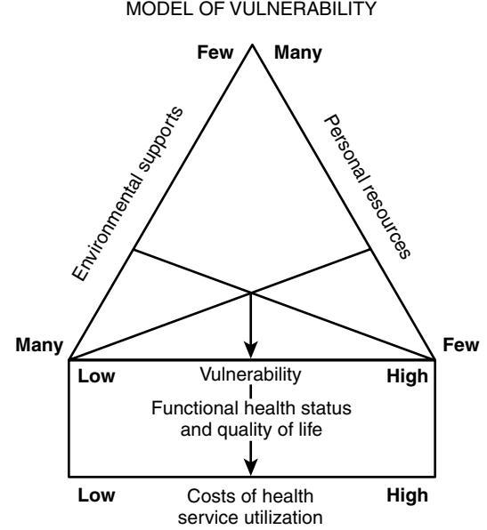
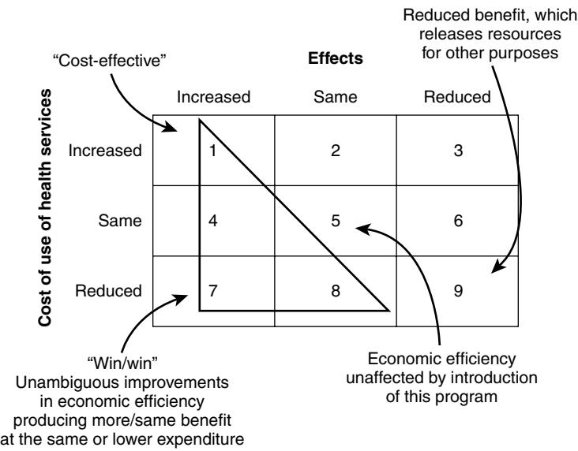
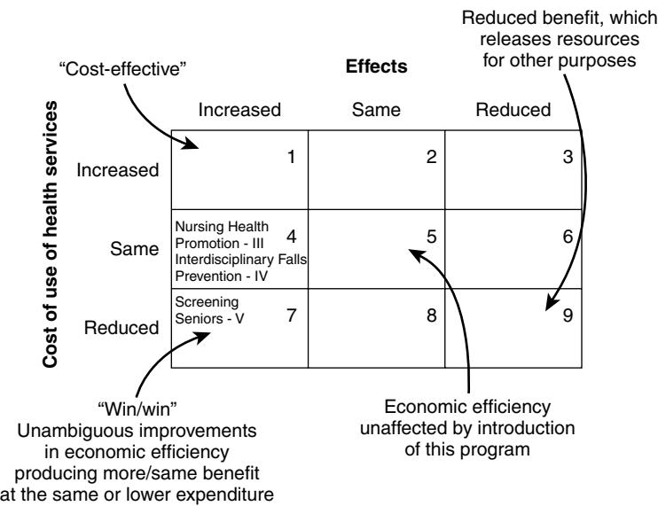

# CHAPTER 98

# Health Promotion for the Community-Living Older Adult

Maureen F. Markle-Reid Heather H. Keller Gina Browne

# **INTRODUCTION**

Older adults (>65 years of age) are growing in proportion and number in both developed and less-developed nations1 as a result of economic prosperity, health care, improved sanitation, and improved education. In Canada, as in many other developed countries, there will be an aging of the population as the "baby boom" generation reaches the age of 65. The fastest-growing segment is those who are ≥80 years; currently 1 in 30 Canadians is over the age of 80, and this proportion is projected to increase to 1 in 10 by 2056.2

Increasingly, Canada's older citizens are aging in place, attributable to the aging of the population, technologic advances, budget constraints, and preferences of older adults, their families, and society, as well as changes in options for care. Over 90% of those aged 65 and over live in the community.3 Rates of institutionalization for older people have decreased, and formal community-based care has expanded, such that the proportion of older people receiving community care now substantially outweighs the proportion receiving formal services through an institution.4 Since the late 1980s in Canada, hospital beds have been reduced by 30% and nursing home beds by 11%, and ambulatory care has increased. The result is increasing pressure on community-based services to maintain accessible, high-quality, and comprehensive health care within the confines of economic constraints.4–6

The benefits associated with aging in place are well documented. Residing at home optimizes an older person's health,7,8 independence, control, and sense of well-being,9 as well as social connectedness, which positively influences health.8,10 Managers and policy makers alike face questions about the most efficient mix of service strategies for the promotion of health in this more community-based and less institution-oriented system.

As the population of older adults (≥65 years) has increased, and as medical advances continue to convert once acute lifethreatening diseases into chronic illnesses, there has been an associated increase in the prevalence of unremitting chronic conditions and frailty.11–13 Over 80% of older people (≥65 years) have chronic medical conditions requiring daily selfcare and management.14 Chronic conditions, including cardiovascular diseases, diabetes, obesity, cancer, and respiratory diseases, account for 59% of the 56.5 million deaths annually and 45.9% of the global burden of disease worldwide.15 Among those with chronic conditions, more than one half of older adults report having at least two of these diagnoses.16 These unremitting chronic illnesses also have a significant economic impact. The total cost of ill health, disability, and death resulting from chronic diseases is about \$80 billion annually for Canada.17 Use of healthcare services is positively related to comorbidity—use increases as

the number of chronic conditions goes up.16 The gradient effect in health service use is most apparent for acute hospitalizations, general practitioner visits, and nursing consultations.16 Left unchecked, these conditions have the potential to overwhelm the health care system and threaten its sustainability.16 The long-term solution must involve health promotion to delay or better manage these conditions to contain costs and reduce demand for services.18

Approximately 15% of community-living seniors fall into the category of being "frail," defined as vulnerable to significant functional decline as a result of the accumulation of multiple, interacting illnesses, impairments, and disabilities.13,19,20 Of those considered frail, 17% are at high risk for such decline that would jeopardize their ability to live independently at home in the community.21 These people are typically 75 years of age or older and are living with multiple health conditions that are acute and chronic in nature as well as functional disabilities.22 They may also have cognitive impairments or social support networks that are overextended or at risk of breaking down.22,23 These characteristics put frail older adults at risk for increasing morbidity, disability, health service use, and death.24

However, chronic disease and frailty should not be considered an inevitable or irreversible consequence of aging.25 Although it is true that as individuals age, they are at greater risk of developing chronic health problems, these conditions are not inherent in the aging process.26 Older adults are quite heterogeneous, including those aging "successfully," "usually," and at "accelerated" rates.27–29 A majority of the most costly health conditions are preventable, treatable, or manageable.18 The World Health Organization15,30 estimates that at least one third of the total economic and social burden of disease in developed countries is caused by a handful of largely avoidable risks: tobacco, alcohol, high blood pressure, high cholesterol, and obesity.31

For many of these risk factors for chronic disease, negative impacts can be reversed quickly, most benefits will accrue within a decade, and even modest changes in risk factor levels can bring about large improvements in people's health.15,30 For example, with healthy eating, regular exercise, not smoking, and effective stress management, over 90% of cases of type 2 diabetes and 80% of cases of coronary heart disease could be avoided.15,30 One review reported that even a 5% reduction in preventable illnesses could lead to substantial savings in medical costs, as well as cost savings beyond the health care sector.18 Consequently, identifying modifiable factors that can reduce or delay health service use and increase quality of life in these populations is a priority.

A growing body of research in Canada suggests that older community-living adults can benefit significantly from proactive health promotion and preventive care interventions.32–39 The ultimate goal of these programs is to proactively identify and address factors influencing health and to promote positive health behaviors and autonomy of older people living in the community, to prevent or delay institutionalization, reduce health care costs, and improve health-related quality of life and function.40

This chapter summarizes this research and identifies how health promotion and preventive care for community-living older adults can be improved. The specific objectives of this chapter are as follows: (1) to describe three separate groups of older adults and their need for health promotion and preventive care, (2) to describe a conceptual framework for health promotion and preventive care for frail older adults, (3) to describe a framework for economic evaluation of health care programs, (4) to argue in favor of the importance of screening to identify older adults who could benefit from health promotion and preventive care efforts, (5) to describe successful health promotion and prevention efforts among community-living older adults, and (6) to demonstrate the need for further policy and research on health promotion and preventive care for community-living older adults.

# **THE HETEROGENEITY OF OLDER ADULTS AND THE NEED FOR HEALTH PROMOTION**

Older adults are a heterogeneous group, and aging occurs at different rates in different people. Chronologic age does not tell the full story of functional ability or quality of life, and most disabilities of old age are not inevitable, universal, or irreversible.25 In the context of health, people who are aging successfully are those who continue to experience good health for an extended period of time. "This is the 65-year old who plans to take a cycling tour of France, the 75-yearold who plays tennis twice a week, or the 80-year-old who walks two miles each day."29 Older adults who are *successfully aging* have minimal health problems, may visit their primary health care provider for preventive checks such as blood pressure, and may have a few risk factors (e.g., family history of heart disease), but they are quite healthy, with no modifiable risk factors. These older adults are likely to be on no medications or only prophylactic formulations. They watch what they eat and try to exercise. They typically develop signs of chronic disease late in life, such as starting medication for hypertension in their late 70s. Because of this delay in onset of chronic disease, successfully aging older adults spend less time dealing with its effects.29

*Usually aging* older adults have some signs that chronic disease has initiated. Typically, they take a few medications to manage conditions such as hypertension or dyslipidemia, they may be bothered by the occasional bout of arthritis pain, and their doctor sees them on a routine basis to monitor their conditions. These indicators or conditions do not drastically affect the quality of life of these older adults, as they still travel when they want and do most of the activities that they are interested in such as driving, babysitting their grandchildren, or taking cruises.29 Approximately 80% of seniors are experiencing successful or usual aging,41 although this proportion falls among the oldest old.42

The older adult experiencing *accelerated aging* appears frailer and more functionally dependent for his or her age. These people, who represent 15% to 20% of seniors, are typically over 75 years of age and have co-occurring physical health problems, both acute and chronic.20,42 They are highly vulnerable, living in the community with supports that are prone to breakdown with any shift in their health and well-being.21–23 Many live in isolation, cut off from community services because of a lack of information, transportation, or the will to initiate action on their own.43 Another important consideration is that many seniors live in poverty or near-poverty conditions, as a growing number live alone without the benefit of two pensions for married older adults.44 Additionally, the prevalence of depression among those experiencing accelerated aging is estimated at 26% to 44%, at least twice that among older people in general.45 These characteristics lead to a greater risk for loss of functional independence, institutionalization, and death.13 Long-term care facilities take care of approximately 5% of these seniors, and about 15% reside at home in the community.20 These frail older adults pose a central challenge to current health systems, as they are frequently in contact with the health system including acute hospitalization and home care services.23,29 A further consideration is that frail seniors living at home are particularly difficult to reach and are at high risk for loss of functional independence and for institutionalization.13 These data underline the need for health promotion efforts in this group.

Before further discussing health promotion and preventive care in the frail older adult, it is important to clarify what is meant by frailty. Despite the dramatic increase in the use of the term *frailty* since the late 1980s, there is a lack of consensus in the literature regarding its meaning and use and no clear conceptual guidelines for establishing criteria to describe older adults as frail.24 Is frailty a disease? Is it a part of aging? What does frailty look like? How is it defined, framed, and understood? Finally, exactly how frail is frail?46,47 A first step in addressing the problem of frailty is to understand better how to identify those who are frail.48 Despite calls for more research,49,50 the components of frailty have not been sufficiently defined to identify populations at risk or in need of proactive interventions.24

One literature review of definitions and conceptual models of frailty in relation to older adults suggests that frailty is a multiple-determined state of vulnerability in which an individual is at risk of becoming more or less frail over time.24 The implication of this is that the process of frailty can be modified or reversed.24 This finding highlights the need for rational, theoretical interventions directed toward health promotion and preventive care for this population. This chapter gives guidelines for a taking a new theoretical approach to the concept of frailty in older adults, which is (1) multidimensional and considers the complex interplay among behavioral, biologic, social, and environmental determinants on health rather than a single influence13,51,52; (2) not age-related; (3) subjectively defined; and (4) considers both individual and environmental factors that influence health. (Table 98-1).24

Despite the differences in these three groups in terms of their needs, each one could benefit from health promotion and preventive care efforts targeted to its specific needs.15,29 Programs and services that promote the health of older adults, focused on keeping them healthy rather than solely being reactive to symptoms, are underdeveloped in North

#### **Table 98-1. Dimensions of Frailty**

- The concept must be multidimensional and consider the complex interplay among behavioral, biologic, social, and environmental determinants on health rather than a single influence.
- The concept must not be age related, suggesting a negative and stereotypical view of aging.
- The concept must take into account an individual's context and incorporate subjective perceptions.

The concept must take into account the contribution of both individual and environmental factors that influence health.

#### **Dimension Supporting Evidence**

- This view is consistent with the observation that many social, socioeconomic, and lifestyle factors are associated with health and that determinants of health are often highly interrelated.13,51,52 Theoretical models need to address the complexity of problems rather than focusing on a single problem, because older people typically have coexisting physical, emotional, and social problems that are interrelated with one another and with external factors.24,170
- Theoretical models should reflect a positive view of aging that emphasizes the capacity for autonomy and independence and maximizes the person's strengths171 as well as deficits.24
- The trajectory of frailty is unique for each individual.172 The emphasis is on the individual's perception of health rather than on the objective circumstances. Research supports the hypothesis that an individual's poor adjustment to chronic illness or affective state is not related to the specific physical disease or level of disability but rather to the negative meaning the individual attributes to it.173 Theoretical models need to incorporate subjective measures and allow for individual variability.24
- Frailty can originate from within an individual or from conditions in the environment. Theoretical models need to address the constellation of individual and environmental factors that influence health.24

America.28,53 Potentially, the lack of development of such programs is due to the narrow societal viewpoint that older adults cannot change behaviors such as smoking, eating, and exercising.54 Chernoff54 suggested that in some ways this belief is true, but there is also research that proves otherwise. Seniors are interested in changing and can change behaviors when given the support to do so. The goal of any health promotion program for older adults living in the community should be on optimizing their current health, even if minimal change in quantity of life is achieved.1 Given the heterogeneity of older adults, it is essential to consider the differences in these three groups in terms of their health trajectories and quality of life when making decisions about the type and amount of health promotion activities required. As the population ages and the number of people aging in place increases, there is an urgent need to identify effective and efficient ways of promoting the health of community-living older adults.

# **CONCEPTUAL FRAMEWORK FOR HEALTH PROMOTION AND PREVENTIVE CARE FOR FRAIL OLDER ADULTS**

Empirical evidence alone is insufficient to direct the design and evaluation of interventions. Theory is essential for program development, implementation, and evaluation, as it explains and can predict outcomes. Furthermore, theory enhances the generalizability of the results by providing the basis for informing the systematic development and implementation of intervention strategies that improve the health of older people as well as evaluation indicators.55

An adapted version of the model of vulnerability56 incorporates the key concepts of frailty discussed earlier to guide the development, implementation, and evaluation of health promotion and preventive care interventions. Vulnerability is a net result of an interaction between the person's personal resources (cognitive, emotional, intellectual, behavioral) and environmental supports (social, material, cultural), both of which, along with biologic characteristics (age, gender, genetic endowment), are determinants of health. Within an individual, personal resources and environmental supports intersect, as shown in Figure 98-1, and can be synergistic and cumulative.37 The base of the triangle represents the degree of vulnerability,56 and thus also the individual's health

Figure 98-1. Model of vulnerability. *(Adapted from Rogers AC. Vulnerability, health and health care. J Adv Nurs 1997;26(1):65–72.)*

status and quality of life. Based on published evidence,32 expenditure of use of health services increases proportionately with the level of vulnerability.

Even if personal resources hold constant, changes in an individual's environmental supports can greatly alter one's degree of vulnerability and thus his or her use of health and social services.37 What is needed is "a 'fit' between the needs and resources of the person and the demands and resources of the environment (p. 68)."56 This vulnerability model provides a schema of the basic components of a multidimensional health promotion and preventive care intervention for reducing functional decline, enhancing health, and promoting appropriate use of healthcare services. Proactive health promotion and preventive care interventions either targeted at the individual or the environment can identify and strengthen available resources, thereby reducing vulnerability and the on-demand use of expensive health services while enhancing quality of life. Hence, strategies for optimizing health in the model of vulnerability are multilevel.56

| Risk Factors                                                            | Supporting Evidence                                   |
|-------------------------------------------------------------------------|-------------------------------------------------------|
| Personal Resources                                                      |                                                       |
| Inborn                                                                  | Aday, 1993174; Rogers, 199756                         |
| Age, gender, race, temperament, genetic predisposition to disease,      |                                                       |
| susceptibility to illness, sensitivity to drugs and chemical imbalances |                                                       |
| Acquired                                                                |                                                       |
| Recently moved                                                          | Hebert, 199722                                        |
| Recently discharged from hospital                                       | Hollander & Chappell, 2002175                         |
| Poor self-perceived health                                              | Stuck et al, 1999103                                  |
| Depression and anxiety                                                  | Schoevers et al, 2005102; Stuck et al, 1999103        |
| Falling                                                                 | Lin et al, 2007176; Markle-Reid et al, 2008150        |
| Taking multiple medications                                             | Hebert et al, 199722; Hogan et al, 200351             |
| Cognitive impairment                                                    | Stuck et al, 1999103                                  |
| Using assistance for activities of daily living                         | Challis & Hughes, 2002131; Markle-Reid et al, 2008177 |
| Impaired vision or hearing                                              | Stuck et al, 1999103                                  |
| Social isolation                                                        | Stuck et al, 1999103                                  |
| Comorbid health conditions                                              | Stuck et al, 1999103; Wilkins, 2006178                |
| Nutritional risk                                                        | Keller et al, 2004146                                 |
| Low level of physical activity                                          | Tinetti et al, 1999153                                |
| Excessive consumption of alcohol and smoking                            | Stuck et al, 1999103                                  |
| Environmental Supports                                                  |                                                       |
| Societal attitudes and stereotypes of aging                             | Rogers, 199756                                        |
| Living alone, social isolation                                          | Stuck et al, 1999103                                  |
| Low income                                                              | Li et al, 2005179                                     |
| Low levels of education                                                 | Aday, 1993174; Pressley, 1999180                      |

#### **Table 98-2. Dimensions of Risk in Rogers' Model of Vulnerability**

*Personal resources* can be defined as either inborn or acquired characteristics, that interact with the environment to influence health.56 Inborn characteristics that influence health include nonmodifiable factors such as the person's age, gender, race, temperament, genetic predisposition to disease, susceptibility to illness, sensitivity to drugs, and chemical imbalances. Acquired characteristics are modifiable factors known to increase risk for functional decline in older adults. *Environmental supports* can be defined as factors that interact with personal resources to influence health56 (Table 98-2).

# **FRAMEWORK FOR ECONOMIC EVALUATION**

Although the literature contains many evaluations of programs seeking to achieve improved outcomes for vulnerable populations, such as frail older community-dwelling adults, few of these outcome studies include measures of cost.33 Economic analysis has now established itself as having an important role in the planning, management, and evaluation of healthcare. It consists of comparing both the effects and expense of alternative interventions for a single problem with the goal of maximizing improvements in health-related wellbeing using a fixed pool of available resources.57 As depicted in Figure 98-2, the economic evaluation of healthcare programs58 yields nine possible outcomes (the more favorable ones are highlighted by shading). In outcome 1, increased effects or health benefits are achieved with increased expenditure for additional resources consumed. This is called *cost-effective,* whereby more effect is achieved for more cost. Outcome 4 is also favorable, because increased effects are achieved with one approach over another at equivalent expenditures. Outcome 7 represents the win/win situation or unambiguous improvements in economic efficiency, whereby more effect is produced at lower expenditures. Outcome 8 represents the situation in which alternative health programs produce the same effect, but some approaches are associated with lower expenditure from a societal perspective. Options 7 and 8 are superior to the often implemented option 9, in which funding is cut, along with the potential for reduced effects, which releases resources for other purposes.58

This approach can be used to classify the main effects and expense of comparative community health interventions. In addition, this approach can be used to classify who (with what characteristics) benefits most and at what expense when various interventions are available. This is especially of concern in systems of national health insurance, in which people will use may use services (inappropriately).59

# **SCREENING AND ASSESSMENT: IDENTIFYING OLDER ADULTS WHO COULD BENEFIT FROM HEALTH PROMOTION AND PREVENTIVE CARE EFFORTS**

There is a growing body of international evidence that suggests that early detection of older people at risk for functional decline or loss of autonomy is beneficial. Screening or other methods of early detection would identify older adults with risk factors that could lead to significant health problems and the use of costly health care resources. Several studies of screening and case finding among older adults have been conducted in an attempt to proactively identify and address problems to reduce the use of costly resources; these studies are reviewed later on.

Many older adults living the community have unrecognized risk factors. Health concerns or risk occur in almost all (92% to 99%) older adults in practice populations, with up to 83% having at least one unreported or unrecognized risk.60–62 Many of these risk factors are social problems62 that can affect a senior's support network and well-being and have the potential to increase health care expenditures if left undetected and, therefore, untreated. Unsolicited home

Figure 98-2. Framework for evaluating possible outcomes of economic evaluation of health care programs. *(From Birch S, Gafni A. Cost-effectiveness and cost utility analyses: methods for the non-economic evaluation of health care programs and how we can do better. In: Geisler E, Heller O, editors. Managing Technology in Healthcare. Norwell, MA: Kluwer Academic Publishers; 1996.)*

visits by a health visitor can be a means of recognizing these unmet needs. Harrison et al identified through this service that 35% of 110 patients over 70 years of age had previously unidentified risks that could benefit from preventive programs.63 Similar results were reported by Brown et al, in an audit of 40 general practices in the United Kingdom of patients over 75 years of age.64 In this study, 12% of the eligible practice population was seen over the study period; 44% were found to have at least one health problem that was previously undetected. Similarly, Ramsdell et al found that home-based assessment of older adults resulted in the detection of up to four new problems as compared to an office-based assessment.65 Stuck et al identified several key advantages of in-home visits versus office-based visits.66 A home-based assessment allows for an evaluation of the physical environment to identify risk factors and equipment needs, review of medications, observe contacts with family members, and provide better accessibility for clients with mobility problems. Further, an office-based visit often has a focus for the appointment and limited time affects solicitation of further risks.

Browne et al,32 in a review of 12 randomized controlled trials evaluating a community-based approach to care in a Canadian setting, found that for clients with multiple problems (such as the frail older adult), it is more expensive in the same year to *not* provide these clients with proactive and comprehensive preventive care and health promotion. Similarly, Caulfield et al (p. 87),60 in a review of the literature on geriatric screening programs, concluded that "home based, comprehensive screening of the older adult for undetected physical, mental and socio-economic problems by nursing or other trained personnel may be able to prolong survival, improve quality of life, and perhaps even postpone dependency or institutionalization." Screening eliminates a barrier between the need for help and gaining access to that help.

Discussed next are three areas—falls, nutrition, and depression—in which screening and assessment are advocated for older adults living in the community, as these conditions are readily preventable through health promotion efforts. The term *screening* refers to the process of detecting or identifying a health condition or risk factor among a specific population. The term *assessment* refers to the process that follows a positive screen and involves evaluating the problem and older adult in a more specific fashion in order to confirm the problem or establish the diagnosis and develop a treatment plan.67

## **Risk of Falls**

Despite knowledge that most falls are both predictable and preventable, falls and fall-related injuries continue to negatively impact older adults' quality of life and health care resources (see also Chapter 106). Fall-related injuries are among the most common, serious, and expensive health conditions affecting community-living older adults.68 Thirty percent of community-living adults over 65 years of age fall at least once a year, and the proportion increases to 50% by the age of 80 years.69 In people aged 65 years and older, falls are the leading cause of injury-related admissions to acute care hospitals and in-hospital deaths70 and explain 40% of nursing home admissions.71 The costs of health care associated with fall-related injuries are staggering. The 1999/2000 costs of fall injuries to seniors in Canada were estimated to be \$2.4 billion.72 With an aging population and an associated increase in the number of falls and fall-related injuries, these cost estimates are projected to rise as high as \$240 billion by 2040.73

The negative impact of a fall on health and related quality of life can be profound. Fall injuries often result in fear of falling,74,75 leading to self-imposed restriction of activity and loss of confidence,76 low self-esteem, depression,75 chronic pain, and functional deterioration.77 Falls and fallrelated injuries and complications are the leading cause of death among seniors.78 Frail seniors, exhibiting accelerated aging, are at increased risk for falls, with approximately 50% falling at least once per year (three times the risk of healthy seniors).79 They are also more likely to sustain serious injury and take longer to recover after falling.73 Falls are caused by multiple, interacting factors, some of which are modifiable. Factors such as postural hypotension, the use of multiple medications, and impairments in cognition, vision, balance, gait, and strength increase the risk of falling and fall injuries.68 Although no single factor causes all falls, the risk of falling increases with the number of risk factors present.80

Evidence suggests that most falls are predictable and preventable. Previous intervention studies showed that approximately 30% to 40% of falls can be avoided.81–83 A 10% reduction in the number of nonfatal falls would mean 7931 fewer falls and health care savings of \$138.6 million.18 Categorizing individuals into different levels of risk through screening is thus important from both clinical and economic perspectives; seniors with the highest risk of falling will benefit most from preventive efforts and from avoiding the negative consequences of falls.82 The best approach to preventing falls in any group of older persons requires knowledge of where that group sits on the risk spectrum, because this will determine the type and amount of services required as well as the effectiveness of the program.77 Essentially, fall risk screening is a means of targeting limited home and community care resources.

Home and community care providers are well positioned to play a major role in preventing falls in older people through screening and intervention. An understanding of the risk factors for falls (listed earlier) will increase the clinician's ability to effectively target the use of screening. Since the late 1990s, several fall risk screening instruments focused on community-living older adults have been developed due to the rising concern for fall-related injuries.84 Considerable evidence now documents that the most effective fall reduction programs involve routine and systematic fall risk assessments or screens, followed by targeting of interventions to an individual's risk profile.79,85 This research has been substantiated by meta-analyses of many randomized controlled trials85,86 and by consensus panels of experts who have developed evidence-based practice guidelines for the detection and management of falls risk.79,82,87,88 The importance of this direction cannot be overstated. Reducing just one fall risk factor can have great effect on the frequency and morbidity of falls.83

## **Risk of nutrition problems**

As also discussed in Chapter 82, nutrition problems in older adults are common, because of the diverse individual and collective determinants of food intake in this age group.27 Low intakes of various food groups, energy, protein, and micronutrients continue to be reported in those over the age 65 years.29,89 Poor-quality food that is energy-dense and lack of exercise also are causes of obesity in this age group.89 Obesity when coupled with poor function results in a precarious state for older adults. Those who are frail and exhibiting accelerated aging are also highly susceptible to malnutrition.29,89,90

Since the late 1990s, several nutrition screening indices have focused on community-living older adults,91 because of the rising concern for the nutritional health of older adults and a desire to intervene as soon as possible.29,54 Nutrition screening is viewed as a means of targeting limited nutrition resources, especially dietitian services.92 Unfortunately, most of the research to date has focused on describing "at risk"

populations or demonstrating the linkages between nutrition risk and negative health outcomes such as falls, other morbidity, institutionalization, and mortality, without demonstrating that nutrition screening can change practice and thus prevent these outcomes. Prevalence of risk varies depending on the index used and the subgroup of older adults screened; estimates range from 25% in "usually" aging seniors to 69% in those who are frail.29,93–95 Risk factors associated with poor food intake or nutrition risk include poor self-rated health,94,96 functional limitations,27,96,97 low level of education, low income, lack of social support, poor dentition, smoking, vision problems,96,97 stress,93 lack of transportation, poor social networks, and living alone.29 Food intake is complex due to its multifactorial determinants, and interventions to promote food intake need to be comprehensive and multisectoral.

In the United States, the Elderly Nutrition Program under the Older Americans Act has provided nutritious meals and other nutrition services to older adults that are especially vulnerable (e.g., those living in underserviced rural areas).89 Although not mandatory, screening, assessment and interventions such as counseling and basic nutrition education can be provided within individual communities. Screening within the program is meant to target interventions,89 but no research on the effectiveness of the screening process has been documented. Furthermore, only 20% of older adults who could benefit from this program are reached,98 and targeting of services to those most in need is required.99

One article described a nutrition screening program with the NRS-2002 in 26 European hospital departments in 12 countries.100 The average age of patients screened (n = 5051) was 60 years, and 33% were considered to be "at risk." These patients were more likely to have complications, fatal outcome, and a longer length of stay than those without risk. Unfortunately, the authors did not describe or evaluate the treatment options that may or may not have been provided to these patients, so the effectiveness of the screening is unknown. There is only one known evaluation of a nutrition screening program focused on older adults in the community, limited to describing and assessing the process of screening.36

The Bringing Nutrition Screening to Seniors in Canada project36 involved developing, implementing, and evaluating screening programs in five diverse communities in Canada. Almost 1200 seniors were screened and, if found at risk, provided with referrals to community services. An ethical screening process that included follow-up postscreening helped to identify the impact of the program. Seniors indicated that screening helped them to recognize their problem areas and become aware of the various programs and services available in their community. Some individuals reported improving their food intake as a result of the screening, although objective data were not collected.36 As with falls, now that nutrition screening tools are available, research needs to turn to determining the effectiveness of screening and early nutrition interventions in this population.

## **Risk of depression**

Depression is among the most common, and potentially treatable, cause of death, morbidity, functional decline, and increased health care use and costs among community-living older adults.101–103 Despite the high prevalence of depression in this population, the diagnosis of depression is often missed or suboptimally managed.104 Depression affects between 5% and 10% of individuals in primary care but is only recognized in around one half of the cases.105 In one study of older adults receiving home care services, only 12% of those with depression received adequate treatment.104

Both clinician and health care system factors impede the recognition and treatment of depression. First, older people at risk for or suffering or recovering from depression have limited access to community-based services directed toward promoting mental health. In many jurisdictions, eligibility for, and allocation of, home care services are directed toward addressing physical needs—mental health problems must be the secondary diagnosis in order to be eligible.106 Second, there is limited collaboration and communication among home and community care providers, primary health care providers and others providing mental health services to community-living older adults, and a lack of continuity of care provider. Third, there is a lack of expertise among home and community care service providers in identifying and managing depression.106,107 Older people generally have chronic medical conditions and disabilities that mask the presence of depression,108 and attitudes and beliefs about mental illness discourage health care providers from asking patients about depression and patients from revealing depressive symptoms. Finally, there is a tendency to normalize symptoms of depression in this population.109

Unrecognized, untreated, and undertreated mood disorders generate enormous personal, economic, and societal costs.104,108 Depression in older people often coexists with other chronic illnesses, and untreated depression is a significant risk factor for functional decline, diminished quality of life, death from comorbid medical conditions or suicide, dementia, social isolation, poor adherence to treatment, increased demands on unpaid caregivers and increased use of expensive health services.110,111 In 1998, depression cost Canadians approximately \$14.4 billion dollars per year.112,113 These costs are compounded by indirect costs such as costs to unpaid caregivers. Unpaid caregivers of depressed seniors are more likely themselves to experience symptoms of depression.114 Depression is also associated with unhealthy lifestyle factors such as smoking, alcohol use,115 physical inactivity, and noncompliance with medical treatment.116

Those who are frail, exhibiting accelerated aging, are at increased risk for depression.19,117 The prevalence of depression among older persons receiving home care services is estimated to be between 26% and 44%—at least twice that among older persons in general.104,118,119 They also suffer from a fourfold increase in more severe forms of depression than the general population.120 Clearly, recognition is key to referral and subsequent treatment for depression in this population.109

Multiple, interacting physical, psychological, and social factors increase the risk of depression in old age. These include factors such as having a comorbid health condition(s), functional limitations, taking medications (such as centrally acting antihypertensive drugs, analgesics, steroids, and antiparkinsonians), social factors (e.g., social disadvantage, low social support), or a previous history of depression.121

Routine depression screening and assessment have been shown to be effective in improving the recognition and management of depression in community-living older adults.109,122–128 A variety of screening instruments have been developed for screening and assessing depression in older adults. These screening tools were developed to reflect the differences in presentation of depression in older adults and to address issues such as the presence of concurrent medical disorders (e.g., dementia).129

Community providers can play a pivotal role in screening for depression in community-living older adults. An understanding of the factors for depression (listed earlier) will increase the clinician's ability to effectively target the use of screening or inquire about symptoms that make up the diagnostic criteria for a depressive disorder, particularly when several risk factors are present.67 The evidence suggests that screening is most effective when targeted to higher-risk groups.67 Current Canadian recommendations suggest that screening for depression in primary care settings should be completed only if effective follow-up and treatment can be provided.130 Although access to specialized geriatric mental health services remains limited in some settings, primary health care practitioners are able to provide appropriate follow-up and treatment.67

# **Importance and implementation of screening**

Awareness of the importance of screening and assessment of risk is required at several levels: older adults, their families, their home care providers, and the community.29 Although older adults appear to be interested in health promotion, they often do not think they are at risk for falls, poor nutrition, or depression. Screening may increase their attentiveness or self-awareness. More important, assessment of risk can be used to guide the allocation of limited home and community resources to those most likely to benefit from preventive efforts.

Overall, the data underscore the important role of home and community care providers in the early identification and management of risk factors for functional decline by performing a multifactorial assessment using validated screening instruments followed by targeting of interventions to an individual's risk profile.85 In a review of the literature, Challis and Hughes131 identified the need for greater standardization and multidisciplinarity of assessments as one of four factors that influenced the "margin" between institutional and community-based care for community-living seniors.

Screening in the community is a complex activity and providers need support to build capacity.29 Furthermore, tools used for assessment of risk may not be standardized and often lack rigorous reliability and validity testing.43,132 To be acceptable to practice and relevant for a diverse group of community-living older adults, risk screening instruments need to be reliable, valid, brief and easy to use and accurately discriminate between levels of risk. Different instruments may be required for different segments of the older adult population, as they are quite heterogeneous ranging from well and successfully aging to chronically ill.133 They also need to be acceptable to the individual being assessed and the provider performing the assessment.84

In addition to an appropriate screening instrument, capacity for screening in the community is based on the development of an ethical screening process.134,135 An ethical screening process includes referral to community resources or services and follow-up to ensure that identified needs are met.135 Development of an ethical screening process is complex and time, resources, and effort are needed.135 Research and best practice guidelines should be translated into practice so that risk assessment is implemented and appropriate interventions are tailored to individual needs.

# **PROMOTING HEALTH IN COMMUNITY-LIVING OLDER ADULTS: LESSONS FROM FIVE INTERVENTION STUDIES**

Health promotion and disease prevention efforts are categorized as primary, secondary, or tertiary. Health promotion is the process of enabling people to take control over the determinants of health and thereby improve their health.136 Health promotion strategies are based on a participatory model of health,137 which seeks to expand an individual's positive potential for health. This is in contrast with preventive care, which is grounded in the traditional biomedical model of health137 and seeks to avoid risks or decrease risks to health and well-being.138

A participatory approach to enhancing health involves activities that seek to empower individuals and promote positive attitudes, knowledge, and skills to maintain and enhance health.139,140 Health promotion strategies involve goals such as autonomy, empowerment, and independent decision making.37 Health promotion interventions are developed, implemented, and evaluated together with individuals, families, and stakeholders from different organizations.141 Empowerment for health goes beyond illness and the management of a specific disease. Its success is seen in terms of enhanced health, well-being, quality of life, sense of self-esteem, and self-worth.142

According to the World Health Organization, health promotion strategies include developing personal health skills, creating supportive environments, strengthening community action, reorienting health services, and building healthy public policy.142 Thus, health promotion strategies are multilevel, focusing not only on individuals but also on family, community, and societal health. Health promotion not only is concerned with enabling the development of life skills, self-concept, and social skills, but is also concerned with environmental intervention through a broad range of political, legislative, fiscal, and administrative means.137

Whereas health promotion is approach motivated, preventive care is avoidance motivated.138 Preventive care, which is divided into primary, secondary, and tertiary levels, is aimed at reducing premature morbidity and mortality.137,138,143 *Primary prevention* is focused on removal of risk factors for disease or functional decline from the individual or the environment. Activities of this type are implemented for successful or usual aging older adults who are asymptomatic and free of clinical evidence of the targeted disease or health condition. *Secondary prevention* activities focus on early identification and prompt treatment of risk factors before they lead to functional decline.135 In essence, secondary prevention is the way to add "life to years."1 Secondary prevention can avert successfully and usually aging older adults from progressing through the stages of functional decline, and they are thus more relevant. *Tertiary prevention* is typically provided to those with accelerated aging and includes activities or measures focused on those who currently exhibit some signs of functional decline. These interventions aim both to limit the progression of disease or functional decline or loss of independence26 and to maximize function.

The current knowledge base concerning the potential role for health promotion and secondary prevention in older people remains relatively small.26,29 Most community-based interventions for older adults occur at a tertiary prevention level, focusing on illness and the treatment of disease and largely ignoring health promotion, secondary prevention, and partnering approaches between and among all professionals and older people with chronic diseases.37,144 In the United States, of the more than \$1.7 trillion in health care spent nationally every year, less than 4 cents of every dollar is spent on prevention and public health.18 This approach has come in for much criticism for its narrow focus on "downstream," diverting scarce resources away from primary and secondary prevention efforts that focus on early identification and prompt treatment of risk factors before they lead to functional decline. Functional disabilities and illnesses in older people often are managed as acute medical problems, not as ongoing life challenges that require continuous attention to health promotion and preventive care.39 Older people need both health promotion and preventive care, so it is essential that health professionals become engaged in all areas of activity.145

This section describes five examples of health promotion and preventive care interventions designed for communityliving older adults in which either falls, nutrition, or mental health (depression) were areas of focus:

- I. Evergreen Action Nutrition: an example of a secondary prevention program146–148
- II. Home support exercise intervention for frail older adults using home care services149
- III. Nursing health promotion for frail older adults using home care services38
- IV. Falls prevention for older home care clients at risk for falling150
- V. Proactive screening, case finding, and treatment of older adults in primary care151

Studies I and II are prospective cohort studies of older adults living in the community with comparable types and severity of illnesses and disabilities who self-select to one community-based approach over another. Studies III to V are prospective randomized controlled trials (RCTs) that control for the methodological problems of self-selection that confound studies I and II. Measures of well-being and cost of use of health services provided to older adults randomly assigned to health-oriented, proactive care were compared with those of similar clients receiving reactive, unplanned, and disease-oriented approaches to care. The major findings from each study are described, and lessons as they relate to using results to informed practice, policy, and future research are described.

# **Study I. Evergreen Action Nutrition: an example of a secondary prevention program**

Despite the importance of preventive nutrition interventions for older adults, secondary prevention programs are relatively absent or not documented.29 Evergreen Action Nutrition is an education program provided since 1999 in a seniors recreation center in southern Ontario. Using a community-based approach, this program was developed, implemented, and evaluated by an advisory committee that included senior members of the center.152 Nutrition screening was used throughout the program to identify needs, raise awareness, and evaluate activities. The program was voluntary, and seniors could participate solely through reading education materials or they could be involved in hands-on activities like cooking groups. Activities included resourcing the center library with quality nutrition books; a nutrition column in the monthly newsletter; monthly nutrition and nutrition displays; cooking groups for men; support groups for persons managing weight or diabetes; food demonstrations, which included hands-on activities and food consumption; celebrity chefs; and monthly deliveries of a fresh vegetable and fruit box. Process evaluation demonstrated that the program was effective.148 The program had a large reach, with approximately two thirds of members (~2000 seniors) having participated in some way during a 3-year period. Respondents to a randomly mailed survey were significantly less likely to be at nutrition risk than those surveyed at baseline (38.9% vs. 56.7%, respectively). Participants, as compared with nonparticipants on the follow-up survey, had better fruit and vegetable intakes. Food demonstrations and cooking groups were effective at overcoming barriers to trying new foods and recipes.146,147 Participants reported the intention to change cooking and eating behaviors based on these nutrition education formats. This program was conducted with funding from a research grant for the first 3 years of the program and has continued with minimal funding from the seniors association that runs the center and from monies collected for participation in activities. Lessons learned in this program are that diverse education activities are needed to reach a wide audience—no single intervention will appeal to all seniors. Seniors are interested and motivated to improve their nutrition knowledge and behaviors. A recreation center is an ideal setting for this activity, as it is a nonthreatening environment, and creating a program that has consistent educators and other staff is important for building trust and program continuity. Finally, a participatory approach that involved the target group was essential for developing and implementing meaningful education activities.

# **Study II. Home support exercise intervention for frail older adults using home care services**

This prospective cohort study was designed to determine the effectiveness of a home support exercise program (HSEP) for frail older adults receiving home care services.149 Home exercise is an effective means to prevent falls, to maintain functional independence, and to promote rehabilitation following injury or illness.153 The study sample consisted of 98 frail older adults (≥65 years of age) using home support services in a home care program in southern Ontario, Canada. Sixty subjects were randomly selected to receive the HSEP, whereas 38 matched controls were allocated to receive standard home care without the HSEP. A total of 77 subjects completed the 4-month follow-up (40 HSEP, 37 controls). The HSEP is a 4-month in-home physical activity intervention provided by a trained home support worker. It consists of 10 simple, functional, and progressive exercises that are to be done on a daily basis. Once the exercises have been introduced, the home support worker continues to monitor the client's progress and to offer motivational support. Results showed that at 4 months, those who received the HSEP selfreported general improvement such as feeling better, being less stiff and stronger, and being able to walk more easily. Those in the control group reported that they felt worse than they did 4 months previously. Between groups, significant differences were observed for mobility and walking scores, with an average improvement of 14% to 34% in the HSEP group, compared with only minor improvement or functional decline in the control. Significant improvements for balance confidence were also observed, whereas the control group experienced little or no change in balance confidence. The findings support the effectiveness of the HSEP, as well as the importance of proactive and regular exercise interventions and support in this population.149

# **Study III. Nursing health promotion for frail older adults using home care services**

This single-blind, randomized controlled trial, with a 6-month follow-up, conducted in a home care program in southern Ontario, Canada, was designed to determine the effects and expense of adding nursing health promotion and preventive care to usual home care services in a national system of health and social insurance.38 The study sample consisted of 242 older adults (≥75 years of age) using home support services. Subjects were randomized to intervention (n = 144) or control groups (n = 144). A total of 242 (84%) subjects completed the 6-month follow-up. In addition to usual home care, the nursing group received a health assessment combined with regular home visits or telephone contacts, health education regarding management of illness, coordination of community services, and empowerment strategies to enhance independence. The primary outcome was functional health status and related quality of life. Secondary outcomes were depression, perceived social support, coping ability, and cost of use of health services from baseline to 6 months. Results showed that providing older adults with proactive nursing health promotion and preventive care compared with providing nursing services on a reactive and episodic basis results in better mental health functioning (*P* = .041) and a reduction in depression (*P* = .001) at no additional expense (e.g., both interventions cost the same). The overall conclusion of this study is that home-based nursing health promotion, proactively provided to frail older people with chronic health needs, enhances quality of life at no additional expense from a societal perspective. The results underscore the need to reinvest in nursing services for health promotion for older adults receiving home care services.38

# **Study IV. Falls prevention for older home care clients at risk for falling**

This single-blind, randomized controlled trial, with a 6-month follow-up, conducted in a home care program in southern Ontario, Canada, was designed to determine the effects and costs of a multifactorial, interdisciplinary team approach to falls prevention compared to usual home care for older home care clients at risk of falling.150 The study sample consisted of 109 older adults (≥75 years of age) using home support services who are at risk for falls. Subjects were randomized to intervention (n = 54) or control (n = 55) groups. A total of 92 subjects completed the 6-month follow-up. The intervention was a 6-month multifactorial and evidence-based prevention strategy involving an interdisciplinary team. The primary outcome was number of falls during the 6-month follow-up. Secondary outcomes were changes in fall risk factors and costs of use of health services from baseline to 6 months. Results showed that at 6 months, there was no difference in the mean number of falls between groups (−0.04 [95% CI:−1.27, 1.18]; *P* = .702). However, subgroup analyses showed that the intervention was effective in reducing falls in men (*P* = .009), 75 to 84 years of age (*P* < .001), with a fear of falling (*P* < .001) or a negative history of falls (*P* < .041). There was a greater reduction in number of slips and trips (−4.97 [95% CI:−10.7 to 0.84], *P* = .03) and a greater improvement in role functioning related to emotional health in the intervention group (−14.13 [95% CI: −0.28 to 28.54], *P* = .054). These improvements were achieved at no additional cost from a societal perspective (e.g., both interventions cost the same). The overall conclusion of this study is that a multifactorial, interdisciplinary team approach was more effective and no more expensive than usual home care in improving quality of life, reducing the incidence of slips and trips, and reducing falls among males (≥75 to 84 years) with a fear of falling or a negative history of falls.150 This study is important because of the high prevalence of falls among older adults receiving home support services. The baseline fall rate of 72% in the present sample greatly exceeds the fall rates of 30% typically reported for representative samples of community-dwelling older adults.79 Home care policy makers, agencies, and fund-raisers should work together to ensure that an interdisciplinary team approach is available to the subgroups of seniors who could benefit from it most to reduce future falls, enhance quality of life, and reduce on-demand use of health services.

# **Study V. Proactive screening, case finding, and treatment of older adults in primary care**

This randomized controlled trial was designed to determine the effect and expense of proactive screening, case finding, and random treatment of ambulatory seniors having 1 of 28 unrecognized medical concerns, in a primary health care setting.151 Seniors with unrecognized health concern were randomly allocated to treatment (n = 209) or nontreatment (n = 410) groups. Treatment consisted of one to two visits to an appropriate primary care professional (physician, nurse, or social worker) depending on the specific concerns. On the whole, there was no significant improvement in the overall functional capacity of seniors treated versus those not treated for their concerns. However, screening, case finding, and health-oriented, proactive primary care resulted in improved mental health and social functions (11% to 22%, respectively) for seniors who were 75 years of age and older and living alone. Similar seniors without treatment showed a deterioration of 2% in their scores over the 2-year period (*P* = .04). Seniors who were lonely and treated used \$2610 per person per annum in services, compared with similar untreated seniors who used \$10,971 per person per annum after 2 years. The overall conclusion of this study is that screening, case finding, and health-oriented, proactive primary care are more effective and less expensive for older adults with psychosocial risks.151

## **Lessons learned**

Collectively, these studies of health promotion and preventive care interventions suggest that in a system of national health insurance, such as we have in Canada, proactive, comprehensive, and integrated interventions for older adults with varying characteristics can result in better heath outcomes for the same and sometimes lower cost compared with providing services on a limited, reactive, and piecemeal basis. The use of prospective studies allows for an estimation of change in client status over time. Studies I and II, which used a prospective cohort design, illustrate the benefit of health-oriented and proactive community services and support for older adults with comparable types and severity of illnesses and disabilities who self-select to one communitybased approach over another. Studies III to V employed a randomized controlled trial design to compare the effects and costs of a health promotion and preventive care intervention with reactive, unplanned, and piecemeal approaches to care. Across these studies, subjects were assessed with different outcome measures appropriate to their circumstances, yet the same approach to the quantification of the cost of use of health services was employed.154 Studies III and IV of frail, older, home care populations illustrate that health promotion and preventive care interventions compared with piecemeal and on-demand care result in improved outcomes at no more expense to society (rubric 4, Figure 98-3). In study V of ambulatory populations with chronic conditions who live alone, improved outcomes can be achieved at lower cost with health promotion and prevention care (rubric 7, Figure 98-3). Expenditure data in these four studies include the cost of the health promotion and prevention care interventions. The studies illustrate potential outcomes 4 and 7 in Figure 98-3 and collectively represent different kinds of economic efficiencies that are achieved with populations with more or less access to services to begin with.

As a whole, the results of these studies provide empirical support for the positive synergistic and cumulative effects of bolstering personal resources (e.g., physical, mental health, and social functioning) and environmental supports (e.g., community supports) on health status and related quality of life56 to considerable economic effect (no additional or lower expense). Health care providers need to be able to assess older adults' areas of strength and vulnerability. Awareness of the sources of vulnerability and barriers to health care may assist health care providers to provide more holistic, comprehensive care to their clients.56

These five studies illustrate a number of features of successful community-based health promotion programs for community-living older adults. First, the results have shown that comprehensive and coordinated services aimed at all of the broad determinants of health are superior when compared to individual, fragmented, and disease-oriented approaches to care.32 Because health is determined by many more things than physical needs, such approaches must extend beyond the care of medical problems to address other nonmedical determinants of health (e.g., social support, mental health, housing, income).5 This approach represents a fundamental shift away from a *replacement function* focused solely on physical needs to an *empowerment function* to enhance seniors' independence, autonomy, and problem-solving skills.155 The results of these studies suggest that, in a system of national health insurance, interventions that address single problems or single risk or protective factors are less effective in reducing health problems or enhancing competencies in people with synergistic risks than proactive, health-oriented, and comprehensive interventions.33,37 Effective interventions include

Figure 98-3. Framework for evaluating possible outcomes of economic evaluation of health care programs. *(From Birch S, Gafni A. Cost-effectiveness and cost utility analyses: methods for the non-economic evaluation of health care programs and how we can do better. In: Geisler E, Heller O, editors. Managing Technology in Healthcare. Norwell, MA: Kluwer Academic Publishers; 1996.)*

elements that ensure access to a comprehensive range of services provided in the right amount and delivered by the right care provider, in the right place and at the right time.131

Second, successful health promotion interventions need to be tailored to individual needs. The most expensive services are those that are not tailored to people's needs (or vulnerabilities).33 No single intervention or mix of community services will meet the health promotion needs of all seniors. Hence, there is a need to classify who (with what characteristics) most benefits and at what expense, from various interventions, especially in systems of national health insurance where people will use, however, (in)appropriately, some service if another is made (un)available.32 Screening plays a part in targeting those who are most likely to benefit. Seniors are interested and motivated to change their behavior to enhance health. Successful behavior change is associated with the empowerment of individuals through the provision of appropriate communication, information, and support. Interventions need to respond appropriately to an individual's readiness to change through various strategies tailored to an individual's needs. Models of care should be flexible and contextualized, taking into account individual needs and comorbidities and paying particular attention to vulnerable, at-risk populations. These data can be used to target scarce resources to those most likely to benefit from preventive efforts.

Third, to be successful, health promotion needs to occur across multiple sectors. In these studies, the interventions involved a wide range of actions operating at three levels: the individual clinician (e.g., promoting changes in practice behavior), the interdisciplinary team (e.g., fostering interprofessional collaboration), and the health care system (e.g., influencing the financing, management, and delivery of services). When health problems are chronic, care must be organized and coordinated over time, among providers, and across settings.155 This multisector work requires good communication and a close affiliation so that individual home and community-based services do not operate in isolation but are part of a broader, more balanced, integrated approach to a comprehensive and coordinated system of services that address all of the factors that determine health.

Fourth, models of care need to be function based (from the client's perspective) rather than disease based. The emphasis is on the individual's perception of health, rather than on his or her objective circumstances, and in determining his or her decision to take action. The evidence is clear that increasing people's involvement in their health care management and decision making has been shown to improve health status and lower costs.156

Finally, it is important to take a comprehensive approach to examine expenditures associated with different approaches to home and community-based care.32 In addition to savings within the health care sector, a program could expect to see a return on its investment in prevention in other sectors (e.g., education, social, and benefits other than reduction of disease).18 Economists argue that the effect of a publicly funded home and community-based service on society as a whole should be considered when making decisions about the use of that service.157 This comprehensive societal viewpoint is often ignored in the economic analysis of health care services.32

# **THE NEED FOR LEGISLATION AND POLICY**

Despite the potentially important role of home and community-based services in health promotion and preventive care for older adults, several realities continue to impede this direction. Within the persistently biomedically and institutionally focused health care arena, in-home and community-based care still suffer from underfunding of services, underfunding of research to inform policy and practice, and limited consideration of the broader determinants of health in these sectors.144 Since the late 1990s, health care systems have been challenged to provide more home and community care services to older, more vulnerable, and frail individuals while limiting the growth of health care expenditures.158–160 Growing demand for home and community care is attributable to several factors—namely, technologic advancements, changing demographics, patient preference, and the presumed cost-effectiveness of home care.158 With increasing life expectancy, substantial increases in home care expenditures are expected by 2026.161 Often, the need goes unmet as resources are shifted from prevention and health promotion to meet the more pressing need for postacute care substitution.162 This emphasis, coupled with the sustained biomedical orientation of services, can mean that the focus on prevention and health promotion for seniors with chronic needs is minimal at best.144 The allocation of home and community services often is based on physical needs or medical services, suggesting that nonmedical services are unrelated to health outcomes, despite evidence to the contrary.7

A growing body of research, done mostly in a national system of health insurance, suggests that for older people with chronic health needs, these trends combine to create a fragmented system of health care delivery, characterized by providing health services on a reactive, episodic, and piecemeal basis rather than a comprehensive and proactive system of care.23,33 Delays or errors in detecting and responding to chronically ill older people's changing health needs can contribute to more complications, cause functional decline and negative changes in quality of life,163 and increase the demand for expensive institution-based care such as acute hospitalization.33 Furthermore, this experience with the acute care system often undermines chronically ill seniors' self-confidence and their interest and ability to participate in their own care. The result is a vicious circle of reliance on institutionalized care.140

To address effectively the growing burden of chronic disease and frailty in older people living in the community, healthy home and community care policies are needed to provide vision, set priorities, and establish standards. Such policies and standards should support the development of basic competencies for health promotion and preventive care among providers, as well as systemic changes within home and community care organizations to allow the allocation of adequate resources for assessment of risk and delivery of health promotion and prevention strategies. There is a need to move away from a "find-it and fix-it" episodic orientation that does not match the ongoing care needs of older people with chronic condition, who need a "find-it, manage it, and prevent it" approach.31

Home and community-based programs need to provide a continuum of services including health promotion, prevention, and postacute care substitution services.158 Enhanced funding and focused health promotion and preventive care activities should be applied to mitigate the risk factors for functional decline and loss of independence, so that living at home, even with significant challenges, can become a true reality for older populations. Without this legislation and resource provision, improvements in the health of older adults will continue to be an ad hoc affair with limited impact.29

# **THE NEED FOR MORE RESEARCH**

With the increasing demand for home and communitybased services for older people, there is increasing pressure for evidence to demonstrate that community-based health promotion and preventive care for older people is an efficient use of health care resources in developed countries.164 A 2003 report by the World Health Organization for policy makers on the future direction of health-promotion evaluation emphasized the need for evidence about effective and efficient health-promotion and preventive care strategies.15 This evidence is needed to ensure that the most appropriate services are available to those who most need them, to ensure the best health outcomes.160 However, the current knowledge base concerning the potential role for health promotion and secondary prevention in older people remains relatively small.26,29 Specifically, further investigation is needed regarding the most efficacious ways of providing health promotion and preventive care to the different groups of successfully, usually, and accelerated aging. These groups have different needs, risk factors, and comorbid conditions and experience different barriers and facilitators to health promotion,165 and further research is needed to differentiate these influences.

Older adults with chronic conditions who are experiencing accelerated aging have been identified as at increased risk for functional decline, institutionalization, and death,13 but these individuals are often excluded in community-based trials.49,166 There is a need to establish a knowledge base about the needs of this vulnerable group. Understanding what factors in the individual and the environment are most predictive of morbidity and use of health services is needed to move forward with health promotion efforts in this group.

Large, randomized trials are required to test innovative approaches to health promotion and secondary prevention strategies for community-living older adults. Such studies should provide information on client-important outcomes, such as functional health status and related quality of life, mental health, and social support. These studies should also address more process-oriented outcomes associated with health promotion, such as autonomy, empowerment, and decision making.137 Such studies should also compare outcomes achieved with different providers and different combinations of providers to inform how best to meet the needs of this client group. Future research also needs to incorporate a full economic evaluation and identify the specific subgroups of clients who will benefit most.

A major gap in the research on home-based health promotion is the lack of a theoretic framework.37 As a result, it is difficult to assess the appropriateness of the intervention to the outcomes being measured or to formulate hypotheses regarding why or how a particular intervention should be expected to result in a particular outcome.141,167 Future research is needed that uses a theoretical framework and provides descriptive and contextual details about the health promotion strategies and measures of process to enable their replication and provide information about why an intervention was or was not found to be effective.168 Further testing of the vulnerability model is needed to provide a knowledge base for designing and evaluating health promotion strategies.

Finally, research is needed on older adults' awareness and perceived need for health promotion. Despite being identified as at risk and having an awareness of the benefits associated with certain health behaviors, not all older adults decide to make positive behavioral changes.165 Furthermore, some people may be less likely to change health behaviors than others, such as the oldest cohorts and women,169 and it may be necessary to target strategies to these groups. Qualitative studies would help to identify the processes involved in the decision to change behavior, including the factors that influence compliance with recommendations. This type of information can be used to identify the most effective ways of supporting health promotion behavioral change to ultimately improve older adults' quality of life. Overall, this research will assist with targeting limited home and community resources and improving the effectiveness of efforts.

#### **ACKNOWLEDGMENTS**

Dr. Maureen Markle-Reid holds a Career Scientist Award (2004–2009) from the Ontario Ministry of Health and Long-Term Care, Health Research Personnel Development Fund.

Dr. Heather Keller received a New Investigator Research Award (2000–2006) from CIHR, which allowed her to complete much of her work on the screening and community nutrition education interventions cited in this chapter.

Dr. Gina Browne is the founder and director of the System-Linked Research Unit, funded by the Ontario Ministry of Health and Long-Term Care, which supported many of the studies cited in this chapter.

For a complete list of references, please visit online only at www.expertconsult.com