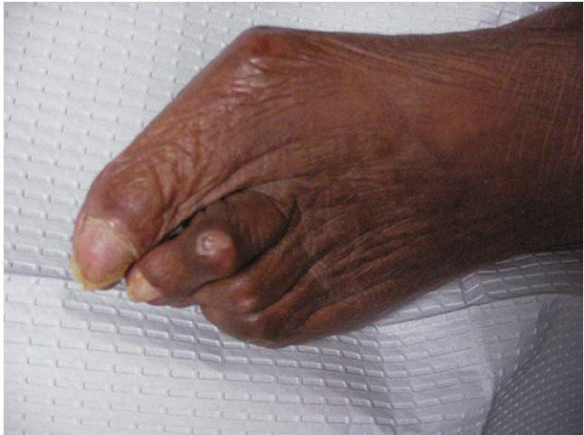

Plate 74-1. A bunion deformity with hammer toe of the second digit. Note preulcerative lesion over proximal phalangeal joint of second toe secondary to shoe pressure.

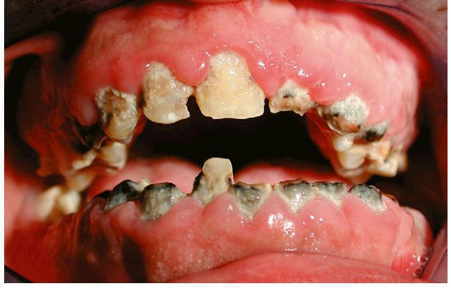

Plate 75-1.

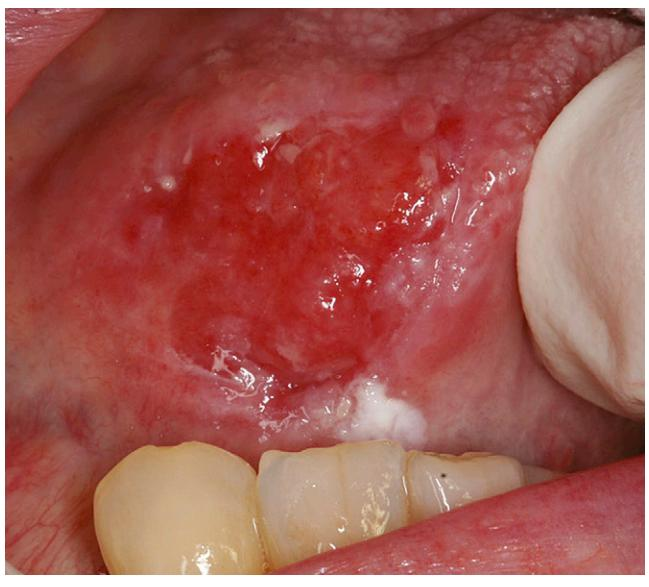

Plate 75-3.

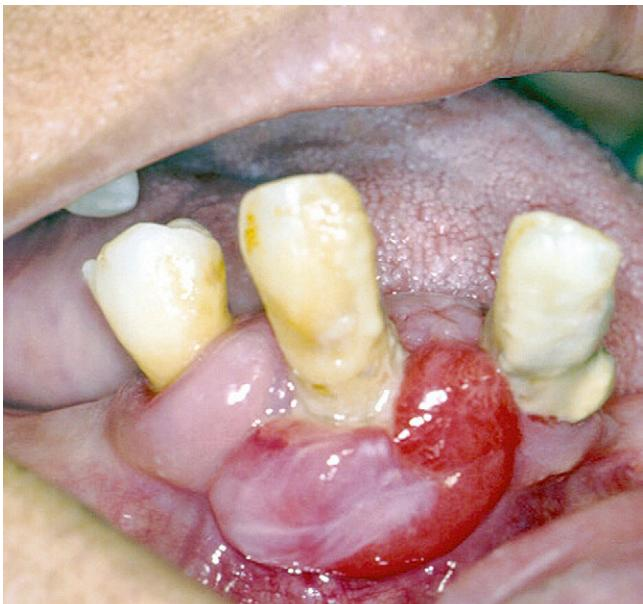

Plate 75-2.

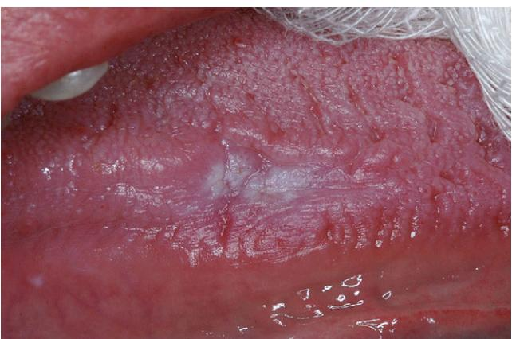

Plate 75-4.

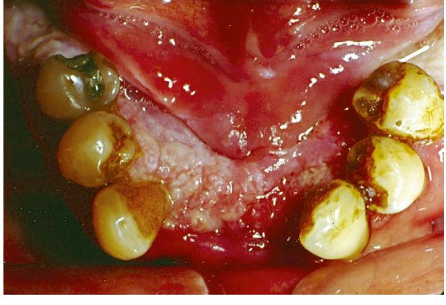

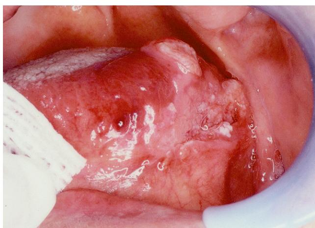

Plate 75-6.

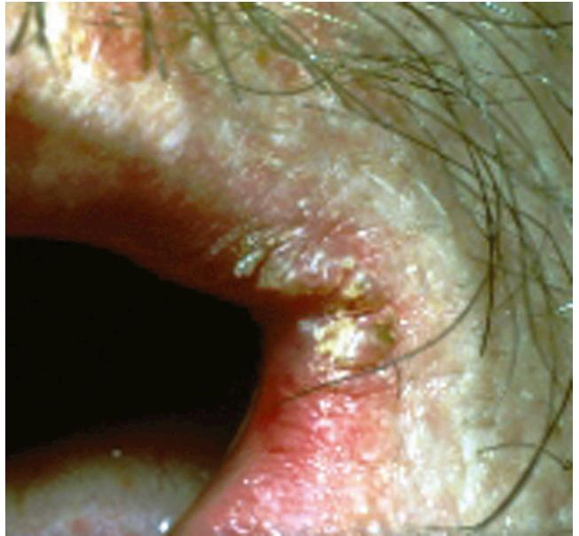

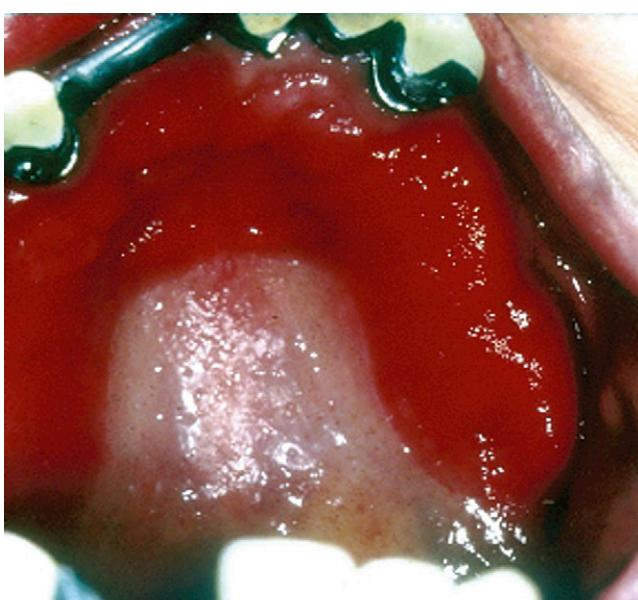

Plate 75-7. Plate 75-8.

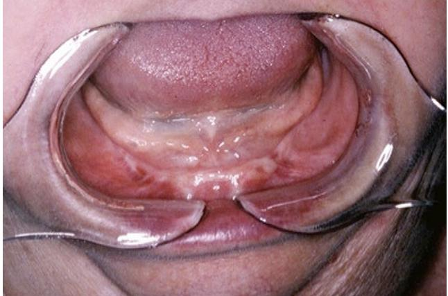

Plate 75-9.

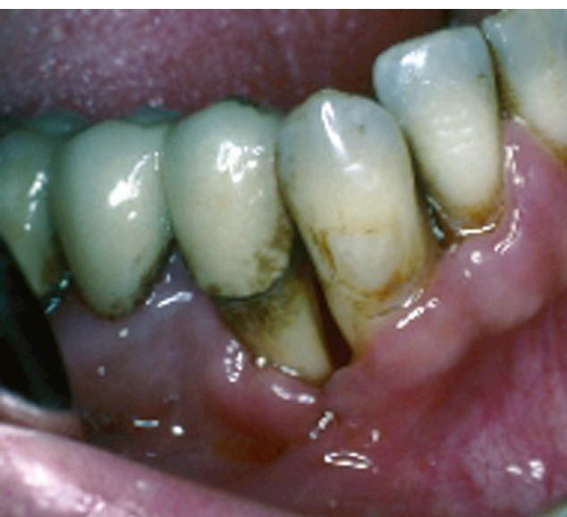

Plate 75-10.

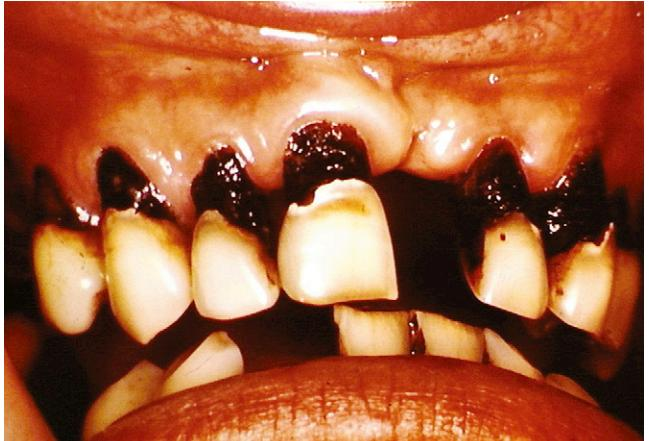

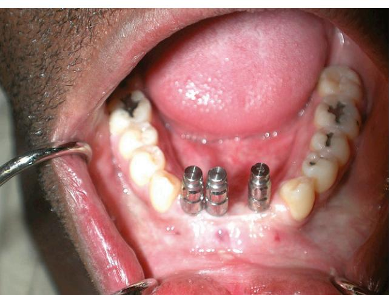

Plate 75-11.

Plate 75-12.

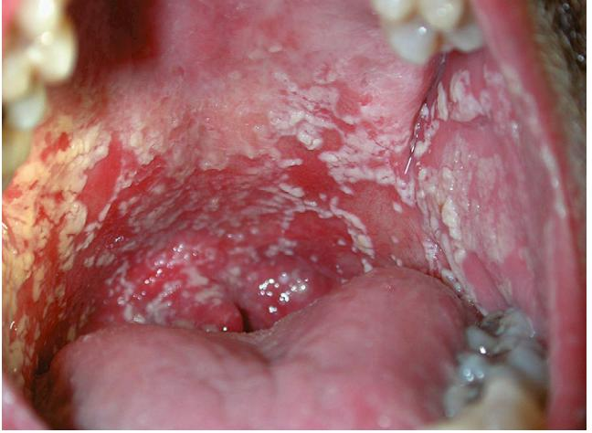

Plate 75-13.

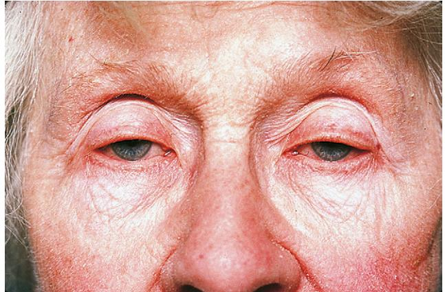

Plate 96-1. Senile ptosis. Note the low lid level and the loss of the normal lid folds. *(Courtesy of Murray Meltzer, MD.)*

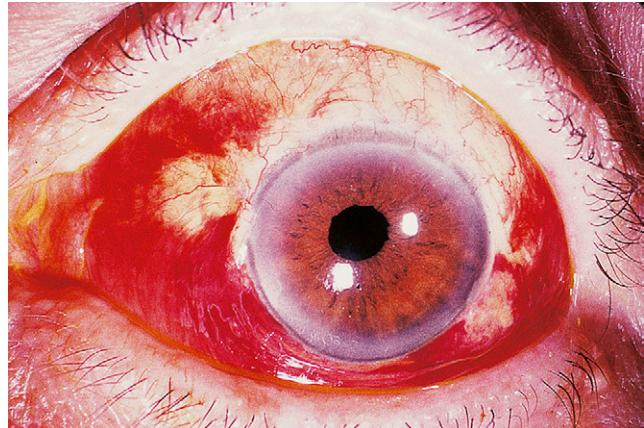

Plate 96-2. Subconjunctival hemorrhage. This small hematoma, seen through the transparent conjunctiva, is benign unless recurrent.

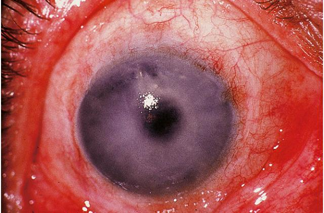

Plate 96-3. Corneal edema. The cornea is thickened and cloudy because of failure of the corneal endothelium to adequately dehydrate the tissue. *(Courtesy of Calvin Roberts, MD.)*

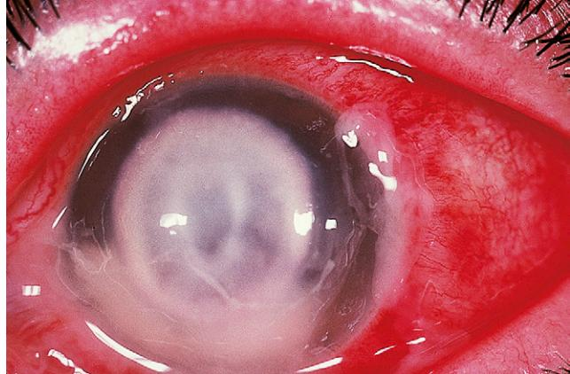

Plate 96-4. Corneal ulcer. A localized infection causes an epithelial defect and attracts an infiltrate of white blood cells. *(Courtesy of Michael Newton, MD.)*

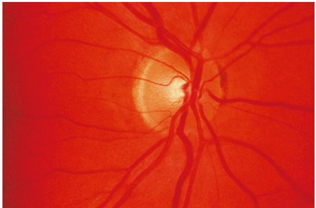

Plate 96-5. Normal optic nerve head. Cup-to-disc ratio is about 0.3.

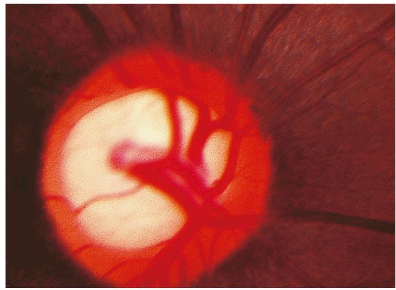

Plate 96-6. Glaucomatous optic nerve head cupping. Loss of neural tissue is seen as narrowing of the neural rim of the optic disc and enlargement of the central cup. *(Compare with Plate 96-5.)*

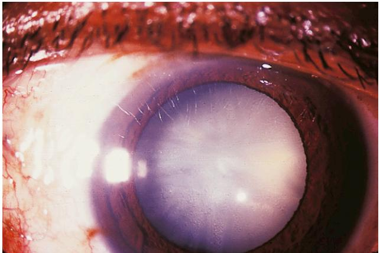

Plate 96-7. Cataract. Loss of transparency of the crystalline lens impairs visual

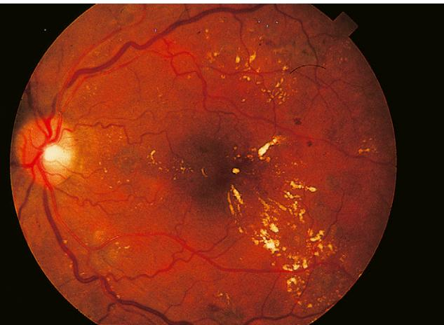

acuity. *(Courtesy of Calvin Roberts, MD.)* Plate 96-8. Background diabetic retinopathy. Microaneurysms ("dot hemorrhages"), intraretinal hemorrhages ("blot hemorrhages"), and "hard" exudates indicate deterioration of the retinal microcirculation.

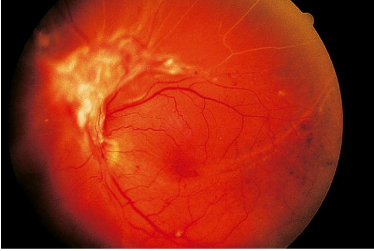

Plate 96-9. Proliferative diabetic retinopathy. A membrane of fibrovascular tissue has sprouted from the optic disc in response to prolonged retinal ischemia.

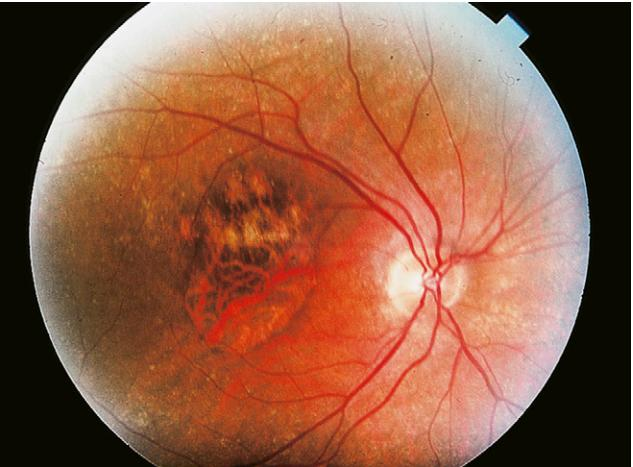

Plate 96-10. Atrophic ("dry") age-related macular degeneration. Geographic atrophy of the retinal pigment epithelium causes loss of central vision.

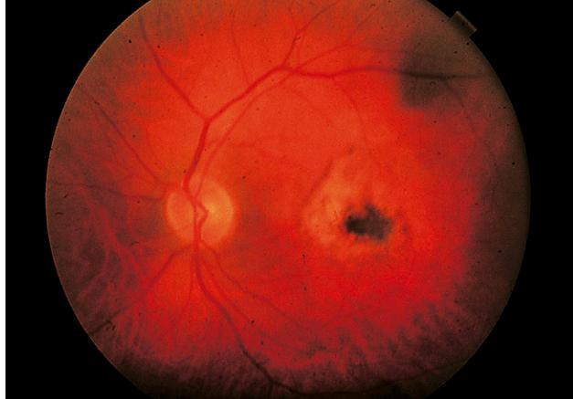

Plate 96-11. Exudative ("wet") age-related macular degeneration. Leakage and scarring from a subretinal neovascular membrane destroys central retinal function.

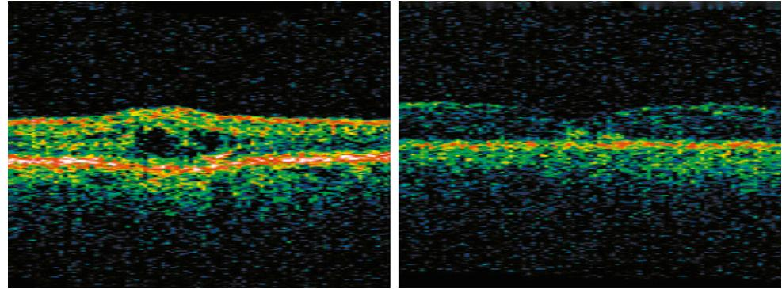

Plate 96-12. Treatment of wet age-related macular degeneration in a 90-year-old woman with intravitreal ranibizumab. Baseline images (left) show macular edema in retinal cross-section as seen in OCT scan image. After three injections of ranibizumab, edema has resolved (right). Visual acuity improved from 20/100 to 20/40.