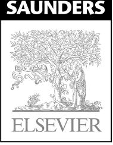

# TEXTBOOK OF GERIATRIC MEDICINE AND GERONTOLOGY

Seventh Edition

Howard M. Fillit Kenneth Rockwood Kenneth Woodhouse

の

# BROCKLEHURST'S TEXTBOOK OF GERIATRIC MEDICINE AND GERONTOLOGY

## SEVENTH EDITION

## Howard M. Fillit MD

Clinical Professor of Geriatrics and Medicine The Mount Sinai Medical Center Executive Director The Alzheimer's Drug Discovery Foundation and the Institute for the Study of Aging New York, New York

## Kenneth Rockwood MD MPA FRCPC FCAHS FRCP

Professor of Medicine Division of Geriatric Medicine Dalhousie University Geriatrician Queen Elizabeth II Health Sciences Centre Halifax, Nova Scotia Canada

## Kenneth Woodhouse MD FRCP FHEA

Pro Vice-Chancellor Professor of Geriatric Medicine Cardiff University Cardiff, Wales United Kingdom

1600 John F. Kennedy Blvd. Ste 1800 Philadelphia, PA 19103-2899

BROCKLEHURST'S TEXTBOOK OF GERIATRIC MEDICINE AND GERONTOLOGY ISBN: 978-1-4160-6231-8

**Copyright © 2010, 2003, 1998, 1992, 1985, 1978, 1973 by Saunders, an imprint of Elsevier Inc.**

**All rights reserved.** No part of this publication may be reproduced or transmitted in any form or by any means, electronic or mechanical, including photocopying, recording, or any information storage and retrieval system, without permission in writing from the publisher. Permissions may be sought directly from Elsevier's Rights Department: phone: (+1) 215 239 3804 (US) or (+44) 1865 843830 (UK); fax: (+44) 1865 853333; e-mail: healthpermissions@elsevier.com. You may also complete your request on-line via the Elsevier website at http://www.elsevier.com/permissions.

**Notice**

Knowledge and best practice in this field are constantly changing. As new research and experience broaden our knowledge, changes in practice, treatment and drug therapy may become necessary or appropriate. Readers are advised to check the most current information provided (i) on procedures featured or (ii) by the manufacturer of each product to be administered, to verify the recommended dose or formula, the method and duration of administration, and contraindications. It is the responsibility of the practitioner, relying on his or her own experience and knowledge of the patient, to make diagnoses, to determine dosages and the best treatment for each individual patient, and to take all appropriate safety precautions. To the fullest extent of the law, neither the Publisher nor the Editors assume any liability for any injury and/or damage to persons or property arising out of or related to any use of the material contained in this book.

The Publisher

#### **Library of Congress Cataloging-in-Publication Data**

Brocklehurst's textbook of geriatric medicine and gerontology / [edited by] Howard M. Fillit, Kenneth Rockwood, Kenneth Woodhouse. -- 7th ed.

p. ; cm.

 Includes bibliographical references and index. ISBN 978-1-4160-6231-8 1. Geriatrics. 2. Gerontology. I. Fillit, Howard. II. Rockwood, Kenneth. III. Woodhouse, K. W. IV. Brocklehurst, J. C. (John Charles) V. Title: Textbook of geriatric medicine and gerontology. VI. Title: Geriatric medicine and gerontology. [DNLM: 1. Geriatrics. 2. Aging. WT 100 B8641 2009]

 RC952.B75 2009 618.97--dc22

2009008517

*Acquisitions Editor:* Druanne Martin *Developmental Editor:* Anne Snyder *Editorial Assistant:* Taylor Ball *Publishing Services Manager:* Hemamalini Rajendrababu *Project Manager:* Sukanthi Sukumar *Design Direction:* Steven Stave *Marketing Manager:* Helena Mutak

Printed in the United States of America Last digit is the print number: 9 8 7 6 5 4 3 2 1

## Contributors

#### **MUHANNED ABU-HIJLEH MD FCCP**

Assistant Professor of Medicine Director of Interventional Pulmonology and Clinical Pulmonary Services Department of Medicine Rhode Island Hospital – The Alpert Medical School of Brown University Providence, Rhode Island

#### **ENRIQUE AGUILAR MD**

Assistant Professor of Medicine Department of Medicine University of Miami, Miller School of Medicine; Associate Chief of Staff, Geriatrics and Extended Care Service Assistant Professor Department of Geriatrics Research, Education, and Clinical Center Miami Veterans Affairs Healthcare System Miami, Florida

#### **SONIA ANCOLI-ISRAEL PhD**

Professor Department of Psychiatry University of California; Director of Education Sleep Medicine Center University of California San Diego, California

#### **MELISSA K ANDREW MD MSc (PH) FRCPC**

Assistant Professor Department of Geriatric Medicine Dalhousie University; Assistant Professor Internal Medicine and Geriatric Medicine Capital District Health Authority Halifax, Nova Scotia, Canada

#### **WILBERT S ARONOW MD FACC FAHA FCCP AGSF**

Clinical Professor of Medicine New York Medical College; Attending Physician Divisions of Cardiology, Geriatrics, and Pulmonary/Critical Care and Chief, Cardiology Clinic Westchester Medical Center/New York Medical College; Senior Associate Program Director and Research Mentor for Residents and Fellows Department of Medicine, Westchester Medical Center/ New York Medical College, Divisions of Cardiology, Geriatrics, and Pulmonary/Critical Care New York Medical College Valhalla, New York

#### **LODOVICO BALDUCCI MD**

Chief, Senior Adult Oncology Program H. Lee Moffitt Cancer Center and Research Institute Tampa, Florida

#### **MARIO BARBAGALLO MD PhD**

Professor of Geriatric Medicine Department of Internal Medicine and Emergent Pathologies University of Palermo Palermo, Italy

#### **ANTONY BAYER MB BCh FRCP**

Senior Lecturer in Geriatric Medicine Department of Medicine Cardiff University; Director, Cardiff Memory Team Rehabilitation Directorate Cardiff and Vale University Local Health Board Cardiff, Wales, United Kingdom

#### **CERI BEATON BM BS BMedSci MRCS**

Department of Surgery Royal Gwent Hospital Newport, South Wales, United Kingdom

## **PAUL E BELCHETZ MA MD MSc FRCP**

Senior Clinical Lecturer Faculty of Medicine University of Leeds; Consultant Physician/Endocrinologist Leeds Nuffield Hospital; Consultant Physician/Endocrinologist Spire Leeds Hospital Leeds, United Kingdom

## **STEVEN L BERK MD**

Dean, School of Medicine Health Sciences Center Texas Tech University Lubbock, Texas

## **RAVI S BHAT MBBS DPM MD FRANZCP**

Associate Professor of Psychiatry School of Rural Health The University of Melbourne; Consultant Old Age Psychiatrist and Director of Psychiatry Goulburn Valley Area Mental Health Service Goulburn Valley Health Shepparton, Victoria, Australia

## **ARNAB BHOWMICK MBChB FRCS (Gen Surg)**

Department of Surgery Lancashire Teaching Hospitals NHS Trust Lancashire, United Kingdom

#### **ITALO BIAGGIONI MD**

Professor of Medicine and Pharmacology Vanderbilt University Nashville, Tennessee

#### **SIMON G BIGGS BSc PhD AFBPsS**

Professor of Gerontology Director, Institute of Gerontology King's College London London, United Kingdom

## **DAVID A. BLACK MA MBA FRCP**

Dean and Director Kent, Surrey and Sussex Postgraduate Medical and Dental Deanery; Consultant Physician South London Healthcare Trust London, United Kingdom

## **HARRISON G BLOOM MD**

Associate Clinical Professor Brookdale Department of Geriatrics and Palliative Medicine Mount Sinai School of Medicine; Senior Associate and Director, Clinical Education and Consultation Service International Longevity Center New York, New York

## **CHARLOTTE E BOLTON MD MRCP**

Associate Professor in Respiratory Medicine Nottingham Respiratory Biomedical Research Unit University of Nottingham; Honorary Consultant in Respiratory Medicine Nottingham City Hospital Nottingham, United Kingdom

## **JULIE BLASKEWICZ BORON MS PhD**

Assistant Professor Department of Psychology Youngstown State University Youngstown, Ohio

## **CLIVE BOWMAN FRCP FFPH**

Medical Director BUPA Care Services Leeds, United Kingdom

#### **SIDNEY S BRAMAN MD FCCP**

Professor of Medicine Director, Division of Pulmonary and Critical Care Medicine Department of Medicine Rhode Island Hospital, The Alpert Medical School of Brown University Providence, Rhode Island

## **LAWRENCE J BRANDT MD MACG FACP FAAPP**

Professor of Medicine and Surgery Albert Einstein College of Medicine; Chief of Gastroenterology Montefiore Medical Center Bronx, New York

### **ROBERTA DIAZ BRINTON PhD**

Professor Department of Pharmacology and Pharmaceutical Sciences School of Pharmacy, Pharmaceutical Sciences Center and Program in Neuroscience University of Southern California Los Angeles, California

## **SCOTT E BRODIE MD PhD**

Associate Professor Department of Ophthalmology Mount Sinai Medical Center New York, New York

## **GINA BROWNE RN PhD**

Professor School of Nursing, Clinical Epidemiology and Biostatistics and Ontario Training Centre in Health Services and Policy Research McMaster University Hamilton, Ontario, Canada

## **PATRICIA BRUCKENTHAL PhD APRN**

Clinical Associate Professor School of Nursing Stony Brook University Stony Brook; Nurse Practitioner Pain and Headache Treatment Center, Department of Neurology North Shore University Hospital Manhasset, New York

## **ANDREW K BURROUGHS MBChB (Hons) FEBG FRCP**

Professor of Hepatology Centre for Liver Studies University College London; Professor and Consultant Physician The Royal Free Sheila Sherlock Liver Centre Royal Free Hospital Hampstead, London, United Kingdom

## **ROBERT N BUTLER MD**

President and CEO International Longevity Center—USA New York, New York

## **RICHARD CAMICIOLI MSc MD FRCP(C)**

Professor of Medicine (Neurology) University of Alberta Edmonton, Alberta, Canada

## **IAN A CAMPBELL FRCP**

Consultant Physician Chest Department Llandough Hospital Cardiff, Wales, United Kingdom

## **ROBERT VICTOR CANTU MD**

Assistant Professor of Orthopaedic Surgery Dartmouth-Hitchcock Medical Center Lebanon, New Hampshire

## **MARGRED CAPEL**

Consultant in Palliative Medicine George Thomas Hospice Care Cardiff, Wales, United Kingdom

## **HARVINDER S CHAHAL BMedSci MBBS MRCP**

Specialist Registrar in Endocrinology Department of Endocrinology St Bartholomew's Hospital London, United Kingdom

## **HERMAN S CHEUNG PhD**

James L. Knight Professor Department of Biomedical Engineering and Medicine University of Miami; Senior VA Career Scientist Geriatric Research, Education, and Clinical Center Bruce W. Carter VA Medical Center Miami, Florida

## **SEAN D CHRISTIE MD FRCSC**

Associate Professor Department of Surgery (Neurosurgery) Dalhousie University Queen Elizabeth II Health Sciences Centre Halifax, Nova Scotia, Canada

## **DUNCAN S COLE BSc FRCPC MD PhD**

Senior Scientist Division of Genomic Medicine Toronto General Research Institute Toronto, Ontario, Canada

## **CLAUDIA COOPER BM MRCPsych MSc PhD**

Senior Lecturer Psychiatry of Older People Research Department of Mental Health Sciences University College of London London, United Kingdom

## **TARA K COOPER MBBCh MRCOG**

Department of Medicine and Veterinary Medicine University of Edinburgh Edinburgh; Department of Obstetrics and Gynaecology St Johns Hospital Livingston, United Kingdom

## **RICHARD A COWIE BSc(Hons) MBChB FRCSE(SN)**

Consultant Neurosurgeon Greater Manchester Neuroscience Centre Salford Royal Hospital Salford, United Kingdom

#### **PETER CROME MD PhD DSc FRCP (Lond, Edin and Glasg) FFPM**

Professor of Geriatric Medicine School of Medicine Keele University Newcastle-under-Lyme Staffordshire, United Kingdom

## **SIMON C M CROXSON MD FRCP**

Consultant Physician Department of the Elderly Bristol General Hospital Bristol, United Kingdom

## **STUTI DANG MD MPH**

Assistant Professor of Medicine Department of Medicine Geriatrics Institute, University of Miami Miller School of Medicine; Researcher, Physician, and Director, T-Care and TLC Geriatric Research, Education, and Clinical Center Bruce W. Carter VA Medical Center; Stein Gerontological Institute Miami Jewish Home Health Systems Miami, Florida

## **GWYNETH A DAVIES MRCP MD**

Senior Clinical Lecturer School of Medicine Swansea University; Honorary Consultant Department of Respiratory Medicine Singleton Hospital, ABMU Health Board Swansea, Wales, United Kingdom

## **TIMOTHY J DOHERTY MD PhD FRCP(C)**

Associate Professor Department of Clinical Neurological Sciences The University of Western Ontario London, Ontario, Canada

#### **LIGIA J DOMINGUEZ MD**

Assistant Professor of Geriatric Medicine Department of Internal Medicine and Emergent Pathologies University of Palermo Palermo, Italy

#### **WILLIAM M DRAKE DM FRCP**

Consultant Endocrinologist Department of Endocrinology St Bartholomew's Hospital London, United Kingdom

#### **EAMONN EELES MBBS MRCP MSc**

Assistant Professor Department of Geriatrics and Internal Medicine Dalhousie University Halifax, Nova Scotia, Canada; Consultant Physician Department of Geriatrics and General Medicine Llandough Hospital Cardiff, Wales, United Kingdom

#### **WILLIAM B ERSHLER MD**

Senior Investigator Clinical Research Branch National Institute on Aging National Institutes of Health Baltimore, Maryland

#### **WILLIAM J EVANS PhD**

Adjunct Professor Department of Medicine, Division of Geriatrics Duke University Durham; Vice President and Head Muscle Metabolism Discovery Performance Unit GlaxoSmithKline Research Triangle Park, North Carolina

#### **MARTIN R FARLOW MD**

Professor and Vice Chair of Neurology Indiana University School of Medicine; Neurologist University Clinical Neurologists Indianapolis, Indiana

#### **RICHARD C FELDSTEIN MD MSc**

Department of Gastroenterology New York University School of Medicine; Attending Faculty Department of Gastroenterology Woodhull Medical and Mental Health Center Brooklyn, New York

## **HOWARD M FILLIT MD**

Clinical Professor of Geriatrics and Medicine The Mount Sinai Medical Center Executive Director The Alzheimer's Drug Discovery Foundation and the Institute for the Study of Aging New York, New York

#### **ANDREW Y FINLAY MBBS FRCP (Lond and Glas)**

Professor of Dermatology Department of Dermatology Cardiff University School of Medicine Cardiff, Wales, United Kingdom

#### **ILORA FINLAY MBBS FRCP FRCGP**

Professor of Palliative Medicine Cardiff University; Consultant in Palliative Medicine Velindre Hospital Cardiff, Wales, United Kingdom

#### **ROGER M FRANCIS MB ChB FRCP**

Professor of Geriatric Medicine University of Newcastle upon Tyne; Consultant Physician Bone Clinic Musculoskeletal Unit Freeman Hospital Newcastle upon Tyne, United Kingdom

#### **ANTHONY J FREEMONT MD FRCP FRCPath**

Professor of Osteoarticular Pathology School of Clinical and Laboratory Sciences University of Manchester; Honorary Consultant in Osteoarticular Pathology Department of Histopathology Central Manchester NHS Foundation Trust Great Manchester, United Kingdom

#### **JAMES E GALVIN MD MPH**

Associate Professor Department of Neurology Washington University School of Medicine St Louis, Missouri

#### **NICHOLAS J R GEORGE MD FRCS FEBU**

Senior Lecturer and Consultant in Urology Department of Urology University Hospital South Manchester Manchester, United Kingdom

#### **NEIL D GILLESPIE BSc(Hons) MBChB MD**

Senior Lecturer in Medicine (Ageing and Health) Ninewells Hospital and Medical School University of Dundee Dundee, United Kingdom

#### **ROBERT GLICKMAN DMD**

Professor and Chair Department of Oral and Maxillofacial Surgery New York University College of Dentistry; Director NYU Medical Center/Bellevue Hospital Center New York, New York

#### **ADAM G GOLDEN MD MBA**

Assistant Professor of Medicine Department of Medicine Geriatrics Institute, University of Miami Miller School of Medicine; Researcher and Physician Geriatric Research, Education, and Clinical Center Bruce W. Carter VA Medical Center Miami, Florida

#### **LESLIE B GORDON MD PhD**

Associate Professor of Pediatrics Research Department of Pediatrics Warren Alpert Medical School of Brown University Hasbro Children's Hospital Providence, Rhode Island; Medical Director The Progeria Research Foundation Peabody, Massachusetts

#### **MICHELLE GORENSTEIN PsychD**

Psychology Intern Department of Psychiatry The Mount Sinai Medical Center New York, New York

#### **MARGOT A GOSNEY MD FRCP**

Director Department of Clinical Health Sciences University of Reading; Professor of Elderly Care Medicine Department of Elderly Care Royal Berkshire NHS Foundation Trust Reading, United Kingdom

#### **JOHN TREVOR GREEN MB Bch MD FRCP**

Clinical Senior Lecturer Department of Medical Education Cardiff University; Consultant Physician Department of Gastroenterology University Hospital Llandough Cardiff, Wales, United Kingdom

#### **DAVID A GREENWALD MD FACG FASGE AGA-F**

Associate Professor of Clinical Medicine Albert Einstein College of Medicine; Gastroenterology Fellowship Director Montefiore Medical Center Bronx, New York

#### **CELIA L GREGSON BMedSci(Hons) MRCP(UK) MSc**

Wellcome Clinical Research Fellow Academic Rheumatology University of Bristol Bristol, United Kingdom

#### **MICHAEL L GRUBER MD**

Clinical Professor of Neurology and Neurosurgery New York University School of Medicine; Attending Department of Neurology and Neurosurgery NYU Langone Medical Center New York, New York; Director, Brain Tumor Center of New Jersey Department of Neurology Overlook Hospital Summit, New Jersey

#### **DAVID R P GUAY PharmD**

Professor College of Pharmacy University of Minnesota Department of Geriatrics HealthPartners Inc. Minneapolis, Minnesota

#### **RENATO MAIA GUIMARÃES MD MSc**

Director Geriatric Medical Center Hospital Universitario de Brasilia Brasilia, Brazil

## **KHALID HAMANDI MB BS BSC MRCP PhD**

Consultant Neurologist Welsh Epilepsy Unit Department of Neurology University Hospital of Wales and University Hospital Llandough Cardiff, Wales, United Kingdom

## **PETER HAMMOND BM BCh MA MD FRCP**

Consultant Physician Department of Diabetes and Endocrinology Harrogate District Hospital Harrogate – North Yorkshire, United Kingdom

## **STEVEN M HANDLER MD MS**

Division of Geriatric Medicine Department of Medicine Department of Biomedical Informatics School of Medicine University of Pittsburgh Geriatric Research Education and Clinical Center Veterans Affairs Pittsburgh Healthcare System Pittsburgh, Pennsylvania

## **JOSEPH T HANLON PharmD MS**

Division of Geriatric Medicine, Department of Medicine, School of Medicine, and Department of Pharmacy and Therapeutics, School of Pharmacy, University of Pittsburgh Geriatric Research Education and Clinical Center

and Center for Health Equity Research and Promotion Veterans Affairs Pittsburgh Healthcare System Pittsburgh, Pennsylvania

#### **MALENE HANSEN PhD**

Assistant Professor Center for Neuroscience, Aging, and Stem Cell Research Burnham Institute for Medical Research La Jolla, California

#### **DANIELLE HARARI MB BS FRCP**

Honorary Senior Lecturer Division of Health and Social Care Research Kings College London; Consultant Physician in Geriatric Medicine Department of Ageing and Health Guy' s and St Thomas' NHS Foundation Trust London, United Kingdom

## **MUJTABA HASAN MD MSc FRCP**

Senior Lecturer Department of Geriatric Medicine Cardiff University Cardiff; Consultant Physician Department of Geriatric Medicine Aneurin Bevan Health Board Caerphilly, Wales, United Kingdom

## **GEORGE A HECKMAN MD MSc FRCPC**

Department of Medicine, Divisions of Geriatric Medicine and Cardiology McMaster University Hamilton Health Science, General Division Hamilton, Ontario, Canada

## **PAUL HIGGS BSc PhD**

Professor of the Sociology of Ageing Division of Research Strategy University College London London, United Kingdom

#### **DAVID B HOGAN MD FACP FRCPC**

Professor and Brenda Strafford Foundation Chair in Geriatric Medicine Department of Medicine University of Calgary; Medical Director, Cognitive Assessment Clinic Department of Clinical Neurosciences and Medicine Alberta Health Services – Calgary; Medical Director, Calgary Falls Prevention Clinic Department of Medicine Alberta Health Services – Calgary Calgary, Alberta, Canada

## **SØREN HOLM BA MA MD**

Professor of Bioethics School of Law The University of Manchester Manchester, United Kingtom; Professor of Medical Ethics Section for Medical Ethics University of Oslo Oslo, Norway

#### **BEN HOPE-GILL MD FRCP**

Consultant Respiratory Physician Department of Respiratory Medicine Cardiff and Vale NHS Trust Cardiff, Wales, United Kingdom

#### **SUSAN E HOWLETT BSc (Hons) MSc PhD**

Professor of Pharmacology and Medicine Division of Geriatric Medicine Dalhousie University Halifax, Nova Scotia, Canada

## **RUTH E HUBBARD MSc MD MRCP**

Consultant Geriatrician Department of Geriatric Medicine Cardiff and Vale NHS Trust Cardiff, Wales, United Kingdom

## **JOANNA HURLEY MB BCh MRCP (UK)**

Specialist Registrar in Gastroenterology Department of Gastroenterology University Hospital Llandough Penarth, Wales, United Kingdom

## **C SHANTHI JOHNSON PhD RD FACSM FDC**

Professor and Associate Dean (Research and Graduate Studies) Faculty of Kinesiology and Health Studies University of Regina Regina, Saskatchewan, Canada

## **LARRY E JOHNSON MD PhD**

Associate Professor Department of Geriatrics and Family and Preventive Medicine University of Arkansas for Medical Sciences; Medical Director Community Living Center Central Arkansas veterans Healthcare System Little Rock, Arkansas

## **BINDU KANAPURU MD**

Clinical Research Fellow Clinical Research Branch National Institute on Aging, National Institutes of Health Baltimore, Maryland

## **ROSALIE A KANE PhD**

Professor of Public Health Health Policy and Management School of Public Health University of Minnesota Minneapolis, Minnesota

## **CORNELIUS KATONA MD FRCPsych**

Professor University of Kent Wingham Barton Manor Westmarsh, Canterbury, Kent, United Kingdom

## **SEYMOUR KATZ MD FACP MACG**

Clinical Professor of Medicine Department of Medicine Albert Einstein College of Medicine Bronx; Attending Physician Department of Medicine North Shore University Hospital/Long Island Jewish Health System Manhasset; Attending Physician Department of Medicine St. Francis Hospital Roslyn, New York

## **HORACIO KAUFMANN MD FAAN**

Professor of Neurology and Medicine Department of Neurology New York University School of Medicine New York, New York

## **NICHOLAS A KEFALIDES MD PhD**

Professor of Medicine-Emeritus Department of Medicine University of Pennsylvania Philadelphia, Pennsylvania

## **HEATHER H KELLER RD PhD FDC**

Professor Department of Family Relations and Applied Nutrition University of Guelph Guelph, Ontario, Canada

## **ROSE ANNE KENNY MD FRCPI FRCP**

Chair of Geriatric Medicine Department of Medical Gerontology Trinity College Dublin; Consultant Physician in Geriatric Medicine Department of Medicine for the Elderly St. James's Hospital Dublin, Ireland

## **THOMAS B L KIRKWOOD MA MSc PhD**

Director, Institute for Ageing and Health Newcastle University Newcastle upon Tyne, United Kingdom

## **BRANDON KORETZ MD**

Assistant Clinical Professor UCLA Medical Center UCLA Santa Monica Orthopedic Hospital Department of Medicine University of California, Los Angeles Los Angeles, California

## **MARK A KOSINSKI DPM**

Professor Department of Medical Sciences New York College of Podiatric Medicine New York, New York

## **KENNETH J KOVAL MD**

Professor of Orthopaedic Surgery Dartmouth-Hitchcock Medical Center Lebanon, New Hampshire

## **GEORGE A KUCHEL MD FRCP**

Professor of Medicine Citicorp Chair in Geriatrics and Gerontology University of Connecticut Center on Aging University of Connecticut Health Center Farmington, Connecticut

## **CHAO-QIANG LAI PhD**

Research Molecular Biologist Department of Nutrition and Genomics Laboratory Jean Mayer USDA Human Nutrition Research Center on Aging at Tufts University Boston, Massachusetts

#### **W CLARK LAMBERT MD PhD**

Professor and Associate Head, Dermatology Professor of Pathology Chief, Dermatopathology Department of Dermatology New Jersey Medical School Newark, New Jersey

## **ALEXANDER LAPIN MD Dr Phil (Chem) Dr Theol**

Associate Professor Clinical Institute of Medical and Chemical Diagnostics; Head of the Laboratory Department Laboratory Medicine Sozialmedizinisches Zentrum Sophienspital Vienna, Austria

## **MYRNA I LEWIS PhD†**

Assistant Professor Mount Sinai School of Medicine New York, New York

## **STUART A LIPTON MD PhD**

Professor (Adjunct) Department of Neurology University of California, San Diego; Neurologist Department of Neurology UCSD Medical Center La Jolla, California

## **GILL LIVINGSTON MBChB FRCPsych MD**

Professor Department of Mental Health Sciences University College of London; Consultant Psychiatrist Mental Health Care of Older People Camden and Islington Foundation Trust London, United Kingdom

## **JORGE H LOPEZ MD**

Professor of Internal Medicine and Geriatrics Department of Internal Medicine Universidad Nacional de Colombia; President Asociacion Colombiana de Gerontologia Y Geriatria Bogota, Colombia

## **MARY V MACNEIL MD FRCPC**

Assistant Professor Department of Medicine Dalhousie University; Medical Oncologist Department of Medicine Division of Medical Oncology Queen Elizabeth II Health Sciences Centre and Nova Scotia Cancer Centre Halifax, Nova Scotia, Canada

## **ROBERT L MAHER PharmD BCPS CGP**

Assistant Professor of Pharmacy Practice Mylan School of Pharmacy Duquesne University Pittsburgh, Pennsylvania

## **JILL MANTHORPE MA**

Professor of Social Work Director, Social Care Workforce Research Unit King's College London London, United Kingdom

## **KENNETH G MANTON PhD**

Research Professor Office of Dean of Arts and Sciences Duke University Durham, North Carolina

## **BRYAN MARKINSON DPM**

Assistant Professor of Orthopaedics and Pathology Center for Advanced Medicine Mount Sinai School of Medicine New York, New York

## **MAUREEN F MARKLE-REID RN MScN PhD**

Associate Professor School of Nursing McMaster University; Career Scientist Ontario Ministry of Health and Long-Term Care Hamilton, Ontario, Canada

## **JANE MARTIN PhD**

Assistant Clinical Professor Co-Director Neuropsychological Testing and Evaluation Center Department of Psychiatry Mount Sinai Medical Center New York, New York

## **EDWARD J MASORO PhD**

Emeritus Professor University of Texas Health Science Center San Antonio, Texas

## **CHARLES N McCOLLUM MB ChB FRCS MD**

Professor of Surgery University Hospital of South Manchester Manchester, United Kingdom

## **MICHAEL A McDEVITT MD PhD**

Assistant Professor Department of Medicine and Oncology Johns Hopkins School of Medicine and Sidney Kimmel Comprehensive Cancer Center at Johns Hopkins Baltimore, Maryland

## **BRUCE S McEWEN PhD**

Professor and Head Laboratory of Neuroendocrinology The Rockefeller University New York, New York

## **JOLYON MEARA MD FRCP**

Senior Lecturer in Geriatric Medicine University of Wales College of Medicine Rhyl, North Wales, United Kingdom

## **MYRON MILLER MD**

Professor Department of Medicine Johns Hopkins University School of Medicine; Director Division of Geriatric Medicine Department of Medicine Sinai Hospital of Baltimore Baltimore, Maryland

## **ARNOLD MITNITSKI PhD**

Associate Professor Department of Medicine Dalhousie University Halifax, Nova Scotia, Canada

## **PAIGE A MOORHOUSE MD MPH FRCPC**

Assistant Professor Department of Medicine Division of Geriatric Medicine Dalhousie University; Clinical Researcher Division of Geriatric Medicine Capital District Health Authority Halifax, Nova Scotia, Canada

## **JOHN E MORLEY MB BCh**

Professor of Gerontology Director Division of Geriatric Medicine; Director Geriatric Research, Education and Clinical Center St Louis, Missouri

## **LATANA A MUNANG MBChB MRCP (UK)**

Specialist Registrar in Geriatric Medicine and General Internal Medicine Department of Geriatric Medicine Western General Hospital Edinburgh, United Kingdom

## **JAMES W MYERS MD**

Professor, Infectious Diseases Department of Internal Medicine Quillen College of Medicine East Tennessee State University Johnson City, Tennessee

## **TOMOHIRO NAKAMURA PhD**

Research Assistant Professor Center for Neuroscience, Aging, and Stem Cell Research Burnham Institute for Medical Research La Jolla, California

## **JAMES NAZROO MBBS BSc MSc PhD**

Professor of Sociology Department of Sociology School of Social Sciences University of Manchester Manchester, United Kingdom

## **MICHAEL W NICOLLE MD FRCPC DPhil**

Associate Professor Department of Clinical Neurological Sciences University of Western Ontario London, Ontario, Canada

## **SEAN M OLDHAM PhD**

Assistant Professor Cancer Center and Center for Neuroscience, Aging and Stem Cell Research Burnham Institute for Medical Research La Jolla, California

## **JOSE M ORDOVAS PhD**

Professor Friedman School of Nutrition Science and Policy Tufts University; Director Nutrition and Genomics Laboratory Jean Mayer USDA Human Nutrition Research Center on Aging at Tufts University Boston, Massachusetts

## **JOSEPH G OUSLANDER MD**

Professor of Clinical Biomedical Science Associate Dean for Geriatric Programs Charles E. Schmidt College of Biomedical Science; Professor (Courtesy) Christine E. Lynn College of Nursing Florida Atlantic University Boca Raton; Professor of Medicine (Voluntary) Associate Director Division of Gerontology and Geriatric Medicine University of Miami Miller School of Medicine Miami, Florida

## **JAMES T PACALA MD MS**

Associate Professor and Distinguished Teaching Professor Family Medicine and Community Health University of Minnesota Medical School Minneapolis, Minnesota

#### **LAURENCE D PARNELL PhD**

Computational Biologist Nutrition and Genomics Laboratory Jean Mayer USDA Human Nutrition Research Center on Aging at Tufts University Boston, Massachusetts

#### **GOPAL A PATEL MD**

Department of Dermatology New Jersey Medical School Newark, New Jersey; Department of Medicine Memorial Sloan Kettering Cancer Center New York, New York

#### **THOMAS T PERLS MD MPH FACP**

Associate Professor of Medicine; Director The New England Centenarian Study Boston University School of Medicine Boston University Medical Center Boston, Massachusetts

#### **THANH G PHAN MBBS**

Assistant Professor Department of Medicine Monash University; Assistant Professor Department of Neurosciences Monash Medical Centre Clayton, Australia

#### **KATIE PINK MBBCH (Hons) MRCP**

Specialist Registrar Department of Respiratory Medicine Llandough Hospital Cardiff, Wales, United Kingdom

#### **VALERIE M POMEROY PhD FCSP BA Grad Dip Phys**

Professor of Rehabilitation for Older People Section of Geriatric Medicine Division of Clinical Developmental Sciences St George's University of London London, United Kingdom

#### **JOHN F POTTER BM BS DM FRCP**

Professor of Ageing and Stroke Medicine School of Medicine University of East Anglia Norwich, United Kingdom

#### **MALCOLM C A PUNTIS MB Bach PhD FRCS**

Senior Lecturer Department of Surgery Cardiff University; Consultant Surgeon University Hospital of Wales Cardiff, Wales, United Kingdom

#### **GANGARAM RAGI MD**

Director Advanced Laser and Skin Cancer Center Teaneck, New Jersey

#### **HOLLY J RAMSAWH PhD**

Assistant Project Scientist Department of Psychiatry University of California San Diego San Diego, California

#### **M SHAWKAT RAZZAQUE MD PhD**

Department of Oral Medicine, Infection and Immunity Harvard School of Dental Medicine Boston, Massachusetts; Department of Pathology Nagasaki University School of Medicine Nagasaki, Japan

#### **DAVID B REUBEN MD**

Professor of Medicine Department of Medicine UCLA Medical Center UCLA Santa Monica Orthopedic Hospital University of California, Los Angeles Los Angeles, California

#### **KENNETH ROCKWOOD MD MPA FRCPC FCAHS FRCP**

Professor of Medicine Division of Geriatric Medicine Dalhousie University; Geriatrician Queen Elizabeth II Health Sciences Centre Halifax, Nova Scotia, Canada

## **CHRISTOPHER A RODRIGUES PhD FRCP**

Consultant Gastroenterologist Department of Gastroenterology Kingston Hospital Kingston-upon-Thames, Surrey, United Kingdom

## **YVES ROLLAND**

Service de Médecine Interne et de Gérontologie Clinique Hôpital La Grave-Casselardit Toulouse, France

## **BERNARD A ROOS MD**

Professor and Director Geriatrics Institute Department of Medicine, Neurology, and Exercise and Sport Sciences University of Miami Miller School of Medicine; Director Geriatric Research, Education, and Clinical Center Bruce W. Carter VA Medical Center; Director Stein Gerontological Institute Miami Jewish Home Health Systems Miami, Florida

## **SONJA ROSEN MD**

Assistant Clinical Professor UCLA Medical Center UCLA Santa Monica Orthopedic Hospital Division of Geriatric Medicine Department of Medicine David Geffen School of Medicine at University of California Los Angeles Los Angeles, California

## **DAVID H ROSENBAUM MD**

Associate Clinical Professor of Neurology Mount Sinai Medical Center New York, New York

## **PHILIP A ROUTLEDGE OBE MD FRCP FRCPE FBTS**

Professor of Clinical Pharmacology Section of Pharmacology, Therapeutics and Toxicology Cardiff University; Department of Clinical Pharmacology University Hospital Llandough Cardiff and Vale University Health Board Cardiff, Wales, United Kingdom

## **LAURENCE Z RUBENSTEIN MD MPH**

Professor of Geriatric Medicine University of California Los Angeles School of Medicine Los Angeles; Geriatric Research Education and Clinical Center Greater Los Angeles VA Medical Center Sepulveda, California

## **LISA V RUBENSTEIN MD MSPH**

Professor of Medicine and Public Health University of California Los Angeles School of Medicine Los Angeles; Department of Medicine Greater Los Angeles VA Medical Center Sepulveda, California

## **GORDON SACKS PharmD**

Clinical Associate Professor School of Pharmacy University of Wisconsin Madison, Wisconsin

## **GERRY J F SALDANHA MA (Oxon) FRCP**

Consultant Neurologist Department of Neurology Maidstone and Tunbridge Wells NHS Trust Tunbridge Wells, Kent; Consultant Neurologist Department of Neurology King's College Hospital NHS Foundation Trust London, United Kingdom

## **LUIS F SAMOS MD**

Assistant Professor of Medicine Department of Medicine University of Miami Miller School of Medicine; Medical Director Nursing Home Care Unit Geriatrics and Extended Care Service Miami Veterans Affairs Healthcare System Miami, Florida

## **MARY SANO PhD**

Professor of Psychiatry Director of the Alzheimer's Disease Research Mount Sinai School of Medicine Director of Research and Development Bronx Veterans Administration Hospital Bronx, New York

## **ROBERT SANTER BSc PhD DSc**

School of Biosciences Cardiff University Cardiff, Wales, United Kingdom

## **K WARNER SCHAIE PhD ScD(Hon) DrPhil (Hon)**

Affiliate Professor Department of Psychiatry and Behavioral Sciences University of Washington Seattle, Washington

#### **KENNETH E SCHMADER MD**

Department of Medicine (Division of Geriatrics), and Center for the Study of Aging and Human Development Duke University Medical Center Geriatric Research, Education and Clinical Center Veterans Affairs Medical Center Durham, North Carolina

## **ANDREA SCHREIBER DMD**

Clinical Professor Department of Oral and Maxillofacial Surgery New York University College of Dentistry; Associate Attending Department of Oral and Maxillofacial Surgery Bellevue Hospital Center; Director New York University Medical Center/Bellevue Hospital Center New York, New York

## **ROBERT A SCHWARTZ MD MPH**

Professor and Head Department of Dermatology Professor of Medicine Professor of Preventive Medicine and Community Health Professor of Pathology New Jersey Medical School Newark, New Jersey

## **DAVID L SCOTT BSc MD FRCP**

Professor of Clinical Rheumatology Kings College London; Honorary Consultant Rheumatologist Kings College Hospital London, United Kingdom

## **MARGARET C SEWELL PhD**

Assistant Clinical Professor of Psychiatry Mount Sinai School of Medicine Director, Education Core Alzheimer's Disease Research Center New York, New York

## **D GWYN SEYMOUR BSc MD FRCP**

Emeritus Professor of Medicine (Care of the Elderly) University of Aberdeen Aberdeen, United Kingdom

## **KRUPA SHAH MD MPH**

Instructor in Medicine Division of Geriatrics and Ageing University of Rochester, School of Medicine Rochester, New York

## **HAMSARAJ G M SHETTY BSc MBBS FRCP (London)**

Honorary Senior Lecturer Department of Integrated Medicine Cardiff University Medical School; Consultant Physician Department of Integrated Medicine University Hospital of Wales Cardiff, Wales, United Kingdom

## **FELIPE SIERRA PhD**

Director Division of Aging Biology National Institute on Aging Bethesda, Maryland

## **ALAN J SINCLAIR MSc MD FRCP**

Director Institute of Diabetes for Older People University of Bedfordshire Luton, Bedfordshire, United Kingdom

## **KRISTEL SLEEGERS MD PhD**

Assistant Professor Department of Molecular Genetics VIB and University of Antwerp; Laboratory of Neurogenetics Institute Born-Bunge Antwerp, Belgium

## **OLIVER MILLING SMITH MBChB BSc MD MRCOG**

Department of Medicine and Veterinary Medicine University of Edinburgh; Department of Obstetrics and Gynaecology Royal Infirmary Edinburgh Scotland, United Kingdom

## **PHILLIP P SMITH MD**

Department of Surgery University of Connecticut Health Center Farmington, Connecticut

## **VELANDAI K SRIKANTH**

Assistant Professor Department of Medicine Southern Clinical School Monash University; Assistant Professor Department of Neurosciences Monash Medical Centre Clayton, Australia; Honorary Member Department of Epidemiology Menzies Research Institute Hobart, Australia

#### **JOHN M STARR FRCPEd**

Professor of Health and Ageing Geriatric Medicine Unit University of Edinburgh Scotland, United Kingdom

#### **RICHARD G STEFANACCI DO MGH MBA AGSF CMD**

Director Institute for Geriatric Studies Director Center for Medicare Medication Management University of the Sciences in Philadelphia; Medical Director Department of LIFE NewCourtland Elder Services Philadelphia, Pennsylvania

#### **PAUL STOLEE PhD**

Associate Professor Department of Health Studies and Gerontology University of Waterloo Waterloo, Ontario, Canada

#### **MICHAEL STONE BA MBBS DM FRCP**

Professor Bone Research Unit Department of Geriatrics Cardiff University Cardiff, Wales; Geriatric Medicine University Hospital of Llandough Penarth, Wales, United Kingdom

#### **BRYAN D STRUCK MD**

Associate Professor DW Reynolds Department of Geriatric Medicine University of Oklahoma Health Sciences Center–College of Medicine; Medical Director Palliative Care Unit Department of Geriatrics and Extended Care Oklahoma City Veterans Administration Medical Center Oklahoma City, Oklahoma

#### **ALLAN D STRUTHERS BSc MD FRCP FESC**

Professor of Cardiovascular Medicine Division of Medical Sciences University of Dundee; Consultant Physician Department of Medicine Ninewells Hospital Dundee, United Kingdom

#### **STEPHANIE A STUDENSKI MD MPH**

Professor Department of Internal Medicine University of Pittsburgh; Staff Physician Geriatric Research Education and Clinical Center Pittsburgh Veterans Affairs Health System Pittsburgh, Pennsylvania

#### **DENNIS H SULLIVAN MD**

Professor of Geriatrics and Internal Medicine Executive Vice Chairman Donald W. Reynolds Department of Geriatrics University of Arkansas for Medical Sciences; Director Geriatric Research Education and Clinical Center Central Arkansas Veterans Healthcare System Little Rock, Arkansas

#### **RAWAN TARAWNEH MD**

Fellow Department of Neurology Washington University School of Medicine Alzheimer's Disease Research Center St Louis, Missouri

#### **DENNIS D TAUB PhD**

Senior Investigator Clinical Immunology Section Laboratory of Immunology Gerontology Research Center National Institute on Aging/National Institute of Health Baltimore, Maryland

#### **ROBERT E TEPPER MD FACP FACG**

Associate Attending Physician Department of Medicine North Shore University Hospital Manhasset; Attending Physician Department of Medicine St Francis Hospital Roslyn, New York

#### **LADORA V THOMPSON PhD BS PT**

Professor Program in Physical Therapy University of Minnesota Minneapolis, Minnesota

#### **AMANDA G THRIFT BSc (Hons) PhD PGDipBiostat**

Adjunct Associate Professor Department of Epidemiology and Preventive Medicine Monash University; Head of Unit Department of Stroke Epidemiology Baker IDI Heart and Diabetes Institute Melbourne, Victoria, Australia

#### **ANTHEA TINKER CBE PhD FKC AcSS**

Professor of Social Gerontology Institute of Gerontology King's College London London, United Kingdom

#### **MOHAN K TUMMALA MD MRCP**

Department of Hematology and Oncology Marshfield Clinic Minocqua, Wisconsin

#### **JANE TURTON MD**

Medicine and Geriatric Medicine Cardiff University Cardiff, Wales, United Kingdom

#### **CHRISTINE VAN BROECKHOVEN PhD DSc**

Professor and Department Director Department of Molecular Genetics VIB and University of Antwerp; Research Director Laboratory of Neurogenetics Institute Born-Bunge Antwerp, Belgium

#### **BRUNO VELLAS MD PhD**

Centre de Gériatrie Toulouse, France

#### **NORMAN VETTER FFPH MD**

Department of Primary Care and Public Health Cardiff University; National Public Health Service Temple of Peace Cardiff, Wales, United Kingdom

### **EMMA C VEYSEY MBChB MRCP**

Dermatology Department Singleton Hospital Swansea, United Kingdom

#### **ANDREW VIGARIO BA**

Research Coordinator Alzheimer's Disease Research Center Mount Sinai Medical Center New York, New York

#### **DENNIS T VILLAREAL MD**

Professor of Medicine Department of Medicine University of New Mexico School of Medicine; Chief, Geriatrics Section Department of Medicine New Mexico VA Health Care System Albuquerque, New Mexico

## **OLEG VOLKOV PhD**

Senior Research Associate International Longevity Center New York, New York

#### **ADRIAN WAGG MB FRCP FHEA**

Consultant and Senior Lecturer in Geriatric Medicine Department of Geriatric Medicine University College London; Consultant and Senior Lecturer in Geriatric Medicine Department of Geriatric Medicine University College London and St Pancras Hospitals London, United Kingdom

#### **ARNOLD WALD MD**

Professor of Medicine Section of Gastroenterology and Hepatology University of Wisconsin School of Medicine and Public Health Madison, Wisconsin

#### **MARION F WALKER PhD MPhil Dip COT**

Professor in Stroke Rehabilitation School of Community Health Sciences Institute of Neuroscience The University of Nottingham Nottingham, United Kingdom

#### **KATHERINE WARD DPM DABPS**

Palisades Podiatry Associates Pomona, New York

#### **HUBER R WARNER PhD**

Associate Dean for Research College of Biological Sciences University of Minnesota Minneapolis, Minnesota

#### **BARBARA E WEINSTEIN PhD**

Professor and Executive Officer Health Sciences Doctoral Programs–Audiology, Nursing Sciences, Physical Therapy, Public Health Graduate Center

The City University of New York New York, New York

#### **SHERRY L WILLIS PhD**

Research Professor Department of Psychiatry and Behavioral Sciences University of Washington Seattle, Washington

#### **MILES D WITHAM BM BCh PhD**

Clinical Lecturer in Ageing and Health University of Dundee Dundee, United Kingdom

#### **JEAN WOO MD**

Professor Department of Medicine and Therapeutics The Chinese University of Hong Kong Hong Kong, China

#### **KENNETH WOODHOUSE MD FRCP FHEA**

Vice-Chancellor Professor of Geriatric Medicine Cardiff University Cardiff, Wales, United Kingdom

#### **ELIAS XIROUCHAKIS MD**

Research Fellow The Sheila Sherlock Hepatobiliary Pancreatic and Liver Transplantation Unit Royal Free and UCL Medical School London, United Kingdom; Consultant Gastroenterologist and Hepatologist Department of Gastroenterology and Hepatology Athens Medical, P. Falirou Hospital Athens, Greece

#### **JOHN YOUNG MB(Hons) MSc MBA FRCP**

Professor of Elderly Care Medicine Leeds Institute of Health Sciences Leeds University Consultant Geriatrician Bradford Teaching Hospitals NHS Trust Leeds, United Kingdom

#### **ZAHRA ZIAIE BS**

Laboratory Manager Science Center Port at University City Science Center Philadelphia, Pennsylvania

## Acknowledgments

Dr. Fillit wishes to thank his wife Janet and children, Marielle and Michael, for their support, patience, and encouragement. He also expresses his appreciation to Leonard Lauder and Ronald Lauder, founders and chairmen of the Institute for the Study of Aging, for their vision and dedication to aging research. He also thanks Filomena Machleder, whose tireless and excellent assistance made this book possible.

*Howard M. Fillit*

Professor Rockwood would like to thank many organizations that supported research on aging, including the Canadian Institutes of Health Research, the Dalhousie Medical Research Fund, and the Fountain Innovation Fund of the Queen Elizabeth II Health Sciences Foundation. He expresses special thanks for the support from his wife, Susan Howlett, and their sons, Michael and James.

#### *Kenneth Rockwood*

Professor Woodhouse would like to thank his wife, Judith, and his children for their unwavering support and encouragement. The support of his colleagues is very much appreciated and acknowledged. He would also like to thank his assistant, Shirley Green, whose knowledge of journal and book production procedures has proved invaluable in assisting him to fulfill his editorial commitment to the book.

*Kenneth Woodhouse*

All three editors wish to pay special tribute to the outstanding editorial support from Anne Snyder and Druanne Martin at Elsevier.